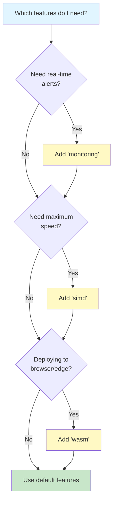
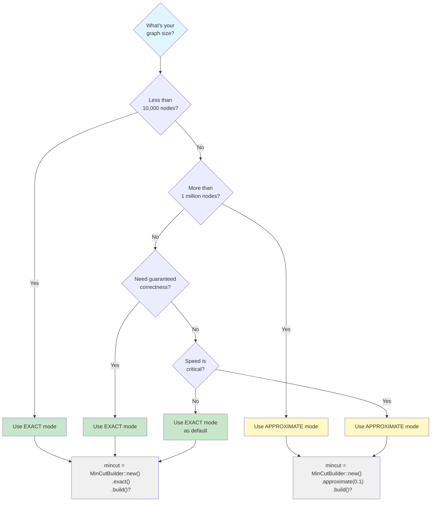

# Getting Started with RuVector MinCut

Welcome to RuVector MinCut! This guide will help you understand minimum cuts and start using the library in your Rust projects.

---

## 1. What is Minimum Cut?

### The Simple Explanation

Imagine you have a network of roads connecting different cities. The **minimum cut** answers this question:

> **"What's the smallest number of roads I need to close to completely separate the network into two parts?"**

Think of it like finding the **weakest links in a chain** — the places where your network is most vulnerable to breaking apart.

### Real-World Analogies

| Scenario | What You Have | What Min-Cut Finds |
|----------|---------------|-------------------|
| **Road Network** | Cities connected by roads | Fewest roads to block to isolate a city |
| **Social Network** | People connected by friendships | Weakest link between two communities |
| **Computer Network** | Servers connected by cables | Most vulnerable connections if attacked |
| **Water Pipes** | Houses connected by pipes | Minimum pipes to shut off to stop water flow |
| **Supply Chain** | Factories connected by routes | Critical dependencies that could break the chain |

### Visual Example

Here's what a minimum cut looks like in a simple graph:

```mermaid
graph LR
    subgraph "Original Graph"
    A((A)) ---|1| B((B))
    B ---|1| C((C))
    C ---|1| D((D))
    A ---|1| D((D))
    B ---|1| D((D))
    end

    subgraph "After Minimum Cut (value = 2)"
    A1((A)) -.x.- B1((B))
    B1((B)) ---|1| C1((C))
    C1((C)) ---|1| D1((D))
    A1((A)) -.x.- D1((D))
    B1 ---|1| D1
    end

    style A1 fill:#ffcccc
    style A fill:#ffcccc
    style B fill:#ccccff
    style C fill:#ccccff
    style D fill:#ccccff
    style B1 fill:#ccccff
    style C1 fill:#ccccff
    style D1 fill:#ccccff
```

**Legend:**
- **Solid lines** (—): Edges that remain
- **Crossed lines** (-.x.-): Edges in the minimum cut (removed)
- **Red nodes**: One side of the partition (set S)
- **Blue nodes**: Other side of the partition (set T)

The minimum cut value is **2** because we need to remove 2 edges to disconnect node A from the rest.

### Key Terminology for Beginners

| Term | Simple Explanation | Example |
|------|-------------------|---------|
| **Vertex** (or Node) | A point in the network | A city, a person, a server |
| **Edge** | A connection between two vertices | A road, a friendship, a cable |
| **Weight** | The "strength" or "capacity" of an edge | Road width, friendship closeness |
| **Cut** | A set of edges that, when removed, splits the graph | Roads to close to isolate a city |
| **Partition** | The two groups created after a cut | Cities on each side of the divide |
| **Cut Value** | Sum of weights of edges in the cut | Total capacity of removed edges |

### Why Is This Useful?

- **Find Vulnerabilities**: Identify critical infrastructure that could fail
- **Optimize Networks**: Understand where to strengthen connections
- **Detect Communities**: Find natural groupings in social networks
- **Image Segmentation**: Separate objects from backgrounds in photos
- **Load Balancing**: Divide work efficiently across systems

---

## 2. Installation

### Adding to Your Project

The easiest way to add RuVector MinCut to your project:

```bash
cargo add ruvector-mincut
```

Or manually add to your `Cargo.toml`:

```toml
[dependencies]
ruvector-mincut = "0.2"
```

### Understanding Feature Flags

RuVector MinCut has several optional features you can enable based on your needs:

```toml
[dependencies]
ruvector-mincut = { version = "0.2", features = ["monitoring", "simd"] }
```

#### Available Features

| Feature | Default | What It Does | When to Use |
|---------|---------|--------------|-------------|
| **`exact`** | ✅ Yes | Exact minimum cut algorithm | When you need guaranteed correct results |
| **`approximate`** | ✅ Yes | Fast (1+ε)-approximate algorithm | When speed matters more than perfect accuracy |
| **`monitoring`** | ❌ No | Real-time event notifications | When you need alerts for cut changes |
| **`integration`** | ❌ No | GraphDB integration with ruvector-graph | When working with vector databases |
| **`simd`** | ❌ No | SIMD vector optimizations | For faster processing on modern CPUs |
| **`wasm`** | ❌ No | WebAssembly compatibility | For browser or edge deployment |
| **`agentic`** | ❌ No | 256-core parallel execution | For agentic chip deployment |

#### Common Configurations

```toml
# Default: exact + approximate algorithms
[dependencies]
ruvector-mincut = "0.2"

# With real-time monitoring
[dependencies]
ruvector-mincut = { version = "0.2", features = ["monitoring"] }

# Maximum performance
[dependencies]
ruvector-mincut = { version = "0.2", features = ["simd"] }

# Everything enabled
[dependencies]
ruvector-mincut = { version = "0.2", features = ["full"] }
```

### Quick Feature Decision Guide



---

## 3. Your First Min-Cut

Let's create a simple program that finds the minimum cut in a triangle graph.

### Complete Working Example

Create a new file `examples/my_first_mincut.rs`:

```rust
use ruvector_mincut::{MinCutBuilder, DynamicMinCut};

fn main() -> Result<(), Box<dyn std::error::Error>> {
    println!("🔷 Finding Minimum Cut in a Triangle\n");

    // Step 1: Create a triangle graph
    //    1 ------- 2
    //     \       /
    //      \     /
    //       \   /
    //         3
    //
    // Each edge has weight 1.0
    let mut mincut = MinCutBuilder::new()
        .exact()  // Use exact algorithm for guaranteed correct results
        .with_edges(vec![
            (1, 2, 1.0),  // Edge from vertex 1 to vertex 2, weight 1.0
            (2, 3, 1.0),  // Edge from vertex 2 to vertex 3, weight 1.0
            (3, 1, 1.0),  // Edge from vertex 3 to vertex 1, weight 1.0
        ])
        .build()?;

    // Step 2: Query the minimum cut value
    let cut_value = mincut.min_cut_value();
    println!("Minimum cut value: {}", cut_value);
    println!("→ We need to remove {} edge(s) to disconnect the graph\n", cut_value);

    // Step 3: Get the partition (which vertices are on each side?)
    let (side_s, side_t) = mincut.partition();
    println!("Partition:");
    println!("  Side S (red): {:?}", side_s);
    println!("  Side T (blue): {:?}", side_t);
    println!("→ These two groups are separated by the cut\n");

    // Step 4: Get the actual edges in the cut
    let cut_edges = mincut.cut_edges();
    println!("Edges in the minimum cut:");
    for (u, v, weight) in &cut_edges {
        println!("  {} ←→ {} (weight: {})", u, v, weight);
    }
    println!("→ These edges must be removed to separate the graph\n");

    // Step 5: Make the graph dynamic - add a new edge
    println!("📍 Adding edge 3 → 4 (weight 2.0)...");
    let new_cut = mincut.insert_edge(3, 4, 2.0)?;
    println!("New minimum cut value: {}", new_cut);
    println!("→ Adding a leaf node increased connectivity\n");

    // Step 6: Delete an edge
    println!("📍 Deleting edge 2 → 3...");
    let final_cut = mincut.delete_edge(2, 3)?;
    println!("Final minimum cut value: {}", final_cut);
    println!("→ The graph is now a chain: 1-2, 3-4, 1-3\n");

    println!("✅ Success! You've computed your first dynamic minimum cut.");

    Ok(())
}
```

### Running the Example

```bash
cargo run --example my_first_mincut
```

**Expected Output:**

```
🔷 Finding Minimum Cut in a Triangle

Minimum cut value: 2.0
→ We need to remove 2 edge(s) to disconnect the graph

Partition:
  Side S (red): [1]
  Side T (blue): [2, 3]
→ These two groups are separated by the cut

Edges in the minimum cut:
  1 ←→ 2 (weight: 1.0)
  1 ←→ 3 (weight: 1.0)
→ These edges must be removed to separate the graph

📍 Adding edge 3 → 4 (weight 2.0)...
New minimum cut value: 2.0
→ Adding a leaf node increased connectivity

📍 Deleting edge 2 → 3...
Final minimum cut value: 1.0
→ The graph is now a chain: 1-2, 3-4, 1-3

✅ Success! You've computed your first dynamic minimum cut.
```

### Breaking Down the Code

Let's understand each part:

#### 1. Building the Graph

```rust
let mut mincut = MinCutBuilder::new()
    .exact()
    .with_edges(vec![
        (1, 2, 1.0),
        (2, 3, 1.0),
        (3, 1, 1.0),
    ])
    .build()?;
```

- **`MinCutBuilder::new()`**: Creates a new builder
- **`.exact()`**: Use exact algorithm (guaranteed correct)
- **`.with_edges(vec![...])`**: Add edges as `(source, target, weight)` tuples
- **`.build()?`**: Construct the data structure

#### 2. Querying the Cut

```rust
let cut_value = mincut.min_cut_value();
```

This is **O(1)** — instant! The value is already computed.

#### 3. Getting the Partition

```rust
let (side_s, side_t) = mincut.partition();
```

Returns two vectors of vertex IDs showing which vertices are on each side of the cut.

#### 4. Dynamic Updates

```rust
mincut.insert_edge(3, 4, 2.0)?;  // Add edge
mincut.delete_edge(2, 3)?;        // Remove edge
```

These operations update the minimum cut in **O(n^{o(1)})** amortized time — much faster than recomputing from scratch!

---

## 4. Understanding the Output

### What Do the Numbers Mean?

#### Minimum Cut Value

```rust
let cut_value = mincut.min_cut_value();  // Example: 2.0
```

**Interpretation:**
- This is the **sum of weights** of edges you need to remove
- For unweighted graphs (all edges weight 1.0), it's the **count of edges**
- **Lower values** = weaker connectivity, easier to disconnect
- **Higher values** = stronger connectivity, harder to disconnect

#### Partition

```rust
let (side_s, side_t) = mincut.partition();
// Example: ([1], [2, 3])
```

**Interpretation:**
- `side_s`: Vertex IDs on one side of the cut (arbitrarily chosen)
- `side_t`: Vertex IDs on the other side
- All edges connecting S to T are in the minimum cut
- Vertices within S or T remain connected

#### Cut Edges

```rust
let cut_edges = mincut.cut_edges();
// Example: [(1, 2, 1.0), (1, 3, 1.0)]
```

**Interpretation:**
- These are the **specific edges** that form the minimum cut
- Format: `(source_vertex, target_vertex, weight)`
- Removing these edges disconnects the graph
- The sum of weights equals the cut value

### Exact vs Approximate Results

```rust
let result = mincut.min_cut();

if result.is_exact {
    println!("Guaranteed minimum: {}", result.value);
} else {
    println!("Approximate: {} (±{}%)",
        result.value,
        (result.approximation_ratio - 1.0) * 100.0
    );
}
```

#### Exact Mode
- **`is_exact = true`**
- Guaranteed to find the true minimum cut
- Slower for very large graphs
- Use when correctness is critical

#### Approximate Mode
- **`is_exact = false`**
- Returns a cut within `(1+ε)` of the minimum
- Much faster for large graphs
- Use when speed matters more than perfect accuracy

**Example:** With `ε = 0.1`:
- If true minimum = 10, approximate returns between 10 and 11
- Approximation ratio = 1.1 (10% tolerance)

### Performance Characteristics

```rust
// Query: O(1) - instant!
let value = mincut.min_cut_value();

// Insert edge: O(n^{o(1)}) - subpolynomial!
mincut.insert_edge(u, v, weight)?;

// Delete edge: O(n^{o(1)}) - subpolynomial!
mincut.delete_edge(u, v)?;
```

**What is O(n^{o(1)})?**
- Slower than O(1) but faster than O(n), O(log n), etc.
- Example: O(n^{0.01}) or O(n^{1/log log n})
- Much better than traditional O(m·n) algorithms
- Enables real-time updates even for large graphs

---

## 5. Choosing Between Exact and Approximate

Use this flowchart to decide which mode to use:



### Quick Comparison

| Aspect | Exact Mode | Approximate Mode |
|--------|-----------|------------------|
| **Accuracy** | 100% correct | (1+ε) of optimal |
| **Speed** | Moderate | Very fast |
| **Memory** | O(n log n + m) | O(n log n / ε²) |
| **Best For** | Small-medium graphs | Large graphs |
| **Update Time** | O(n^{o(1)}) | O(n^{o(1)}) |

### Code Examples

**Exact Mode** (guaranteed correct):
```rust
let mut mincut = MinCutBuilder::new()
    .exact()
    .with_edges(edges)
    .build()?;

assert!(mincut.min_cut().is_exact);
```

**Approximate Mode** (10% tolerance):
```rust
let mut mincut = MinCutBuilder::new()
    .approximate(0.1)  // ε = 0.1
    .with_edges(edges)
    .build()?;

let result = mincut.min_cut();
assert!(!result.is_exact);
assert_eq!(result.approximation_ratio, 1.1);
```

---

## 6. Next Steps

Congratulations! You now understand the basics of minimum cuts and how to use RuVector MinCut. Here's where to go next:

### Learn More

| Topic | Link | What You'll Learn |
|-------|------|------------------|
| **Advanced API** | [02-advanced-api.md](02-advanced-api.md) | Batch operations, custom graphs, thread safety |
| **Real-Time Monitoring** | [03-monitoring.md](03-monitoring.md) | Event notifications, thresholds, callbacks |
| **Performance Tuning** | [04-performance.md](04-performance.md) | Benchmarking, optimization, scaling |
| **Use Cases** | [05-use-cases.md](05-use-cases.md) | Network analysis, community detection, partitioning |
| **Algorithm Details** | [../ALGORITHMS.md](../ALGORITHMS.md) | Mathematical foundations, proofs, complexity |
| **Architecture** | [../ARCHITECTURE.md](../ARCHITECTURE.md) | Internal design, data structures, implementation |

### Try These Examples

RuVector MinCut comes with several examples you can run:

```bash
# Basic minimum cut operations
cargo run --example basic

# Graph sparsification
cargo run --example sparsify_demo

# Local k-cut algorithm
cargo run --example localkcut_demo

# Real-time monitoring (requires 'monitoring' feature)
cargo run --example monitoring --features monitoring

# Performance benchmarking
cargo run --example benchmark --release
```

### Common Tasks

#### Task 1: Analyze Your Own Graph

```rust
use ruvector_mincut::{MinCutBuilder, DynamicMinCut};

fn analyze_network(edges: Vec<(u32, u32, f64)>) -> Result<(), Box<dyn std::error::Error>> {
    let mut mincut = MinCutBuilder::new()
        .exact()
        .with_edges(edges)
        .build()?;

    println!("Network vulnerability: {}", mincut.min_cut_value());
    println!("Critical edges: {:?}", mincut.cut_edges());

    Ok(())
}
```

#### Task 2: Monitor Real-Time Changes

```rust
#[cfg(feature = "monitoring")]
use ruvector_mincut::{MonitorBuilder, EventType};

fn setup_monitoring() {
    let monitor = MonitorBuilder::new()
        .threshold_below(5.0, "critical")
        .on_event_type(EventType::CutDecreased, "alert", |event| {
            eprintln!("⚠️ WARNING: Cut decreased to {}", event.new_value);
        })
        .build();

    // Attach to your mincut structure...
}
```

#### Task 3: Batch Process Updates

```rust
fn batch_updates(mincut: &mut impl DynamicMinCut,
                 new_edges: &[(u32, u32, f64)]) -> Result<(), Box<dyn std::error::Error>> {
    // Insert many edges at once
    for (u, v, w) in new_edges {
        mincut.insert_edge(*u, *v, *w)?;
    }

    // Query triggers lazy evaluation
    let current_cut = mincut.min_cut_value();
    println!("Updated minimum cut: {}", current_cut);

    Ok(())
}
```

### Get Help

- **📖 Documentation**: [docs.rs/ruvector-mincut](https://docs.rs/ruvector-mincut)
- **🐙 GitHub Issues**: [Report bugs or ask questions](https://github.com/ruvnet/ruvector/issues)
- **💬 Discussions**: [Community forum](https://github.com/ruvnet/ruvector/discussions)
- **🌐 Website**: [ruv.io](https://ruv.io)

### Keep Learning

The minimum cut problem connects to many fascinating areas of computer science:

- **Network Flow**: Max-flow/min-cut theorem
- **Graph Theory**: Connectivity, separators, spanning trees
- **Optimization**: Linear programming, approximation algorithms
- **Distributed Systems**: Partition tolerance, consensus
- **Machine Learning**: Graph neural networks, clustering

---

## Quick Reference

### Builder Pattern

```rust
MinCutBuilder::new()
    .exact()                    // or .approximate(0.1)
    .with_edges(edges)          // Initial edges
    .with_capacity(10000)       // Preallocate capacity
    .build()?                   // Construct
```

### Core Operations

```rust
mincut.min_cut_value()          // Get cut value (O(1))
mincut.partition()              // Get partition (O(n))
mincut.cut_edges()              // Get cut edges (O(m))
mincut.insert_edge(u, v, w)?    // Add edge (O(n^{o(1)}))
mincut.delete_edge(u, v)?       // Remove edge (O(n^{o(1)}))
```

### Result Inspection

```rust
let result = mincut.min_cut();
result.value                    // Cut value
result.is_exact                 // true if exact mode
result.approximation_ratio      // 1.0 if exact, >1.0 if approximate
result.edges                    // Edges in the cut
result.partition                // (S, T) vertex sets
```

---

**Happy computing! 🚀**

> **Pro Tip**: Start simple with exact mode on small graphs, then switch to approximate mode as your graphs grow. The API is identical!
