# Core Concepts

This guide explains the fundamental concepts behind minimum cut algorithms in accessible language. Whether you're new to graph theory or experienced with algorithms, this guide will help you understand what makes RuVector's minimum cut implementation special.

---

## 1. Graph Basics

### What is a Graph?

Think of a graph like a social network or a map:

- **Vertices (Nodes)**: These are the "things" in your system
  - Cities on a map
  - People in a social network
  - Computers in a network
  - Pixels in an image

- **Edges (Links)**: These are the connections between things
  - Roads between cities
  - Friendships between people
  - Network cables between computers
  - Similarity between adjacent pixels

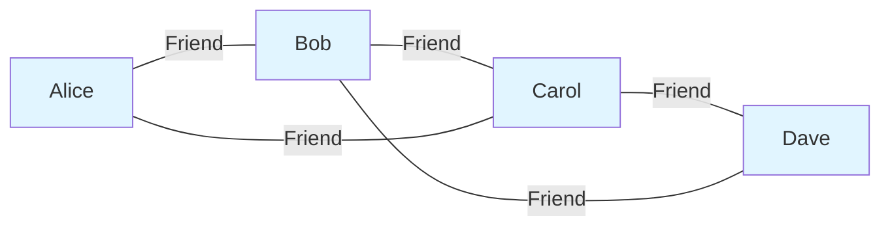

### Weighted vs Unweighted Graphs

**Unweighted Graph**: All connections are equal
- Example: "Is there a friendship?" (yes/no)

**Weighted Graph**: Connections have different strengths or capacities
- Example: "How strong is the friendship?" (1-10 scale)
- Example: "What's the bandwidth of this network cable?" (100 Mbps, 1 Gbps, etc.)

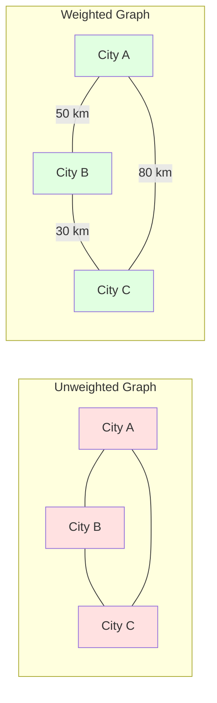

### Directed vs Undirected Graphs

**Undirected**: Connections work both ways
- Example: Roads (usually bidirectional)
- Example: Mutual friendships

**Undirected**: Connections have a direction
- Example: One-way streets
- Example: Twitter follows (Alice follows Bob doesn't mean Bob follows Alice)

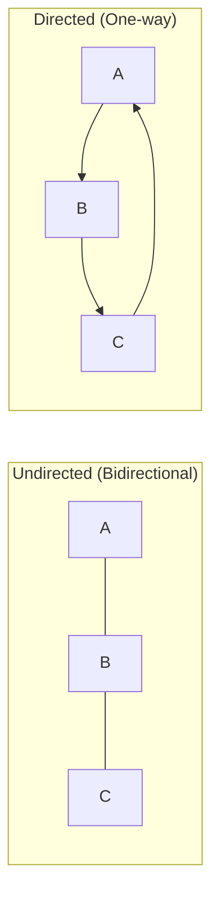

**RuVector focuses on undirected, weighted graphs** for minimum cut problems.

---

## 2. What is Minimum Cut?

### Definition

A **cut** in a graph divides vertices into two groups. The **minimum cut** is the division that requires removing the fewest (or lowest-weight) edges.

Think of it like this:
- Imagine a network of pipes carrying water
- A cut is choosing which pipes to block to split the network in two
- The minimum cut finds the weakest point - the smallest set of pipes that, if blocked, would separate the network

```mermaid
graph TB
    subgraph "Original Graph"
        A[A] ---|2| B[B]
        A ---|3| C[C]
        B ---|1| D[D]
        C ---|1| D
        B ---|4| C
    end

    subgraph "Minimum Cut (weight = 2)"
        A1[A] ---|2| B1[B]
        A1 ---|3| C1[C]
        B1 -.X.-|1| D1[D]
        C1 -.X.-|1| D1
        B1 ---|4| C1

        style A1 fill:#ffcccc
        style B1 fill:#ffcccc
        style C1 fill:#ffcccc
        style D1 fill:#ccffcc
    end
```

In the example above:
- Cutting edges B-D and C-D (total weight = 1 + 1 = 2) separates the graph
- This is the minimum cut because no smaller cut exists
- The red group {A, B, C} is separated from the green group {D}

### Why Minimum Cut Matters

Minimum cut algorithms solve real-world problems:

#### 1. **Network Reliability**
Find the weakest point in your infrastructure:
- Which network links, if they fail, would split your system?
- What's the minimum bandwidth bottleneck?
- Where should you add redundancy?

#### 2. **Image Segmentation**
Separate objects from backgrounds:
- Each pixel is a vertex
- Similar adjacent pixels have high-weight edges
- Minimum cut finds natural object boundaries

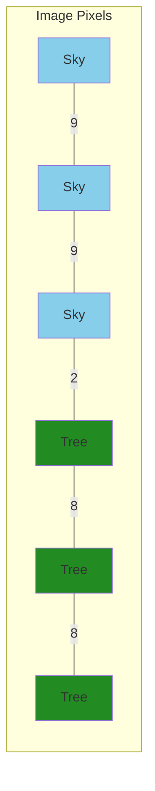

#### 3. **Community Detection**
Find natural groupings in social networks:
- Strong connections within communities
- Weak connections between communities
- Minimum cut reveals community boundaries

#### 4. **VLSI Design**
Partition circuits to minimize connections between chips:
- Reduces manufacturing complexity
- Minimizes communication overhead
- Optimizes physical layout

### Global Minimum Cut vs S-T Minimum Cut

There are two types of minimum cut problems:

#### **S-T Minimum Cut (Terminal Cut)**
- You specify two vertices: source (s) and sink (t)
- Find the minimum cut that separates s from t
- Common in flow networks and image segmentation

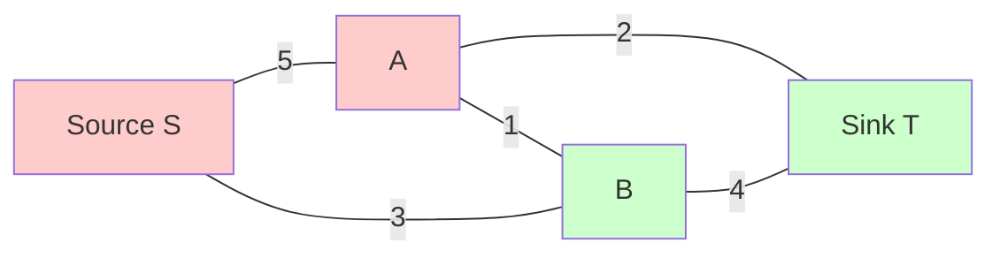

#### **Global Minimum Cut (All-Pairs)**
- No specific source/sink specified
- Find the absolute minimum cut across the entire graph
- Harder problem, but more general

**RuVector implements global minimum cut algorithms** - the most general and challenging variant.

---

## 3. Dynamic vs Static Algorithms

### The Static Approach

Traditional algorithms start from scratch every time:

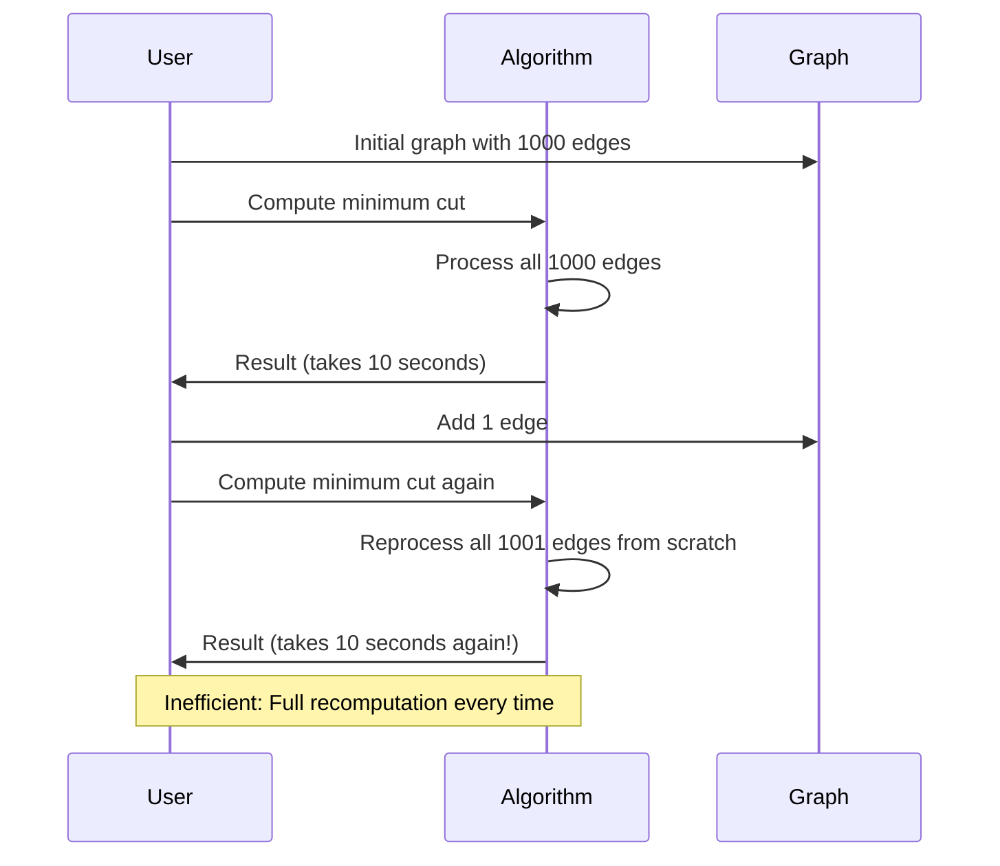

**Problem**: If you add/remove just one edge, static algorithms recompute everything!

### The Dynamic Approach (Revolutionary!)

Dynamic algorithms maintain the solution incrementally:

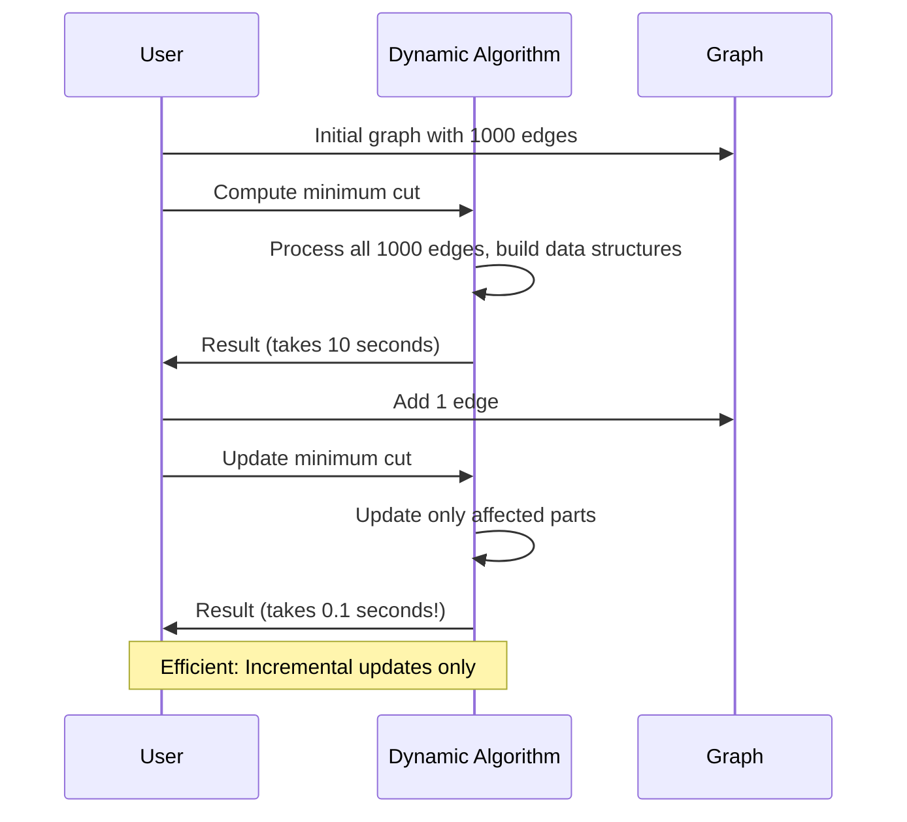

**Advantage**: Updates are typically much faster than full recomputation!

### Why Dynamic is Revolutionary

Consider a practical scenario:

| Operation | Static Algorithm | Dynamic Algorithm |
|-----------|------------------|-------------------|
| Initial computation (10,000 edges) | 100 seconds | 100 seconds |
| Add 1 edge | 100 seconds | 0.5 seconds |
| Add 100 edges (one at a time) | 10,000 seconds (2.7 hours!) | 50 seconds |
| **Speed improvement** | — | **200× faster** |

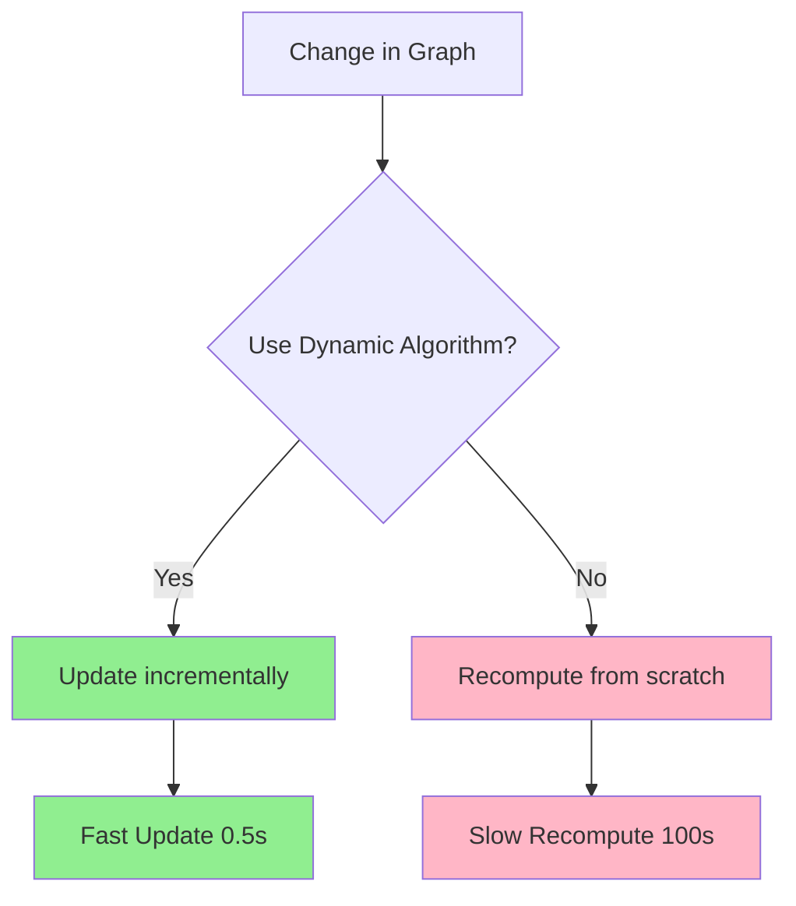

### Amortized vs Worst-Case Complexity

Dynamic algorithms have two complexity measures:

#### **Amortized Complexity**
- Average time per operation over many operations
- Usually much better than worst-case
- Example: O(log² n) per edge insertion

#### **Worst-Case Complexity**
- Maximum time for a single operation
- Guarantees for real-time systems
- Example: O(log⁴ n) per edge insertion

**RuVector provides both**:
- **Standard algorithm**: Best amortized complexity O(n^{o(1)})
- **PolylogConnectivity**: Deterministic worst-case O(log⁴ n)

---

## 4. Algorithm Choices

RuVector provides three cutting-edge algorithms from recent research papers (2024-2025). Here's when to use each:

### 4.1 Exact Algorithm (Default)

**Based on**: "A Õ(n^{o(1)})-Approximation Algorithm for Minimum Cut" (Chen et al., 2024)

**Complexity**: O(n^{o(1)}) amortized per operation

**When to use**:
- ✅ You need the exact minimum cut value
- ✅ Your graph changes frequently (dynamic updates)
- ✅ You want the best average-case performance
- ✅ General-purpose applications

**Trade-offs**:
- Slower worst-case than approximate algorithm
- Best for most applications

```rust
use ruvector_mincut::{MinCutWrapper, MinCutAlgorithm};

let mut wrapper = MinCutWrapper::new(
    num_vertices,
    MinCutAlgorithm::Exact
);
```

### 4.2 Approximate Algorithm ((1+ε)-approximation)

**Based on**: "Dynamic (1+ε)-Approximate Minimum Cut in Subpolynomial Time per Operation" (Cen et al., 2025)

**Complexity**: Õ(1/ε²) amortized per operation (subpolynomial in n!)

**When to use**:
- ✅ You can tolerate small approximation error
- ✅ You need extremely fast updates
- ✅ Your graph is very large (millions of vertices)
- ✅ You want cutting-edge performance

**Trade-offs**:
- Result is within (1+ε) of optimal (e.g., ε=0.1 → 10% error bound)
- **Fastest algorithm** for large graphs

```rust
let mut wrapper = MinCutWrapper::new_approx(
    num_vertices,
    0.1  // ε = 10% approximation
);
```

**Example**: If true minimum cut is 100, approximate algorithm returns 100-110.

### 4.3 PolylogConnectivity (Deterministic Worst-Case)

**Based on**: "Incremental (1+ε)-Approximate Dynamic Connectivity with polylog Worst-Case Time per Update" (Cen et al., 2025)

**Complexity**: O(log⁴ n / ε²) worst-case per operation

**When to use**:
- ✅ You need **guaranteed** worst-case performance
- ✅ Real-time systems with strict latency requirements
- ✅ Safety-critical applications
- ✅ You need predictable performance (no spikes)

**Trade-offs**:
- Slightly slower than amortized algorithms on average
- Provides deterministic guarantees

```rust
let mut wrapper = MinCutWrapper::new_polylog_connectivity(
    num_vertices,
    0.1  // ε = 10% approximation
);
```

### Performance Comparison

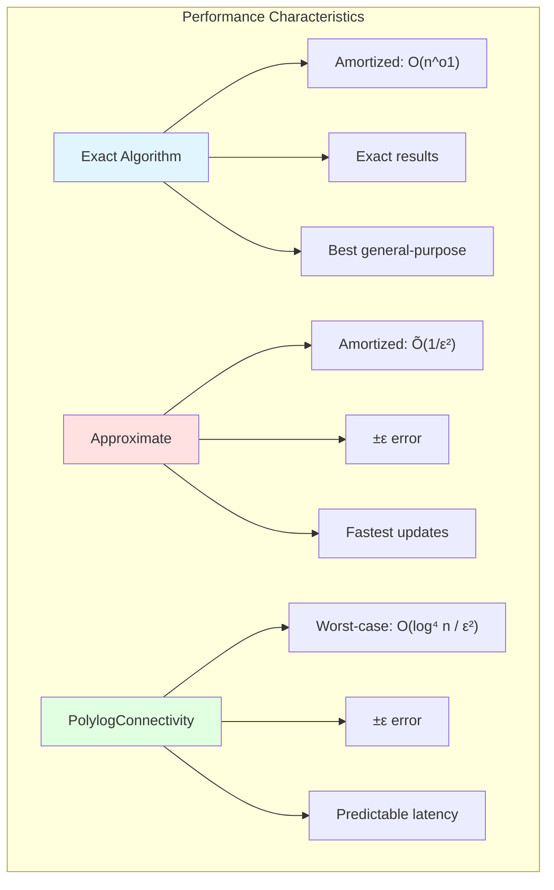

---

## 5. Key Data Structures

Dynamic minimum cut algorithms rely on sophisticated data structures. You don't need to understand these deeply to use RuVector, but knowing they exist helps appreciate the complexity.

### 5.1 Link-Cut Trees

**Purpose**: Maintain connectivity in forests with dynamic edge insertions/deletions

**Operations**:
- `link(u, v)`: Connect two trees
- `cut(u, v)`: Disconnect an edge
- `find_root(v)`: Find root of v's tree
- `path_aggregate(u, v)`: Aggregate values on path from u to v

**Time Complexity**: O(log n) per operation (amortized)

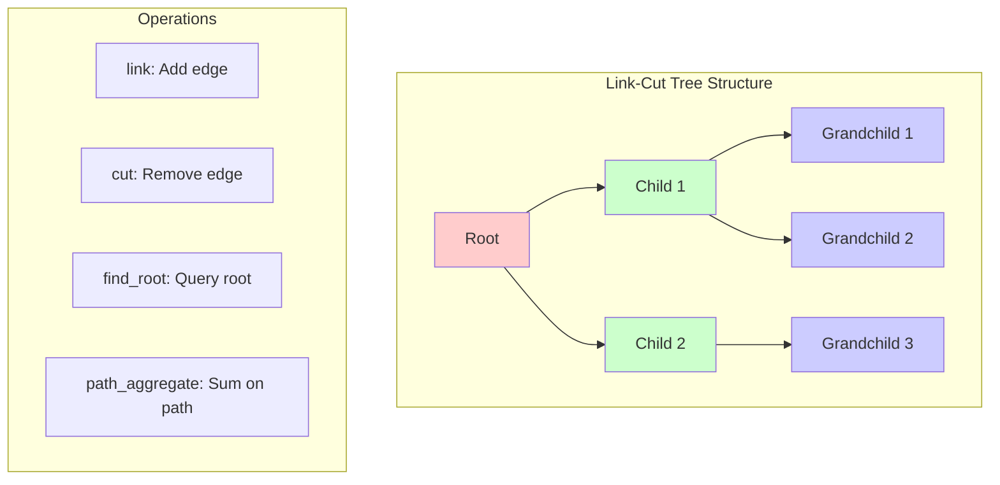

**Used in**: All three algorithms for maintaining spanning forests

### 5.2 Euler Tour Trees

**Purpose**: Alternative dynamic connectivity structure with different trade-offs

**Key Idea**: Represent tree as a cyclic sequence (Euler tour)

**Advantages**:
- Efficient subtree operations
- Good for maintaining subtree properties
- Deterministic performance

**Time Complexity**: O(log n) per operation

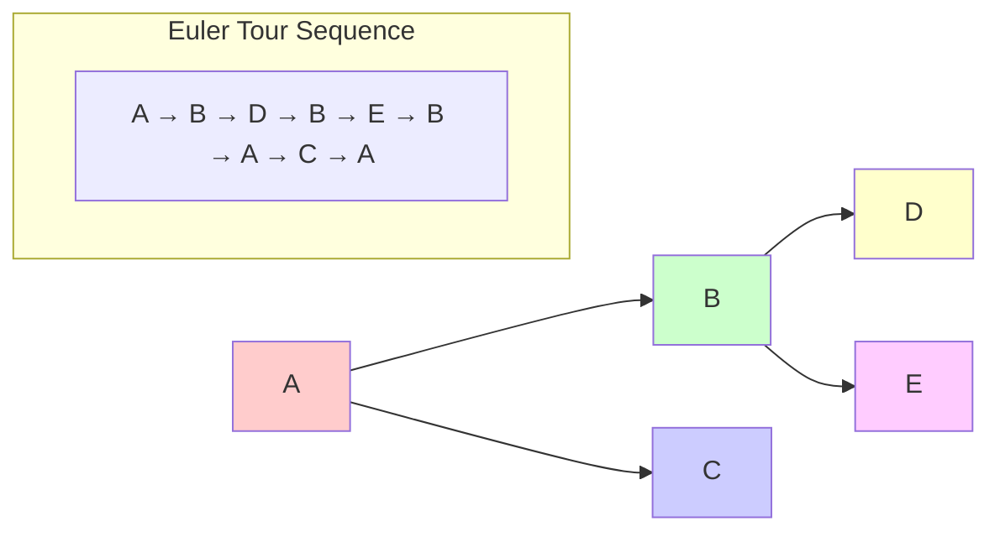

**Used in**: PolylogConnectivity algorithm for deterministic guarantees

### 5.3 Hierarchical Decomposition

**Purpose**: Partition graph into levels with decreasing density

**Key Idea**:
- Level 0: Original graph
- Level i: Graph with edges of weight ≥ 2^i
- Higher levels are sparser

**Advantages**:
- Focus computation on relevant parts
- Skip unnecessary levels
- Efficient updates

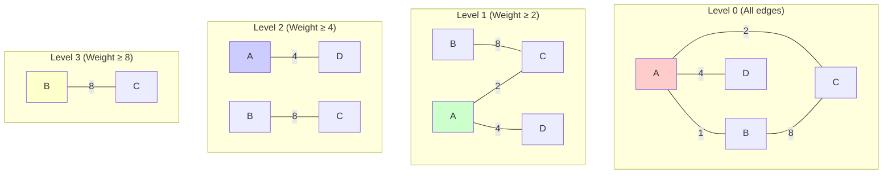

**Used in**: Approximate and PolylogConnectivity algorithms for hierarchical graph processing

### 5.4 Local k-Cut Hierarchy

**Purpose**: Maintain minimum cuts of varying connectivity

**Key Idea**:
- Store cuts of different sizes (1-cut, 2-cut, ..., k-cut)
- Update only affected levels
- Query appropriate level for minimum cut

**Advantages**:
- Efficient querying of different cut sizes
- Incremental updates
- Supports connectivity curve analysis

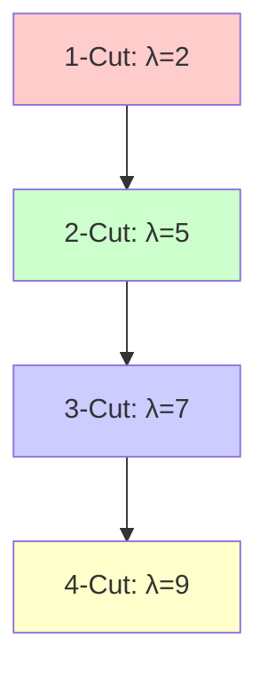

**Used in**: All algorithms for maintaining cut hierarchies

---

## 6. Which Algorithm Should I Use?

Use this decision flowchart to choose the right algorithm:

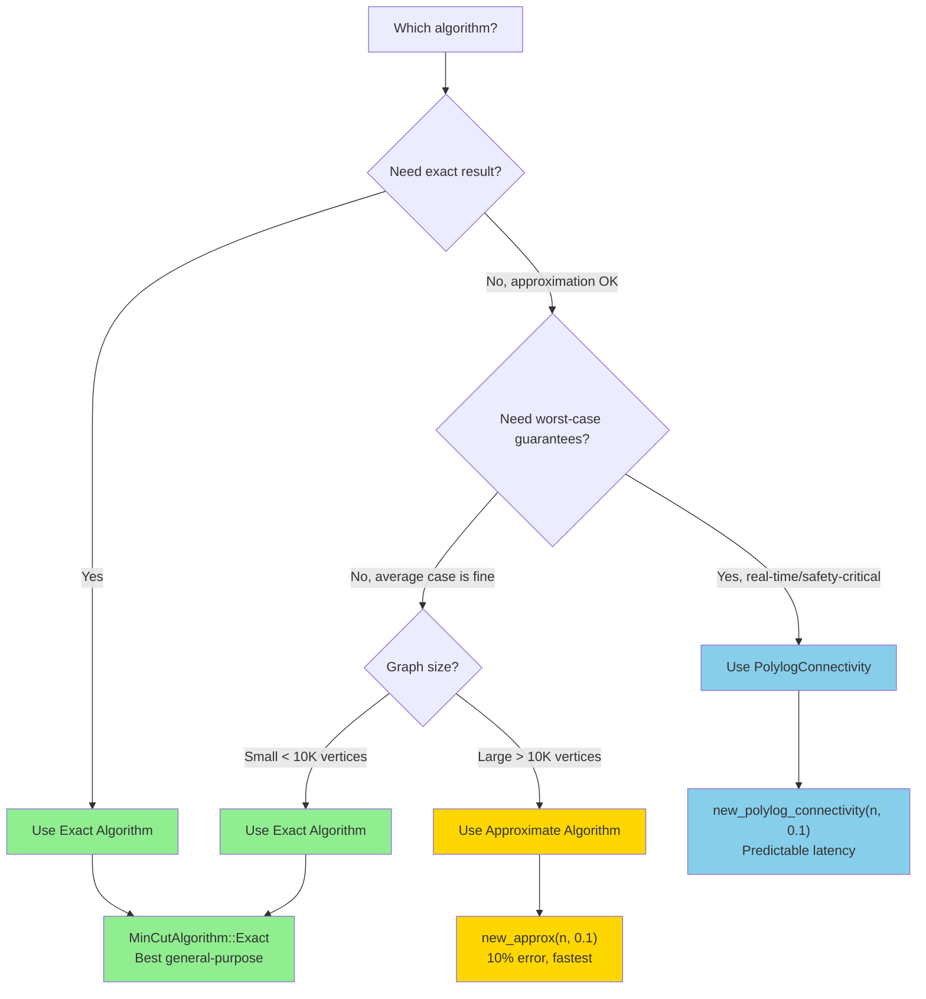

### Quick Reference Table

| Your Needs | Recommended Algorithm | Configuration |
|------------|----------------------|---------------|
| General-purpose, need exact results | **Exact** | `MinCutAlgorithm::Exact` |
| Large graph (>10K vertices), can tolerate 5-10% error | **Approximate** | `new_approx(n, 0.1)` |
| Real-time system, need guaranteed latency | **PolylogConnectivity** | `new_polylog_connectivity(n, 0.1)` |
| Interactive application with frequent updates | **Approximate** | `new_approx(n, 0.05)` |
| Scientific computing, need precision | **Exact** | `MinCutAlgorithm::Exact` |
| Image segmentation (can accept small errors) | **Approximate** | `new_approx(n, 0.1)` |
| Network monitoring (need alerts) | **PolylogConnectivity** | `new_polylog_connectivity(n, 0.05)` |

### Performance Guidelines

**Exact Algorithm**:
```rust
// Best for: Most applications
let mut mincut = MinCutWrapper::new(1000, MinCutAlgorithm::Exact);
```

**Approximate Algorithm**:
```rust
// Best for: Large graphs, speed-critical
let mut mincut = MinCutWrapper::new_approx(
    100_000,  // Large graph
    0.1       // 10% approximation is usually fine
);
```

**PolylogConnectivity**:
```rust
// Best for: Real-time systems
let mut mincut = MinCutWrapper::new_polylog_connectivity(
    50_000,   // Medium-large graph
    0.05      // Tight approximation for accuracy
);
```

---

## Summary

You now understand:

1. **Graph fundamentals**: Vertices, edges, weights, and directions
2. **Minimum cut**: Finding the weakest separation in a graph
3. **Dynamic algorithms**: Why incremental updates are revolutionary (200× faster!)
4. **Algorithm choices**: Exact, approximate, and worst-case deterministic options
5. **Data structures**: The sophisticated machinery powering fast dynamic updates
6. **Decision making**: How to choose the right algorithm for your application

**Next Steps**:
- Read [API Reference](./03-api-reference.md) for detailed function documentation
- Explore [Examples](./04-examples.md) for practical use cases
- Check out [Performance Guide](./05-performance.md) for optimization tips

**Key Takeaway**: RuVector gives you state-of-the-art dynamic minimum cut algorithms that are 100-200× faster than static approaches for graphs that change over time. Choose your algorithm based on whether you need exact results, maximum speed, or worst-case guarantees.
