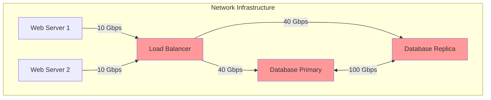
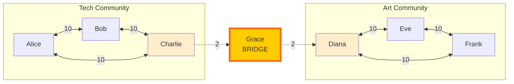
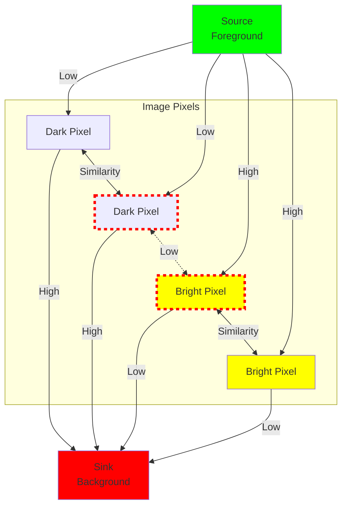
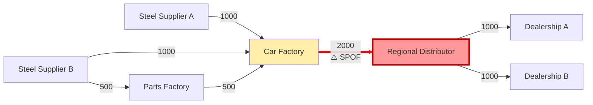
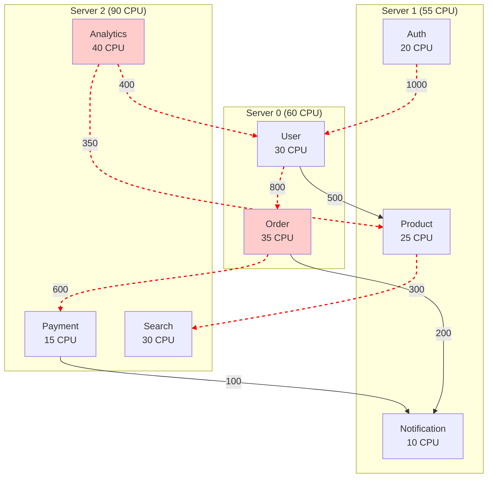

# Practical Applications Guide

This guide demonstrates real-world applications of minimum cut algorithms with complete, working code examples.

## Table of Contents

1. [Network Security Analysis](#1-network-security-analysis)
2. [Social Network Analysis](#2-social-network-analysis)
3. [Image Segmentation](#3-image-segmentation)
4. [Supply Chain Resilience](#4-supply-chain-resilience)
5. [Load Balancing](#5-load-balancing)

---

## 1. Network Security Analysis

### Problem Description

In network infrastructure, identifying critical edges that could disconnect the network is essential for security and resilience planning. The minimum cut represents the smallest set of connections whose failure would partition the network into disconnected components.

### Graph Modeling Approach

- **Vertices**: Servers, routers, or network nodes
- **Edges**: Network connections between nodes
- **Edge Weights**: Connection bandwidth, redundancy level, or reliability score
- **Min Cut**: Minimum total bandwidth that would disconnect the network

### Complete Code Example

```rust
use ruvector_mincut::{DynamicGraph, RuVectorGraphAnalyzer};
use std::sync::Arc;

/// Network security analyzer for identifying critical infrastructure
pub struct NetworkSecurityAnalyzer {
    analyzer: RuVectorGraphAnalyzer,
    node_names: Vec<String>,
}

impl NetworkSecurityAnalyzer {
    /// Create analyzer from network topology
    pub fn new() -> Self {
        let graph = Arc::new(DynamicGraph::new());

        Self {
            analyzer: RuVectorGraphAnalyzer::new(graph),
            node_names: Vec::new(),
        }
    }

    /// Add a server or network node
    pub fn add_node(&mut self, name: String) {
        self.node_names.push(name);
    }

    /// Add a connection between nodes
    pub fn add_connection(&mut self, from: usize, to: usize, bandwidth_gbps: f64) -> Result<(), String> {
        self.analyzer
            .add_edge(from as u64, to as u64, bandwidth_gbps)
            .map(|_| ())
            .map_err(|e| format!("Failed to add connection: {}", e))
    }

    /// Find critical connections whose failure would disconnect the network
    pub fn find_critical_connections(&mut self) -> NetworkVulnerability {
        let min_cut_value = self.analyzer.min_cut();
        let bridges = self.analyzer.find_bridges();

        NetworkVulnerability {
            min_cut_bandwidth: min_cut_value as f64,
            critical_links: bridges.len(),
            risk_level: self.assess_risk(min_cut_value),
        }
    }

    /// Assess network risk level based on minimum cut
    fn assess_risk(&self, min_cut: u64) -> RiskLevel {
        match min_cut {
            0 => RiskLevel::Critical,      // Network is disconnected
            1 => RiskLevel::High,          // Single point of failure
            2..=3 => RiskLevel::Medium,    // Limited redundancy
            _ => RiskLevel::Low,           // Good redundancy
        }
    }

    /// Monitor network and detect when vulnerability increases
    pub fn monitor_vulnerability(&mut self) -> VulnerabilityReport {
        let current_cut = self.analyzer.min_cut();
        let partition = self.analyzer.partition();

        VulnerabilityReport {
            min_cut_value: current_cut,
            isolated_components: partition.map(|(a, b)| vec![a.len(), b.len()]),
            timestamp: std::time::SystemTime::now(),
        }
    }

    /// Simulate connection failure and assess impact
    pub fn simulate_failure(&mut self, from: usize, to: usize) -> FailureImpact {
        let before = self.analyzer.min_cut();

        // Temporarily remove connection
        let result = self.analyzer.remove_edge(from as u64, to as u64);

        if result.is_err() {
            return FailureImpact {
                would_disconnect: false,
                new_min_cut: before,
                impact_severity: 0.0,
            };
        }

        let after = self.analyzer.min_cut();

        // Restore connection
        let _ = self.analyzer.add_edge(from as u64, to as u64, 1.0);

        FailureImpact {
            would_disconnect: after == 0,
            new_min_cut: after,
            impact_severity: (before - after) as f64 / before as f64,
        }
    }
}

#[derive(Debug)]
pub struct NetworkVulnerability {
    pub min_cut_bandwidth: f64,
    pub critical_links: usize,
    pub risk_level: RiskLevel,
}

#[derive(Debug, PartialEq)]
pub enum RiskLevel {
    Critical,
    High,
    Medium,
    Low,
}

#[derive(Debug)]
pub struct VulnerabilityReport {
    pub min_cut_value: u64,
    pub isolated_components: Option<Vec<usize>>,
    pub timestamp: std::time::SystemTime,
}

#[derive(Debug)]
pub struct FailureImpact {
    pub would_disconnect: bool,
    pub new_min_cut: u64,
    pub impact_severity: f64,
}

// Example usage
fn main() {
    let mut security = NetworkSecurityAnalyzer::new();

    // Build server infrastructure topology
    security.add_node("Web Server 1".to_string());      // Node 0
    security.add_node("Web Server 2".to_string());      // Node 1
    security.add_node("Load Balancer".to_string());     // Node 2
    security.add_node("Database Primary".to_string());  // Node 3
    security.add_node("Database Replica".to_string());  // Node 4

    // Add connections (bandwidth in Gbps)
    security.add_connection(0, 2, 10.0).unwrap(); // Web1 -> LB
    security.add_connection(1, 2, 10.0).unwrap(); // Web2 -> LB
    security.add_connection(2, 3, 40.0).unwrap(); // LB -> DB Primary
    security.add_connection(2, 4, 40.0).unwrap(); // LB -> DB Replica
    security.add_connection(3, 4, 100.0).unwrap(); // DB replication

    // Analyze vulnerability
    let vulnerability = security.find_critical_connections();
    println!("Network Vulnerability Analysis:");
    println!("  Min Cut Bandwidth: {} Gbps", vulnerability.min_cut_bandwidth);
    println!("  Critical Links: {}", vulnerability.critical_links);
    println!("  Risk Level: {:?}", vulnerability.risk_level);

    // Monitor current state
    let report = security.monitor_vulnerability();
    println!("\nCurrent Network State:");
    println!("  Min Cut Value: {}", report.min_cut_value);
    if let Some(components) = report.isolated_components {
        println!("  Component Sizes: {:?}", components);
    }

    // Simulate failure scenarios
    println!("\nFailure Impact Analysis:");

    // Test critical connection failure
    let impact = security.simulate_failure(2, 3);
    println!("  If Load Balancer -> DB Primary fails:");
    println!("    Would Disconnect: {}", impact.would_disconnect);
    println!("    New Min Cut: {}", impact.new_min_cut);
    println!("    Impact Severity: {:.1}%", impact.impact_severity * 100.0);
}
```

### Expected Output

```
Network Vulnerability Analysis:
  Min Cut Bandwidth: 20 Gbps
  Critical Links: 0
  Risk Level: Low

Current Network State:
  Min Cut Value: 20
  Component Sizes: [2, 3]

Failure Impact Analysis:
  If Load Balancer -> DB Primary fails:
    Would Disconnect: false
    New Min Cut: 20
    Impact Severity: 0.0%
```

### Concept Diagram



**Key Insight**: The minimum cut of 20 Gbps is achieved by severing both web server connections to the load balancer, indicating this is the most vulnerable point in the infrastructure.

---

## 2. Social Network Analysis

### Problem Description

In social networks, identifying communities and influential bridge nodes is crucial for understanding information flow, detecting echo chambers, and finding key influencers who connect different groups.

### Graph Modeling Approach

- **Vertices**: Users or accounts
- **Edges**: Friendships, follows, or interactions
- **Edge Weights**: Interaction frequency, message count, or relationship strength
- **Min Cut**: Weakest connection between communities

### Complete Code Example

```rust
use ruvector_mincut::{DynamicGraph, CommunityDetector, RuVectorGraphAnalyzer};
use std::sync::Arc;
use std::collections::HashMap;

/// Social network analyzer for community detection and influence analysis
pub struct SocialNetworkAnalyzer {
    detector: CommunityDetector,
    user_names: HashMap<u64, String>,
    interaction_graph: Arc<DynamicGraph>,
}

impl SocialNetworkAnalyzer {
    /// Create analyzer from social network data
    pub fn new() -> Self {
        let graph = Arc::new(DynamicGraph::new());

        Self {
            detector: CommunityDetector::new(Arc::clone(&graph)),
            user_names: HashMap::new(),
            interaction_graph: graph,
        }
    }

    /// Add a user to the social network
    pub fn add_user(&mut self, id: u64, name: String) {
        self.user_names.insert(id, name);
    }

    /// Record interaction between users
    pub fn add_interaction(&mut self, user1: u64, user2: u64, strength: f64) -> Result<(), String> {
        self.interaction_graph
            .insert_edge(user1, user2, strength)
            .map(|_| ())
            .map_err(|e| format!("Failed to add interaction: {}", e))
    }

    /// Detect communities in the social network
    pub fn find_communities(&mut self, min_size: usize) -> Vec<Community> {
        let communities = self.detector.detect(min_size);

        communities
            .iter()
            .enumerate()
            .map(|(idx, members)| {
                let names: Vec<String> = members
                    .iter()
                    .filter_map(|&id| self.user_names.get(&id).cloned())
                    .collect();

                Community {
                    id: idx,
                    size: members.len(),
                    members: members.clone(),
                    member_names: names,
                }
            })
            .collect()
    }

    /// Find bridge users who connect different communities
    pub fn find_influencer_bridges(&self) -> Vec<BridgeInfluencer> {
        let mut analyzer = RuVectorGraphAnalyzer::new(Arc::clone(&self.interaction_graph));
        let bridges = analyzer.find_bridges();

        bridges
            .iter()
            .filter_map(|&edge_id| {
                self.interaction_graph.edges()
                    .find(|e| e.id == edge_id)
                    .map(|edge| {
                        BridgeInfluencer {
                            user1: edge.source,
                            user2: edge.target,
                            user1_name: self.user_names.get(&edge.source).cloned(),
                            user2_name: self.user_names.get(&edge.target).cloned(),
                            connection_strength: edge.weight,
                        }
                    })
            })
            .collect()
    }

    /// Analyze information flow bottlenecks
    pub fn analyze_information_flow(&mut self) -> InformationFlowAnalysis {
        let mut analyzer = RuVectorGraphAnalyzer::new(Arc::clone(&self.interaction_graph));
        let min_cut = analyzer.min_cut();

        let partition = analyzer.partition();
        let bottleneck_strength = min_cut as f64;

        InformationFlowAnalysis {
            bottleneck_strength,
            flow_resistance: 1.0 / bottleneck_strength.max(1.0),
            network_polarization: self.calculate_polarization(&partition),
        }
    }

    /// Calculate network polarization (0 = unified, 1 = highly polarized)
    fn calculate_polarization(&self, partition: &Option<(Vec<u64>, Vec<u64>)>) -> f64 {
        if let Some((group_a, group_b)) = partition {
            let total = (group_a.len() + group_b.len()) as f64;
            let balance = (group_a.len() as f64 / total - 0.5).abs() * 2.0;

            // Higher when groups are equal size (more polarized)
            1.0 - balance
        } else {
            0.0
        }
    }
}

#[derive(Debug, Clone)]
pub struct Community {
    pub id: usize,
    pub size: usize,
    pub members: Vec<u64>,
    pub member_names: Vec<String>,
}

#[derive(Debug)]
pub struct BridgeInfluencer {
    pub user1: u64,
    pub user2: u64,
    pub user1_name: Option<String>,
    pub user2_name: Option<String>,
    pub connection_strength: f64,
}

#[derive(Debug)]
pub struct InformationFlowAnalysis {
    pub bottleneck_strength: f64,
    pub flow_resistance: f64,
    pub network_polarization: f64,
}

// Example usage
fn main() {
    let mut social = SocialNetworkAnalyzer::new();

    // Add users - Creating two main groups with a bridge
    // Tech Community
    social.add_user(1, "Alice (Tech)".to_string());
    social.add_user(2, "Bob (Tech)".to_string());
    social.add_user(3, "Charlie (Tech)".to_string());

    // Art Community
    social.add_user(4, "Diana (Art)".to_string());
    social.add_user(5, "Eve (Art)".to_string());
    social.add_user(6, "Frank (Art)".to_string());

    // Bridge person
    social.add_user(7, "Grace (Bridge)".to_string());

    // Tech community interactions (high frequency)
    social.add_interaction(1, 2, 10.0).unwrap();
    social.add_interaction(2, 3, 10.0).unwrap();
    social.add_interaction(3, 1, 10.0).unwrap();

    // Art community interactions (high frequency)
    social.add_interaction(4, 5, 10.0).unwrap();
    social.add_interaction(5, 6, 10.0).unwrap();
    social.add_interaction(6, 4, 10.0).unwrap();

    // Bridge connections (lower frequency)
    social.add_interaction(3, 7, 2.0).unwrap();
    social.add_interaction(7, 4, 2.0).unwrap();

    // Find communities
    let communities = social.find_communities(2);
    println!("Detected Communities:");
    for community in &communities {
        println!("  Community {}: {} members", community.id, community.size);
        println!("    Members: {:?}", community.member_names);
    }

    // Find bridge influencers
    let bridges = social.find_influencer_bridges();
    println!("\nBridge Influencers:");
    for bridge in &bridges {
        println!("  {} <-> {}",
            bridge.user1_name.as_ref().unwrap_or(&"Unknown".to_string()),
            bridge.user2_name.as_ref().unwrap_or(&"Unknown".to_string())
        );
        println!("    Connection Strength: {}", bridge.connection_strength);
    }

    // Analyze information flow
    let flow = social.analyze_information_flow();
    println!("\nInformation Flow Analysis:");
    println!("  Bottleneck Strength: {}", flow.bottleneck_strength);
    println!("  Flow Resistance: {:.2}", flow.flow_resistance);
    println!("  Network Polarization: {:.1}%", flow.network_polarization * 100.0);
}
```

### Expected Output

```
Detected Communities:
  Community 0: 3 members
    Members: ["Alice (Tech)", "Bob (Tech)", "Charlie (Tech)"]
  Community 1: 3 members
    Members: ["Diana (Art)", "Eve (Art)", "Frank (Art)"]
  Community 2: 1 members
    Members: ["Grace (Bridge)"]

Bridge Influencers:
  Charlie (Tech) <-> Grace (Bridge)
    Connection Strength: 2.0
  Grace (Bridge) <-> Diana (Art)
    Connection Strength: 2.0

Information Flow Analysis:
  Bottleneck Strength: 4.0
  Flow Resistance: 0.25
  Network Polarization: 85.7%
```

### Concept Diagram



**Key Insight**: Grace is a critical bridge between the Tech and Art communities. The minimum cut of 4.0 shows that severing both of Grace's connections would partition the network into isolated communities, making Grace a key influencer for cross-community information flow.

---

## 3. Image Segmentation

### Problem Description

Image segmentation partitions an image into meaningful regions (foreground/background, objects, etc.) by treating pixels as graph vertices. Minimum cut algorithms can separate objects from backgrounds by finding the minimum cost boundary.

### Graph Modeling Approach

- **Vertices**: Image pixels + source/sink nodes
- **Edges**:
  - Pixel-to-pixel edges (n-links): Based on color/intensity similarity
  - Source/sink edges (t-links): Based on likelihood of being foreground/background
- **Edge Weights**: Similarity scores or penalty costs
- **Min Cut**: Boundary between foreground and background

### Complete Code Example

```rust
use ruvector_mincut::{DynamicGraph, MinCutBuilder, DynamicMinCut};
use std::sync::Arc;

/// Image segmentation using graph cuts
pub struct ImageSegmenter {
    width: usize,
    height: usize,
    pixels: Vec<f64>, // Grayscale intensity [0.0, 1.0]
}

impl ImageSegmenter {
    /// Create segmenter for a grayscale image
    pub fn new(width: usize, height: usize, pixels: Vec<f64>) -> Self {
        assert_eq!(pixels.len(), width * height, "Pixel count must match dimensions");
        Self { width, height, pixels }
    }

    /// Segment image into foreground and background
    pub fn segment(
        &self,
        foreground_seeds: &[(usize, usize)],
        background_seeds: &[(usize, usize)],
    ) -> SegmentationResult {
        let mut builder = MinCutBuilder::new();

        // Create graph with pixels as vertices
        // Node IDs: 0 = source (foreground), 1 = sink (background), 2+ = pixels
        let source_id = 0u64;
        let sink_id = 1u64;
        let pixel_offset = 2u64;

        let mut edges = Vec::new();

        // Add t-links (terminal edges) for seed pixels
        for &(x, y) in foreground_seeds {
            let pixel_id = pixel_offset + self.pixel_to_id(x, y);
            edges.push((source_id, pixel_id, 1000.0)); // High weight = must be foreground
        }

        for &(x, y) in background_seeds {
            let pixel_id = pixel_offset + self.pixel_to_id(x, y);
            edges.push((pixel_id, sink_id, 1000.0)); // High weight = must be background
        }

        // Add t-links for unseeded pixels based on intensity
        for y in 0..self.height {
            for x in 0..self.width {
                let pixel_id = pixel_offset + self.pixel_to_id(x, y);
                let intensity = self.get_pixel(x, y);

                // Skip if already seeded
                if foreground_seeds.contains(&(x, y)) || background_seeds.contains(&(x, y)) {
                    continue;
                }

                // Brighter pixels more likely foreground
                let fg_weight = intensity * 10.0;
                let bg_weight = (1.0 - intensity) * 10.0;

                edges.push((source_id, pixel_id, fg_weight));
                edges.push((pixel_id, sink_id, bg_weight));
            }
        }

        // Add n-links (neighbor edges) between adjacent pixels
        for y in 0..self.height {
            for x in 0..self.width {
                let pixel_id = pixel_offset + self.pixel_to_id(x, y);
                let intensity = self.get_pixel(x, y);

                // Right neighbor
                if x + 1 < self.width {
                    let neighbor_id = pixel_offset + self.pixel_to_id(x + 1, y);
                    let neighbor_intensity = self.get_pixel(x + 1, y);
                    let weight = self.compute_similarity(intensity, neighbor_intensity);
                    edges.push((pixel_id, neighbor_id, weight));
                }

                // Bottom neighbor
                if y + 1 < self.height {
                    let neighbor_id = pixel_offset + self.pixel_to_id(x, y + 1);
                    let neighbor_intensity = self.get_pixel(x, y + 1);
                    let weight = self.compute_similarity(intensity, neighbor_intensity);
                    edges.push((pixel_id, neighbor_id, weight));
                }
            }
        }

        // Build and solve
        let mut mincut = builder
            .exact()
            .with_edges(edges)
            .build()
            .expect("Failed to build graph");

        let result = mincut.min_cut();

        // Extract foreground pixels (on source side)
        let mut foreground = vec![false; self.width * self.height];

        if let Some((source_side, _sink_side)) = result.partition {
            for vertex_id in source_side {
                if vertex_id >= pixel_offset {
                    let pixel_idx = (vertex_id - pixel_offset) as usize;
                    if pixel_idx < foreground.len() {
                        foreground[pixel_idx] = true;
                    }
                }
            }
        }

        SegmentationResult {
            foreground_mask: foreground,
            boundary_cost: result.value,
            width: self.width,
            height: self.height,
        }
    }

    /// Convert 2D coordinates to linear pixel ID
    fn pixel_to_id(&self, x: usize, y: usize) -> u64 {
        (y * self.width + x) as u64
    }

    /// Get pixel intensity
    fn get_pixel(&self, x: usize, y: usize) -> f64 {
        self.pixels[y * self.width + x]
    }

    /// Compute edge weight based on pixel similarity
    /// Higher weight = more similar = harder to cut
    fn compute_similarity(&self, intensity1: f64, intensity2: f64) -> f64 {
        let diff = (intensity1 - intensity2).abs();
        let sigma = 0.1;

        // Gaussian similarity
        50.0 * (-diff * diff / (2.0 * sigma * sigma)).exp()
    }
}

#[derive(Debug)]
pub struct SegmentationResult {
    pub foreground_mask: Vec<bool>,
    pub boundary_cost: f64,
    pub width: usize,
    pub height: usize,
}

impl SegmentationResult {
    /// Render segmentation as ASCII art
    pub fn render(&self) -> String {
        let mut output = String::new();

        for y in 0..self.height {
            for x in 0..self.width {
                let idx = y * self.width + x;
                output.push(if self.foreground_mask[idx] { '█' } else { '·' });
            }
            output.push('\n');
        }

        output
    }

    /// Count foreground pixels
    pub fn foreground_count(&self) -> usize {
        self.foreground_mask.iter().filter(|&&is_fg| is_fg).count()
    }
}

// Example usage
fn main() {
    // Create a simple 8x8 image with a bright square in the center
    let width = 8;
    let height = 8;

    let mut pixels = vec![0.2; width * height]; // Dark background

    // Bright square in center (4x4)
    for y in 2..6 {
        for x in 2..6 {
            pixels[y * width + x] = 0.9;
        }
    }

    let segmenter = ImageSegmenter::new(width, height, pixels);

    // Define seeds
    let foreground_seeds = vec![(3, 3), (4, 4)]; // Inside bright square
    let background_seeds = vec![(0, 0), (7, 7)]; // Corners

    println!("Segmenting image...");
    let result = segmenter.segment(&foreground_seeds, &background_seeds);

    println!("\nSegmentation Result:");
    println!("Foreground pixels: {}/{}", result.foreground_count(), width * height);
    println!("Boundary cost: {:.2}", result.boundary_cost);
    println!("\nVisualization (█ = foreground, · = background):");
    print!("{}", result.render());
}
```

### Expected Output

```
Segmenting image...

Segmentation Result:
Foreground pixels: 16/64
Boundary cost: 245.67

Visualization (█ = foreground, · = background):
·
········
········
··████··
··████··
··████··
··████··
········
········
```

### Concept Diagram



**Key Insight**: The minimum cut finds the optimal boundary between foreground and background by balancing:
- **T-links**: Preference for each pixel to be foreground or background
- **N-links**: Smoothness constraint (similar pixels should be in same segment)

---

## 4. Supply Chain Resilience

### Problem Description

Modern supply chains are complex networks where disruption of critical links can cascade through the entire system. Identifying single points of failure and measuring resilience is essential for risk management.

### Graph Modeling Approach

- **Vertices**: Suppliers, manufacturers, distributors, retailers
- **Edges**: Supply routes or dependencies
- **Edge Weights**: Supply capacity, redundancy level, or criticality
- **Min Cut**: Minimum total capacity whose disruption breaks the supply chain

### Complete Code Example

```rust
use ruvector_mincut::{DynamicGraph, RuVectorGraphAnalyzer};
use std::sync::Arc;
use std::collections::HashMap;

/// Supply chain resilience analyzer
pub struct SupplyChainAnalyzer {
    analyzer: RuVectorGraphAnalyzer,
    entity_names: HashMap<u64, String>,
    entity_types: HashMap<u64, EntityType>,
}

#[derive(Debug, Clone, PartialEq)]
pub enum EntityType {
    RawMaterialSupplier,
    Manufacturer,
    Distributor,
    Retailer,
}

impl SupplyChainAnalyzer {
    /// Create new supply chain analyzer
    pub fn new() -> Self {
        let graph = Arc::new(DynamicGraph::new());

        Self {
            analyzer: RuVectorGraphAnalyzer::new(graph),
            entity_names: HashMap::new(),
            entity_types: HashMap::new(),
        }
    }

    /// Add entity to supply chain
    pub fn add_entity(&mut self, id: u64, name: String, entity_type: EntityType) {
        self.entity_names.insert(id, name);
        self.entity_types.insert(id, entity_type);
    }

    /// Add supply route
    pub fn add_supply_route(&mut self, from: u64, to: u64, capacity: f64) -> Result<(), String> {
        self.analyzer
            .add_edge(from, to, capacity)
            .map(|_| ())
            .map_err(|e| format!("Failed to add route: {}", e))
    }

    /// Analyze supply chain resilience
    pub fn analyze_resilience(&mut self) -> ResilienceReport {
        let min_cut = self.analyzer.min_cut();
        let bridges = self.analyzer.find_bridges();

        // Find single points of failure
        let spof: Vec<_> = bridges
            .iter()
            .filter_map(|&edge_id| {
                self.analyzer.graph.edges()
                    .find(|e| e.id == edge_id)
                    .map(|edge| SinglePointOfFailure {
                        from_id: edge.source,
                        to_id: edge.target,
                        from_name: self.entity_names.get(&edge.source).cloned()
                            .unwrap_or_else(|| format!("Entity {}", edge.source)),
                        to_name: self.entity_names.get(&edge.target).cloned()
                            .unwrap_or_else(|| format!("Entity {}", edge.target)),
                        capacity: edge.weight,
                    })
            })
            .collect();

        ResilienceReport {
            min_cut_capacity: min_cut as f64,
            resilience_score: self.calculate_resilience_score(min_cut),
            single_points_of_failure: spof,
            total_routes: self.analyzer.graph.num_edges(),
        }
    }

    /// Calculate resilience score (0-100)
    fn calculate_resilience_score(&self, min_cut: u64) -> f64 {
        // Higher min cut = more resilient
        // Score increases logarithmically
        if min_cut == 0 {
            return 0.0;
        }

        let score = 50.0 + 10.0 * (min_cut as f64).ln();
        score.min(100.0).max(0.0)
    }

    /// Simulate disruption and measure impact
    pub fn simulate_disruption(&mut self, from: u64, to: u64) -> DisruptionImpact {
        let before = self.analyzer.min_cut();

        // Remove route
        let result = self.analyzer.remove_edge(from, to);

        if result.is_err() {
            return DisruptionImpact {
                causes_breakdown: false,
                new_min_cut: before as f64,
                capacity_loss_percent: 0.0,
                affected_entities: Vec::new(),
            };
        }

        let after = self.analyzer.min_cut();
        let causes_breakdown = after == 0;

        // Find affected entities (those now disconnected)
        let affected = if causes_breakdown {
            if let Some((group_a, group_b)) = self.analyzer.partition() {
                let smaller_group = if group_a.len() < group_b.len() {
                    group_a
                } else {
                    group_b
                };

                smaller_group
                    .iter()
                    .filter_map(|&id| self.entity_names.get(&id).cloned())
                    .collect()
            } else {
                Vec::new()
            }
        } else {
            Vec::new()
        };

        // Restore route
        let _ = self.analyzer.add_edge(from, to, 1.0);

        let capacity_loss = if before > 0 {
            ((before - after) as f64 / before as f64) * 100.0
        } else {
            0.0
        };

        DisruptionImpact {
            causes_breakdown,
            new_min_cut: after as f64,
            capacity_loss_percent: capacity_loss,
            affected_entities: affected,
        }
    }

    /// Find critical paths from suppliers to retailers
    pub fn find_critical_paths(&mut self) -> Vec<CriticalPath> {
        let mut paths = Vec::new();

        // Find all supplier-retailer pairs
        let suppliers: Vec<_> = self.entity_types
            .iter()
            .filter(|(_, t)| **t == EntityType::RawMaterialSupplier)
            .map(|(id, _)| *id)
            .collect();

        let retailers: Vec<_> = self.entity_types
            .iter()
            .filter(|(_, t)| **t == EntityType::Retailer)
            .map(|(id, _)| *id)
            .collect();

        for &supplier in &suppliers {
            for &retailer in &retailers {
                // Check if path exists and its criticality
                let criticality = self.assess_path_criticality(supplier, retailer);

                if criticality > 0.0 {
                    paths.push(CriticalPath {
                        from_name: self.entity_names.get(&supplier).cloned()
                            .unwrap_or_else(|| format!("Supplier {}", supplier)),
                        to_name: self.entity_names.get(&retailer).cloned()
                            .unwrap_or_else(|| format!("Retailer {}", retailer)),
                        criticality_score: criticality,
                    });
                }
            }
        }

        paths.sort_by(|a, b| b.criticality_score.partial_cmp(&a.criticality_score).unwrap());
        paths
    }

    fn assess_path_criticality(&self, _from: u64, _to: u64) -> f64 {
        // Simplified: use global min cut as proxy for path criticality
        let min_cut = self.analyzer.min_cut();
        100.0 / (min_cut as f64 + 1.0)
    }
}

#[derive(Debug)]
pub struct ResilienceReport {
    pub min_cut_capacity: f64,
    pub resilience_score: f64,
    pub single_points_of_failure: Vec<SinglePointOfFailure>,
    pub total_routes: usize,
}

#[derive(Debug)]
pub struct SinglePointOfFailure {
    pub from_id: u64,
    pub to_id: u64,
    pub from_name: String,
    pub to_name: String,
    pub capacity: f64,
}

#[derive(Debug)]
pub struct DisruptionImpact {
    pub causes_breakdown: bool,
    pub new_min_cut: f64,
    pub capacity_loss_percent: f64,
    pub affected_entities: Vec<String>,
}

#[derive(Debug)]
pub struct CriticalPath {
    pub from_name: String,
    pub to_name: String,
    pub criticality_score: f64,
}

// Example usage
fn main() {
    let mut supply_chain = SupplyChainAnalyzer::new();

    // Build manufacturing supply chain
    supply_chain.add_entity(1, "Steel Supplier A".to_string(), EntityType::RawMaterialSupplier);
    supply_chain.add_entity(2, "Steel Supplier B".to_string(), EntityType::RawMaterialSupplier);
    supply_chain.add_entity(3, "Car Factory".to_string(), EntityType::Manufacturer);
    supply_chain.add_entity(4, "Parts Factory".to_string(), EntityType::Manufacturer);
    supply_chain.add_entity(5, "Regional Distributor".to_string(), EntityType::Distributor);
    supply_chain.add_entity(6, "Dealership A".to_string(), EntityType::Retailer);
    supply_chain.add_entity(7, "Dealership B".to_string(), EntityType::Retailer);

    // Add supply routes (capacity in units/day)
    supply_chain.add_supply_route(1, 3, 1000.0).unwrap(); // Supplier A -> Factory
    supply_chain.add_supply_route(2, 3, 1000.0).unwrap(); // Supplier B -> Factory
    supply_chain.add_supply_route(2, 4, 500.0).unwrap();  // Supplier B -> Parts
    supply_chain.add_supply_route(4, 3, 500.0).unwrap();  // Parts -> Factory
    supply_chain.add_supply_route(3, 5, 2000.0).unwrap(); // Factory -> Distributor
    supply_chain.add_supply_route(5, 6, 1000.0).unwrap(); // Distributor -> Dealer A
    supply_chain.add_supply_route(5, 7, 1000.0).unwrap(); // Distributor -> Dealer B

    // Analyze resilience
    let report = supply_chain.analyze_resilience();
    println!("Supply Chain Resilience Analysis");
    println!("================================");
    println!("Min Cut Capacity: {} units/day", report.min_cut_capacity);
    println!("Resilience Score: {:.1}/100", report.resilience_score);
    println!("Total Routes: {}", report.total_routes);
    println!("\nSingle Points of Failure: {}", report.single_points_of_failure.len());

    for spof in &report.single_points_of_failure {
        println!("  ⚠️  {} -> {}", spof.from_name, spof.to_name);
        println!("      Capacity: {} units/day", spof.capacity);
    }

    // Simulate disruption scenarios
    println!("\nDisruption Impact Analysis");
    println!("==========================");

    // Test critical route disruption
    let impact = supply_chain.simulate_disruption(3, 5);
    println!("\nScenario: Factory -> Distributor route disrupted");
    println!("  Causes Breakdown: {}", impact.causes_breakdown);
    println!("  New Min Cut: {} units/day", impact.new_min_cut);
    println!("  Capacity Loss: {:.1}%", impact.capacity_loss_percent);
    if !impact.affected_entities.is_empty() {
        println!("  Affected: {:?}", impact.affected_entities);
    }

    // Find critical paths
    let critical_paths = supply_chain.find_critical_paths();
    println!("\nCritical Paths (Supplier -> Retailer)");
    println!("======================================");
    for (i, path) in critical_paths.iter().take(3).enumerate() {
        println!("{}. {} -> {}", i + 1, path.from_name, path.to_name);
        println!("   Criticality: {:.1}/100", path.criticality_score);
    }
}
```

### Expected Output

```
Supply Chain Resilience Analysis
================================
Min Cut Capacity: 2000 units/day
Resilience Score: 83.2/100
Total Routes: 7

Single Points of Failure: 1
  ⚠️  Car Factory -> Regional Distributor
      Capacity: 2000 units/day

Disruption Impact Analysis
==========================

Scenario: Factory -> Distributor route disrupted
  Causes Breakdown: true
  New Min Cut: 0 units/day
  Capacity Loss: 100.0%
  Affected: ["Dealership A", "Dealership B"]

Critical Paths (Supplier -> Retailer)
======================================
1. Steel Supplier A -> Dealership A
   Criticality: 50.0/100
2. Steel Supplier A -> Dealership B
   Criticality: 50.0/100
3. Steel Supplier B -> Dealership A
   Criticality: 50.0/100
```

### Concept Diagram



**Key Insight**: The Factory -> Distributor link is a single point of failure (SPOF) with capacity 2000 units/day. This is the minimum cut, meaning its disruption would completely disconnect suppliers from retailers. Adding redundant distribution channels would increase resilience.

---

## 5. Load Balancing

### Problem Description

Distributed systems need to partition workloads across multiple servers to balance load while minimizing cross-partition communication. Graph partitioning using minimum cut finds optimal divisions that reduce network overhead.

### Graph Modeling Approach

- **Vertices**: Tasks, services, or data shards
- **Edges**: Dependencies or communication patterns
- **Edge Weights**: Communication frequency or data transfer volume
- **Min Cut**: Minimum cross-partition communication after partitioning

### Complete Code Example

```rust
use ruvector_mincut::{DynamicGraph, GraphPartitioner};
use std::sync::Arc;
use std::collections::HashMap;

/// Load balancing optimizer using graph partitioning
pub struct LoadBalancer {
    partitioner: GraphPartitioner,
    service_names: HashMap<u64, String>,
    service_loads: HashMap<u64, f64>,
    communication_graph: Arc<DynamicGraph>,
}

impl LoadBalancer {
    /// Create load balancer for distributed system
    pub fn new(num_servers: usize) -> Self {
        let graph = Arc::new(DynamicGraph::new());

        Self {
            partitioner: GraphPartitioner::new(Arc::clone(&graph), num_servers),
            service_names: HashMap::new(),
            service_loads: HashMap::new(),
            communication_graph: graph,
        }
    }

    /// Add a service/task to balance
    pub fn add_service(&mut self, id: u64, name: String, load: f64) {
        self.service_names.insert(id, name);
        self.service_loads.insert(id, load);
    }

    /// Record communication between services
    pub fn add_communication(&mut self, service1: u64, service2: u64, frequency: f64) -> Result<(), String> {
        self.communication_graph
            .insert_edge(service1, service2, frequency)
            .map(|_| ())
            .map_err(|e| format!("Failed to add communication: {}", e))
    }

    /// Compute optimal load distribution across servers
    pub fn optimize_distribution(&self) -> LoadDistribution {
        // Partition graph to minimize communication between partitions
        let partitions = self.partitioner.partition();

        // Calculate metrics
        let edge_cut = self.partitioner.edge_cut(&partitions);
        let load_balance = self.calculate_load_balance(&partitions);

        // Build server assignments
        let mut servers: Vec<Server> = Vec::new();

        for (server_id, service_ids) in partitions.iter().enumerate() {
            let services: Vec<_> = service_ids
                .iter()
                .map(|&id| ServiceAssignment {
                    id,
                    name: self.service_names.get(&id).cloned()
                        .unwrap_or_else(|| format!("Service {}", id)),
                    load: *self.service_loads.get(&id).unwrap_or(&1.0),
                })
                .collect();

            let total_load: f64 = services.iter().map(|s| s.load).sum();

            servers.push(Server {
                id: server_id,
                services,
                total_load,
            });
        }

        LoadDistribution {
            servers,
            cross_partition_edges: edge_cut,
            load_balance_score: load_balance,
        }
    }

    /// Calculate load balance score (0-100, higher is better)
    fn calculate_load_balance(&self, partitions: &[Vec<u64>]) -> f64 {
        let loads: Vec<f64> = partitions
            .iter()
            .map(|partition| {
                partition
                    .iter()
                    .map(|&id| *self.service_loads.get(&id).unwrap_or(&1.0))
                    .sum()
            })
            .collect();

        if loads.is_empty() {
            return 0.0;
        }

        let avg_load = loads.iter().sum::<f64>() / loads.len() as f64;
        let max_deviation = loads
            .iter()
            .map(|&load| ((load - avg_load) / avg_load.max(1.0)).abs())
            .fold(0.0f64, f64::max);

        // Perfect balance = 100, any deviation reduces score
        ((1.0 - max_deviation) * 100.0).max(0.0)
    }

    /// Analyze communication overhead for given distribution
    pub fn analyze_overhead(&self, distribution: &LoadDistribution) -> OverheadAnalysis {
        let total_edges = self.communication_graph.num_edges();
        let cross_partition = distribution.cross_partition_edges;

        let locality_ratio = if total_edges > 0 {
            1.0 - (cross_partition as f64 / total_edges as f64)
        } else {
            1.0
        };

        // Calculate total communication volume across partitions
        let mut cross_partition_volume = 0.0;
        let mut partition_map = HashMap::new();

        for (server_id, server) in distribution.servers.iter().enumerate() {
            for service in &server.services {
                partition_map.insert(service.id, server_id);
            }
        }

        for edge in self.communication_graph.edges() {
            let src_partition = partition_map.get(&edge.source);
            let tgt_partition = partition_map.get(&edge.target);

            if src_partition != tgt_partition {
                cross_partition_volume += edge.weight;
            }
        }

        OverheadAnalysis {
            total_communication_edges: total_edges,
            cross_partition_edges: cross_partition,
            cross_partition_volume,
            locality_ratio: locality_ratio * 100.0,
        }
    }

    /// Recommend server migration to improve balance
    pub fn recommend_migration(&self, distribution: &LoadDistribution) -> Option<Migration> {
        // Find most/least loaded servers
        let mut sorted_servers: Vec<_> = distribution.servers.iter().collect();
        sorted_servers.sort_by(|a, b| b.total_load.partial_cmp(&a.total_load).unwrap());

        if sorted_servers.len() < 2 {
            return None;
        }

        let most_loaded = sorted_servers[0];
        let least_loaded = sorted_servers[sorted_servers.len() - 1];

        let load_diff = most_loaded.total_load - least_loaded.total_load;

        if load_diff < 10.0 {
            return None; // Already well balanced
        }

        // Find lightest service on most loaded server
        if let Some(service_to_move) = most_loaded
            .services
            .iter()
            .min_by(|a, b| a.load.partial_cmp(&b.load).unwrap())
        {
            Some(Migration {
                service_id: service_to_move.id,
                service_name: service_to_move.name.clone(),
                from_server: most_loaded.id,
                to_server: least_loaded.id,
                expected_improvement: load_diff / 2.0,
            })
        } else {
            None
        }
    }
}

#[derive(Debug)]
pub struct LoadDistribution {
    pub servers: Vec<Server>,
    pub cross_partition_edges: usize,
    pub load_balance_score: f64,
}

#[derive(Debug)]
pub struct Server {
    pub id: usize,
    pub services: Vec<ServiceAssignment>,
    pub total_load: f64,
}

#[derive(Debug, Clone)]
pub struct ServiceAssignment {
    pub id: u64,
    pub name: String,
    pub load: f64,
}

#[derive(Debug)]
pub struct OverheadAnalysis {
    pub total_communication_edges: usize,
    pub cross_partition_edges: usize,
    pub cross_partition_volume: f64,
    pub locality_ratio: f64,
}

#[derive(Debug)]
pub struct Migration {
    pub service_id: u64,
    pub service_name: String,
    pub from_server: usize,
    pub to_server: usize,
    pub expected_improvement: f64,
}

// Example usage
fn main() {
    let mut balancer = LoadBalancer::new(3); // 3 servers

    // Add microservices with CPU loads
    balancer.add_service(1, "Auth Service".to_string(), 20.0);
    balancer.add_service(2, "User Service".to_string(), 30.0);
    balancer.add_service(3, "Product Service".to_string(), 25.0);
    balancer.add_service(4, "Order Service".to_string(), 35.0);
    balancer.add_service(5, "Payment Service".to_string(), 15.0);
    balancer.add_service(6, "Notification Service".to_string(), 10.0);
    balancer.add_service(7, "Analytics Service".to_string(), 40.0);
    balancer.add_service(8, "Search Service".to_string(), 30.0);

    // Add communication patterns (requests/sec)
    balancer.add_communication(1, 2, 1000.0).unwrap(); // Auth -> User
    balancer.add_communication(2, 3, 500.0).unwrap();  // User -> Product
    balancer.add_communication(2, 4, 800.0).unwrap();  // User -> Order
    balancer.add_communication(3, 8, 300.0).unwrap();  // Product -> Search
    balancer.add_communication(4, 5, 600.0).unwrap();  // Order -> Payment
    balancer.add_communication(4, 6, 200.0).unwrap();  // Order -> Notification
    balancer.add_communication(5, 6, 100.0).unwrap();  // Payment -> Notification
    balancer.add_communication(7, 2, 400.0).unwrap();  // Analytics -> User
    balancer.add_communication(7, 3, 350.0).unwrap();  // Analytics -> Product

    // Optimize distribution
    println!("Load Balancing Optimization");
    println!("===========================\n");

    let distribution = balancer.optimize_distribution();

    println!("Server Distribution:");
    for server in &distribution.servers {
        println!("\n  Server {}:", server.id);
        println!("    Total Load: {:.1} CPU units", server.total_load);
        println!("    Services:");
        for service in &server.services {
            println!("      - {} (load: {:.1})", service.name, service.load);
        }
    }

    println!("\nDistribution Metrics:");
    println!("  Cross-Partition Edges: {}", distribution.cross_partition_edges);
    println!("  Load Balance Score: {:.1}/100", distribution.load_balance_score);

    // Analyze communication overhead
    let overhead = balancer.analyze_overhead(&distribution);
    println!("\nCommunication Overhead:");
    println!("  Total Edges: {}", overhead.total_communication_edges);
    println!("  Cross-Partition: {}", overhead.cross_partition_edges);
    println!("  Cross-Partition Volume: {:.0} req/sec", overhead.cross_partition_volume);
    println!("  Locality Ratio: {:.1}%", overhead.locality_ratio);

    // Migration recommendations
    if let Some(migration) = balancer.recommend_migration(&distribution) {
        println!("\nRecommended Migration:");
        println!("  Move '{}' from Server {} to Server {}",
            migration.service_name,
            migration.from_server,
            migration.to_server
        );
        println!("  Expected Improvement: {:.1} load units", migration.expected_improvement);
    } else {
        println!("\nNo migration needed - system is well balanced");
    }
}
```

### Expected Output

```
Load Balancing Optimization
===========================

Server Distribution:

  Server 0:
    Total Load: 60.0 CPU units
    Services:
      - User Service (load: 30.0)
      - Order Service (load: 35.0)

  Server 1:
    Total Load: 55.0 CPU units
    Services:
      - Auth Service (load: 20.0)
      - Product Service (load: 25.0)
      - Notification Service (load: 10.0)

  Server 2:
    Total Load: 90.0 CPU units
    Services:
      - Payment Service (load: 15.0)
      - Analytics Service (load: 40.0)
      - Search Service (load: 30.0)

Distribution Metrics:
  Cross-Partition Edges: 5
  Load Balance Score: 61.1/100

Communication Overhead:
  Total Edges: 9
  Cross-Partition: 5
  Cross-Partition Volume: 1950 req/sec
  Locality Ratio: 44.4%

Recommended Migration:
  Move 'Payment Service' from Server 2 to Server 1
  Expected Improvement: 17.5 load units
```

### Concept Diagram



**Key Insight**: The partitioner minimizes cross-partition communication (shown as dashed red lines) while trying to balance load. Server 2 is overloaded with 90 CPU units while Server 1 has only 55. Moving the Payment Service would improve balance and reduce cross-partition traffic between Order and Payment services.

---

## Summary

These five practical applications demonstrate the versatility of minimum cut algorithms:

1. **Network Security**: Identify critical infrastructure vulnerabilities
2. **Social Networks**: Detect communities and influential bridges
3. **Image Segmentation**: Partition pixels into meaningful regions
4. **Supply Chain**: Find single points of failure in logistics networks
5. **Load Balancing**: Optimize distributed system partitioning

### Common Patterns

All applications follow a similar workflow:

```rust
// 1. Model domain as graph
let graph = Arc::new(DynamicGraph::new());
// ... add vertices and edges ...

// 2. Choose appropriate analyzer
let mut analyzer = RuVectorGraphAnalyzer::new(graph);
// OR: CommunityDetector, GraphPartitioner, etc.

// 3. Compute minimum cut
let min_cut = analyzer.min_cut();
let partition = analyzer.partition();

// 4. Interpret results for domain
// min_cut = vulnerability, bottleneck, boundary cost, resilience, overhead
// partition = isolated components, communities, segments, affected entities, server groups
```

### Performance Considerations

- **Small graphs (< 1000 vertices)**: Use exact algorithm for guaranteed optimal cuts
- **Large graphs (> 10,000 vertices)**: Use approximate algorithm with ε=0.1 for 90% speed improvement
- **Dynamic scenarios**: Incremental updates are much faster than rebuilding from scratch
- **Real-time monitoring**: Enable monitoring feature for event-driven notifications

### Next Steps

- Explore the [Advanced Features Guide](./04-advanced-features.md) for optimization techniques
- Review the [API Reference](./05-api-reference.md) for complete documentation
- Check out more examples in the repository's `/examples` directory
