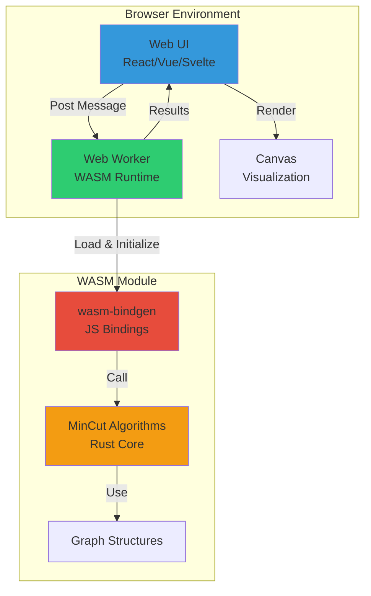
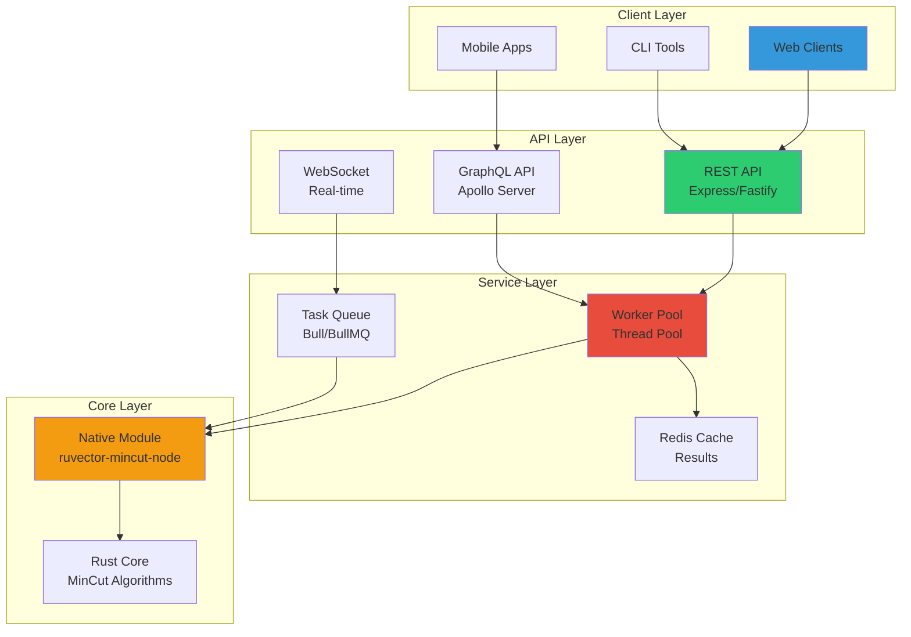
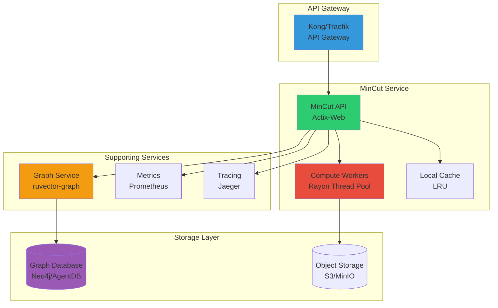
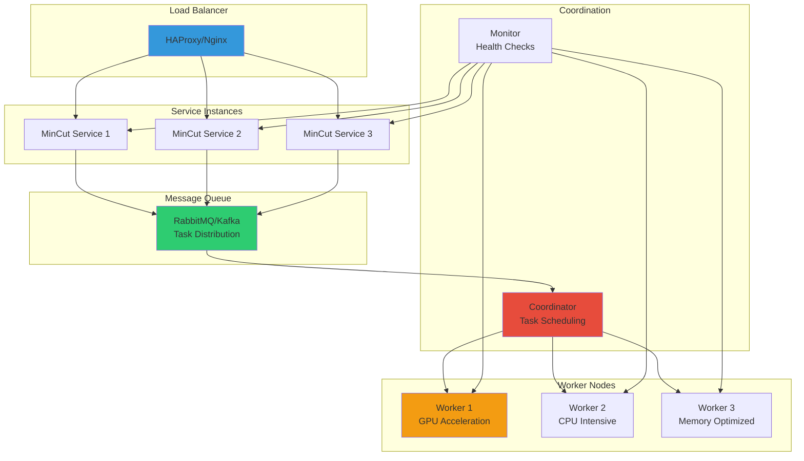

# Integration Guide

This guide covers all methods for integrating `ruvector-mincut` into your applications across different platforms and languages.

## Table of Contents

- [Rust Crate Integration](#rust-crate-integration)
- [WebAssembly (WASM)](#webassembly-wasm)
- [Node.js Integration](#nodejs-integration)
- [Python Integration](#python-integration)
- [REST API Service](#rest-api-service)
- [GraphQL Integration](#graphql-integration)
- [Architecture Patterns](#architecture-patterns)

---

## Rust Crate Integration

### Basic Setup

Add `ruvector-mincut` to your `Cargo.toml`:

```toml
[dependencies]
ruvector-mincut = "0.1.0"
ruvector-graph = "0.1.0"  # For graph database features

# Optional: Enable specific features
[dependencies.ruvector-mincut]
version = "0.1.0"
features = ["parallel", "advanced", "visualization"]
```

### Feature Flags

The crate supports several feature combinations:

```toml
[features]
default = []

# Core features
parallel = ["rayon"]           # Parallel execution with rayon
advanced = ["petgraph"]        # Advanced algorithms (Nagamochi-Ibaraki, etc.)
visualization = ["plotters"]   # Graph visualization support

# Performance features
simd = []                      # SIMD optimizations
native = []                    # Native CPU optimizations

# Serialization
serde = ["dep:serde"]
bincode = ["dep:bincode"]

# All features
full = ["parallel", "advanced", "visualization", "simd", "serde"]
```

### Workspace Setup

For multi-crate workspaces:

```toml
# workspace/Cargo.toml
[workspace]
members = [
    "app",
    "algorithms",
]

[workspace.dependencies]
ruvector-mincut = { version = "0.1.0", features = ["parallel", "advanced"] }

# app/Cargo.toml
[dependencies]
ruvector-mincut = { workspace = true }

# algorithms/Cargo.toml
[dependencies]
ruvector-mincut = { workspace = true, features = ["visualization"] }
```

### Basic Usage Example

```rust
use ruvector_mincut::{MinCutWrapper, MinCutAlgorithm};
use ruvector_mincut::graph::GraphBuilder;

fn main() -> Result<(), Box<dyn std::error::Error>> {
    // Build a graph
    let mut builder = GraphBuilder::new();
    builder.add_edge(0, 1, 1.0);
    builder.add_edge(1, 2, 1.0);
    builder.add_edge(2, 3, 1.0);
    builder.add_edge(3, 0, 1.0);
    builder.add_edge(0, 2, 0.5);

    let graph = builder.build()?;

    // Create wrapper and find minimum cut
    let mut wrapper = MinCutWrapper::new(graph);
    let result = wrapper.compute_min_cut(MinCutAlgorithm::StoerWagner)?;

    println!("Minimum cut value: {}", result.cut_value);
    println!("Partition 1: {:?}", result.partition1);
    println!("Partition 2: {:?}", result.partition2);

    Ok(())
}
```

### Advanced Usage with Features

```rust
#[cfg(feature = "parallel")]
use rayon::prelude::*;

use ruvector_mincut::{
    MinCutWrapper,
    MinCutAlgorithm,
    algorithms::PaperAlgorithm,
};

fn parallel_analysis(graphs: Vec<Graph>) -> Vec<MinCutResult> {
    #[cfg(feature = "parallel")]
    {
        graphs.par_iter()
            .map(|g| {
                let mut wrapper = MinCutWrapper::new(g.clone());
                wrapper.compute_min_cut(MinCutAlgorithm::FlowBased).unwrap()
            })
            .collect()
    }

    #[cfg(not(feature = "parallel"))]
    {
        graphs.iter()
            .map(|g| {
                let mut wrapper = MinCutWrapper::new(g.clone());
                wrapper.compute_min_cut(MinCutAlgorithm::FlowBased).unwrap()
            })
            .collect()
    }
}

#[cfg(feature = "advanced")]
fn use_paper_algorithms(graph: &Graph) -> Result<f64, MinCutError> {
    use ruvector_mincut::PaperAlgorithm;

    let mut wrapper = MinCutWrapper::new(graph.clone());

    // Use state-of-the-art algorithm from SODA 2025
    let result = wrapper.compute_paper_algorithm(
        PaperAlgorithm::RandomizedMinCutVerification
    )?;

    Ok(result.cut_value)
}
```

---

## WebAssembly (WASM)

### Building for WASM Target

#### Prerequisites

```bash
# Install wasm-pack
curl https://rustwasm.github.io/wasm-pack/installer/init.sh -sSf | sh

# Add wasm32 target
rustup target add wasm32-unknown-unknown
```

#### Build Commands

```bash
# Development build
wasm-pack build --target web --dev crates/ruvector-mincut-wasm

# Production build with optimizations
wasm-pack build --target web --release crates/ruvector-mincut-wasm

# Build for Node.js
wasm-pack build --target nodejs crates/ruvector-mincut-wasm

# Build for bundlers (webpack, rollup)
wasm-pack build --target bundler crates/ruvector-mincut-wasm
```

#### Optimization Tips

```toml
# Cargo.toml for WASM builds
[profile.release]
opt-level = "z"           # Optimize for size
lto = true               # Link-time optimization
codegen-units = 1        # Better optimization
panic = "abort"          # Smaller binary
strip = true             # Strip symbols

[profile.release.package."*"]
opt-level = "z"
```

### Browser Integration

#### HTML Setup

```html
<!DOCTYPE html>
<html>
<head>
    <meta charset="utf-8">
    <title>RuVector MinCut Demo</title>
</head>
<body>
    <h1>Minimum Cut Calculator</h1>

    <div>
        <label>Number of nodes:</label>
        <input type="number" id="nodeCount" value="10" min="2" max="1000">
    </div>

    <div>
        <label>Edge density:</label>
        <input type="range" id="density" min="0.1" max="1.0" step="0.1" value="0.3">
        <span id="densityValue">0.3</span>
    </div>

    <button id="computeBtn">Compute Min Cut</button>

    <div id="results"></div>
    <canvas id="graphCanvas" width="800" height="600"></canvas>

    <script type="module">
        import init, {
            MinCutWrapper,
            GraphBuilder,
            MinCutAlgorithm
        } from './pkg/ruvector_mincut_wasm.js';

        async function run() {
            // Initialize WASM module
            await init();

            document.getElementById('computeBtn').addEventListener('click', computeMinCut);
            document.getElementById('density').addEventListener('input', (e) => {
                document.getElementById('densityValue').textContent = e.target.value;
            });
        }

        async function computeMinCut() {
            const nodeCount = parseInt(document.getElementById('nodeCount').value);
            const density = parseFloat(document.getElementById('density').value);

            // Build random graph
            const builder = new GraphBuilder();

            for (let i = 0; i < nodeCount; i++) {
                for (let j = i + 1; j < nodeCount; j++) {
                    if (Math.random() < density) {
                        const weight = Math.random() * 10;
                        builder.add_edge(i, j, weight);
                    }
                }
            }

            const graph = builder.build();

            // Compute minimum cut
            const wrapper = new MinCutWrapper(graph);
            const startTime = performance.now();

            const result = wrapper.compute_min_cut(MinCutAlgorithm.StoerWagner);

            const elapsed = performance.now() - startTime;

            // Display results
            document.getElementById('results').innerHTML = `
                <h2>Results</h2>
                <p><strong>Minimum Cut Value:</strong> ${result.cut_value.toFixed(4)}</p>
                <p><strong>Partition 1 Size:</strong> ${result.partition1.length}</p>
                <p><strong>Partition 2 Size:</strong> ${result.partition2.length}</p>
                <p><strong>Computation Time:</strong> ${elapsed.toFixed(2)} ms</p>
                <p><strong>Edges in Cut:</strong> ${result.cut_edges.length}</p>
            `;

            // Visualize (optional - requires additional canvas code)
            visualizeGraph(graph, result);
        }

        function visualizeGraph(graph, result) {
            const canvas = document.getElementById('graphCanvas');
            const ctx = canvas.getContext('2d');

            // Clear canvas
            ctx.clearRect(0, 0, canvas.width, canvas.height);

            // Simple force-directed layout visualization
            // (Simplified version - production would use D3.js or similar)
            const nodes = result.partition1.concat(result.partition2);
            const positions = layoutNodes(nodes, canvas.width, canvas.height);

            // Draw edges
            ctx.strokeStyle = '#ccc';
            ctx.lineWidth = 1;
            // ... edge drawing code

            // Draw nodes
            result.partition1.forEach(nodeId => {
                drawNode(ctx, positions[nodeId], '#3498db');
            });

            result.partition2.forEach(nodeId => {
                drawNode(ctx, positions[nodeId], '#e74c3c');
            });
        }

        function drawNode(ctx, pos, color) {
            ctx.fillStyle = color;
            ctx.beginPath();
            ctx.arc(pos.x, pos.y, 8, 0, 2 * Math.PI);
            ctx.fill();
        }

        function layoutNodes(nodes, width, height) {
            // Simple circular layout
            const positions = {};
            const radius = Math.min(width, height) * 0.4;
            const centerX = width / 2;
            const centerY = height / 2;

            nodes.forEach((nodeId, i) => {
                const angle = (2 * Math.PI * i) / nodes.length;
                positions[nodeId] = {
                    x: centerX + radius * Math.cos(angle),
                    y: centerY + radius * Math.sin(angle)
                };
            });

            return positions;
        }

        run();
    </script>
</body>
</html>
```

#### TypeScript Integration

```typescript
// mincut-worker.ts
import init, {
    MinCutWrapper,
    GraphBuilder,
    MinCutAlgorithm,
    type MinCutResult
} from 'ruvector-mincut-wasm';

interface GraphData {
    nodes: number;
    edges: Array<[number, number, number]>;
}

interface ComputeRequest {
    type: 'compute';
    graph: GraphData;
    algorithm: string;
}

let initialized = false;

self.onmessage = async (e: MessageEvent<ComputeRequest>) => {
    if (!initialized) {
        await init();
        initialized = true;
    }

    const { graph, algorithm } = e.data;

    try {
        // Build graph
        const builder = new GraphBuilder();
        graph.edges.forEach(([from, to, weight]) => {
            builder.add_edge(from, to, weight);
        });

        const g = builder.build();

        // Compute minimum cut
        const wrapper = new MinCutWrapper(g);
        const algo = MinCutAlgorithm[algorithm as keyof typeof MinCutAlgorithm];
        const result = wrapper.compute_min_cut(algo);

        self.postMessage({
            success: true,
            result: {
                cutValue: result.cut_value,
                partition1: Array.from(result.partition1),
                partition2: Array.from(result.partition2),
                cutEdges: Array.from(result.cut_edges)
            }
        });
    } catch (error) {
        self.postMessage({
            success: false,
            error: error instanceof Error ? error.message : 'Unknown error'
        });
    }
};
```

#### Main Application

```typescript
// app.ts
import type { MinCutResult } from './types';

class MinCutService {
    private worker: Worker;
    private requestId = 0;
    private pending = new Map<number, {
        resolve: (result: MinCutResult) => void;
        reject: (error: Error) => void;
    }>();

    constructor() {
        this.worker = new Worker(
            new URL('./mincut-worker.ts', import.meta.url),
            { type: 'module' }
        );

        this.worker.onmessage = (e) => {
            const { id, success, result, error } = e.data;
            const pending = this.pending.get(id);

            if (pending) {
                if (success) {
                    pending.resolve(result);
                } else {
                    pending.reject(new Error(error));
                }
                this.pending.delete(id);
            }
        };
    }

    async computeMinCut(
        graph: GraphData,
        algorithm: string = 'StoerWagner'
    ): Promise<MinCutResult> {
        return new Promise((resolve, reject) => {
            const id = this.requestId++;
            this.pending.set(id, { resolve, reject });

            this.worker.postMessage({
                type: 'compute',
                id,
                graph,
                algorithm
            });
        });
    }

    terminate() {
        this.worker.terminate();
    }
}

// Usage
const service = new MinCutService();

const graph = {
    nodes: 6,
    edges: [
        [0, 1, 2.0],
        [1, 2, 3.0],
        [2, 3, 1.0],
        [3, 4, 2.0],
        [4, 5, 1.0],
        [5, 0, 2.0],
        [0, 3, 0.5]
    ]
};

const result = await service.computeMinCut(graph);
console.log('Min cut value:', result.cutValue);
```

---

## Node.js Integration

### Installation

```bash
# Using npm
npm install ruvector-mincut-node

# Using yarn
yarn add ruvector-mincut-node

# Using pnpm
pnpm add ruvector-mincut-node
```

### TypeScript Setup

```typescript
// types/mincut.d.ts
declare module 'ruvector-mincut-node' {
    export interface Edge {
        from: number;
        to: number;
        weight: number;
    }

    export interface MinCutResult {
        cutValue: number;
        partition1: number[];
        partition2: number[];
        cutEdges: Array<[number, number]>;
    }

    export interface ConnectivityCurve {
        numClusters: number;
        cutValue: number;
    }

    export enum MinCutAlgorithm {
        StoerWagner = 'StoerWagner',
        FlowBased = 'FlowBased',
        KargerStein = 'KargerStein',
        NagamochiIbaraki = 'NagamochiIbaraki',
        Hierarchical = 'Hierarchical'
    }

    export class GraphBuilder {
        constructor();
        addEdge(from: number, to: number, weight: number): void;
        build(): Graph;
    }

    export class Graph {
        nodeCount(): number;
        edgeCount(): number;
    }

    export class MinCutWrapper {
        constructor(graph: Graph);
        computeMinCut(algorithm: MinCutAlgorithm): Promise<MinCutResult>;
        computeConnectivityCurve(maxClusters?: number): Promise<ConnectivityCurve[]>;
        computeLocalKCut(k: number, sourceNode: number): Promise<MinCutResult>;
    }

    export class PaperAlgorithm {
        static RandomizedMinCutVerification: string;
        static BoundedMinCutEnumeration: string;
        static ApproximateGlobalMinCut: string;
    }
}
```

### Basic Usage

```typescript
// src/mincut.ts
import {
    GraphBuilder,
    MinCutWrapper,
    MinCutAlgorithm,
    type MinCutResult
} from 'ruvector-mincut-node';

async function computeMinimumCut(
    edges: Array<[number, number, number]>
): Promise<MinCutResult> {
    // Build graph
    const builder = new GraphBuilder();

    for (const [from, to, weight] of edges) {
        builder.addEdge(from, to, weight);
    }

    const graph = builder.build();

    // Compute minimum cut
    const wrapper = new MinCutWrapper(graph);
    const result = await wrapper.computeMinCut(MinCutAlgorithm.StoerWagner);

    return result;
}

// Example usage
const edges: Array<[number, number, number]> = [
    [0, 1, 1.0],
    [1, 2, 1.0],
    [2, 3, 1.0],
    [3, 0, 1.0],
    [0, 2, 0.5]
];

computeMinimumCut(edges).then(result => {
    console.log('Minimum cut value:', result.cutValue);
    console.log('Partition 1:', result.partition1);
    console.log('Partition 2:', result.partition2);
});
```

### Express.js Service

```typescript
// src/server.ts
import express, { Request, Response } from 'express';
import {
    GraphBuilder,
    MinCutWrapper,
    MinCutAlgorithm
} from 'ruvector-mincut-node';

const app = express();
app.use(express.json());

interface MinCutRequest {
    edges: Array<[number, number, number]>;
    algorithm?: string;
}

app.post('/api/mincut', async (req: Request<{}, {}, MinCutRequest>, res: Response) => {
    try {
        const { edges, algorithm = 'StoerWagner' } = req.body;

        if (!edges || !Array.isArray(edges)) {
            return res.status(400).json({
                error: 'Invalid request: edges array required'
            });
        }

        // Validate edges
        for (const edge of edges) {
            if (!Array.isArray(edge) || edge.length !== 3) {
                return res.status(400).json({
                    error: 'Invalid edge format: expected [from, to, weight]'
                });
            }
        }

        // Build graph
        const builder = new GraphBuilder();
        edges.forEach(([from, to, weight]) => {
            builder.addEdge(from, to, weight);
        });

        const graph = builder.build();

        // Compute minimum cut
        const wrapper = new MinCutWrapper(graph);
        const algo = MinCutAlgorithm[algorithm as keyof typeof MinCutAlgorithm]
                     || MinCutAlgorithm.StoerWagner;

        const result = await wrapper.computeMinCut(algo);

        res.json({
            success: true,
            data: {
                cutValue: result.cutValue,
                partition1: result.partition1,
                partition2: result.partition2,
                cutEdges: result.cutEdges,
                algorithm: algorithm
            }
        });
    } catch (error) {
        console.error('Error computing min cut:', error);
        res.status(500).json({
            success: false,
            error: error instanceof Error ? error.message : 'Unknown error'
        });
    }
});

app.post('/api/connectivity-curve', async (req: Request, res: Response) => {
    try {
        const { edges, maxClusters = 10 } = req.body;

        const builder = new GraphBuilder();
        edges.forEach(([from, to, weight]: [number, number, number]) => {
            builder.addEdge(from, to, weight);
        });

        const graph = builder.build();
        const wrapper = new MinCutWrapper(graph);

        const curve = await wrapper.computeConnectivityCurve(maxClusters);

        res.json({
            success: true,
            data: curve
        });
    } catch (error) {
        console.error('Error computing connectivity curve:', error);
        res.status(500).json({
            success: false,
            error: error instanceof Error ? error.message : 'Unknown error'
        });
    }
});

const PORT = process.env.PORT || 3000;
app.listen(PORT, () => {
    console.log(`MinCut service running on port ${PORT}`);
});
```

### Async Patterns with Worker Threads

```typescript
// src/worker-pool.ts
import { Worker } from 'worker_threads';
import { cpus } from 'os';

interface WorkerTask {
    id: number;
    edges: Array<[number, number, number]>;
    algorithm: string;
}

interface WorkerResult {
    id: number;
    result: any;
    error?: string;
}

export class MinCutWorkerPool {
    private workers: Worker[] = [];
    private queue: Array<{
        task: WorkerTask;
        resolve: (result: any) => void;
        reject: (error: Error) => void;
    }> = [];
    private activeWorkers = 0;
    private taskId = 0;

    constructor(private poolSize: number = cpus().length) {
        this.initializeWorkers();
    }

    private initializeWorkers() {
        for (let i = 0; i < this.poolSize; i++) {
            const worker = new Worker('./mincut-worker.js');

            worker.on('message', (result: WorkerResult) => {
                this.activeWorkers--;

                const pending = this.queue.shift();
                if (pending) {
                    if (result.error) {
                        pending.reject(new Error(result.error));
                    } else {
                        pending.resolve(result.result);
                    }
                }

                this.processQueue();
            });

            worker.on('error', (error) => {
                console.error('Worker error:', error);
                this.activeWorkers--;
                this.processQueue();
            });

            this.workers.push(worker);
        }
    }

    async computeMinCut(
        edges: Array<[number, number, number]>,
        algorithm: string = 'StoerWagner'
    ): Promise<any> {
        return new Promise((resolve, reject) => {
            const task: WorkerTask = {
                id: this.taskId++,
                edges,
                algorithm
            };

            this.queue.push({ task, resolve, reject });
            this.processQueue();
        });
    }

    private processQueue() {
        while (this.activeWorkers < this.poolSize && this.queue.length > 0) {
            const { task } = this.queue[0];
            const worker = this.workers[this.activeWorkers];

            this.activeWorkers++;
            worker.postMessage(task);
        }
    }

    terminate() {
        this.workers.forEach(worker => worker.terminate());
        this.workers = [];
    }
}

// Usage
const pool = new MinCutWorkerPool();

const tasks = [
    pool.computeMinCut([[0, 1, 1], [1, 2, 1]], 'StoerWagner'),
    pool.computeMinCut([[0, 1, 2], [1, 2, 3]], 'FlowBased'),
    pool.computeMinCut([[0, 1, 1], [1, 2, 1], [2, 0, 1]], 'KargerStein')
];

const results = await Promise.all(tasks);
console.log('All results:', results);
```

---

## Python Integration

### PyO3 Bindings Concept

```python
# ruvector_mincut/__init__.py
"""
Python bindings for ruvector-mincut library.

This module provides Python access to high-performance minimum cut algorithms
implemented in Rust.
"""

from typing import List, Tuple, Optional, Dict, Any
from enum import Enum

class MinCutAlgorithm(Enum):
    """Available minimum cut algorithms."""
    STOER_WAGNER = "StoerWagner"
    FLOW_BASED = "FlowBased"
    KARGER_STEIN = "KargerStein"
    NAGAMOCHI_IBARAKI = "NagamochiIbaraki"
    HIERARCHICAL = "Hierarchical"


class MinCutResult:
    """Result of a minimum cut computation."""

    def __init__(
        self,
        cut_value: float,
        partition1: List[int],
        partition2: List[int],
        cut_edges: List[Tuple[int, int]]
    ):
        self.cut_value = cut_value
        self.partition1 = partition1
        self.partition2 = partition2
        self.cut_edges = cut_edges

    def __repr__(self) -> str:
        return (
            f"MinCutResult(cut_value={self.cut_value}, "
            f"partition1={self.partition1}, "
            f"partition2={self.partition2})"
        )

    def to_dict(self) -> Dict[str, Any]:
        """Convert result to dictionary."""
        return {
            'cut_value': self.cut_value,
            'partition1': self.partition1,
            'partition2': self.partition2,
            'cut_edges': self.cut_edges
        }


class GraphBuilder:
    """Builder for constructing graphs."""

    def __init__(self):
        """Initialize a new graph builder."""
        self._edges: List[Tuple[int, int, float]] = []

    def add_edge(self, from_node: int, to_node: int, weight: float = 1.0) -> 'GraphBuilder':
        """
        Add an edge to the graph.

        Args:
            from_node: Source node ID
            to_node: Target node ID
            weight: Edge weight (default: 1.0)

        Returns:
            Self for method chaining
        """
        self._edges.append((from_node, to_node, weight))
        return self

    def build(self) -> 'Graph':
        """
        Build the graph.

        Returns:
            Constructed Graph object
        """
        # This would call the Rust implementation
        from . import _native
        return Graph(_native.build_graph(self._edges))


class Graph:
    """Graph data structure."""

    def __init__(self, handle):
        """Initialize with native handle (internal use)."""
        self._handle = handle

    def node_count(self) -> int:
        """Get the number of nodes in the graph."""
        from . import _native
        return _native.graph_node_count(self._handle)

    def edge_count(self) -> int:
        """Get the number of edges in the graph."""
        from . import _native
        return _native.graph_edge_count(self._handle)


class MinCutWrapper:
    """Wrapper for minimum cut computations."""

    def __init__(self, graph: Graph):
        """
        Initialize wrapper with a graph.

        Args:
            graph: Graph to analyze
        """
        self.graph = graph
        from . import _native
        self._handle = _native.create_mincut_wrapper(graph._handle)

    def compute_min_cut(
        self,
        algorithm: MinCutAlgorithm = MinCutAlgorithm.STOER_WAGNER
    ) -> MinCutResult:
        """
        Compute the minimum cut.

        Args:
            algorithm: Algorithm to use

        Returns:
            MinCutResult containing the cut value and partitions

        Raises:
            ValueError: If computation fails
        """
        from . import _native

        result = _native.compute_min_cut(self._handle, algorithm.value)

        return MinCutResult(
            cut_value=result['cut_value'],
            partition1=result['partition1'],
            partition2=result['partition2'],
            cut_edges=result['cut_edges']
        )

    def compute_connectivity_curve(
        self,
        max_clusters: Optional[int] = None
    ) -> List[Dict[str, Any]]:
        """
        Compute connectivity curve showing cut values at different cluster counts.

        Args:
            max_clusters: Maximum number of clusters (default: node_count)

        Returns:
            List of dictionaries with 'num_clusters' and 'cut_value'
        """
        from . import _native
        return _native.compute_connectivity_curve(self._handle, max_clusters)

    def compute_local_k_cut(
        self,
        k: int,
        source_node: int
    ) -> MinCutResult:
        """
        Compute local k-cut around a source node.

        Args:
            k: Target cluster count
            source_node: Source node for local cut

        Returns:
            MinCutResult for the local cut
        """
        from . import _native

        result = _native.compute_local_k_cut(self._handle, k, source_node)

        return MinCutResult(
            cut_value=result['cut_value'],
            partition1=result['partition1'],
            partition2=result['partition2'],
            cut_edges=result['cut_edges']
        )


# Convenience functions
def compute_min_cut(
    edges: List[Tuple[int, int, float]],
    algorithm: MinCutAlgorithm = MinCutAlgorithm.STOER_WAGNER
) -> MinCutResult:
    """
    Convenience function to compute minimum cut from edge list.

    Args:
        edges: List of (from, to, weight) tuples
        algorithm: Algorithm to use

    Returns:
        MinCutResult

    Example:
        >>> edges = [(0, 1, 1.0), (1, 2, 1.0), (2, 0, 1.0)]
        >>> result = compute_min_cut(edges)
        >>> print(f"Cut value: {result.cut_value}")
    """
    builder = GraphBuilder()
    for from_node, to_node, weight in edges:
        builder.add_edge(from_node, to_node, weight)

    graph = builder.build()
    wrapper = MinCutWrapper(graph)
    return wrapper.compute_min_cut(algorithm)
```

### Python Usage Example

```python
# examples/python_example.py
from ruvector_mincut import (
    GraphBuilder,
    MinCutWrapper,
    MinCutAlgorithm,
    compute_min_cut
)
import matplotlib.pyplot as plt
import networkx as nx

def basic_example():
    """Basic usage example."""
    # Build a simple graph
    builder = GraphBuilder()
    builder.add_edge(0, 1, 1.0)
    builder.add_edge(1, 2, 1.0)
    builder.add_edge(2, 3, 1.0)
    builder.add_edge(3, 0, 1.0)
    builder.add_edge(0, 2, 0.5)

    graph = builder.build()

    # Compute minimum cut
    wrapper = MinCutWrapper(graph)
    result = wrapper.compute_min_cut(MinCutAlgorithm.STOER_WAGNER)

    print(f"Minimum cut value: {result.cut_value}")
    print(f"Partition 1: {result.partition1}")
    print(f"Partition 2: {result.partition2}")
    print(f"Cut edges: {result.cut_edges}")


def connectivity_analysis():
    """Analyze connectivity curve."""
    # Create a larger graph
    edges = []
    for i in range(10):
        edges.append((i, (i + 1) % 10, 1.0))
        if i % 2 == 0:
            edges.append((i, (i + 5) % 10, 0.5))

    builder = GraphBuilder()
    for from_node, to_node, weight in edges:
        builder.add_edge(from_node, to_node, weight)

    graph = builder.build()
    wrapper = MinCutWrapper(graph)

    # Get connectivity curve
    curve = wrapper.compute_connectivity_curve(max_clusters=5)

    # Plot
    clusters = [c['num_clusters'] for c in curve]
    cut_values = [c['cut_value'] for c in curve]

    plt.figure(figsize=(10, 6))
    plt.plot(clusters, cut_values, marker='o')
    plt.xlabel('Number of Clusters')
    plt.ylabel('Minimum Cut Value')
    plt.title('Connectivity Curve')
    plt.grid(True)
    plt.savefig('connectivity_curve.png')
    print("Saved connectivity curve to connectivity_curve.png")


def visualize_cut():
    """Visualize the minimum cut."""
    # Build graph
    edges = [
        (0, 1, 1.0), (1, 2, 1.0), (2, 3, 1.0),
        (3, 4, 1.0), (4, 5, 1.0), (5, 0, 1.0),
        (0, 3, 0.5), (1, 4, 0.5), (2, 5, 0.5)
    ]

    # Compute minimum cut
    result = compute_min_cut(edges)

    # Create NetworkX graph for visualization
    G = nx.Graph()
    for from_node, to_node, weight in edges:
        G.add_edge(from_node, to_node, weight=weight)

    # Color nodes by partition
    colors = []
    for node in G.nodes():
        if node in result.partition1:
            colors.append('lightblue')
        else:
            colors.append('lightcoral')

    # Highlight cut edges
    edge_colors = []
    for edge in G.edges():
        if edge in result.cut_edges or (edge[1], edge[0]) in result.cut_edges:
            edge_colors.append('red')
        else:
            edge_colors.append('gray')

    # Draw
    plt.figure(figsize=(10, 8))
    pos = nx.spring_layout(G)
    nx.draw(G, pos, node_color=colors, edge_color=edge_colors,
            node_size=500, with_labels=True, width=2)
    plt.title(f'Minimum Cut (value: {result.cut_value})')
    plt.savefig('mincut_visualization.png')
    print("Saved visualization to mincut_visualization.png")


if __name__ == '__main__':
    print("Running basic example...")
    basic_example()

    print("\nAnalyzing connectivity...")
    connectivity_analysis()

    print("\nVisualizing cut...")
    visualize_cut()
```

---

## REST API Service

### Actix-Web Service

```rust
// src/api/mod.rs
use actix_web::{web, App, HttpResponse, HttpServer, middleware};
use serde::{Deserialize, Serialize};
use ruvector_mincut::{MinCutWrapper, MinCutAlgorithm, MinCutError};
use ruvector_mincut::graph::GraphBuilder;

#[derive(Debug, Deserialize)]
struct Edge {
    from: usize,
    to: usize,
    weight: f64,
}

#[derive(Debug, Deserialize)]
struct MinCutRequest {
    edges: Vec<Edge>,
    algorithm: Option<String>,
}

#[derive(Debug, Serialize)]
struct MinCutResponse {
    cut_value: f64,
    partition1: Vec<usize>,
    partition2: Vec<usize>,
    cut_edges: Vec<(usize, usize)>,
    algorithm: String,
    computation_time_ms: f64,
}

#[derive(Debug, Serialize)]
struct ErrorResponse {
    error: String,
    details: Option<String>,
}

#[derive(Debug, Deserialize)]
struct ConnectivityRequest {
    edges: Vec<Edge>,
    max_clusters: Option<usize>,
}

#[derive(Debug, Serialize)]
struct ConnectivityPoint {
    num_clusters: usize,
    cut_value: f64,
}

#[derive(Debug, Serialize)]
struct ConnectivityResponse {
    curve: Vec<ConnectivityPoint>,
    computation_time_ms: f64,
}

// Health check endpoint
async fn health() -> HttpResponse {
    HttpResponse::Ok().json(serde_json::json!({
        "status": "healthy",
        "version": env!("CARGO_PKG_VERSION")
    }))
}

// Compute minimum cut endpoint
async fn compute_min_cut(req: web::Json<MinCutRequest>) -> HttpResponse {
    let start = std::time::Instant::now();

    // Build graph
    let mut builder = GraphBuilder::new();
    for edge in &req.edges {
        builder.add_edge(edge.from, edge.to, edge.weight);
    }

    let graph = match builder.build() {
        Ok(g) => g,
        Err(e) => {
            return HttpResponse::BadRequest().json(ErrorResponse {
                error: "Failed to build graph".to_string(),
                details: Some(e.to_string()),
            });
        }
    };

    // Parse algorithm
    let algorithm = match req.algorithm.as_deref() {
        Some("StoerWagner") | None => MinCutAlgorithm::StoerWagner,
        Some("FlowBased") => MinCutAlgorithm::FlowBased,
        Some("KargerStein") => MinCutAlgorithm::KargerStein,
        Some("NagamochiIbaraki") => MinCutAlgorithm::NagamochiIbaraki,
        Some("Hierarchical") => MinCutAlgorithm::Hierarchical,
        Some(algo) => {
            return HttpResponse::BadRequest().json(ErrorResponse {
                error: "Invalid algorithm".to_string(),
                details: Some(format!("Unknown algorithm: {}", algo)),
            });
        }
    };

    // Compute minimum cut
    let mut wrapper = MinCutWrapper::new(graph);
    let result = match wrapper.compute_min_cut(algorithm) {
        Ok(r) => r,
        Err(e) => {
            return HttpResponse::InternalServerError().json(ErrorResponse {
                error: "Computation failed".to_string(),
                details: Some(e.to_string()),
            });
        }
    };

    let elapsed = start.elapsed();

    HttpResponse::Ok().json(MinCutResponse {
        cut_value: result.cut_value,
        partition1: result.partition1,
        partition2: result.partition2,
        cut_edges: result.cut_edges,
        algorithm: format!("{:?}", algorithm),
        computation_time_ms: elapsed.as_secs_f64() * 1000.0,
    })
}

// Connectivity curve endpoint
async fn connectivity_curve(req: web::Json<ConnectivityRequest>) -> HttpResponse {
    let start = std::time::Instant::now();

    // Build graph
    let mut builder = GraphBuilder::new();
    for edge in &req.edges {
        builder.add_edge(edge.from, edge.to, edge.weight);
    }

    let graph = match builder.build() {
        Ok(g) => g,
        Err(e) => {
            return HttpResponse::BadRequest().json(ErrorResponse {
                error: "Failed to build graph".to_string(),
                details: Some(e.to_string()),
            });
        }
    };

    // Compute connectivity curve
    let mut wrapper = MinCutWrapper::new(graph);
    let curve = match wrapper.compute_connectivity_curve(req.max_clusters) {
        Ok(c) => c,
        Err(e) => {
            return HttpResponse::InternalServerError().json(ErrorResponse {
                error: "Computation failed".to_string(),
                details: Some(e.to_string()),
            });
        }
    };

    let elapsed = start.elapsed();

    let response_curve: Vec<ConnectivityPoint> = curve
        .into_iter()
        .map(|point| ConnectivityPoint {
            num_clusters: point.num_clusters,
            cut_value: point.cut_value,
        })
        .collect();

    HttpResponse::Ok().json(ConnectivityResponse {
        curve: response_curve,
        computation_time_ms: elapsed.as_secs_f64() * 1000.0,
    })
}

// List available algorithms
async fn list_algorithms() -> HttpResponse {
    HttpResponse::Ok().json(serde_json::json!({
        "algorithms": [
            {
                "name": "StoerWagner",
                "description": "Exact algorithm with O(V³) time complexity",
                "exact": true
            },
            {
                "name": "FlowBased",
                "description": "Maximum flow based algorithm",
                "exact": true
            },
            {
                "name": "KargerStein",
                "description": "Randomized algorithm with high probability guarantees",
                "exact": false
            },
            {
                "name": "NagamochiIbaraki",
                "description": "O(VE + V²log V) deterministic algorithm",
                "exact": true
            },
            {
                "name": "Hierarchical",
                "description": "Hierarchical clustering based approach",
                "exact": false
            }
        ]
    }))
}

#[actix_web::main]
async fn main() -> std::io::Result<()> {
    env_logger::init_from_env(env_logger::Env::new().default_filter_or("info"));

    let port = std::env::var("PORT")
        .unwrap_or_else(|_| "8080".to_string())
        .parse::<u16>()
        .expect("Invalid PORT");

    log::info!("Starting MinCut API server on port {}", port);

    HttpServer::new(|| {
        App::new()
            .wrap(middleware::Logger::default())
            .wrap(middleware::Compress::default())
            .route("/health", web::get().to(health))
            .route("/api/mincut", web::post().to(compute_min_cut))
            .route("/api/connectivity", web::post().to(connectivity_curve))
            .route("/api/algorithms", web::get().to(list_algorithms))
    })
    .bind(("0.0.0.0", port))?
    .run()
    .await
}
```

### API Client Example

```typescript
// client/mincut-api-client.ts
export interface Edge {
    from: number;
    to: number;
    weight: number;
}

export interface MinCutResult {
    cutValue: number;
    partition1: number[];
    partition2: number[];
    cutEdges: Array<[number, number]>;
    algorithm: string;
    computationTimeMs: number;
}

export interface ConnectivityPoint {
    numClusters: number;
    cutValue: number;
}

export class MinCutAPIClient {
    constructor(private baseUrl: string = 'http://localhost:8080') {}

    async computeMinCut(
        edges: Edge[],
        algorithm?: string
    ): Promise<MinCutResult> {
        const response = await fetch(`${this.baseUrl}/api/mincut`, {
            method: 'POST',
            headers: { 'Content-Type': 'application/json' },
            body: JSON.stringify({ edges, algorithm })
        });

        if (!response.ok) {
            const error = await response.json();
            throw new Error(error.error || 'API request failed');
        }

        return response.json();
    }

    async computeConnectivityCurve(
        edges: Edge[],
        maxClusters?: number
    ): Promise<{ curve: ConnectivityPoint[]; computationTimeMs: number }> {
        const response = await fetch(`${this.baseUrl}/api/connectivity`, {
            method: 'POST',
            headers: { 'Content-Type': 'application/json' },
            body: JSON.stringify({ edges, max_clusters: maxClusters })
        });

        if (!response.ok) {
            const error = await response.json();
            throw new Error(error.error || 'API request failed');
        }

        return response.json();
    }

    async listAlgorithms(): Promise<any> {
        const response = await fetch(`${this.baseUrl}/api/algorithms`);
        return response.json();
    }
}

// Usage
const client = new MinCutAPIClient();

const edges = [
    { from: 0, to: 1, weight: 1.0 },
    { from: 1, to: 2, weight: 1.0 },
    { from: 2, to: 0, weight: 1.0 }
];

const result = await client.computeMinCut(edges, 'StoerWagner');
console.log(result);
```

---

## GraphQL Integration

### Schema Definition

```graphql
# schema.graphql
type Query {
  """Get available algorithms"""
  algorithms: [Algorithm!]!

  """Check service health"""
  health: HealthStatus!
}

type Mutation {
  """Compute minimum cut for a graph"""
  computeMinCut(input: MinCutInput!): MinCutResult!

  """Compute connectivity curve"""
  computeConnectivityCurve(input: ConnectivityInput!): ConnectivityCurve!

  """Compute local k-cut around a source node"""
  computeLocalKCut(input: LocalKCutInput!): MinCutResult!
}

input EdgeInput {
  from: Int!
  to: Int!
  weight: Float!
}

input MinCutInput {
  edges: [EdgeInput!]!
  algorithm: AlgorithmType = STOER_WAGNER
}

input ConnectivityInput {
  edges: [EdgeInput!]!
  maxClusters: Int
}

input LocalKCutInput {
  edges: [EdgeInput!]!
  k: Int!
  sourceNode: Int!
}

enum AlgorithmType {
  STOER_WAGNER
  FLOW_BASED
  KARGER_STEIN
  NAGAMOCHI_IBARAKI
  HIERARCHICAL
}

type Algorithm {
  name: String!
  description: String!
  exact: Boolean!
  timeComplexity: String!
}

type MinCutResult {
  cutValue: Float!
  partition1: [Int!]!
  partition2: [Int!]!
  cutEdges: [[Int!]!]!
  algorithm: String!
  computationTimeMs: Float!
}

type ConnectivityPoint {
  numClusters: Int!
  cutValue: Float!
}

type ConnectivityCurve {
  curve: [ConnectivityPoint!]!
  computationTimeMs: Float!
}

type HealthStatus {
  status: String!
  version: String!
}
```

### Resolver Implementation

```rust
// src/graphql/mod.rs
use async_graphql::{
    Context, Object, Schema, EmptySubscription, SimpleObject, Enum, InputObject
};
use ruvector_mincut::{MinCutWrapper, MinCutAlgorithm};
use ruvector_mincut::graph::GraphBuilder;

#[derive(InputObject)]
struct EdgeInput {
    from: usize,
    to: usize,
    weight: f64,
}

#[derive(InputObject)]
struct MinCutInput {
    edges: Vec<EdgeInput>,
    #[graphql(default)]
    algorithm: AlgorithmType,
}

#[derive(InputObject)]
struct ConnectivityInput {
    edges: Vec<EdgeInput>,
    max_clusters: Option<usize>,
}

#[derive(InputObject)]
struct LocalKCutInput {
    edges: Vec<EdgeInput>,
    k: usize,
    source_node: usize,
}

#[derive(Enum, Copy, Clone, Eq, PartialEq)]
enum AlgorithmType {
    StoerWagner,
    FlowBased,
    KargerStein,
    NagamochiIbaraki,
    Hierarchical,
}

impl From<AlgorithmType> for MinCutAlgorithm {
    fn from(algo: AlgorithmType) -> Self {
        match algo {
            AlgorithmType::StoerWagner => MinCutAlgorithm::StoerWagner,
            AlgorithmType::FlowBased => MinCutAlgorithm::FlowBased,
            AlgorithmType::KargerStein => MinCutAlgorithm::KargerStein,
            AlgorithmType::NagamochiIbaraki => MinCutAlgorithm::NagamochiIbaraki,
            AlgorithmType::Hierarchical => MinCutAlgorithm::Hierarchical,
        }
    }
}

#[derive(SimpleObject)]
struct Algorithm {
    name: String,
    description: String,
    exact: bool,
    time_complexity: String,
}

#[derive(SimpleObject)]
struct MinCutResultGQL {
    cut_value: f64,
    partition1: Vec<usize>,
    partition2: Vec<usize>,
    cut_edges: Vec<Vec<usize>>,
    algorithm: String,
    computation_time_ms: f64,
}

#[derive(SimpleObject)]
struct ConnectivityPointGQL {
    num_clusters: usize,
    cut_value: f64,
}

#[derive(SimpleObject)]
struct ConnectivityCurveGQL {
    curve: Vec<ConnectivityPointGQL>,
    computation_time_ms: f64,
}

#[derive(SimpleObject)]
struct HealthStatus {
    status: String,
    version: String,
}

pub struct QueryRoot;

#[Object]
impl QueryRoot {
    async fn algorithms(&self) -> Vec<Algorithm> {
        vec![
            Algorithm {
                name: "StoerWagner".to_string(),
                description: "Exact algorithm with O(V³) time complexity".to_string(),
                exact: true,
                time_complexity: "O(V³)".to_string(),
            },
            Algorithm {
                name: "FlowBased".to_string(),
                description: "Maximum flow based algorithm".to_string(),
                exact: true,
                time_complexity: "O(V²E)".to_string(),
            },
            Algorithm {
                name: "KargerStein".to_string(),
                description: "Randomized algorithm with high probability".to_string(),
                exact: false,
                time_complexity: "O(V²log³V)".to_string(),
            },
            Algorithm {
                name: "NagamochiIbaraki".to_string(),
                description: "Deterministic near-linear algorithm".to_string(),
                exact: true,
                time_complexity: "O(VE + V²log V)".to_string(),
            },
            Algorithm {
                name: "Hierarchical".to_string(),
                description: "Hierarchical clustering approach".to_string(),
                exact: false,
                time_complexity: "O(V²log V)".to_string(),
            },
        ]
    }

    async fn health(&self) -> HealthStatus {
        HealthStatus {
            status: "healthy".to_string(),
            version: env!("CARGO_PKG_VERSION").to_string(),
        }
    }
}

pub struct MutationRoot;

#[Object]
impl MutationRoot {
    async fn compute_min_cut(&self, input: MinCutInput) -> async_graphql::Result<MinCutResultGQL> {
        let start = std::time::Instant::now();

        // Build graph
        let mut builder = GraphBuilder::new();
        for edge in input.edges {
            builder.add_edge(edge.from, edge.to, edge.weight);
        }
        let graph = builder.build()?;

        // Compute minimum cut
        let mut wrapper = MinCutWrapper::new(graph);
        let result = wrapper.compute_min_cut(input.algorithm.into())?;

        let elapsed = start.elapsed();

        Ok(MinCutResultGQL {
            cut_value: result.cut_value,
            partition1: result.partition1,
            partition2: result.partition2,
            cut_edges: result.cut_edges.into_iter()
                .map(|(a, b)| vec![a, b])
                .collect(),
            algorithm: format!("{:?}", input.algorithm),
            computation_time_ms: elapsed.as_secs_f64() * 1000.0,
        })
    }

    async fn compute_connectivity_curve(
        &self,
        input: ConnectivityInput
    ) -> async_graphql::Result<ConnectivityCurveGQL> {
        let start = std::time::Instant::now();

        // Build graph
        let mut builder = GraphBuilder::new();
        for edge in input.edges {
            builder.add_edge(edge.from, edge.to, edge.weight);
        }
        let graph = builder.build()?;

        // Compute connectivity curve
        let mut wrapper = MinCutWrapper::new(graph);
        let curve = wrapper.compute_connectivity_curve(input.max_clusters)?;

        let elapsed = start.elapsed();

        Ok(ConnectivityCurveGQL {
            curve: curve.into_iter()
                .map(|p| ConnectivityPointGQL {
                    num_clusters: p.num_clusters,
                    cut_value: p.cut_value,
                })
                .collect(),
            computation_time_ms: elapsed.as_secs_f64() * 1000.0,
        })
    }

    async fn compute_local_k_cut(
        &self,
        input: LocalKCutInput
    ) -> async_graphql::Result<MinCutResultGQL> {
        let start = std::time::Instant::now();

        // Build graph
        let mut builder = GraphBuilder::new();
        for edge in input.edges {
            builder.add_edge(edge.from, edge.to, edge.weight);
        }
        let graph = builder.build()?;

        // Compute local k-cut
        let mut wrapper = MinCutWrapper::new(graph);
        let result = wrapper.compute_local_k_cut(input.k, input.source_node)?;

        let elapsed = start.elapsed();

        Ok(MinCutResultGQL {
            cut_value: result.cut_value,
            partition1: result.partition1,
            partition2: result.partition2,
            cut_edges: result.cut_edges.into_iter()
                .map(|(a, b)| vec![a, b])
                .collect(),
            algorithm: "LocalKCut".to_string(),
            computation_time_ms: elapsed.as_secs_f64() * 1000.0,
        })
    }
}

pub type MinCutSchema = Schema<QueryRoot, MutationRoot, EmptySubscription>;

pub fn create_schema() -> MinCutSchema {
    Schema::build(QueryRoot, MutationRoot, EmptySubscription).finish()
}
```

### GraphQL Server

```rust
// src/graphql_server.rs
use actix_web::{web, App, HttpServer, guard, middleware};
use async_graphql::http::{playground_source, GraphQLPlaygroundConfig};
use async_graphql_actix_web::{GraphQLRequest, GraphQLResponse};

mod graphql;
use graphql::create_schema;

async fn graphql_playground() -> actix_web::HttpResponse {
    actix_web::HttpResponse::Ok()
        .content_type("text/html; charset=utf-8")
        .body(playground_source(
            GraphQLPlaygroundConfig::new("/graphql")
        ))
}

async fn graphql_handler(
    schema: web::Data<graphql::MinCutSchema>,
    req: GraphQLRequest,
) -> GraphQLResponse {
    schema.execute(req.into_inner()).await.into()
}

#[actix_web::main]
async fn main() -> std::io::Result<()> {
    env_logger::init_from_env(env_logger::Env::new().default_filter_or("info"));

    let schema = create_schema();

    log::info!("GraphQL Playground: http://localhost:8080/playground");

    HttpServer::new(move || {
        App::new()
            .app_data(web::Data::new(schema.clone()))
            .wrap(middleware::Logger::default())
            .service(
                web::resource("/graphql")
                    .guard(guard::Post())
                    .to(graphql_handler)
            )
            .service(
                web::resource("/playground")
                    .guard(guard::Get())
                    .to(graphql_playground)
            )
    })
    .bind(("0.0.0.0", 8080))?
    .run()
    .await
}
```

---

## Architecture Patterns

### WASM Browser Deployment



### Node.js Server Architecture



### Microservice Integration



### Distributed Processing



---

## Integration with ruvector-graph

For graph database features and persistent storage, integrate with `ruvector-graph`:

```rust
use ruvector_mincut::MinCutWrapper;
use ruvector_graph::{GraphDB, Query};

// Load graph from database
let db = GraphDB::connect("localhost:7687")?;
let graph = db.query("MATCH (n)-[r]-(m) RETURN n, r, m")?;

// Compute minimum cut
let mut wrapper = MinCutWrapper::new(graph);
let result = wrapper.compute_min_cut(MinCutAlgorithm::StoerWagner)?;

// Store results back to database
db.execute(
    "CREATE (r:MinCutResult {value: $value})",
    &[("value", result.cut_value)]
)?;
```

---

## Best Practices

### Performance Optimization

1. **Use Web Workers for WASM** - Keep UI responsive
2. **Worker Pools for Node.js** - Utilize all CPU cores
3. **Caching** - Cache results for identical graphs
4. **Batch Processing** - Process multiple graphs in parallel
5. **Algorithm Selection** - Choose appropriate algorithm for graph size

### Error Handling

```typescript
try {
    const result = await computeMinCut(edges);
} catch (error) {
    if (error.message.includes('memory')) {
        // Graph too large, try different algorithm
    } else if (error.message.includes('timeout')) {
        // Computation timeout, use approximate algorithm
    } else {
        // Other errors
    }
}
```

### Security Considerations

1. **Input Validation** - Validate graph size limits
2. **Rate Limiting** - Prevent abuse of compute resources
3. **Timeout Protection** - Set computation timeouts
4. **Resource Limits** - Limit memory usage per request

---

## Next Steps

- [Performance Optimization Guide](./05-performance-optimization.md)
- [API Reference](../api/README.md)
- [Examples](../../examples/README.md)
