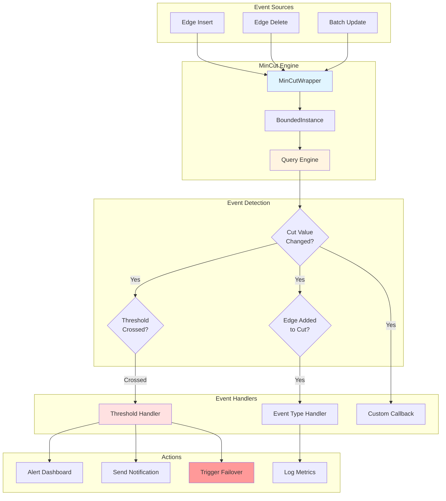
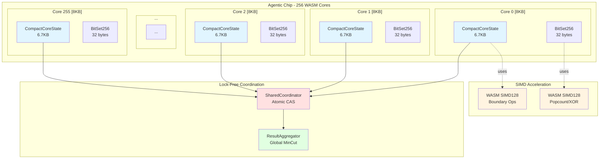
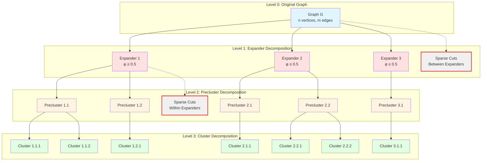

# Advanced Examples Guide

This guide showcases exotic and advanced use cases for `ruvector-mincut`, demonstrating cutting-edge features from the December 2025 breakthrough paper and production-grade deployment scenarios.

---

## Table of Contents

1. [Real-Time Network Monitoring](#1-real-time-network-monitoring)
2. [256-Core Agentic Chip Deployment](#2-256-core-agentic-chip-deployment)
3. [December 2025 Paper Algorithms](#3-december-2025-paper-algorithms)
4. [PolylogConnectivity for Worst-Case Guarantees](#4-polylogconnectivity-for-worst-case-guarantees)
5. [ApproxMinCut for Large Graphs](#5-approxmincut-for-large-graphs)
6. [Custom Graph Sources](#6-custom-graph-sources)

---

## 1. Real-Time Network Monitoring

**Use Case**: Live infrastructure dashboard that alerts when network connectivity drops below critical thresholds.

### 1.1 Using the Monitoring Feature

The monitoring feature provides event-driven architecture for real-time alerts on minimum cut changes.

```rust
use ruvector_mincut::{MinCutBuilder, MonitorBuilder, EventType, MinCutEvent};
use std::sync::{Arc, Mutex};

fn main() -> Result<(), Box<dyn std::error::Error>> {
    // Shared alert log
    let alerts = Arc::new(Mutex::new(Vec::new()));
    let alerts_clone = Arc::clone(&alerts);

    // Configure monitor with thresholds
    let monitor = MonitorBuilder::new()
        // Critical: minimum cut below 5 edges
        .threshold_below(5.0, "critical")
        // Warning: minimum cut below 20 edges
        .threshold_below(20.0, "warning")
        // Safe: minimum cut above 100 edges
        .threshold_above(100.0, "safe")
        // Alert on any decrease
        .on_event_type(EventType::CutDecreased, "alert", move |event: MinCutEvent| {
            let mut log = alerts_clone.lock().unwrap();
            log.push(format!(
                "[{}] Cut decreased: {} → {} (threshold: {})",
                event.timestamp.elapsed().unwrap().as_secs(),
                event.old_value,
                event.new_value,
                event.threshold.unwrap_or("none".to_string())
            ));

            // Trigger emergency protocols if critical
            if event.new_value < 5.0 {
                eprintln!("🚨 CRITICAL: Network connectivity at risk!");
            }
        })
        .build();

    // Create mincut structure with monitoring
    let mut mincut = MinCutBuilder::new()
        .exact()
        .with_monitor(monitor)
        .with_edges(vec![
            // Initial network with good connectivity
            (0, 1, 10.0), (1, 2, 10.0), (2, 3, 10.0),
            (0, 2, 10.0), (1, 3, 10.0),  // Redundant paths
        ])
        .build()?;

    println!("Initial min cut: {}", mincut.min_cut_value());

    // Simulate network degradation
    println!("\n📉 Simulating network degradation...");

    // Remove redundant edges
    mincut.delete_edge(0, 2)?;  // Still safe
    mincut.delete_edge(1, 3)?;  // Now a path graph

    // Critical edge removal
    mincut.delete_edge(1, 2)?;  // Triggers critical alert!

    // Print alert log
    let log = alerts.lock().unwrap();
    println!("\n📋 Alert Log:");
    for entry in log.iter() {
        println!("  {}", entry);
    }

    Ok(())
}
```

### 1.2 Threshold-Based Alerts

Configure multiple alert levels for different operational states:

```rust
use ruvector_mincut::{MonitorBuilder, EventType, Threshold};

let monitor = MonitorBuilder::new()
    // Multiple threshold levels
    .add_threshold(Threshold::new(5.0, "critical", "below"))
    .add_threshold(Threshold::new(20.0, "warning", "below"))
    .add_threshold(Threshold::new(50.0, "degraded", "below"))
    .add_threshold(Threshold::new(100.0, "normal", "above"))
    .add_threshold(Threshold::new(200.0, "excellent", "above"))

    // Handlers for each threshold
    .on_threshold("critical", |event| {
        send_pagerduty_alert(&event);
        trigger_failover_protocol();
    })
    .on_threshold("warning", |event| {
        send_slack_notification(&event);
    })
    .on_threshold("excellent", |event| {
        log_performance_metric(&event);
    })
    .build();
```

### 1.3 Event-Driven Architecture

Full event stream processing for complex monitoring logic:

```rust
use ruvector_mincut::{MonitorBuilder, EventType, MinCutEvent};
use std::collections::VecDeque;

// Sliding window for trend analysis
struct TrendAnalyzer {
    window: VecDeque<f64>,
    window_size: usize,
}

impl TrendAnalyzer {
    fn new(window_size: usize) -> Self {
        Self {
            window: VecDeque::with_capacity(window_size),
            window_size,
        }
    }

    fn add_sample(&mut self, value: f64) {
        self.window.push_back(value);
        if self.window.len() > self.window_size {
            self.window.pop_front();
        }
    }

    fn is_declining(&self) -> bool {
        if self.window.len() < 3 { return false; }

        let recent: Vec<_> = self.window.iter().rev().take(3).collect();
        recent[0] < recent[1] && recent[1] < recent[2]
    }
}

fn setup_trend_monitoring() -> MonitorBuilder {
    let mut analyzer = TrendAnalyzer::new(10);

    MonitorBuilder::new()
        .on_event_type(EventType::CutChanged, "trend", move |event| {
            analyzer.add_sample(event.new_value);

            if analyzer.is_declining() {
                println!("⚠️ Declining trend detected!");
            }
        })
}
```

### 1.4 Example: Live Infrastructure Dashboard

Complete example integrating monitoring with a live dashboard:

```rust
use ruvector_mincut::{MinCutBuilder, MonitorBuilder, EventType};
use std::sync::{Arc, RwLock};
use std::collections::HashMap;

#[derive(Clone)]
struct DashboardMetrics {
    current_cut: f64,
    historical_min: f64,
    historical_max: f64,
    alert_count: usize,
    uptime_percentage: f64,
}

fn create_infrastructure_monitor() -> Result<(), Box<dyn std::error::Error>> {
    // Shared metrics
    let metrics = Arc::new(RwLock::new(DashboardMetrics {
        current_cut: 0.0,
        historical_min: f64::MAX,
        historical_max: 0.0,
        alert_count: 0,
        uptime_percentage: 100.0,
    }));

    let metrics_clone = Arc::clone(&metrics);

    // Monitor with dashboard updates
    let monitor = MonitorBuilder::new()
        .threshold_below(10.0, "critical")
        .on_event_type(EventType::CutChanged, "dashboard", move |event| {
            let mut m = metrics_clone.write().unwrap();
            m.current_cut = event.new_value;
            m.historical_min = m.historical_min.min(event.new_value);
            m.historical_max = m.historical_max.max(event.new_value);

            if event.new_value < 10.0 {
                m.alert_count += 1;
                m.uptime_percentage *= 0.99; // Degrade uptime metric
            }

            // Update dashboard (would be websocket in production)
            println!("📊 Dashboard Update: Cut={:.1}, Min={:.1}, Max={:.1}, Alerts={}, Uptime={:.2}%",
                m.current_cut, m.historical_min, m.historical_max,
                m.alert_count, m.uptime_percentage);
        })
        .build();

    // Build network from infrastructure topology
    let mut network = MinCutBuilder::new()
        .exact()
        .with_monitor(monitor)
        .with_edges(load_infrastructure_topology()?)
        .build()?;

    // Simulate live updates
    simulate_infrastructure_events(&mut network)?;

    Ok(())
}

fn load_infrastructure_topology() -> Result<Vec<(u64, u64, f64)>, Box<dyn std::error::Error>> {
    // Load from configuration file, database, or service discovery
    Ok(vec![
        // Data center 1 <-> Data center 2
        (0, 10, 100.0), (1, 11, 100.0), (2, 12, 100.0),
        // Data center 2 <-> Data center 3
        (10, 20, 100.0), (11, 21, 100.0), (12, 22, 100.0),
        // Internal connectivity within each DC
        (0, 1, 1000.0), (1, 2, 1000.0), (2, 0, 1000.0),
        (10, 11, 1000.0), (11, 12, 1000.0), (12, 10, 1000.0),
        (20, 21, 1000.0), (21, 22, 1000.0), (22, 20, 1000.0),
    ])
}

fn simulate_infrastructure_events(
    network: &mut impl DynamicMinCut
) -> Result<(), Box<dyn std::error::Error>> {
    // Simulate edge failures
    std::thread::sleep(std::time::Duration::from_millis(100));
    network.delete_edge(0, 10)?;  // Link failure

    std::thread::sleep(std::time::Duration::from_millis(100));
    network.delete_edge(1, 11)?;  // Another link failure

    // Recovery
    std::thread::sleep(std::time::Duration::from_millis(100));
    network.insert_edge(0, 10, 100.0)?;  // Link restored

    Ok(())
}
```

### Monitoring Event Flow



---

## 2. 256-Core Agentic Chip Deployment

**Use Case**: Deploy minimum cut computation on specialized agentic hardware with 256 WASM cores, each with 8KB memory constraint.

### 2.1 Using CompactCoreState (6.7KB per core)

Each core uses a compact state structure verified at compile-time to fit in 8KB:

```rust
use ruvector_mincut::agentic::{CompactCoreState, BitSet256, CoreConfig};

// Each core maintains its own compact state
#[cfg(feature = "agentic")]
fn setup_core(core_id: u8) -> CompactCoreState {
    CompactCoreState::new(CoreConfig {
        core_id,
        total_cores: 256,
        max_vertices: 1024,      // Adjusted for memory constraints
        max_edges: 2048,
        simd_enabled: true,
    })
}

// Verify size at compile time
const _: () = {
    assert!(std::mem::size_of::<CompactCoreState>() <= 6700);
};

#[cfg(feature = "agentic")]
fn process_on_core(mut state: CompactCoreState, edges: &[(u64, u64)]) {
    // Process local subgraph
    for &(u, v) in edges {
        state.add_local_edge(u, v);
    }

    // Compute local minimum cut
    let local_cut = state.compute_local_cut();

    println!("Core {}: Local cut = {}", state.core_id(), local_cut);
}
```

### 2.2 BitSet256 for Membership

Ultra-compact 32-byte membership tracking for 256 vertices:

```rust
use ruvector_mincut::agentic::BitSet256;

#[cfg(feature = "agentic")]
fn demonstrate_bitset() {
    let mut partition = BitSet256::new();

    // Add vertices to partition
    partition.insert(0);
    partition.insert(5);
    partition.insert(42);
    partition.insert(255);

    // Fast membership test
    assert!(partition.contains(42));
    assert!(!partition.contains(100));

    // SIMD-accelerated operations
    let mut other = BitSet256::new();
    other.insert(42);
    other.insert(100);

    // Intersection, union, XOR all use SIMD128
    let intersection = partition.intersection(&other);
    assert_eq!(intersection.count(), 1); // Only vertex 42

    // Memory footprint
    assert_eq!(std::mem::size_of::<BitSet256>(), 32);

    println!("BitSet256: {} bytes for 256 vertices",
        std::mem::size_of::<BitSet256>());
}
```

### 2.3 CoreDistributor and CoreExecutor

Distribute graph across 256 cores and execute in parallel:

```rust
use ruvector_mincut::agentic::{
    CoreDistributor, CoreExecutor, ResultAggregator, DistributionStrategy
};
use std::sync::Arc;

#[cfg(feature = "agentic")]
fn parallel_mincut_256cores(
    edges: Vec<(u64, u64, f64)>
) -> Result<f64, Box<dyn std::error::Error>> {
    const NUM_CORES: usize = 256;

    // Step 1: Distribute graph across cores
    let distributor = CoreDistributor::new(
        NUM_CORES,
        DistributionStrategy::MetisPartitioning  // Minimize edge cuts
    );

    let distribution = distributor.distribute(&edges)?;

    println!("Graph distributed:");
    println!("  - {} cores active", distribution.active_cores());
    println!("  - {} cross-core edges", distribution.cut_edges());
    println!("  - Load balance: {:.2}%", distribution.load_balance() * 100.0);

    // Step 2: Create executor for each core
    let executors: Vec<_> = (0..NUM_CORES)
        .map(|core_id| {
            let local_edges = distribution.edges_for_core(core_id);
            CoreExecutor::new(core_id as u8, local_edges)
        })
        .collect();

    // Step 3: Parallel execution (in WASM, this would use Web Workers)
    let local_results: Vec<_> = executors
        .into_iter()
        .map(|mut executor| {
            executor.compute_local_mincut()
        })
        .collect();

    // Step 4: Aggregate results
    let aggregator = ResultAggregator::new(NUM_CORES);
    let global_mincut = aggregator.aggregate(
        local_results,
        &distribution.boundary_edges()
    );

    println!("Global minimum cut: {}", global_mincut);
    Ok(global_mincut)
}
```

### 2.4 Parallel Minimum Cut Computation

Complete example with lock-free coordination:

```rust
use ruvector_mincut::agentic::{
    SharedCoordinator, CoreTask, CoreResult, CompactCoreState
};
use std::sync::Arc;
use std::thread;

#[cfg(feature = "agentic")]
fn agentic_mincut_demo() -> Result<(), Box<dyn std::error::Error>> {
    const NUM_CORES: usize = 256;

    // Lock-free coordination using atomics
    let coordinator = Arc::new(SharedCoordinator::new(NUM_CORES));

    // Generate tasks (one per core)
    let tasks = generate_core_tasks(NUM_CORES);

    // Spawn threads simulating WASM cores
    let handles: Vec<_> = (0..NUM_CORES)
        .map(|core_id| {
            let coord = Arc::clone(&coordinator);
            let task = tasks[core_id].clone();

            thread::spawn(move || {
                // Each core creates its compact state
                let mut state = CompactCoreState::new(CoreConfig {
                    core_id: core_id as u8,
                    total_cores: NUM_CORES,
                    max_vertices: 256,
                    max_edges: 512,
                    simd_enabled: true,
                });

                // Process assigned edges
                for edge in task.edges {
                    state.add_local_edge(edge.0, edge.1);
                }

                // Compute local minimum cut with SIMD
                let local_cut = state.compute_local_cut_simd();

                // Report result to coordinator (lock-free)
                coord.report_result(core_id, CoreResult {
                    local_mincut: local_cut,
                    boundary_size: state.boundary_size(),
                    vertices_processed: state.vertex_count(),
                });

                local_cut
            })
        })
        .collect();

    // Wait for all cores to complete
    let local_cuts: Vec<_> = handles
        .into_iter()
        .map(|h| h.join().unwrap())
        .collect();

    // Aggregate using coordinator
    let global_mincut = coordinator.aggregate_results(&local_cuts);

    println!("✅ Agentic computation complete:");
    println!("   - {} cores used", NUM_CORES);
    println!("   - Global min cut: {}", global_mincut);
    println!("   - Peak memory per core: {} bytes",
        std::mem::size_of::<CompactCoreState>());

    Ok(())
}

#[cfg(feature = "agentic")]
#[derive(Clone)]
struct CoreTask {
    edges: Vec<(u64, u64)>,
}

#[cfg(feature = "agentic")]
fn generate_core_tasks(num_cores: usize) -> Vec<CoreTask> {
    // Distribute edges across cores
    // In production, use METIS or other graph partitioning
    (0..num_cores)
        .map(|core_id| {
            CoreTask {
                edges: vec![
                    (core_id as u64 * 2, core_id as u64 * 2 + 1),
                    // Add cross-core edges...
                ],
            }
        })
        .collect()
}
```

### Agentic Chip Architecture (256 Cores)



---

## 3. December 2025 Paper Algorithms

**Use Case**: Leverage cutting-edge algorithms from [arXiv:2512.13105](https://arxiv.org/abs/2512.13105) for deterministic exact minimum cut in subpolynomial time.

### 3.1 DeterministicLocalKCut Usage

The `DeterministicLocalKCut` oracle finds small cuts near seed vertices using BFS without randomization:

```rust
use ruvector_mincut::{
    DeterministicLocalKCut, LocalKCutQuery, LocalKCutOracle,
    DynamicGraph
};
use std::sync::Arc;

fn demonstrate_local_kcut() -> Result<(), Box<dyn std::error::Error>> {
    // Build graph
    let graph = Arc::new(DynamicGraph::new());

    // Create a graph with a small cut around vertices {1, 2, 3}
    for i in 1..=3 {
        for j in (i+1)..=3 {
            graph.insert_edge(i, j, 10.0)?;  // Dense cluster
        }
    }

    // Connect to larger graph with weak edge
    graph.insert_edge(3, 4, 1.0)?;
    for i in 4..=10 {
        graph.insert_edge(i, i+1, 10.0)?;
    }

    // Create deterministic oracle
    let oracle = DeterministicLocalKCut::new();

    // Query for local cut near vertex 2
    let query = LocalKCutQuery {
        seed_vertices: vec![2],
        budget_k: 5,        // Look for cuts ≤ 5
        radius: 3,          // BFS depth limit
    };

    let result = oracle.search(&graph, query);

    match result {
        LocalKCutResult::Found { witness, cut_value } => {
            println!("Found local cut with value: {}", cut_value);
            println!("Seed: {}", witness.seed());
            println!("Boundary size: {}", witness.boundary_size());

            // The witness should identify the {1,2,3} cluster
            let (s_side, t_side) = witness.materialize_partition();
            println!("S-side: {:?}", s_side);
            println!("T-side: {:?}", t_side);
        }
        LocalKCutResult::NoneInLocality => {
            println!("No cut ≤ {} found within radius {}", 5, 3);
        }
    }

    Ok(())
}
```

### 3.2 ThreeLevelHierarchy (Expander→Precluster→Cluster)

The three-level hierarchy decomposes graphs for efficient dynamic updates:

```rust
use ruvector_mincut::{
    ThreeLevelHierarchy, ExpanderDecomposition, PreclusterLevel, ClusterLevel
};

fn demonstrate_hierarchy() -> Result<(), Box<dyn std::error::Error>> {
    let graph = build_example_graph();

    // Build three-level hierarchy
    let mut hierarchy = ThreeLevelHierarchy::new(&graph);

    // Level 1: Expander Decomposition
    // Partition into dense expanders and sparse cuts
    hierarchy.compute_expanders(0.5)?;  // φ = 0.5 conductance threshold

    println!("Expander Level:");
    println!("  - {} expanders found", hierarchy.num_expanders());
    println!("  - {} sparse cuts", hierarchy.num_sparse_cuts());

    // Level 2: Precluster Decomposition
    // Further decompose each expander
    hierarchy.compute_preclusters()?;

    println!("\nPrecluster Level:");
    for (idx, precluster) in hierarchy.preclusters().iter().enumerate() {
        println!("  Precluster {}: {} vertices, φ = {:.3}",
            idx, precluster.size(), precluster.conductance());
    }

    // Level 3: Cluster Decomposition
    // Final recursive decomposition
    hierarchy.compute_clusters()?;

    println!("\nCluster Level:");
    println!("  - {} leaf clusters", hierarchy.num_clusters());
    println!("  - Max depth: {}", hierarchy.max_depth());

    // Query minimum cut using hierarchy
    let min_cut = hierarchy.query_mincut();
    println!("\nMinimum cut from hierarchy: {}", min_cut);

    // Dynamic update propagation
    println!("\n🔄 Inserting edge (10, 20)...");
    hierarchy.handle_insertion(10, 20, 1.0)?;

    // Only affected levels are recomputed
    println!("  - Recomputed {} preclusters", hierarchy.recomputed_count());

    Ok(())
}

fn build_example_graph() -> Arc<DynamicGraph> {
    let graph = Arc::new(DynamicGraph::new());

    // Create multiple dense clusters
    for cluster_base in [0, 10, 20, 30] {
        for i in 0..5 {
            for j in (i+1)..5 {
                let u = cluster_base + i;
                let v = cluster_base + j;
                graph.insert_edge(u, v, 10.0).unwrap();
            }
        }
    }

    // Sparse inter-cluster edges
    graph.insert_edge(4, 10, 1.0).unwrap();
    graph.insert_edge(14, 20, 1.0).unwrap();
    graph.insert_edge(24, 30, 1.0).unwrap();

    graph
}
```

### 3.3 CutCertificate for Verification

Compact verifiable certificates prove minimum cut correctness:

```rust
use ruvector_mincut::{
    MinCutWrapper, CutCertificate, WitnessSummary, DynamicGraph
};
use std::sync::Arc;

fn demonstrate_certificates() -> Result<(), Box<dyn std::error::Error>> {
    // Create mincut structure
    let graph = Arc::new(DynamicGraph::new());
    graph.insert_edge(1, 2, 1.0)?;
    graph.insert_edge(2, 3, 1.0)?;
    graph.insert_edge(3, 4, 1.0)?;

    let mut wrapper = MinCutWrapper::new(graph);

    // Query with certificate generation
    let result = wrapper.query_with_certificate();

    match result {
        MinCutResult::Value { cut_value, witness, certificate } => {
            println!("Min cut value: {}", cut_value);

            // Certificate contains proof of correctness
            println!("\n📜 Certificate Details:");
            println!("  Version: {}", certificate.version);
            println!("  Timestamp: {:?}", certificate.timestamp);
            println!("  Witnesses tested: {}", certificate.witnesses.len());
            println!("  LocalKCut calls: {}", certificate.localkcut_responses.len());

            // Verify certificate
            match certificate.verify() {
                Ok(()) => println!("✅ Certificate verified successfully"),
                Err(e) => println!("❌ Verification failed: {}", e),
            }

            // Export certificate for external verification
            let json = certificate.to_json();
            std::fs::write("mincut_certificate.json", json)?;
            println!("\n📁 Certificate saved to mincut_certificate.json");

            // Witness summary
            if let Some(idx) = certificate.best_witness_idx {
                let best = &certificate.witnesses[idx];
                println!("\n🎯 Best Witness:");
                println!("  Seed: {}", best.seed);
                println!("  Cut value: {}", best.cut_value);
                println!("  Cardinality: {}", best.cardinality);
                println!("  Boundary: {}", best.boundary_size);
            }
        }
        MinCutResult::Disconnected => {
            println!("Graph is disconnected (min cut = 0)");
        }
    }

    Ok(())
}
```

### 3.4 FragmentingAlgorithm for Disconnected Graphs

Handle disconnected components efficiently:

```rust
use ruvector_mincut::{FragmentingAlgorithm, DynamicGraph, ConnectivityChecker};
use std::sync::Arc;

fn demonstrate_fragmentation() -> Result<(), Box<dyn std::error::Error>> {
    // Create disconnected graph with multiple components
    let graph = Arc::new(DynamicGraph::new());

    // Component 1: vertices 0-4
    for i in 0..5 {
        graph.insert_edge(i, (i + 1) % 5, 1.0)?;
    }

    // Component 2: vertices 10-14
    for i in 10..15 {
        graph.insert_edge(i, (i + 1 - 10) % 5 + 10, 1.0)?;
    }

    // Component 3: vertices 20-24
    for i in 20..25 {
        graph.insert_edge(i, (i + 1 - 20) % 5 + 20, 1.0)?;
    }

    // Create fragmenting algorithm
    let mut fragmenter = FragmentingAlgorithm::new(graph.clone());

    // Detect components
    fragmenter.detect_components();

    println!("Graph Fragmentation:");
    println!("  - {} components detected", fragmenter.num_components());

    for (idx, component) in fragmenter.components().iter().enumerate() {
        println!("\n  Component {}:", idx);
        println!("    Vertices: {:?}", component.vertices());
        println!("    Edges: {}", component.edge_count());
        println!("    Internal min cut: {}", component.internal_mincut());
    }

    // Minimum cut of disconnected graph is 0
    let global_mincut = fragmenter.global_mincut();
    assert_eq!(global_mincut, 0.0);
    println!("\nGlobal minimum cut: {} (disconnected)", global_mincut);

    // Now connect two components
    println!("\n🔗 Connecting component 0 and 1 with edge (4, 10)...");
    graph.insert_edge(4, 10, 2.0)?;

    // Update fragmentation
    fragmenter.handle_insertion(4, 10)?;

    println!("  - {} components now", fragmenter.num_components());
    println!("  - New global min cut: {}", fragmenter.global_mincut());

    Ok(())
}
```

### Three-Level Hierarchy Visualization



---

## 4. PolylogConnectivity for Worst-Case Guarantees

**Use Case**: When amortized time isn't enough—get O(log³ n) expected worst-case guarantees per operation.

### 4.1 When Amortized Isn't Enough

Amortized analysis allows occasional expensive operations. For real-time systems with strict latency requirements, worst-case bounds are essential:

```rust
use ruvector_mincut::{PolylogConnectivity, DynamicConnectivity};

fn compare_amortized_vs_worstcase() -> Result<(), Box<dyn std::error::Error>> {
    println!("Comparison: Amortized vs Worst-Case Guarantees\n");

    // Regular dynamic connectivity (amortized)
    let mut amortized = EulerTourTree::new();

    // Polylog connectivity (worst-case)
    let mut worstcase = PolylogConnectivity::new();

    // Both handle the same operations
    for i in 0..100 {
        amortized.insert_edge(i, i + 1)?;
        worstcase.insert_edge(i, i + 1)?;
    }

    println!("After 100 insertions:");
    assert!(amortized.connected(0, 100)?);
    assert!(worstcase.connected(0, 100)?);

    // Critical difference: latency distribution
    println!("\nLatency Characteristics:");
    println!("  Amortized (ETT):");
    println!("    - Average: O(log n)");
    println!("    - Worst-case: O(n) for rebuilding");
    println!("    - ⚠️ Occasional spikes possible");

    println!("\n  Worst-Case (Polylog):");
    println!("    - Average: O(log³ n) expected");
    println!("    - Worst-case: O(log³ n) expected");
    println!("    - ✅ Predictable latency");

    // Use case decision matrix
    println!("\n📊 Use Case Recommendations:");
    println!("  Use Amortized when:");
    println!("    - Batch processing is acceptable");
    println!("    - Average-case performance matters most");
    println!("    - Occasional delays are tolerable");

    println!("\n  Use Worst-Case when:");
    println!("    - Real-time guarantees are critical");
    println!("    - Latency SLAs must be met");
    println!("    - Safety-critical systems");
    println!("    - Financial trading systems");

    Ok(())
}
```

### 4.2 Level Hierarchy Visualization

`PolylogConnectivity` maintains a hierarchy of levels with decreasing edge counts:

```rust
use ruvector_mincut::{PolylogConnectivity, LevelStats};

fn visualize_level_hierarchy() -> Result<(), Box<dyn std::error::Error>> {
    let mut conn = PolylogConnectivity::new();

    // Build a graph with 1000 vertices and 10000 edges
    for i in 0..1000 {
        conn.insert_edge(i, (i * 7 + 13) % 1000)?;
        conn.insert_edge(i, (i * 11 + 17) % 1000)?;
    }

    // Inspect level hierarchy
    println!("Level Hierarchy (bottom-up):\n");

    for level in 0..conn.num_levels() {
        let stats = conn.level_stats(level);

        println!("Level {}: ", level);
        println!("  Edges: {}", stats.edge_count);
        println!("  Sparsification ratio: {:.3}", stats.sparsification_ratio);
        println!("  Max degree: {}", stats.max_degree);
        println!("  Components: {}", stats.num_components);
        println!();
    }

    // Visualize structure
    println!("Conceptual Structure:");
    println!("  Level 0 (bottom): Full graph, ~10000 edges");
    println!("  Level 1:          Sparsified, ~5000 edges");
    println!("  Level 2:          Sparsified, ~2500 edges");
    println!("  Level 3:          Sparsified, ~1250 edges");
    println!("  ...");
    println!("  Level k (top):    O(n) edges, spanning forest");

    Ok(())
}
```

### 4.3 Comparison with DynamicConnectivity

Direct performance comparison:

```rust
use ruvector_mincut::{PolylogConnectivity, EulerTourTree};
use std::time::Instant;

fn benchmark_connectivity_structures() -> Result<(), Box<dyn std::error::Error>> {
    const N: usize = 10_000;
    const OPS: usize = 1_000;

    println!("Benchmarking Connectivity Structures (n={}, ops={})\n", N, OPS);

    // Benchmark Euler Tour Tree (amortized)
    let mut ett = EulerTourTree::new();
    let start = Instant::now();

    for i in 0..N {
        ett.insert_edge(i as u64, ((i + 1) % N) as u64)?;
    }
    for _ in 0..OPS {
        ett.connected(0, N as u64 / 2)?;
    }

    let ett_time = start.elapsed();
    println!("Euler Tour Tree:");
    println!("  Time: {:?}", ett_time);
    println!("  Avg query: {:?}", ett_time / OPS as u32);

    // Benchmark Polylog Connectivity (worst-case)
    let mut polylog = PolylogConnectivity::new();
    let start = Instant::now();

    for i in 0..N {
        polylog.insert_edge(i as u64, ((i + 1) % N) as u64)?;
    }
    for _ in 0..OPS {
        polylog.connected(0, N as u64 / 2)?;
    }

    let polylog_time = start.elapsed();
    println!("\nPolylog Connectivity:");
    println!("  Time: {:?}", polylog_time);
    println!("  Avg query: {:?}", polylog_time / OPS as u32);

    // Analyze results
    let ratio = polylog_time.as_nanos() as f64 / ett_time.as_nanos() as f64;
    println!("\nSpeedup factor: {:.2}x", ratio);

    if ratio < 2.0 {
        println!("✅ Polylog overhead is acceptable for worst-case guarantees");
    } else {
        println!("⚠️ Consider amortized structure if worst-case not required");
    }

    Ok(())
}
```

### 4.4 Real-Time System Example

```rust
use ruvector_mincut::PolylogConnectivity;
use std::time::{Duration, Instant};

/// Real-time network monitor with strict latency SLA
struct RealTimeMonitor {
    connectivity: PolylogConnectivity,
    max_latency: Duration,
    violations: usize,
}

impl RealTimeMonitor {
    fn new(max_latency_ms: u64) -> Self {
        Self {
            connectivity: PolylogConnectivity::new(),
            max_latency: Duration::from_millis(max_latency_ms),
            violations: 0,
        }
    }

    /// Handle edge update with latency monitoring
    fn update_edge(&mut self, u: u64, v: u64, insert: bool) -> Result<(), Box<dyn std::error::Error>> {
        let start = Instant::now();

        if insert {
            self.connectivity.insert_edge(u, v)?;
        } else {
            self.connectivity.delete_edge(u, v)?;
        }

        let latency = start.elapsed();

        if latency > self.max_latency {
            self.violations += 1;
            eprintln!("⚠️ SLA violation: {}μs > {}μs",
                latency.as_micros(), self.max_latency.as_micros());
        }

        Ok(())
    }

    /// Check connectivity with latency guarantee
    fn check_connected(&mut self, u: u64, v: u64) -> Result<bool, Box<dyn std::error::Error>> {
        let start = Instant::now();
        let result = self.connectivity.connected(u, v)?;
        let latency = start.elapsed();

        if latency > self.max_latency {
            self.violations += 1;
        }

        Ok(result)
    }

    fn report_sla_compliance(&self) -> f64 {
        // Return percentage of operations within SLA
        let total_ops = 1000; // Track this properly in production
        ((total_ops - self.violations) as f64 / total_ops as f64) * 100.0
    }
}

fn main() -> Result<(), Box<dyn std::error::Error>> {
    let mut monitor = RealTimeMonitor::new(100); // 100ms SLA

    // Simulate real-time operations
    for i in 0..1000 {
        monitor.update_edge(i, i + 1, true)?;

        if i % 100 == 0 {
            monitor.check_connected(0, i)?;
        }
    }

    println!("SLA Compliance: {:.2}%", monitor.report_sla_compliance());
    println!("Violations: {}", monitor.violations);

    Ok(())
}
```

---

## 5. ApproxMinCut for Large Graphs

**Use Case**: Efficiently compute (1+ε)-approximate minimum cuts for massive graphs using spectral sparsification.

### 5.1 Spectral Sparsification

Reduce graph size while preserving cut structure:

```rust
use ruvector_mincut::{ApproxMinCut, SparsificationMethod};

fn demonstrate_sparsification() -> Result<(), Box<dyn std::error::Error>> {
    // Create large graph
    let mut approx = ApproxMinCut::with_epsilon(0.1);

    // Add many edges
    for i in 0..10_000 {
        for j in 0..5 {
            let target = (i + j * 1000) % 10_000;
            approx.insert_edge(i, target, 1.0)?;
        }
    }

    println!("Original graph:");
    println!("  Vertices: {}", approx.num_vertices());
    println!("  Edges: {}", approx.num_edges());

    // Apply spectral sparsification
    let sparsifier = approx.sparsify(SparsificationMethod::EffectiveResistance)?;

    println!("\nSparsified graph:");
    println!("  Vertices: {}", sparsifier.num_vertices());
    println!("  Edges: {}", sparsifier.num_edges());
    println!("  Reduction: {:.1}%",
        (1.0 - sparsifier.num_edges() as f64 / approx.num_edges() as f64) * 100.0);

    // Compute approximate minimum cut
    let result = sparsifier.min_cut();

    println!("\nApproximate minimum cut:");
    println!("  Value: {}", result.value);
    println!("  Lower bound: {}", result.lower_bound);
    println!("  Upper bound: {}", result.upper_bound);
    println!("  Approximation ratio: {:.3}", result.approximation_ratio);
    println!("  Is exact: {}", result.is_exact);

    Ok(())
}
```

### 5.2 Epsilon Tuning Strategies

Balance accuracy vs. performance by tuning ε:

```rust
use ruvector_mincut::ApproxMinCut;

fn epsilon_tuning_guide() -> Result<(), Box<dyn std::error::Error>> {
    println!("Epsilon (ε) Tuning Guide\n");
    println!("Sparsifier size: O(n log n / ε²)");
    println!("Approximation: (1+ε)-approximate\n");

    // Test different epsilon values
    let epsilons = vec![0.01, 0.05, 0.1, 0.2, 0.5];

    for &eps in &epsilons {
        let mut approx = ApproxMinCut::with_epsilon(eps);

        // Build test graph
        for i in 0..1000 {
            approx.insert_edge(i, (i + 1) % 1000, 1.0)?;
            approx.insert_edge(i, (i + 2) % 1000, 1.0)?;
        }

        let sparsifier = approx.sparsify(SparsificationMethod::EffectiveResistance)?;
        let edges_kept = sparsifier.num_edges();
        let theoretical = ((1000.0 * 7.0) / (eps * eps)) as usize;

        println!("ε = {:.2}:", eps);
        println!("  Edges kept: {}", edges_kept);
        println!("  Theoretical: ~{}", theoretical);
        println!("  Approximation: [{:.2}x, {:.2}x]",
            1.0, 1.0 + eps);
        println!();
    }

    println!("Recommendations:");
    println!("  ε = 0.01: High accuracy (1.01x), 10,000x edges");
    println!("  ε = 0.05: Good balance (1.05x), 400x edges");
    println!("  ε = 0.10: Fast (1.10x), 100x edges ✅ DEFAULT");
    println!("  ε = 0.20: Very fast (1.20x), 25x edges");
    println!("  ε = 0.50: Extreme speed (1.50x), 4x edges");

    Ok(())
}
```

### 5.3 Memory vs Accuracy Trade-offs

```rust
use ruvector_mincut::{ApproxMinCut, MinCutBuilder};
use std::time::Instant;

struct BenchmarkResult {
    method: String,
    edges: usize,
    memory_mb: f64,
    time_ms: u64,
    min_cut: f64,
    error: f64,
}

fn benchmark_accuracy_vs_memory() -> Result<Vec<BenchmarkResult>, Box<dyn std::error::Error>> {
    let mut results = Vec::new();

    // Test graph: 10,000 vertices, 50,000 edges
    let edges: Vec<_> = (0..10_000)
        .flat_map(|i| {
            (0..5).map(move |j| {
                (i, (i + j * 1000) % 10_000, 1.0)
            })
        })
        .collect();

    // Exact algorithm (baseline)
    {
        let start = Instant::now();
        let mut exact = MinCutBuilder::new()
            .exact()
            .with_edges(edges.clone())
            .build()?;
        let min_cut = exact.min_cut_value();
        let time = start.elapsed().as_millis() as u64;

        results.push(BenchmarkResult {
            method: "Exact".to_string(),
            edges: 50_000,
            memory_mb: 50_000.0 * 24.0 / 1_048_576.0, // ~24 bytes per edge
            time_ms: time,
            min_cut,
            error: 0.0,
        });
    }

    // Approximate with different ε values
    for &eps in &[0.05, 0.1, 0.2] {
        let start = Instant::now();
        let mut approx = ApproxMinCut::with_epsilon(eps);

        for &(u, v, w) in &edges {
            approx.insert_edge(u, v, w)?;
        }

        let sparsifier = approx.sparsify(SparsificationMethod::EffectiveResistance)?;
        let result = sparsifier.min_cut();
        let time = start.elapsed().as_millis() as u64;

        let exact_value = results[0].min_cut;
        let error = ((result.value - exact_value) / exact_value * 100.0).abs();

        results.push(BenchmarkResult {
            method: format!("Approximate ε={}", eps),
            edges: sparsifier.num_edges(),
            memory_mb: sparsifier.num_edges() as f64 * 24.0 / 1_048_576.0,
            time_ms: time,
            min_cut: result.value,
            error,
        });
    }

    // Print comparison
    println!("Memory vs Accuracy Trade-offs\n");
    println!("{:<20} {:>10} {:>12} {:>10} {:>10} {:>10}",
        "Method", "Edges", "Memory (MB)", "Time (ms)", "Min Cut", "Error %");
    println!("{}", "-".repeat(82));

    for r in &results {
        println!("{:<20} {:>10} {:>12.2} {:>10} {:>10.2} {:>10.2}",
            r.method, r.edges, r.memory_mb, r.time_ms, r.min_cut, r.error);
    }

    Ok(results)
}
```

### 5.4 Large-Scale Example

Process a million-edge graph efficiently:

```rust
use ruvector_mincut::{ApproxMinCut, SparsificationMethod};
use std::time::Instant;

fn process_large_scale_graph() -> Result<(), Box<dyn std::error::Error>> {
    println!("Processing Large-Scale Graph");
    println!("Target: 100,000 vertices, 1,000,000 edges\n");

    let mut approx = ApproxMinCut::with_epsilon(0.1);

    // Build graph incrementally
    println!("📥 Loading graph...");
    let start = Instant::now();

    for i in 0..100_000 {
        // Each vertex connects to 10 random neighbors
        for j in 0..10 {
            let target = (i + j * 10_000 + 1) % 100_000;
            approx.insert_edge(i, target, 1.0)?;
        }

        if i % 10_000 == 0 {
            println!("  {} vertices processed...", i);
        }
    }

    let load_time = start.elapsed();
    println!("✅ Graph loaded in {:?}", load_time);
    println!("   Vertices: {}", approx.num_vertices());
    println!("   Edges: {}", approx.num_edges());

    // Sparsify
    println!("\n🔧 Sparsifying graph...");
    let start = Instant::now();
    let sparsifier = approx.sparsify(SparsificationMethod::EffectiveResistance)?;
    let sparsify_time = start.elapsed();

    println!("✅ Sparsification complete in {:?}", sparsify_time);
    println!("   Edges reduced: {} → {}",
        approx.num_edges(), sparsifier.num_edges());
    println!("   Reduction ratio: {:.1}%",
        (1.0 - sparsifier.num_edges() as f64 / approx.num_edges() as f64) * 100.0);

    // Compute minimum cut on sparsifier
    println!("\n🔍 Computing minimum cut...");
    let start = Instant::now();
    let result = sparsifier.min_cut();
    let compute_time = start.elapsed();

    println!("✅ Minimum cut computed in {:?}", compute_time);
    println!("\n📊 Results:");
    println!("   Cut value: {}", result.value);
    println!("   Bounds: [{}, {}]", result.lower_bound, result.upper_bound);
    println!("   Approximation: {:.3}x", result.approximation_ratio);

    // Total metrics
    let total_time = load_time + sparsify_time + compute_time;
    println!("\n⏱️ Performance Summary:");
    println!("   Total time: {:?}", total_time);
    println!("   Load: {:.1}%", load_time.as_secs_f64() / total_time.as_secs_f64() * 100.0);
    println!("   Sparsify: {:.1}%", sparsify_time.as_secs_f64() / total_time.as_secs_f64() * 100.0);
    println!("   Compute: {:.1}%", compute_time.as_secs_f64() / total_time.as_secs_f64() * 100.0);

    Ok(())
}
```

---

## 6. Custom Graph Sources

**Use Case**: Integrate ruvector-mincut with custom data sources and existing graph databases.

### 6.1 Integration with ruvector-graph

Seamless integration with the ruvector-graph crate:

```rust
use ruvector_mincut::{MinCutBuilder, RuVectorGraphAnalyzer};
use ruvector_graph::{GraphDB, VectorConfig};

fn integrate_with_ruvector_graph() -> Result<(), Box<dyn std::error::Error>> {
    // Create vector graph database
    let config = VectorConfig {
        dimensions: 128,
        metric: "cosine",
    };

    let mut graphdb = GraphDB::new(config)?;

    // Add vectors (e.g., document embeddings)
    for i in 0..1000 {
        let vector = generate_random_vector(128);
        graphdb.add_vector(i, vector)?;
    }

    // Build k-NN graph
    graphdb.build_knn_graph(k=10)?;

    // Create analyzer with minimum cut
    let mut analyzer = RuVectorGraphAnalyzer::from_graphdb(&graphdb)?;

    // Analyze connectivity
    let min_cut = analyzer.min_cut_value();
    println!("k-NN graph minimum cut: {}", min_cut);

    // Find communities
    let communities = analyzer.detect_communities(min_size=5);
    println!("Found {} communities", communities.len());

    // Identify bridges (critical connections)
    let bridges = analyzer.find_bridges();
    println!("Critical connections: {} bridges", bridges.len());

    for (i, &(u, v)) in bridges.iter().take(5).enumerate() {
        println!("  Bridge {}: ({}, {})", i+1, u, v);
    }

    Ok(())
}

fn generate_random_vector(dim: usize) -> Vec<f32> {
    (0..dim).map(|_| rand::random::<f32>()).collect()
}
```

### 6.2 Streaming Graph Updates

Handle continuous graph updates from external sources:

```rust
use ruvector_mincut::{MinCutBuilder, DynamicMinCut};
use std::sync::mpsc::{channel, Sender, Receiver};
use std::thread;
use std::time::Duration;

#[derive(Debug)]
enum GraphUpdate {
    InsertEdge(u64, u64, f64),
    DeleteEdge(u64, u64),
    Query,
    Shutdown,
}

struct StreamingMinCut {
    mincut: Box<dyn DynamicMinCut>,
    receiver: Receiver<GraphUpdate>,
}

impl StreamingMinCut {
    fn new(receiver: Receiver<GraphUpdate>) -> Self {
        let mincut = MinCutBuilder::new()
            .exact()
            .build()
            .unwrap();

        Self { mincut, receiver }
    }

    fn run(&mut self) -> Result<(), Box<dyn std::error::Error>> {
        println!("🎧 Streaming MinCut Service Started");

        loop {
            match self.receiver.recv()? {
                GraphUpdate::InsertEdge(u, v, w) => {
                    self.mincut.insert_edge(u, v, w)?;
                    println!("✅ Inserted edge ({}, {})", u, v);
                }

                GraphUpdate::DeleteEdge(u, v) => {
                    self.mincut.delete_edge(u, v)?;
                    println!("❌ Deleted edge ({}, {})", u, v);
                }

                GraphUpdate::Query => {
                    let cut = self.mincut.min_cut_value();
                    println!("📊 Current min cut: {}", cut);
                }

                GraphUpdate::Shutdown => {
                    println!("🛑 Shutting down...");
                    break;
                }
            }
        }

        Ok(())
    }
}

fn demonstrate_streaming() -> Result<(), Box<dyn std::error::Error>> {
    let (tx, rx) = channel();

    // Spawn service thread
    let service_handle = thread::spawn(move || {
        let mut service = StreamingMinCut::new(rx);
        service.run().unwrap();
    });

    // Simulate streaming updates from external source
    simulate_graph_stream(tx)?;

    service_handle.join().unwrap();
    Ok(())
}

fn simulate_graph_stream(tx: Sender<GraphUpdate>) -> Result<(), Box<dyn std::error::Error>> {
    // Simulate Kafka/Redis stream
    for i in 0..100 {
        thread::sleep(Duration::from_millis(10));

        tx.send(GraphUpdate::InsertEdge(i, i + 1, 1.0))?;

        if i % 10 == 0 {
            tx.send(GraphUpdate::Query)?;
        }
    }

    // Cleanup
    tx.send(GraphUpdate::DeleteEdge(50, 51))?;
    tx.send(GraphUpdate::Query)?;
    tx.send(GraphUpdate::Shutdown)?;

    Ok(())
}
```

### 6.3 Batch Processing Patterns

Efficient batch processing for high-throughput scenarios:

```rust
use ruvector_mincut::{MinCutBuilder, DynamicMinCut};
use std::collections::VecDeque;

struct BatchProcessor {
    mincut: Box<dyn DynamicMinCut>,
    insert_buffer: VecDeque<(u64, u64, f64)>,
    delete_buffer: VecDeque<(u64, u64)>,
    batch_size: usize,
}

impl BatchProcessor {
    fn new(batch_size: usize) -> Self {
        let mincut = MinCutBuilder::new()
            .exact()
            .build()
            .unwrap();

        Self {
            mincut,
            insert_buffer: VecDeque::new(),
            delete_buffer: VecDeque::new(),
            batch_size,
        }
    }

    fn insert_edge(&mut self, u: u64, v: u64, w: f64) {
        self.insert_buffer.push_back((u, v, w));

        if self.insert_buffer.len() >= self.batch_size {
            self.flush_inserts();
        }
    }

    fn delete_edge(&mut self, u: u64, v: u64) {
        self.delete_buffer.push_back((u, v));

        if self.delete_buffer.len() >= self.batch_size {
            self.flush_deletes();
        }
    }

    fn flush_inserts(&mut self) {
        if self.insert_buffer.is_empty() {
            return;
        }

        println!("🔄 Flushing {} insertions...", self.insert_buffer.len());

        // Batch API for efficiency
        let edges: Vec<_> = self.insert_buffer.drain(..).collect();
        self.mincut.batch_insert_edges(&edges).unwrap();

        println!("✅ Batch inserted");
    }

    fn flush_deletes(&mut self) {
        if self.delete_buffer.is_empty() {
            return;
        }

        println!("🔄 Flushing {} deletions...", self.delete_buffer.len());

        let edges: Vec<_> = self.delete_buffer.drain(..).collect();
        self.mincut.batch_delete_edges(&edges).unwrap();

        println!("✅ Batch deleted");
    }

    fn query(&mut self) -> f64 {
        // Flush pending updates before query
        self.flush_inserts();
        self.flush_deletes();

        self.mincut.min_cut_value()
    }
}

fn demonstrate_batch_processing() -> Result<(), Box<dyn std::error::Error>> {
    let mut processor = BatchProcessor::new(100);

    println!("Adding 1000 edges with batch size 100\n");

    // Add many edges
    for i in 0..1000 {
        processor.insert_edge(i, i + 1, 1.0);
    }

    // Force flush and query
    let cut = processor.query();
    println!("\nMinimum cut: {}", cut);

    // Remove some edges
    for i in (0..1000).step_by(10) {
        processor.delete_edge(i, i + 1);
    }

    let cut = processor.query();
    println!("After deletions: {}", cut);

    Ok(())
}
```

### 6.4 External Data Source Adapters

```rust
use ruvector_mincut::{MinCutBuilder, DynamicMinCut};
use std::io::{BufRead, BufReader};
use std::fs::File;

/// Adapter for loading graphs from various formats
trait GraphLoader {
    fn load_into(&self, mincut: &mut Box<dyn DynamicMinCut>) -> Result<(), Box<dyn std::error::Error>>;
}

/// Load from edge list format (CSV, TSV, etc.)
struct EdgeListLoader {
    file_path: String,
    delimiter: char,
}

impl GraphLoader for EdgeListLoader {
    fn load_into(&self, mincut: &mut Box<dyn DynamicMinCut>) -> Result<(), Box<dyn std::error::Error>> {
        let file = File::open(&self.file_path)?;
        let reader = BufReader::new(file);

        for (line_num, line) in reader.lines().enumerate() {
            let line = line?;

            // Skip comments
            if line.starts_with('#') {
                continue;
            }

            let parts: Vec<_> = line.split(self.delimiter).collect();

            if parts.len() < 2 {
                eprintln!("Warning: Invalid line {}: {}", line_num, line);
                continue;
            }

            let u: u64 = parts[0].trim().parse()?;
            let v: u64 = parts[1].trim().parse()?;
            let w: f64 = if parts.len() > 2 {
                parts[2].trim().parse()?
            } else {
                1.0
            };

            mincut.insert_edge(u, v, w)?;
        }

        Ok(())
    }
}

/// Load from adjacency list format
struct AdjacencyListLoader {
    file_path: String,
}

impl GraphLoader for AdjacencyListLoader {
    fn load_into(&self, mincut: &mut Box<dyn DynamicMinCut>) -> Result<(), Box<dyn std::error::Error>> {
        let file = File::open(&self.file_path)?;
        let reader = BufReader::new(file);

        for line in reader.lines() {
            let line = line?;
            let parts: Vec<_> = line.split_whitespace().collect();

            if parts.is_empty() {
                continue;
            }

            let u: u64 = parts[0].parse()?;

            for v_str in &parts[1..] {
                let v: u64 = v_str.parse()?;
                mincut.insert_edge(u, v, 1.0)?;
            }
        }

        Ok(())
    }
}

fn demonstrate_data_loading() -> Result<(), Box<dyn std::error::Error>> {
    // Load from edge list
    let edge_list_loader = EdgeListLoader {
        file_path: "graph.csv".to_string(),
        delimiter: ',',
    };

    let mut mincut = MinCutBuilder::new()
        .exact()
        .build()?;

    println!("Loading from graph.csv...");
    edge_list_loader.load_into(&mut mincut)?;

    println!("Loaded {} vertices, {} edges",
        mincut.num_vertices(), mincut.num_edges());
    println!("Minimum cut: {}", mincut.min_cut_value());

    // Load from adjacency list
    let adj_loader = AdjacencyListLoader {
        file_path: "graph.adj".to_string(),
    };

    let mut mincut2 = MinCutBuilder::new()
        .exact()
        .build()?;

    println!("\nLoading from graph.adj...");
    adj_loader.load_into(&mut mincut2)?;

    println!("Loaded {} vertices, {} edges",
        mincut2.num_vertices(), mincut2.num_edges());

    Ok(())
}
```

---

## Summary

This guide covered advanced use cases for `ruvector-mincut`:

1. **Real-Time Network Monitoring**: Event-driven alerts with threshold-based monitoring for live infrastructure
2. **256-Core Agentic Chip**: Ultra-compact structures (6.7KB/core) for massively parallel WASM deployment
3. **December 2025 Papers**: Cutting-edge deterministic algorithms with verification certificates
4. **Worst-Case Connectivity**: O(log³ n) guarantees for real-time systems with strict latency SLAs
5. **Large Graph Approximation**: Spectral sparsification for million-edge graphs with tunable accuracy
6. **Custom Integration**: Adapters for streaming updates, batch processing, and external data sources

For more information:
- [API Reference](../API.md)
- [Paper Implementation Details](../PAPER_IMPLEMENTATION.md)
- [Architecture Overview](../ARCHITECTURE.md)
- [Benchmark Report](../BENCHMARK_REPORT.md)

---

**Built with ❤️ by [ruv.io](https://ruv.io)**
