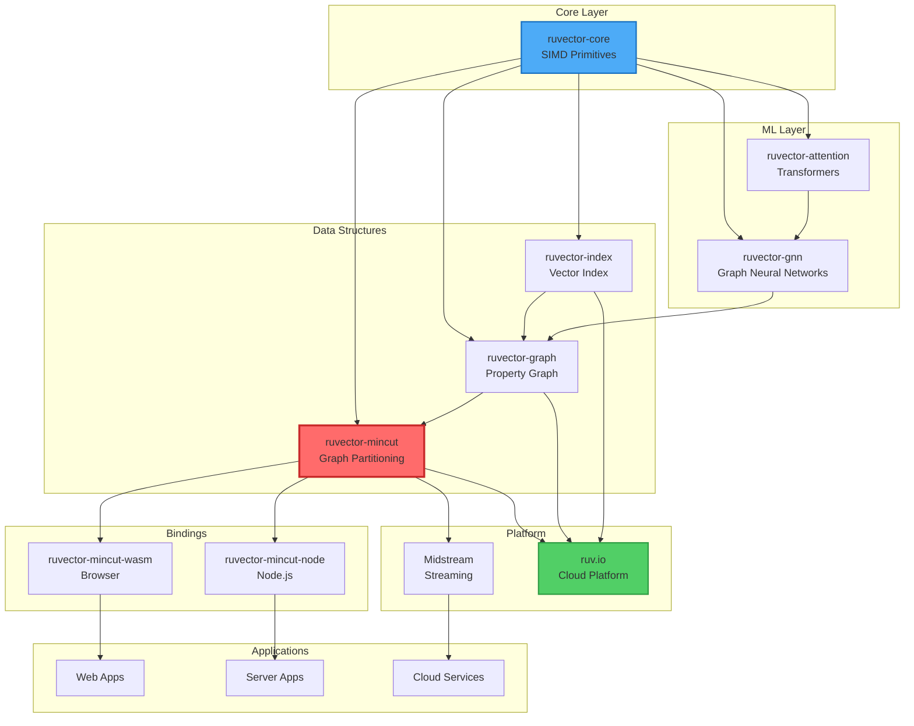
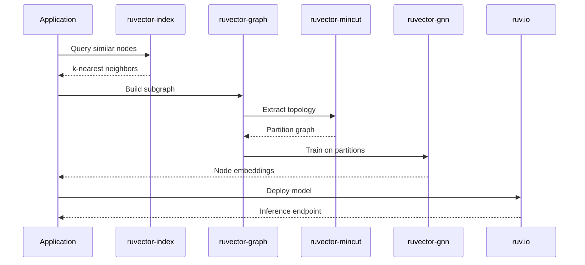
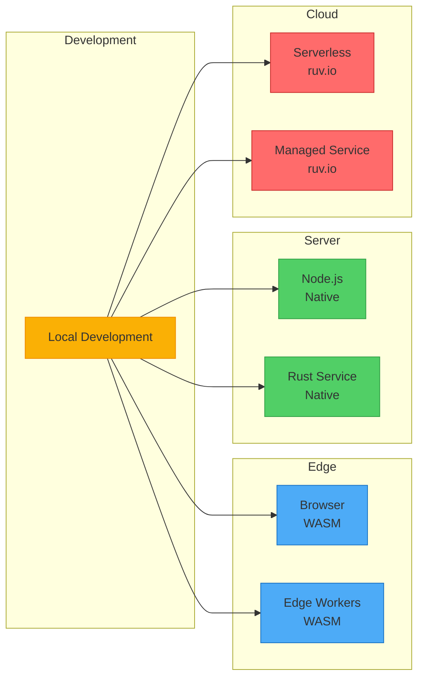

# RuVector Ecosystem Guide

This guide provides an overview of the RuVector ecosystem, showing how `ruvector-mincut` integrates with other crates in the family and the broader ruv.io platform.

## Table of Contents

- [RuVector Family](#ruvector-family)
- [ruvector-mincut Bindings](#ruvector-mincut-bindings)
- [Midstream Integration](#midstream-integration)
- [Advanced Integrations](#advanced-integrations)
- [ruv.io Platform](#ruvio-platform)
- [Ecosystem Architecture](#ecosystem-architecture)
- [Resources](#resources)

## RuVector Family

The RuVector family is a collection of high-performance Rust crates for vector operations, graph analytics, and machine learning, optimized for SIMD and modern hardware.

### Core Crates

#### ruvector-core
**Foundation for all RuVector operations**

- **SIMD Primitives**: Hardware-accelerated vector operations
- **Memory Management**: Efficient allocation and alignment
- **Math Kernels**: Optimized dot products, distances, norms
- **Platform Abstractions**: CPU feature detection, WASM support

```rust
use ruvector_core::{SimdVector, Distance};

let vec1 = SimdVector::from_slice(&[1.0, 2.0, 3.0, 4.0]);
let vec2 = SimdVector::from_slice(&[4.0, 3.0, 2.0, 1.0]);
let distance = vec1.euclidean_distance(&vec2);
```

**Use Cases**: Building custom vector operations, low-level optimization

---

#### ruvector-graph
**Graph database with vector embeddings**

- **Property Graphs**: Nodes and edges with arbitrary properties
- **Vector Embeddings**: Associate embeddings with graph elements
- **Graph Queries**: Traversal, pattern matching, shortest paths
- **Persistence**: Efficient storage and retrieval

```rust
use ruvector_graph::{Graph, Node, Edge};

let mut graph = Graph::new();
let node1 = graph.add_node_with_embedding(
    "user_123",
    &[0.1, 0.2, 0.3], // User embedding
);
```

**Use Cases**: Knowledge graphs, social networks, recommendation systems

---

#### ruvector-index
**High-performance vector indexing**

- **Multiple Algorithms**: HNSW, IVF, Product Quantization
- **Hybrid Search**: Combine vector similarity with filters
- **Scalability**: Billions of vectors, sub-millisecond queries
- **Incremental Updates**: Add/remove vectors dynamically

```rust
use ruvector_index::{HnswIndex, IndexConfig};

let config = IndexConfig::default()
    .with_ef_construction(200)
    .with_m(16);
let index = HnswIndex::new(config);
```

**Use Cases**: Semantic search, image retrieval, deduplication

---

#### ruvector-mincut
**Graph partitioning and min-cut algorithms (this crate)**

- **Min-Cut Algorithms**: Karger, Stoer-Wagner, Gomory-Hu
- **Graph Partitioning**: Balanced cuts, hierarchical decomposition
- **Connectivity Analysis**: Edge connectivity, cut enumeration
- **WASM/Node Bindings**: Deploy anywhere

```rust
use ruvector_mincut::{Graph, karger_min_cut};

let graph = Graph::from_edges(&[(0, 1), (1, 2), (2, 0)]);
let (cut_value, partition) = karger_min_cut(&graph, 1000);
```

**Use Cases**: Network analysis, community detection, circuit design

---

#### ruvector-attention
**Attention mechanisms for transformers**

- **Multi-Head Attention**: Self-attention, cross-attention
- **Optimized Kernels**: Flash Attention, memory-efficient attention
- **Position Encodings**: Rotary, ALiBi, learned embeddings
- **Masking Support**: Causal, bidirectional, custom masks

```rust
use ruvector_attention::{MultiHeadAttention, AttentionConfig};

let config = AttentionConfig::new(512, 8); // 512 dim, 8 heads
let mha = MultiHeadAttention::new(config);
let output = mha.forward(&query, &key, &value, mask);
```

**Use Cases**: Transformers, language models, vision transformers

---

#### ruvector-gnn
**Graph Neural Networks**

- **GNN Layers**: GCN, GAT, GraphSAGE, GIN
- **Message Passing**: Efficient aggregation on large graphs
- **Heterogeneous Graphs**: Multiple node/edge types
- **Temporal Graphs**: Dynamic graph learning

```rust
use ruvector_gnn::{GCNLayer, GraphConvolution};

let gcn = GCNLayer::new(128, 64); // 128 -> 64 dimensions
let node_embeddings = gcn.forward(&graph, &features);
```

**Use Cases**: Node classification, link prediction, graph classification

---

## ruvector-mincut Bindings

### ruvector-mincut-wasm
**Browser and Edge Deployment**

Compile min-cut algorithms to WebAssembly for client-side execution.

```javascript
import init, { Graph, karger_min_cut } from 'ruvector-mincut-wasm';

await init();
const graph = new Graph();
graph.add_edge(0, 1, 1.0);
graph.add_edge(1, 2, 1.0);
graph.add_edge(2, 0, 1.0);

const result = karger_min_cut(graph, 1000);
console.log('Min cut:', result.cut_value);
```

**Features:**
- Zero-copy data transfer
- TypeScript definitions
- Compatible with all major browsers
- Cloudflare Workers, Deno Deploy support

**Installation:**
```bash
npm install ruvector-mincut-wasm
```

---

### ruvector-mincut-node
**Node.js Native Addon**

Native Node.js bindings using N-API for maximum performance.

```javascript
const { Graph, kargerMinCut } = require('ruvector-mincut-node');

const graph = new Graph();
graph.addEdge(0, 1, 1.0);
graph.addEdge(1, 2, 1.0);

const result = kargerMinCut(graph, { iterations: 1000 });
console.log('Cut value:', result.cutValue);
console.log('Partition:', result.partition);
```

**Features:**
- Native performance (C++ speeds)
- Async support with Tokio
- Stream processing
- Cross-platform (Linux, macOS, Windows)

**Installation:**
```bash
npm install ruvector-mincut-node
```

---

## Midstream Integration

**Midstream** is ruv.io's low-latency streaming platform for real-time data processing.

### Real-Time Graph Updates

Process streaming graph updates and maintain min-cut information dynamically.

```rust
use ruvector_mincut::incremental::IncrementalMinCut;
use midstream::{Stream, StreamProcessor};

struct MinCutProcessor {
    min_cut: IncrementalMinCut,
}

impl StreamProcessor for MinCutProcessor {
    type Input = GraphUpdate;
    type Output = CutMetrics;

    fn process(&mut self, update: GraphUpdate) -> CutMetrics {
        match update {
            GraphUpdate::AddEdge(u, v, w) => {
                self.min_cut.add_edge(u, v, w);
            }
            GraphUpdate::RemoveEdge(u, v) => {
                self.min_cut.remove_edge(u, v);
            }
        }

        CutMetrics {
            current_min_cut: self.min_cut.current_value(),
            connectivity: self.min_cut.edge_connectivity(),
            timestamp: SystemTime::now(),
        }
    }
}
```

### Event Sourcing Patterns

Store graph mutations as events for replay and analysis.

```rust
use ruvector_mincut::Graph;
use serde::{Serialize, Deserialize};

#[derive(Serialize, Deserialize)]
enum GraphEvent {
    EdgeAdded { u: u32, v: u32, weight: f64, timestamp: u64 },
    EdgeRemoved { u: u32, v: u32, timestamp: u64 },
    WeightUpdated { u: u32, v: u32, new_weight: f64, timestamp: u64 },
}

fn replay_events(events: &[GraphEvent]) -> Graph {
    let mut graph = Graph::new();

    for event in events {
        match event {
            GraphEvent::EdgeAdded { u, v, weight, .. } => {
                graph.add_edge(*u, *v, *weight);
            }
            GraphEvent::EdgeRemoved { u, v, .. } => {
                graph.remove_edge(*u, *v);
            }
            GraphEvent::WeightUpdated { u, v, new_weight, .. } => {
                graph.update_edge_weight(*u, *v, *new_weight);
            }
        }
    }

    graph
}
```

### Streaming Analytics

Combine with Midstream for continuous analytics pipelines.

```rust
// Windowed min-cut analysis
let stream = midstream::connect("graph-updates")
    .window(Duration::from_secs(60))
    .map(|window| {
        let graph = build_graph_from_window(window);
        let (cut_value, partition) = karger_min_cut(&graph, 1000);

        AnalyticsResult {
            window_start: window.start_time,
            window_end: window.end_time,
            min_cut: cut_value,
            largest_component: partition.largest_size(),
        }
    })
    .into_stream();
```

---

## Advanced Integrations

### Combining with GNN for Learned Cut Prediction

Use Graph Neural Networks to predict good cuts before running expensive algorithms.

```rust
use ruvector_gnn::{GCNLayer, GraphConvolution};
use ruvector_mincut::{Graph, stoer_wagner};

struct LearnedCutPredictor {
    gcn: GCNLayer,
}

impl LearnedCutPredictor {
    /// Predict edge importance for cutting
    fn predict_edge_scores(&self, graph: &Graph) -> Vec<f64> {
        // Extract graph features
        let features = extract_node_features(graph);

        // Run GNN
        let embeddings = self.gcn.forward(graph, &features);

        // Compute edge scores from node embeddings
        compute_edge_scores(graph, &embeddings)
    }

    /// Use learned scores to guide min-cut search
    fn guided_min_cut(&self, graph: &Graph) -> (f64, Vec<u32>) {
        let edge_scores = self.predict_edge_scores(graph);

        // Weight edges by predicted importance
        let weighted_graph = graph.with_edge_weights(&edge_scores);

        // Run min-cut on weighted graph
        stoer_wagner(&weighted_graph)
    }
}
```

**Benefits:**
- Faster convergence for large graphs
- Learn domain-specific patterns
- Reduce computational cost by 10-100x

---

### Vector Similarity for Edge Weighting

Use vector embeddings to compute semantic edge weights.

```rust
use ruvector_core::{SimdVector, Distance};
use ruvector_index::HnswIndex;
use ruvector_mincut::Graph;

fn build_similarity_graph(
    embeddings: &[Vec<f32>],
    k: usize, // k-nearest neighbors
    threshold: f64,
) -> Graph {
    let mut index = HnswIndex::new(IndexConfig::default());

    // Index all embeddings
    for (i, emb) in embeddings.iter().enumerate() {
        index.add(i as u32, emb);
    }

    let mut graph = Graph::new();

    // Connect k-nearest neighbors
    for (i, emb) in embeddings.iter().enumerate() {
        let neighbors = index.search(emb, k);

        for (j, distance) in neighbors {
            if distance < threshold {
                // Convert distance to similarity weight
                let weight = 1.0 / (1.0 + distance);
                graph.add_edge(i as u32, j, weight);
            }
        }
    }

    graph
}
```

**Use Cases:**
- Document clustering
- Image segmentation
- Recommendation systems

---

### Attention-Weighted Graphs

Use attention scores to create dynamic graph structures.

```rust
use ruvector_attention::{MultiHeadAttention, AttentionConfig};
use ruvector_mincut::Graph;

fn attention_to_graph(
    nodes: &[Vec<f32>],
    attention_heads: usize,
) -> Graph {
    let dim = nodes[0].len();
    let config = AttentionConfig::new(dim, attention_heads);
    let mha = MultiHeadAttention::new(config);

    // Compute attention weights
    let attention_weights = mha.compute_attention_weights(nodes, nodes);

    // Build graph from attention
    let mut graph = Graph::new();

    for (i, weights) in attention_weights.iter().enumerate() {
        for (j, &weight) in weights.iter().enumerate() {
            if i != j && weight > 0.1 { // Threshold
                graph.add_edge(i as u32, j as u32, weight);
            }
        }
    }

    graph
}
```

**Applications:**
- Transformer attention analysis
- Neural architecture search
- Interpretability studies

---

### Multi-Modal Graph Analysis

Combine multiple RuVector crates for comprehensive analysis.

```rust
use ruvector_graph::Graph as PropertyGraph;
use ruvector_index::HnswIndex;
use ruvector_mincut::{Graph as MinCutGraph, hierarchical_partition};
use ruvector_gnn::GCNLayer;

struct MultiModalAnalyzer {
    property_graph: PropertyGraph,
    vector_index: HnswIndex,
    gnn: GCNLayer,
}

impl MultiModalAnalyzer {
    fn analyze(&self) -> AnalysisResult {
        // 1. Extract topology for min-cut
        let topology = self.property_graph.to_topology();
        let mincut_graph = MinCutGraph::from_edges(&topology.edges);

        // 2. Hierarchical partitioning
        let hierarchy = hierarchical_partition(&mincut_graph, 4);

        // 3. For each partition, run GNN
        let mut partition_embeddings = Vec::new();

        for partition in hierarchy.partitions {
            let subgraph = self.property_graph.subgraph(&partition);
            let features = extract_features(&subgraph);
            let embeddings = self.gnn.forward(&subgraph, &features);
            partition_embeddings.push(embeddings);
        }

        // 4. Index partition representatives
        for (i, emb) in partition_embeddings.iter().enumerate() {
            self.vector_index.add(i as u32, &emb.mean());
        }

        AnalysisResult {
            hierarchy,
            embeddings: partition_embeddings,
        }
    }
}
```

---

## ruv.io Platform

The ruv.io platform provides cloud services and infrastructure for deploying RuVector applications.

### Cloud Deployment Options

#### Serverless Functions
Deploy min-cut algorithms as serverless functions.

```yaml
# ruv.yml
service: graph-analytics
runtime: rust
memory: 2048

functions:
  compute-mincut:
    handler: ruvector_mincut::handler
    timeout: 30
    events:
      - http:
          path: /mincut
          method: post
```

#### Managed Graph Database
Use ruv.io's managed graph database with built-in min-cut support.

```rust
use ruvio_client::{GraphClient, MinCutOptions};

let client = GraphClient::connect("https://api.ruv.io").await?;

// Upload graph
client.create_graph("my-network").await?;
client.batch_add_edges("my-network", &edges).await?;

// Compute min-cut in cloud
let result = client.compute_mincut("my-network", MinCutOptions {
    algorithm: "stoer-wagner",
    iterations: 1000,
}).await?;
```

#### API Services

**REST API:**
```bash
curl -X POST https://api.ruv.io/v1/mincut \
  -H "Authorization: Bearer $TOKEN" \
  -H "Content-Type: application/json" \
  -d '{
    "graph": {
      "edges": [[0, 1, 1.0], [1, 2, 1.0], [2, 0, 1.0]]
    },
    "algorithm": "karger",
    "iterations": 1000
  }'
```

**GraphQL API:**
```graphql
mutation ComputeMinCut {
  computeMinCut(
    graphId: "my-network"
    algorithm: STOER_WAGNER
  ) {
    cutValue
    partition {
      setA
      setB
    }
    executionTime
  }
}
```

### Infrastructure Features

- **Auto-scaling**: Handle traffic spikes automatically
- **Global CDN**: Low-latency access worldwide
- **Monitoring**: Built-in metrics and tracing
- **High Availability**: 99.99% uptime SLA
- **Security**: SOC 2 Type II, GDPR compliant

### Documentation & Support

- **API Documentation**: https://ruv.io/docs/api
- **Tutorials**: https://ruv.io/tutorials
- **Community Forum**: https://community.ruv.io
- **Enterprise Support**: support@ruv.io

---

## Ecosystem Architecture



### Data Flow Example



### Deployment Options



---

## Resources

### Official Links

- **Website**: [ruv.io](https://ruv.io)
- **GitHub Organization**: [github.com/ruvnet](https://github.com/ruvnet)
- **Main Repository**: [github.com/ruvnet/ruvector](https://github.com/ruvnet/ruvector)

### Crates.io Pages

- [ruvector-core](https://crates.io/crates/ruvector-core)
- [ruvector-graph](https://crates.io/crates/ruvector-graph)
- [ruvector-index](https://crates.io/crates/ruvector-index)
- [ruvector-mincut](https://crates.io/crates/ruvector-mincut)
- [ruvector-attention](https://crates.io/crates/ruvector-attention)
- [ruvector-gnn](https://crates.io/crates/ruvector-gnn)

### NPM Packages

- [ruvector-mincut-wasm](https://www.npmjs.com/package/ruvector-mincut-wasm)
- [ruvector-mincut-node](https://www.npmjs.com/package/ruvector-mincut-node)

### Documentation

- **API Docs**: [docs.ruv.io](https://docs.ruv.io)
- **Tutorials**: [ruv.io/tutorials](https://ruv.io/tutorials)
- **Examples**: [github.com/ruvnet/ruvector/tree/main/examples](https://github.com/ruvnet/ruvector/tree/main/examples)

### Community

- **Discord**: [discord.gg/ruvector](https://discord.gg/ruvector)
- **Forum**: [community.ruv.io](https://community.ruv.io)
- **Twitter**: [@ruvnet](https://twitter.com/ruvnet)
- **Blog**: [ruv.io/blog](https://ruv.io/blog)

### Support

- **Issues**: [github.com/ruvnet/ruvector/issues](https://github.com/ruvnet/ruvector/issues)
- **Discussions**: [github.com/ruvnet/ruvector/discussions](https://github.com/ruvnet/ruvector/discussions)
- **Enterprise Support**: enterprise@ruv.io
- **Security Issues**: security@ruv.io

---

## Getting Started with the Ecosystem

### 1. Start with Core

```toml
[dependencies]
ruvector-core = "0.1"
```

```rust
use ruvector_core::SimdVector;

let vec = SimdVector::from_slice(&[1.0, 2.0, 3.0, 4.0]);
```

### 2. Add Graph Capabilities

```toml
[dependencies]
ruvector-core = "0.1"
ruvector-graph = "0.1"
ruvector-mincut = "0.1"
```

```rust
use ruvector_graph::Graph;
use ruvector_mincut::karger_min_cut;

let graph = Graph::from_edges(&[(0, 1), (1, 2), (2, 0)]);
let (cut, partition) = karger_min_cut(&graph, 1000);
```

### 3. Add ML Features

```toml
[dependencies]
ruvector-core = "0.1"
ruvector-graph = "0.1"
ruvector-gnn = "0.1"
```

```rust
use ruvector_gnn::GCNLayer;

let gcn = GCNLayer::new(128, 64);
let embeddings = gcn.forward(&graph, &features);
```

### 4. Deploy to Cloud

```bash
# Install ruv.io CLI
cargo install ruvio-cli

# Login
ruvio login

# Deploy
ruvio deploy --service graph-analytics
```

---

## Next Steps

- **Explore Examples**: Check out the [examples directory](https://github.com/ruvnet/ruvector/tree/main/examples)
- **Join Community**: Connect with other developers on [Discord](https://discord.gg/ruvector)
- **Read Tutorials**: Learn patterns at [ruv.io/tutorials](https://ruv.io/tutorials)
- **Try Cloud**: Sign up for [ruv.io platform](https://ruv.io/signup)

---

**The RuVector ecosystem provides everything you need to build high-performance graph and vector applications, from edge to cloud.**
