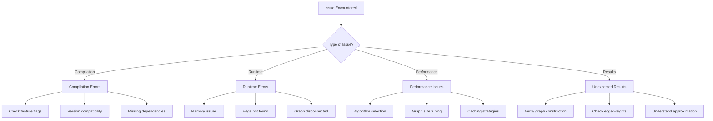
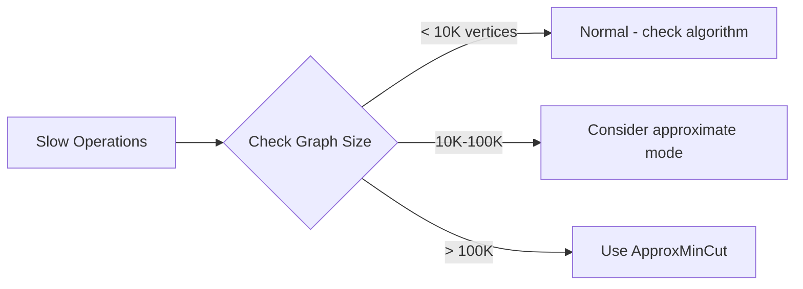

# Troubleshooting Guide

[← Back to Index](README.md) | [Previous: API Reference](07-api-reference.md)

---

## Quick Diagnosis Flowchart



---

## 1. Compilation Errors

### Feature Flag Issues

**Error**: `use of undeclared type MonitorBuilder`

```
error[E0433]: failed to resolve: use of undeclared type `MonitorBuilder`
```

**Solution**: Enable the `monitoring` feature:

```toml
[dependencies]
ruvector-mincut = { version = "0.2", features = ["monitoring"] }
```

---

**Error**: `use of undeclared type CompactCoreState`

**Solution**: Enable the `agentic` feature:

```toml
[dependencies]
ruvector-mincut = { version = "0.2", features = ["agentic"] }
```

---

### Feature Flag Reference

| Type/Feature | Required Feature Flag |
|--------------|----------------------|
| `MonitorBuilder`, `MinCutMonitor` | `monitoring` |
| `CompactCoreState`, `BitSet256` | `agentic` |
| `SparseGraph` | `approximate` |
| SIMD optimizations | `simd` |
| WASM support | `wasm` |

### Version Compatibility

**Error**: `the trait bound is not satisfied`

Check your dependency versions are compatible:

```toml
[dependencies]
ruvector-mincut = "0.2"
ruvector-core = "0.1.2"   # Must be compatible
ruvector-graph = "0.1.2"  # If using integration feature
```

---

## 2. Runtime Errors

### EdgeExists Error

**Error**: `EdgeExists(1, 2)` when inserting an edge

```rust
// ❌ This will fail - edge already exists
mincut.insert_edge(1, 2, 1.0)?;
mincut.insert_edge(1, 2, 2.0)?;  // Error!
```

**Solution**: Check if edge exists first, or delete before reinserting:

```rust
// ✅ Option 1: Delete first
let _ = mincut.delete_edge(1, 2);  // Ignore if not found
mincut.insert_edge(1, 2, 2.0)?;

// ✅ Option 2: Check existence (if your API supports it)
if !mincut.has_edge(1, 2) {
    mincut.insert_edge(1, 2, 1.0)?;
}
```

### EdgeNotFound Error

**Error**: `EdgeNotFound(3, 4)` when deleting

```rust
// ❌ Edge doesn't exist
mincut.delete_edge(3, 4)?;  // Error!
```

**Solution**: Use pattern matching to handle gracefully:

```rust
// ✅ Handle gracefully
match mincut.delete_edge(3, 4) {
    Ok(new_cut) => println!("New min cut: {}", new_cut),
    Err(MinCutError::EdgeNotFound(_, _)) => {
        println!("Edge already removed, continuing...");
    }
    Err(e) => return Err(e.into()),
}
```

### Disconnected Graph

**Issue**: Min cut value is 0

```rust
let mincut = MinCutBuilder::new()
    .with_edges(vec![
        (1, 2, 1.0),
        (3, 4, 1.0),  // Separate component!
    ])
    .build()?;

assert_eq!(mincut.min_cut_value(), 0.0);  // Zero because disconnected
```

**Solution**: Ensure your graph is connected, or handle disconnected case:

```rust
if !mincut.is_connected() {
    println!("Warning: Graph has {} components",
             mincut.component_count());
    // Handle each component separately
}
```

---

## 3. Performance Issues

### Slow Insert/Delete Operations

**Symptom**: Operations taking longer than expected



**Solutions**:

1. **Use approximate mode for large graphs**:
```rust
// Instead of exact mode
let mincut = MinCutBuilder::new()
    .approximate(0.1)  // 10% approximation
    .with_edges(edges)
    .build()?;
```

2. **Use batch operations**:
```rust
// ❌ Slow - many individual operations
for (u, v, w) in edges {
    mincut.insert_edge(u, v, w)?;
}

// ✅ Fast - batch operation
mincut.batch_insert_edges(&edges);
```

3. **For worst-case guarantees, use PolylogConnectivity**:
```rust
// O(log³ n) worst-case per operation
let mut conn = PolylogConnectivity::new();
for (u, v) in edges {
    conn.insert_edge(u, v);
}
```

### Memory Issues

**Symptom**: High memory usage or OOM errors

**Solutions**:

1. **Use approximate mode** (reduces edges via sparsification):
```rust
let mincut = MinCutBuilder::new()
    .approximate(0.1)  // Sparsifies to O(n log n / ε²) edges
    .build()?;
```

2. **For WASM/embedded, use compact structures**:
```rust
#[cfg(feature = "agentic")]
{
    // 6.7KB per core - verified at compile time
    let state = CompactCoreState::new();
}
```

3. **Process in batches for very large graphs**:
```rust
// Process graph in chunks
for chunk in graph_chunks.iter() {
    let partial = MinCutBuilder::new()
        .with_edges(chunk)
        .build()?;
    // Aggregate results
}
```

### Query Performance

**Symptom**: `min_cut_value()` is slow

**Explanation**: First query triggers computation; subsequent queries are O(1):

```rust
let mincut = MinCutBuilder::new()
    .with_edges(edges)
    .build()?;

// First query - triggers full computation
let cut1 = mincut.min_cut_value();  // May take time

// Subsequent queries - O(1) cached
let cut2 = mincut.min_cut_value();  // Instant
```

---

## 4. Unexpected Results

### Min Cut Value Seems Wrong

**Checklist**:

1. **Verify edge weights are correct**:
```rust
// Weight matters! This is different from weight 1.0
mincut.insert_edge(1, 2, 10.0)?;
```

2. **Check for duplicate edges** (weights accumulate):
```rust
// These DON'T accumulate - second insert fails
mincut.insert_edge(1, 2, 5.0)?;
mincut.insert_edge(1, 2, 5.0)?;  // Error: EdgeExists
```

3. **Understand the cut definition**:
```rust
// Min cut = minimum total weight of edges to remove
// to disconnect the graph
let result = mincut.min_cut();
println!("Cut value: {}", result.value);
println!("Cut edges: {:?}", result.cut_edges);
```

### Approximate Results Vary

**Issue**: Different runs give different results

**Explanation**: Approximate mode uses randomized sparsification:

```rust
// Results may vary slightly between builds
let mincut1 = MinCutBuilder::new()
    .approximate(0.1)
    .with_edges(edges.clone())
    .build()?;

let mincut2 = MinCutBuilder::new()
    .approximate(0.1)
    .with_edges(edges)
    .build()?;

// Values are within (1±ε) of true min cut
// but may differ from each other
```

**Solution**: Use a fixed seed if reproducibility is needed:

```rust
let approx = ApproxMinCut::new(ApproxMinCutConfig {
    epsilon: 0.1,
    num_samples: 3,
    seed: 42,  // Fixed seed for reproducibility
});
```

### Partition Looks Unbalanced

**Issue**: One side of partition has most vertices

**Explanation**: Minimum cut doesn't guarantee balanced partitions:

```rust
let result = mincut.min_cut();
let (s, t) = result.partition.unwrap();

// This is valid - min cut found the minimum edges to cut
// Partition balance is NOT a constraint
println!("Partition sizes: {} vs {}", s.len(), t.len());
```

**Solution**: For balanced partitions, use `GraphPartitioner`:

```rust
use ruvector_mincut::GraphPartitioner;

let partitioner = GraphPartitioner::new(graph, 2);
let balanced = partitioner.partition();  // More balanced
```

---

## 5. WASM-Specific Issues

### WASM Build Fails

**Error**: `wasm32 target not installed`

```bash
# Install the target
rustup target add wasm32-unknown-unknown

# Build with wasm-pack
wasm-pack build --target web
```

### WASM Memory Limits

**Issue**: WASM running out of memory

**Solution**: Use compact structures and limit graph size:

```rust
// Maximum recommended for WASM
const MAX_WASM_VERTICES: usize = 50_000;

if vertices.len() > MAX_WASM_VERTICES {
    // Use approximate mode or process in chunks
    let mincut = MinCutBuilder::new()
        .approximate(0.2)  // More aggressive sparsification
        .build()?;
}
```

### Web Worker Integration

**Issue**: Main thread blocking

**Solution**: Run min-cut computation in Web Worker:

```javascript
// worker.js
import init, { WasmMinCut } from 'ruvector-mincut-wasm';

self.onmessage = async (e) => {
    await init();
    const mincut = new WasmMinCut();
    // ... compute
    self.postMessage({ result: mincut.min_cut_value() });
};
```

---

## 6. Node.js-Specific Issues

### Native Module Build Fails

**Error**: `node-gyp` or `napi` build errors

```bash
# Ensure build tools are installed
# On Ubuntu/Debian:
sudo apt-get install build-essential

# On macOS:
xcode-select --install

# On Windows:
npm install --global windows-build-tools
```

### Module Not Found

**Error**: `Cannot find module 'ruvector-mincut-node'`

```bash
# Rebuild native modules
npm rebuild

# Or reinstall
rm -rf node_modules
npm install
```

---

## 7. Common Patterns That Cause Issues

### Anti-Pattern: Not Handling Errors

```rust
// ❌ Panics on error
let cut = mincut.insert_edge(1, 2, 1.0).unwrap();

// ✅ Handle errors properly
let cut = mincut.insert_edge(1, 2, 1.0)
    .map_err(|e| {
        eprintln!("Insert failed: {}", e);
        e
    })?;
```

### Anti-Pattern: Rebuilding Instead of Updating

```rust
// ❌ Slow - rebuilds entire structure
for update in updates {
    let mincut = MinCutBuilder::new()
        .with_edges(all_edges_including_update)
        .build()?;
}

// ✅ Fast - incremental updates
let mut mincut = MinCutBuilder::new()
    .with_edges(initial_edges)
    .build()?;

for (u, v, w) in updates {
    mincut.insert_edge(u, v, w)?;
}
```

### Anti-Pattern: Ignoring Feature Requirements

```rust
// ❌ Compiles but panics at runtime if feature not enabled
#[cfg(feature = "monitoring")]
let monitor = MonitorBuilder::new().build();

// ✅ Proper feature gating
#[cfg(feature = "monitoring")]
{
    let monitor = MonitorBuilder::new().build();
    // Use monitor
}
#[cfg(not(feature = "monitoring"))]
{
    println!("Monitoring not available - enable 'monitoring' feature");
}
```

---

## 8. Getting Help

### Debug Information

When reporting issues, include:

```rust
// Print diagnostic info
println!("ruvector-mincut version: {}", ruvector_mincut::VERSION);
println!("Graph: {} vertices, {} edges",
         mincut.num_vertices(),
         mincut.num_edges());
println!("Algorithm stats: {:?}", mincut.stats());
```

### Resources

| Resource | URL |
|----------|-----|
| GitHub Issues | [github.com/ruvnet/ruvector/issues](https://github.com/ruvnet/ruvector/issues) |
| Documentation | [docs.rs/ruvector-mincut](https://docs.rs/ruvector-mincut) |
| Discord | [ruv.io/discord](https://ruv.io/discord) |
| Stack Overflow | Tag: `ruvector` |

### Minimal Reproducible Example

When reporting bugs, provide:

```rust
use ruvector_mincut::{MinCutBuilder, MinCutError};

fn main() -> Result<(), Box<dyn std::error::Error>> {
    // Minimal code that reproduces the issue
    let mincut = MinCutBuilder::new()
        .with_edges(vec![
            // Your specific edges
        ])
        .build()?;

    // The operation that fails
    let result = mincut.min_cut_value();

    println!("Result: {}", result);
    Ok(())
}
```

---

## Quick Reference: Error Codes

| Error | Cause | Solution |
|-------|-------|----------|
| `EdgeExists(u, v)` | Duplicate edge insertion | Delete first or check existence |
| `EdgeNotFound(u, v)` | Deleting non-existent edge | Use pattern matching |
| `InvalidWeight` | Zero or negative weight | Use positive weights |
| `GraphTooLarge` | Exceeds memory limits | Use approximate mode |
| `NotConnected` | Graph has multiple components | Check connectivity first |

---

<div align="center">

**Still stuck?** [Open an issue](https://github.com/ruvnet/ruvector/issues/new) with your code and error message.

[← Back to Index](README.md)

</div>
