# RuVector MinCut User Guide

**High-performance minimum cut algorithms for Rust, WebAssembly, and Node.js**

[Quick Start](#quick-start) • [Guide Sections](#guide-sections) • [API Reference](07-api-reference.md) • [Benchmarks](../BENCHMARK_REPORT.md)

---

## Welcome

Welcome to the official **RuVector MinCut User Guide**! This comprehensive documentation will help you master graph minimum cut algorithms and integrate them into your applications.

RuVector MinCut provides cutting-edge implementations of minimum cut algorithms from recent research papers (2024-2025), optimized for production use across multiple platforms. Whether you're building network reliability systems, image segmentation tools, or distributed infrastructure, this guide will help you leverage the power of efficient minimum cut computation.

### What You'll Learn

- 🚀 **Getting Started**: Installation, setup, and your first minimum cut computation
- 🧠 **Core Concepts**: Understanding minimum cuts, connectivity, and algorithm selection
- 💼 **Practical Applications**: Real-world use cases from network analysis to ML
- 🔧 **Integration**: Platform-specific guides for Rust, WASM, and Node.js
- 🎯 **Advanced Examples**: Complex workflows and optimization techniques
- 🌐 **Ecosystem**: Leverage the full RuVector platform
- 📚 **API Reference**: Complete API documentation
- 🔍 **Troubleshooting**: Common issues and solutions

---

## Guide Structure

```mermaid
graph TD
    A[RuVector MinCut Guide] --> B[01: Getting Started]
    A --> C[02: Core Concepts]
    A --> D[03: Practical Applications]
    A --> E[04: Integration Guide]
    A --> F[05: Advanced Examples]
    A --> G[06: RuVector Ecosystem]
    A --> H[07: API Reference]
    A --> I[08: Troubleshooting]

    B --> B1[Installation]
    B --> B2[Quick Start]
    B --> B3[First Cut]

    C --> C1[Min Cut Theory]
    C --> C2[Algorithms]
    C --> C3[Performance]

    D --> D1[Network Reliability]
    D --> D2[Image Segmentation]
    D --> D3[Clustering]

    E --> E1[Rust Integration]
    E --> E2[WASM Integration]
    E --> E3[Node.js Integration]

    F --> F1[Custom Workflows]
    F --> F2[Optimization]
    F --> F3[Large Graphs]

    G --> G1[Vector Database]
    G --> G2[QUIC Sync]
    G --> G3[Platform Tools]

    H --> H1[Rust API]
    H --> H2[WASM API]
    H --> H3[Node.js API]

    I --> I1[Common Issues]
    I --> I2[Performance]
    I --> I3[Debugging]

    style A fill:#4A90E2,stroke:#2E5C8A,stroke-width:3px,color:#fff
    style B fill:#50C878,stroke:#2E7D52,stroke-width:2px,color:#fff
    style C fill:#9B59B6,stroke:#6C3483,stroke-width:2px,color:#fff
    style D fill:#E67E22,stroke:#A04000,stroke-width:2px,color:#fff
    style E fill:#3498DB,stroke:#21618C,stroke-width:2px,color:#fff
```

---

## Quick Start

New to RuVector MinCut? Start here:

1. **[Getting Started Guide](01-getting-started.md)** - Install and run your first minimum cut
2. **[Core Concepts](02-core-concepts.md)** - Understand the fundamentals
3. **[Integration Guide](04-integration-guide.md)** - Platform-specific setup

Already familiar? Jump to:
- **[Practical Applications](03-practical-applications.md)** - Real-world examples
- **[Advanced Examples](05-advanced-examples.md)** - Complex workflows
- **[API Reference](07-api-reference.md)** - Complete API documentation

---

## Guide Sections

### 📖 [01: Getting Started](01-getting-started.md)

Your first steps with RuVector MinCut:
- **Installation** - Add to your Rust, WASM, or Node.js project
- **Quick Start** - Run your first minimum cut in minutes
- **Basic Usage** - Simple examples to get you started
- **Platform Setup** - Environment-specific configuration

**Perfect for**: New users, quick evaluation, proof-of-concept projects

---

### 🧠 [02: Core Concepts](02-core-concepts.md)

Deep dive into minimum cut theory and implementation:
- **What is a Minimum Cut?** - Mathematical foundations
- **Algorithm Overview** - Karger-Stein, Stoer-Wagner, and cutting-edge variants
- **Connectivity Analysis** - Understanding graph structure
- **Performance Characteristics** - Algorithm selection guide
- **Data Structures** - Internal representations and optimizations

**Perfect for**: Understanding algorithm behavior, making informed choices, optimization

---

### 💼 [03: Practical Applications](03-practical-applications.md)

Real-world use cases and industry applications:
- **Network Reliability** - Finding critical connections and bottlenecks
- **Image Segmentation** - Computer vision and ML applications
- **Community Detection** - Social network analysis
- **Infrastructure Planning** - Cloud and distributed systems
- **Data Clustering** - Machine learning and analytics
- **Risk Assessment** - Financial and security applications

**Perfect for**: Industry applications, use case research, project planning

---

### 🔧 [04: Integration Guide](04-integration-guide.md)

Platform-specific integration instructions:
- **Rust Integration** - Native library usage, features, and best practices
- **WebAssembly** - Browser and edge deployment
- **Node.js** - Backend and CLI applications
- **TypeScript** - Type-safe JavaScript integration
- **Build Configuration** - Optimization and compilation
- **Deployment** - Production considerations

**Perfect for**: Production integration, platform-specific questions, deployment

---

### 🎯 [05: Advanced Examples](05-advanced-examples.md)

Complex workflows and optimization techniques:
- **Large Graph Processing** - Handling millions of nodes
- **Parallel Computation** - Multi-threaded and distributed processing
- **Custom Workflows** - Building on top of MinCut APIs
- **Performance Tuning** - Memory and speed optimization
- **Hybrid Approaches** - Combining multiple algorithms
- **Streaming Analysis** - Real-time graph updates

**Perfect for**: Performance optimization, large-scale systems, advanced users

---

### 🌐 [06: RuVector Ecosystem](06-ecosystem.md)

Leverage the complete RuVector platform:
- **Vector Database Integration** - Combine with ruvector-db
- **QUIC Synchronization** - Distributed graph analysis
- **Platform Services** - Cloud deployment with ruv.io
- **Multi-Language Support** - Cross-platform workflows
- **Monitoring & Analytics** - Production observability
- **Community & Support** - Resources and help

**Perfect for**: Platform integration, distributed systems, enterprise deployment

---

### 📚 [07: API Reference](07-api-reference.md)

Complete API documentation:
- **Rust API** - Full crate documentation
- **WASM API** - JavaScript/TypeScript bindings
- **Node.js API** - npm package reference
- **Type Definitions** - Complete type signatures
- **Error Handling** - Exception types and recovery
- **Migration Guide** - Version updates and breaking changes

**Perfect for**: API lookup, type checking, implementation details

---

### 🔍 [08: Troubleshooting](08-troubleshooting.md)

Common issues and solutions:
- **Installation Issues** - Dependency and build problems
- **Performance Problems** - Memory and speed optimization
- **Algorithm Selection** - Choosing the right approach
- **Platform-Specific Issues** - WASM, Node.js, and Rust quirks
- **Debugging Guide** - Tools and techniques
- **FAQ** - Frequently asked questions

**Perfect for**: Problem solving, debugging, performance issues

---

## Related Documentation

### Core Documentation
- **[RuVector MinCut README](../../README.md)** - Project overview and features
- **[Benchmark Report](../BENCHMARK_REPORT.md)** - Performance analysis and comparisons
- **[API Documentation](https://docs.rs/ruvector-mincut)** - Full Rust API docs

### RuVector Platform
- **[RuVector Main Repository](https://github.com/ruvnet/ruvector)** - Complete platform
- **[RuVector Database](../../../ruvector-db/README.md)** - Vector database integration
- **[Platform Website](https://ruv.io)** - Cloud services and support

### Community
- **[GitHub Issues](https://github.com/ruvnet/ruvector/issues)** - Bug reports and feature requests
- **[Discussions](https://github.com/ruvnet/ruvector/discussions)** - Community Q&A
- **[Contributing Guide](../../CONTRIBUTING.md)** - How to contribute

---

## Navigation Tips

### 🎯 Quick Navigation

- Use the **table of contents** at the top of each guide page
- Follow **"Next Steps"** links at the bottom of each section
- Check **cross-references** for related topics
- Use the **search** function in your viewer

### 📱 Mobile-Friendly

All documentation is optimized for reading on:
- Desktop browsers
- Mobile devices
- Tablets
- Documentation viewers (VS Code, GitHub, etc.)

### 🔖 Bookmarking

Recommended bookmarks for frequent reference:
- [Getting Started](01-getting-started.md) - Quick setup
- [API Reference](07-api-reference.md) - API lookup
- [Troubleshooting](08-troubleshooting.md) - Problem solving
- [Benchmark Report](../BENCHMARK_REPORT.md) - Performance data

---

## Document Status

| Section | Status | Last Updated | Completeness |
|---------|--------|--------------|--------------|
| Getting Started | ✅ Complete | 2025-12-22 | 100% |
| Core Concepts | ✅ Complete | 2025-12-22 | 100% |
| Practical Applications | ✅ Complete | 2025-12-22 | 100% |
| Integration Guide | ✅ Complete | 2025-12-22 | 100% |
| Advanced Examples | ✅ Complete | 2025-12-22 | 100% |
| RuVector Ecosystem | ✅ Complete | 2025-12-22 | 100% |
| API Reference | ✅ Complete | 2025-12-22 | 100% |
| Troubleshooting | ✅ Complete | 2025-12-22 | 100% |

---

## About This Guide

### Version Information
- **Guide Version**: 1.0.0
- **RuVector MinCut Version**: 0.1.0
- **Last Updated**: December 22, 2025
- **Maintained By**: RuVector Team

### Contributing

Found an issue or want to improve this guide?
- **Report Issues**: [GitHub Issues](https://github.com/ruvnet/ruvector/issues)
- **Suggest Edits**: [Pull Requests](https://github.com/ruvnet/ruvector/pulls)
- **Ask Questions**: [Discussions](https://github.com/ruvnet/ruvector/discussions)

### License

This documentation is licensed under the MIT License, same as RuVector MinCut.

---

**Ready to get started?**

[Begin with Getting Started →](01-getting-started.md)

---

Built with ❤️ by the [RuVector Team](https://ruv.io)

