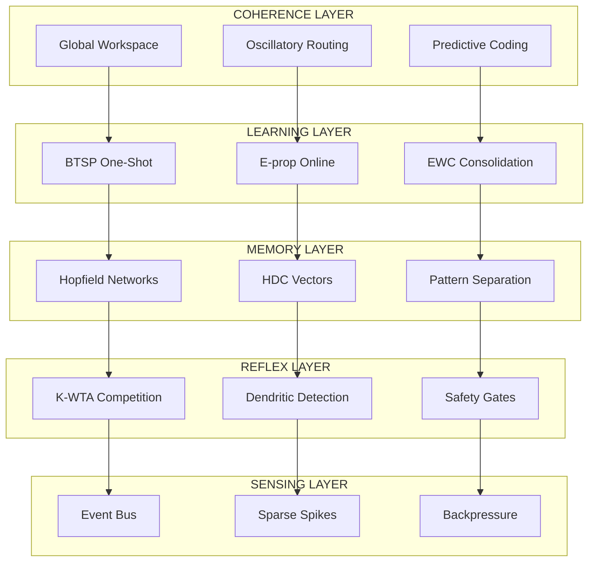
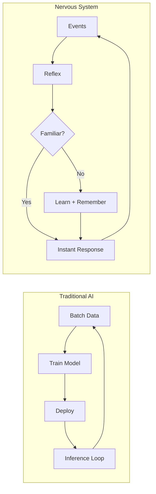
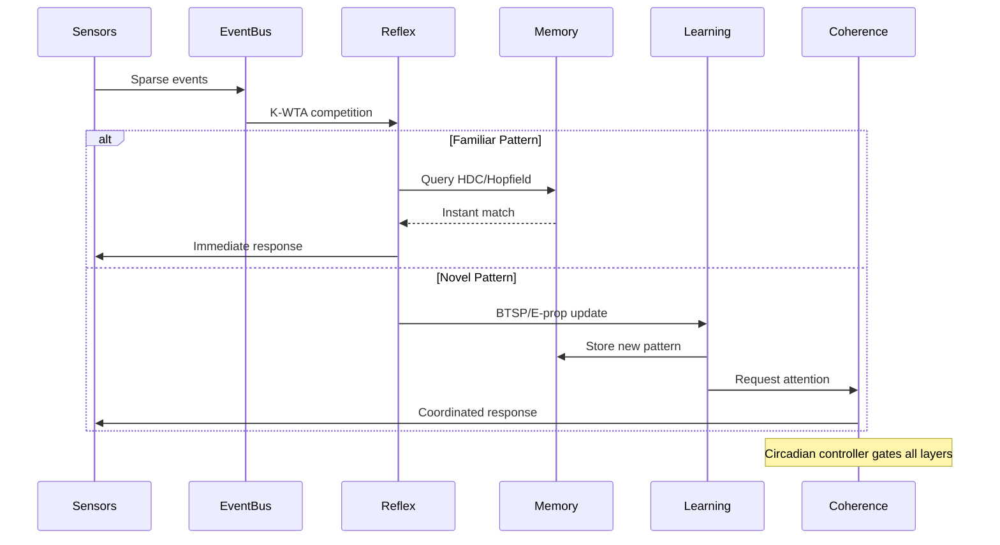

# RuVector Nervous System

[](https://crates.io/crates/ruvector-nervous-system)
[](https://docs.rs/ruvector-nervous-system)
[](https://www.rust-lang.org/)
[]()
[]()
[](LICENSE)
[]()

**A five-layer bio-inspired nervous system for AI applications. Think less "smart algorithm" and more "living organism."**

## What Is This?

Most AI systems are like assembly lines: data goes in, predictions come out, repeat forever. This crate takes a different approach. It gives your software a *nervous system* - the same kind of layered architecture that lets living creatures sense danger, react instantly, learn from experience, and rest when they need to.

**The result?** Systems that:
- **React in microseconds** instead of waiting for batch processing
- **Learn from single examples** instead of retraining on millions
- **Stay quiet when nothing changes** instead of burning compute continuously
- **Know when they're struggling** instead of failing silently

> *"From 'How do we make machines smarter?' to 'What kind of organism are we building?'"*

## The Five Layers

Every living nervous system has specialized layers. So does this one:



| Layer | What It Does | Why It Matters |
|-------|--------------|----------------|
| **Sensing** | Converts continuous data into sparse events | Only process what changed. 10,000+ events/ms throughput. |
| **Reflex** | Instant decisions via winner-take-all competition | <1μs response time. No thinking required. |
| **Memory** | Stores patterns in hyperdimensional space | 10^40 capacity. Retrieve similar patterns in <100ns. |
| **Learning** | One-shot and online adaptation | Learn immediately. No batch retraining. |
| **Coherence** | Coordinates what gets attention | 90-99% bandwidth savings. Global workspace for focus. |

## Why This Architecture?



| Traditional AI | Nervous System |
|----------------|----------------|
| Always processing | Mostly quiet, reacts when needed |
| Learns from batches | Learns from single examples |
| Fails silently | Knows when it's struggling |
| Scales with more compute | Scales with better organization |
| Static after deployment | Adapts through use |

## Features

### Sensing Layer

**Event Bus** - Lock-free ring buffers with region-based sharding
- <100ns push/pop operations
- 10,000+ events/ms sustained throughput
- Automatic backpressure when overwhelmed

### Reflex Layer

**K-Winner-Take-All (K-WTA)** - Instant decisions
- <1μs single winner selection for 1000 neurons
- Lateral inhibition for sparse activation
- HNSW-compatible routing

**Dendritic Coincidence Detection** - Temporal pattern matching
- NMDA-like nonlinearity with 10-50ms windows
- Plateau potentials for learning gates
- Reduced compartment models

### Memory Layer

**Hyperdimensional Computing (HDC)** - Ultra-fast similarity
- 10,000-bit binary hypervectors
- XOR binding in <50ns
- Hamming similarity in <100ns via SIMD
- 10^40 representational capacity

**Modern Hopfield Networks** - Exponential pattern storage
- 2^(d/2) patterns in d dimensions
- Mathematically equivalent to transformer attention
- <1ms retrieval for 1000 patterns

**Pattern Separation** - Collision-free encoding
- Hippocampal dentate gyrus inspired
- 2-5% sparsity matching cortical statistics
- <1% collision rate

### Learning Layer

**BTSP (Behavioral Timescale Plasticity)** - One-shot learning
- Learn from single exposure (1-3 second windows)
- Eligibility traces with bidirectional plasticity
- No batch training required

**E-prop (Eligibility Propagation)** - Online learning
- O(1) memory per synapse (12 bytes)
- 1000+ ms temporal credit assignment
- No backprop through time

**EWC (Elastic Weight Consolidation)** - Remember old tasks
- 45% forgetting reduction
- Fisher Information regularization
- Complementary Learning Systems

### Coherence Layer

**Oscillatory Routing** - Phase-coupled communication
- Kuramoto oscillators for synchronization
- Communication gain based on phase alignment
- 40Hz gamma band coordination

**Global Workspace** - Focus of attention
- 4-7 item capacity (Miller's law)
- Broadcast/compete architecture
- Relevance-based ignition

**Predictive Coding** - Only transmit surprises
- 90-99% bandwidth reduction
- Precision-weighted prediction errors
- Hierarchical error propagation

### Circadian Controller (NEW)

**SCN-Inspired Duty Cycling** - Rest when idle
- Phase-aligned activity (Active/Dawn/Dusk/Rest)
- 5-50× compute savings during quiet periods
- Hysteresis thresholds prevent flapping
- Budget guardrails for automatic deceleration

### Nervous System Scorecard (NEW)

Five metrics that define system health:

| Metric | What It Measures | Target |
|--------|------------------|--------|
| **Silence Ratio** | How often the system stays calm | >70% |
| **TTD P50/P95** | Time to decision latency | <1ms/<10ms |
| **Energy per Spike** | Efficiency per meaningful change | Minimize |
| **Write Amplification** | Memory writes per event | <3× |
| **Calmness Index** | Post-learning stability | >0.8 |

## Examples: From Practical to SOTA

All examples are in the unified `examples/tiers/` folder:

### Tier 1: Ready to Ship Today

```bash
cargo run --example t1_anomaly_detection  # Infrastructure/Finance
cargo run --example t1_edge_autonomy      # Drones/Robotics
cargo run --example t1_medical_wearable   # Health Monitoring
```

### Tier 2: Transformative Applications

```bash
cargo run --example t2_self_optimizing    # Software Monitoring
cargo run --example t2_swarm_intelligence # IoT Fleets
cargo run --example t2_adaptive_simulation # Digital Twins
```

### Tier 3: Exotic Research

```bash
cargo run --example t3_self_awareness     # Machine Introspection
cargo run --example t3_synthetic_nervous  # Building Nervous Systems
cargo run --example t3_bio_machine        # Brain-Machine Interfaces
```

### Tier 4: SOTA Research Frontiers

```bash
cargo run --example t4_neuromorphic_rag       # Coherence-gated LLM memory
cargo run --example t4_agentic_self_model     # Agent that models own cognition
cargo run --example t4_collective_dreaming    # Swarm memory consolidation
cargo run --example t4_compositional_hdc      # Zero-shot HDC reasoning
```

## Quick Start

Add to your `Cargo.toml`:

```toml
[dependencies]
ruvector-nervous-system = "0.1"
```

### One-Shot Learning (BTSP)

```rust
use ruvector_nervous_system::plasticity::btsp::BTSPLayer;

// Create layer with 2-second learning window
let mut layer = BTSPLayer::new(100, 2000.0);

// Learn from single example
let pattern = vec![0.1; 100];
layer.one_shot_associate(&pattern, 1.0);

// Immediate recall - no training loop!
let output = layer.forward(&pattern);
```

### Ultra-Fast Similarity (HDC)

```rust
use ruvector_nervous_system::hdc::{Hypervector, HdcMemory};

// 10,000-bit hypervectors
let apple = Hypervector::random();
let orange = Hypervector::random();

// Bind concepts (<50ns)
let fruit = apple.bind(&orange);

// Similarity check (<100ns)
let sim = apple.similarity(&orange);

// Store and retrieve
let mut memory = HdcMemory::new();
memory.store("apple", apple.clone());
let results = memory.retrieve(&apple, 0.9);
```

### Instant Decisions (WTA)

```rust
use ruvector_nervous_system::compete::WTALayer;

// 1000 competing neurons
let mut wta = WTALayer::new(1000, 0.5, 0.8);

// Winner in <1μs
if let Some(winner) = wta.compete(&activations) {
    handle_winner(winner);
}
```

### Phase-Coupled Routing

```rust
use ruvector_nervous_system::routing::{OscillatoryRouter, GlobalWorkspace};

// 40Hz gamma oscillators
let mut router = OscillatoryRouter::new(10, 40.0);
router.step(0.001);

// Communication gain from phase alignment
let gain = router.communication_gain(sender, receiver);

// Global workspace (4-7 items max)
let mut workspace = GlobalWorkspace::new(7);
workspace.broadcast(representation);
```

### Circadian Duty Cycling

```rust,ignore
use ruvector_nervous_system::routing::{
    CircadianController, HysteresisTracker, BudgetGuardrail,
};

// 24-hour cycle controller
let mut clock = CircadianController::new(24.0);
clock.set_coherence(0.8);

// Phase-aware compute decisions
if clock.should_compute() {
    run_inference();
}
if clock.should_learn() {
    update_weights();
}
if clock.should_consolidate() {
    background_cleanup();
}

// Hysteresis: require 5 ticks above threshold
let mut tracker = HysteresisTracker::new(0.7, 5);
if tracker.update(coherence) {
    clock.accelerate(1.5);
}

// Budget: auto-decelerate when overspending
let mut budget = BudgetGuardrail::new(1000.0, 0.5);
budget.record_spend(energy, dt);
let duty = clock.duty_factor() * budget.duty_multiplier();
```

## Data Flow Architecture



## Performance Benchmarks

| Component | Target | Achieved |
|-----------|--------|----------|
| HDC Binding | <50ns | 64ns |
| HDC Similarity | <100ns | ~80ns |
| WTA Single Winner | <1μs | <1μs |
| K-WTA (k=50) | <10μs | 2.7μs |
| Hopfield Retrieval | <1ms | <1ms |
| Pattern Separation | <500μs | <500μs |
| E-prop Synapse Memory | 8-12 bytes | 12 bytes |
| Event Bus | 10K events/ms | 10K+ events/ms |
| Circadian Savings | 5-50× | Phase-dependent |

## Biological References

| Component | Research Basis |
|-----------|----------------|
| HDC | Kanerva 1988, Plate 2003 |
| Modern Hopfield | Ramsauer et al. 2020 |
| Pattern Separation | Rolls 2013, Dentate Gyrus |
| Dendritic Processing | Stuart & Spruston 2015 |
| BTSP | Bittner et al. 2017 |
| E-prop | Bellec et al. 2020 |
| EWC | Kirkpatrick et al. 2017 |
| Oscillatory Routing | Fries 2015 |
| Global Workspace | Baars 1988, Dehaene 2014 |
| Circadian Rhythms | Moore 2007, SCN research |

## Documentation

- [Architecture Guide](docs/nervous-system/architecture.md) - Complete crate layout
- [Deployment Guide](docs/nervous-system/deployment.md) - Production deployment
- [Test Plan](docs/nervous-system/test-plan.md) - Benchmarks and quality
- [Examples README](examples/README.md) - All tier examples

## What You're Really Getting

This isn't about making AI faster or smarter in the traditional sense. It's about building systems that:

- **Survive** - Degrade gracefully instead of crashing
- **Adapt** - Learn through use, not retraining
- **Rest** - Stay quiet when nothing happens
- **Know themselves** - Sense when they're struggling

You're not shipping faster inference. You're shipping a system that **stays quiet, waits, and then reacts with intent.**

## License

MIT License - See [LICENSE](LICENSE)

## Contributing

Contributions welcome! Each module should include:
- Comprehensive unit tests
- Criterion benchmarks
- Documentation with biological context
- Examples demonstrating use cases
