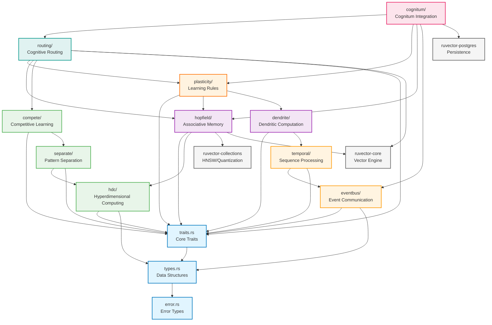

# RuVector Nervous System Architecture

## Executive Summary

The RuVector Nervous System is a biologically-inspired, event-driven cognitive architecture built on top of the RuVector vector database ecosystem. It combines modern neuroscience principles with high-performance Rust implementations to create a scalable, modular system for real-time pattern recognition, associative memory, and adaptive learning.

## Table of Contents

- [Crate Layout](#crate-layout)
- [Module Dependency Graph](#module-dependency-graph)
- [Core Traits](#core-traits)
- [Data Structures](#data-structures)
- [Module Specifications](#module-specifications)
- [Integration with Existing Crates](#integration-with-existing-crates)
- [Feature Flags](#feature-flags)
- [Cargo Configuration](#cargo-configuration)

---

## Crate Layout

```
crates/ruvector-nervous-system/
├── Cargo.toml
├── src/
│   ├── lib.rs                    # Public API and re-exports
│   ├── traits.rs                 # Core trait definitions
│   ├── types.rs                  # Shared data structures
│   ├── error.rs                  # Error types
│   │
│   ├── eventbus/                 # Event-driven communication layer
│   │   ├── mod.rs
│   │   ├── bounded_queue.rs      # Fixed-size circular buffers
│   │   ├── region_shard.rs       # Regional event partitioning
│   │   ├── backpressure.rs       # Flow control mechanisms
│   │   └── priority.rs           # Priority-based routing
│   │
│   ├── temporal/                 # Temporal sequence processing
│   │   ├── mod.rs
│   │   ├── fingerprint.rs        # Sequence fingerprinting
│   │   ├── sliding_window.rs     # Temporal windowing
│   │   └── spike_timing.rs       # Spike-timing patterns
│   │
│   ├── hdc/                      # Hyperdimensional computing
│   │   ├── mod.rs
│   │   ├── hypervector.rs        # Binary hypervector operations
│   │   ├── encoding.rs           # Feature binding and bundling
│   │   ├── similarity.rs         # Hamming distance and similarity
│   │   └── algebra.rs            # HD algebra operations
│   │
│   ├── compete/                  # Competitive learning
│   │   ├── mod.rs
│   │   ├── kwta.rs               # k-Winner-Take-All
│   │   ├── lateral_inhibition.rs # Inhibitory connections
│   │   └── sparse_coding.rs      # Sparse representation
│   │
│   ├── hopfield/                 # Modern Hopfield networks
│   │   ├── mod.rs
│   │   ├── associative.rs        # Associative memory core
│   │   ├── energy.rs             # Energy function computation
│   │   ├── update_rules.rs       # Asynchronous/synchronous updates
│   │   └── capacity.rs           # Memory capacity analysis
│   │
│   ├── separate/                 # Pattern separation
│   │   ├── mod.rs
│   │   ├── encoder.rs            # Orthogonalization encoder
│   │   ├── collision.rs          # Collision detection
│   │   └── decorrelate.rs        # Decorrelation mechanisms
│   │
│   ├── dendrite/                 # Dendritic computation
│   │   ├── mod.rs
│   │   ├── compartment.rs        # Multi-compartment units
│   │   ├── nonlinear.rs          # Nonlinear integration
│   │   └── modulation.rs         # Neuromodulation effects
│   │
│   ├── plasticity/               # Learning and adaptation
│   │   ├── mod.rs
│   │   ├── btsp.rs               # Behavioral Timescale Synaptic Plasticity
│   │   ├── eprop.rs              # e-prop (eligibility propagation)
│   │   ├── rstdp.rs              # Reward-modulated STDP
│   │   ├── ewc.rs                # Elastic Weight Consolidation
│   │   └── meta_learning.rs      # Meta-learning algorithms
│   │
│   ├── routing/                  # Cognitive routing and workspace
│   │   ├── mod.rs
│   │   ├── predictive_coding.rs  # Predictive coding framework
│   │   ├── coherence.rs          # Coherence-based routing
│   │   ├── workspace.rs          # Global workspace theory
│   │   └── attention.rs          # Attention mechanisms
│   │
│   └── cognitum/                 # Cognitum integration layer
│       ├── mod.rs
│       ├── v0_adapter.rs         # Cognitum v0 compatibility
│       ├── v1_adapter.rs         # Cognitum v1 integration
│       └── bridge.rs             # Cross-version bridge
│
├── examples/
│   ├── dvs_processing.rs         # Event camera processing
│   ├── associative_memory.rs     # Hopfield memory demo
│   ├── pattern_recognition.rs    # End-to-end recognition
│   └── learning_demo.rs          # Plasticity demonstration
│
├── benches/
│   ├── eventbus.rs
│   ├── hdc_encoding.rs
│   └── hopfield_retrieval.rs
│
└── tests/
    ├── integration/
    │   ├── end_to_end.rs
    │   └── cognitum_compat.rs
    └── unit/
        ├── eventbus_tests.rs
        ├── hdc_tests.rs
        └── plasticity_tests.rs
```

---

## Module Dependency Graph



---

## Core Traits

### Event Processing

```rust
/// Timestamped event with spatial coordinates
pub trait Event: Send + Sync {
    /// Timestamp in microseconds
    fn timestamp(&self) -> u64;

    /// Spatial coordinates (x, y) if applicable
    fn position(&self) -> Option<(u16, u16)>;

    /// Event polarity or type
    fn polarity(&self) -> bool;

    /// Optional event metadata
    fn metadata(&self) -> Option<&[u8]> {
        None
    }
}

/// Fast reactive pathway bypassing main processing
pub trait ReflexGate: Send + Sync {
    type Input: Event;
    type Output;

    /// Process event with minimal latency (<1ms target)
    fn process_reflex(&mut self, event: &Self::Input) -> Option<Self::Output>;

    /// Check if event should trigger reflex pathway
    fn should_reflex(&self, event: &Self::Input) -> bool;

    /// Reflex gate latency in microseconds
    fn latency_us(&self) -> u64;
}
```

### Memory Operations

```rust
/// One-shot associative memory write
pub trait MemoryWrite<K, V>: Send + Sync {
    type Error;

    /// Store association with single exposure
    fn write_once(&mut self, key: K, value: V) -> Result<(), Self::Error>;

    /// Batch write multiple associations
    fn write_batch(&mut self, pairs: &[(K, V)]) -> Result<(), Self::Error>;

    /// Memory capacity and current utilization
    fn capacity(&self) -> (usize, usize); // (current, max)
}

/// Associative retrieval with partial cues
pub trait Retrieve<K, V>: Send + Sync {
    type Error;

    /// Retrieve value from partial or noisy key
    fn retrieve(&self, partial_key: &K, threshold: f32) -> Result<Option<V>, Self::Error>;

    /// Retrieve top-k similar memories
    fn retrieve_topk(&self, partial_key: &K, k: usize) -> Result<Vec<(V, f32)>, Self::Error>;

    /// Check if retrieval converged (for iterative methods)
    fn converged(&self) -> bool;

    /// Number of retrieval iterations (if applicable)
    fn iterations(&self) -> usize {
        0
    }
}
```

### Learning and Plasticity

```rust
/// Eligibility-based learning update
pub trait Learn: Send + Sync {
    type State;
    type Reward;
    type Error;

    /// Update eligibility traces
    fn update_eligibility(&mut self, state: &Self::State) -> Result<(), Self::Error>;

    /// Apply reward-modulated update
    fn apply_reward(&mut self, reward: Self::Reward) -> Result<(), Self::Error>;

    /// Consolidate important weights (EWC)
    fn consolidate(&mut self, importance_threshold: f32) -> Result<(), Self::Error>;

    /// Reset eligibility traces
    fn reset_traces(&mut self);

    /// Get current learning rate
    fn learning_rate(&self) -> f32;

    /// Set learning rate (adaptive)
    fn set_learning_rate(&mut self, rate: f32);
}

/// Meta-learning for rapid adaptation
pub trait MetaLearn: Learn {
    type TaskDistribution;

    /// Inner loop: adapt to specific task
    fn inner_adapt(&mut self, task_data: &Self::State, steps: usize) -> Result<(), Self::Error>;

    /// Outer loop: update meta-parameters
    fn outer_update(&mut self, task_distribution: &Self::TaskDistribution) -> Result<(), Self::Error>;

    /// Clone learner for task-specific adaptation
    fn clone_for_task(&self) -> Self where Self: Sized;
}
```

### Cognitive Routing

```rust
/// Pattern separation and routing
pub trait Route: Send + Sync {
    type Pattern;
    type Destination;
    type Error;

    /// Separate similar patterns into distinct representations
    fn separate(&self, pattern: &Self::Pattern) -> Result<Self::Pattern, Self::Error>;

    /// Route pattern to appropriate processing module
    fn route(&self, pattern: &Self::Pattern) -> Result<Self::Destination, Self::Error>;

    /// Compute coherence score for pattern
    fn coherence(&self, pattern: &Self::Pattern) -> f32;

    /// Check if pattern should enter global workspace
    fn should_broadcast(&self, pattern: &Self::Pattern, threshold: f32) -> bool {
        self.coherence(pattern) > threshold
    }
}

/// Predictive coding interface
pub trait PredictiveCoding: Send + Sync {
    type Prediction;
    type Observation;
    type Error;

    /// Generate prediction from current state
    fn predict(&self) -> Result<Self::Prediction, Self::Error>;

    /// Compute prediction error
    fn prediction_error(&self, observation: &Self::Observation) -> Result<f32, Self::Error>;

    /// Update internal model based on error
    fn update_model(&mut self, error: f32) -> Result<(), Self::Error>;

    /// Confidence in current prediction
    fn confidence(&self) -> f32;
}
```

---

## Data Structures

### Event Types

```rust
/// Dynamic Vision Sensor (DVS) event
#[derive(Debug, Clone, Copy, PartialEq, Eq)]
pub struct DVSEvent {
    /// Timestamp in microseconds
    pub timestamp: u64,
    /// X coordinate (0-639 for typical DVS)
    pub x: u16,
    /// Y coordinate (0-479 for typical DVS)
    pub y: u16,
    /// Polarity (true = ON, false = OFF)
    pub polarity: bool,
}

impl Event for DVSEvent {
    fn timestamp(&self) -> u64 {
        self.timestamp
    }

    fn position(&self) -> Option<(u16, u16)> {
        Some((self.x, self.y))
    }

    fn polarity(&self) -> bool {
        self.polarity
    }
}

/// Temporal event sequence fingerprint
#[derive(Debug, Clone)]
pub struct SequenceFingerprint {
    /// Fixed-size representation of event sequence
    pub fingerprint: Vec<u8>,
    /// Temporal extent in microseconds
    pub duration: u64,
    /// Number of events in sequence
    pub event_count: usize,
    /// Dominant frequency (Hz)
    pub frequency: f32,
}
```

### Hyperdimensional Computing

```rust
/// Binary hypervector (typically 10,000 dimensions)
#[derive(Debug, Clone, PartialEq, Eq)]
pub struct Hypervector {
    /// Packed binary vector (bit-packed for efficiency)
    bits: Vec<u64>,
    /// Dimensionality
    dim: usize,
}

impl Hypervector {
    /// Create random hypervector
    pub fn random(dim: usize) -> Self {
        assert!(dim % 64 == 0, "Dimension must be multiple of 64");
        let len = dim / 64;
        let bits: Vec<u64> = (0..len)
            .map(|_| rand::random::<u64>())
            .collect();
        Self { bits, dim }
    }

    /// Bind two hypervectors (XOR)
    pub fn bind(&self, other: &Self) -> Self {
        assert_eq!(self.dim, other.dim);
        let bits: Vec<u64> = self.bits.iter()
            .zip(other.bits.iter())
            .map(|(a, b)| a ^ b)
            .collect();
        Self { bits, dim: self.dim }
    }

    /// Bundle hypervectors (majority voting)
    pub fn bundle(vectors: &[Self]) -> Self {
        assert!(!vectors.is_empty());
        let dim = vectors[0].dim;
        let mut counts = vec![0i32; dim];

        for hv in vectors {
            for i in 0..dim {
                if hv.get_bit(i) {
                    counts[i] += 1;
                } else {
                    counts[i] -= 1;
                }
            }
        }

        let threshold = 0i32;
        let mut result = Self::zeros(dim);
        for (i, &count) in counts.iter().enumerate() {
            if count > threshold {
                result.set_bit(i, true);
            }
        }
        result
    }

    /// Hamming distance
    pub fn hamming_distance(&self, other: &Self) -> usize {
        assert_eq!(self.dim, other.dim);
        self.bits.iter()
            .zip(other.bits.iter())
            .map(|(a, b)| (a ^ b).count_ones() as usize)
            .sum()
    }

    /// Normalized similarity (0.0 to 1.0)
    pub fn similarity(&self, other: &Self) -> f32 {
        let distance = self.hamming_distance(other);
        1.0 - (distance as f32 / self.dim as f32)
    }

    // Helper methods
    fn get_bit(&self, index: usize) -> bool {
        let word = index / 64;
        let bit = index % 64;
        (self.bits[word] >> bit) & 1 == 1
    }

    fn set_bit(&mut self, index: usize, value: bool) {
        let word = index / 64;
        let bit = index % 64;
        if value {
            self.bits[word] |= 1 << bit;
        } else {
            self.bits[word] &= !(1 << bit);
        }
    }

    fn zeros(dim: usize) -> Self {
        assert!(dim % 64 == 0);
        Self {
            bits: vec![0u64; dim / 64],
            dim,
        }
    }
}
```

### Sparse Representations

```rust
/// Sparse distributed representation
#[derive(Debug, Clone)]
pub struct SparseCode {
    /// Active neuron indices
    pub active_indices: Vec<usize>,
    /// Total population size
    pub population_size: usize,
    /// Sparsity (fraction active)
    pub sparsity: f32,
}

impl SparseCode {
    /// Create from dense vector (k-WTA)
    pub fn from_dense_kwta(dense: &[f32], k: usize) -> Self {
        let mut indexed: Vec<(usize, f32)> = dense.iter()
            .enumerate()
            .map(|(i, &v)| (i, v))
            .collect();

        // Sort by value descending
        indexed.sort_by(|a, b| b.1.partial_cmp(&a.1).unwrap());

        let active_indices: Vec<usize> = indexed.iter()
            .take(k)
            .map(|(i, _)| *i)
            .collect();

        Self {
            active_indices,
            population_size: dense.len(),
            sparsity: k as f32 / dense.len() as f32,
        }
    }

    /// Convert to dense representation
    pub fn to_dense(&self) -> Vec<f32> {
        let mut dense = vec![0.0; self.population_size];
        for &idx in &self.active_indices {
            dense[idx] = 1.0;
        }
        dense
    }

    /// Overlap with another sparse code
    pub fn overlap(&self, other: &Self) -> usize {
        self.active_indices.iter()
            .filter(|&idx| other.active_indices.contains(idx))
            .count()
    }

    /// Jaccard similarity
    pub fn jaccard_similarity(&self, other: &Self) -> f32 {
        let overlap = self.overlap(other);
        let union = self.active_indices.len() + other.active_indices.len() - overlap;
        if union == 0 {
            return 0.0;
        }
        overlap as f32 / union as f32
    }
}
```

### Versioning and Consolidation

```rust
/// Parameter version for elastic weight consolidation
#[derive(Debug, Clone)]
pub struct ParameterVersion {
    /// Parameter snapshot
    pub weights: Vec<f32>,
    /// Fisher information (importance)
    pub fisher: Vec<f32>,
    /// Version timestamp
    pub timestamp: u64,
    /// Task identifier
    pub task_id: String,
}

impl ParameterVersion {
    /// Compute EWC loss contribution
    pub fn ewc_loss(&self, current_weights: &[f32], lambda: f32) -> f32 {
        assert_eq!(current_weights.len(), self.weights.len());
        assert_eq!(current_weights.len(), self.fisher.len());

        let mut loss = 0.0;
        for i in 0..current_weights.len() {
            let diff = current_weights[i] - self.weights[i];
            loss += self.fisher[i] * diff * diff;
        }

        0.5 * lambda * loss
    }

    /// Merge Fisher information from multiple versions
    pub fn merge_fisher(versions: &[Self]) -> Vec<f32> {
        if versions.is_empty() {
            return vec![];
        }

        let dim = versions[0].fisher.len();
        let mut merged = vec![0.0; dim];

        for version in versions {
            for i in 0..dim {
                merged[i] += version.fisher[i];
            }
        }

        // Average
        let n = versions.len() as f32;
        for val in &mut merged {
            *val /= n;
        }

        merged
    }
}
```

### Hopfield Network State

```rust
/// Modern Hopfield network for associative memory
#[derive(Debug, Clone)]
pub struct HopfieldState {
    /// Stored patterns (each row is a pattern)
    pub patterns: Vec<Vec<f32>>,
    /// Current state
    pub state: Vec<f32>,
    /// Energy value
    pub energy: f32,
    /// Beta parameter (inverse temperature)
    pub beta: f32,
    /// Convergence status
    pub converged: bool,
}

impl HopfieldState {
    /// Create new Hopfield network
    pub fn new(dim: usize, beta: f32) -> Self {
        Self {
            patterns: Vec::new(),
            state: vec![0.0; dim],
            energy: 0.0,
            beta,
            converged: false,
        }
    }

    /// Store pattern (one-shot learning)
    pub fn store_pattern(&mut self, pattern: Vec<f32>) {
        assert_eq!(pattern.len(), self.state.len());
        self.patterns.push(pattern);
    }

    /// Retrieve pattern from partial cue
    pub fn retrieve(&mut self, cue: &[f32], max_iterations: usize) -> Vec<f32> {
        assert_eq!(cue.len(), self.state.len());
        self.state = cue.to_vec();
        self.converged = false;

        for _ in 0..max_iterations {
            let old_state = self.state.clone();
            self.update_step();

            // Check convergence
            let diff: f32 = old_state.iter()
                .zip(self.state.iter())
                .map(|(a, b)| (a - b).abs())
                .sum();

            if diff < 1e-6 {
                self.converged = true;
                break;
            }
        }

        self.compute_energy();
        self.state.clone()
    }

    /// Modern Hopfield update (softmax attention)
    fn update_step(&mut self) {
        let dim = self.state.len();
        let mut new_state = vec![0.0; dim];

        if self.patterns.is_empty() {
            return;
        }

        // Compute similarities (dot products)
        let mut similarities = Vec::with_capacity(self.patterns.len());
        for pattern in &self.patterns {
            let sim: f32 = pattern.iter()
                .zip(self.state.iter())
                .map(|(p, s)| p * s)
                .sum();
            similarities.push(self.beta * sim);
        }

        // Softmax
        let max_sim = similarities.iter().cloned().fold(f32::NEG_INFINITY, f32::max);
        let exp_sims: Vec<f32> = similarities.iter()
            .map(|&s| (s - max_sim).exp())
            .collect();
        let sum_exp: f32 = exp_sims.iter().sum();
        let weights: Vec<f32> = exp_sims.iter()
            .map(|&e| e / sum_exp)
            .collect();

        // Weighted combination
        for (i, pattern) in self.patterns.iter().enumerate() {
            let weight = weights[i];
            for j in 0..dim {
                new_state[j] += weight * pattern[j];
            }
        }

        self.state = new_state;
    }

    /// Compute energy function
    fn compute_energy(&mut self) {
        let mut energy = 0.0;

        for pattern in &self.patterns {
            let sim: f32 = pattern.iter()
                .zip(self.state.iter())
                .map(|(p, s)| p * s)
                .sum();
            energy -= (self.beta * sim).exp();
        }

        self.energy = energy / self.beta;
    }
}
```

---

## Module Specifications

### EventBus Module

**Purpose**: High-throughput, low-latency event distribution with backpressure control.

**Key Components**:

```rust
// eventbus/bounded_queue.rs
pub struct BoundedQueue<T: Event> {
    buffer: VecDeque<T>,
    capacity: usize,
    dropped_count: AtomicU64,
}

// eventbus/region_shard.rs
pub struct RegionShard {
    /// Spatial partitioning (e.g., 16x16 regions for 640x480 DVS)
    regions: Vec<BoundedQueue<DVSEvent>>,
    region_width: u16,
    region_height: u16,
}

// eventbus/backpressure.rs
pub enum BackpressureStrategy {
    Drop,           // Drop oldest events
    Block,          // Block producer
    Sample(f32),    // Probabilistic sampling
    Priority,       // Drop low-priority first
}
```

**Performance Targets**:
- Latency: <100μs event routing
- Throughput: >1M events/sec
- Backpressure: <1% event loss under 2x capacity

---

### Temporal Module

**Purpose**: Extract temporal patterns and sequence fingerprints from event streams.

**Key Components**:

```rust
// temporal/fingerprint.rs
pub struct SequenceFingerprintEncoder {
    window_size: usize,
    stride: usize,
    fingerprint_dim: usize,
}

impl SequenceFingerprintEncoder {
    /// Encode event sequence to fixed-size fingerprint
    pub fn encode(&self, events: &[DVSEvent]) -> SequenceFingerprint {
        // Implementation: time surface + frequency analysis
        todo!()
    }
}

// temporal/spike_timing.rs
pub struct SpikeTiming {
    /// Interspike intervals (ISI)
    pub intervals: Vec<u64>,
    /// Coefficient of variation
    pub cv: f32,
}
```

**Algorithms**:
- Time surface representation
- Frequency domain analysis (FFT)
- Interspike interval statistics
- Temporal convolution kernels

---

### HDC Module

**Purpose**: Hyperdimensional computing for robust, fault-tolerant pattern encoding.

**Key Components**:

```rust
// hdc/encoding.rs
pub struct HDCEncoder {
    /// Base hypervectors for features
    base_vectors: HashMap<String, Hypervector>,
    dim: usize,
}

impl HDCEncoder {
    /// Encode spatial position
    pub fn encode_position(&self, x: u16, y: u16) -> Hypervector {
        // Bind X and Y hypervectors
        let hv_x = self.base_vectors.get(&format!("x_{}", x)).unwrap();
        let hv_y = self.base_vectors.get(&format!("y_{}", y)).unwrap();
        hv_x.bind(hv_y)
    }

    /// Encode temporal sequence
    pub fn encode_sequence(&self, events: &[DVSEvent]) -> Hypervector {
        // Permute and bundle
        let mut hvs = Vec::new();
        for (i, event) in events.iter().enumerate() {
            let hv_pos = self.encode_position(event.x, event.y);
            let hv_time = self.permute(&hv_pos, i);
            hvs.push(hv_time);
        }
        Hypervector::bundle(&hvs)
    }

    fn permute(&self, hv: &Hypervector, n: usize) -> Hypervector {
        // Circular shift by n positions
        todo!()
    }
}
```

**Properties**:
- Dimensionality: 10,000 bits (default)
- Distance preservation
- Noise tolerance: up to 40% bit flips
- One-shot learning capability

---

### Compete Module

**Purpose**: Sparse coding through competitive dynamics.

**Key Components**:

```rust
// compete/kwta.rs
pub struct KWinnerTakeAll {
    k: usize,
    inhibition_radius: f32,
}

impl KWinnerTakeAll {
    /// Apply k-WTA to activation vector
    pub fn apply(&self, activations: &mut [f32]) -> SparseCode {
        // 1. Find top-k activations
        // 2. Apply lateral inhibition
        // 3. Zero out non-winners
        SparseCode::from_dense_kwta(activations, self.k)
    }
}

// compete/lateral_inhibition.rs
pub struct LateralInhibition {
    /// Inhibitory connectivity matrix
    weights: Array2<f32>,
}
```

**Parameters**:
- Sparsity: 2-5% typical
- Inhibition radius: 5-10 neighbors
- Winner selection: top-k or threshold-based

---

### Hopfield Module

**Purpose**: Modern Hopfield networks for one-shot associative memory.

**Key Components**:

```rust
// hopfield/associative.rs
pub struct ModernHopfieldNetwork {
    state: HopfieldState,
    max_iterations: usize,
}

impl MemoryWrite<Vec<f32>, Vec<f32>> for ModernHopfieldNetwork {
    type Error = HopfieldError;

    fn write_once(&mut self, key: Vec<f32>, value: Vec<f32>) -> Result<(), Self::Error> {
        // Modern Hopfield: concatenate key-value as single pattern
        let mut pattern = key;
        pattern.extend(value);
        self.state.store_pattern(pattern);
        Ok(())
    }

    fn write_batch(&mut self, pairs: &[(Vec<f32>, Vec<f32>)]) -> Result<(), Self::Error> {
        for (k, v) in pairs {
            self.write_once(k.clone(), v.clone())?;
        }
        Ok(())
    }

    fn capacity(&self) -> (usize, usize) {
        // Modern Hopfield: exponential capacity
        (self.state.patterns.len(), usize::MAX)
    }
}

impl Retrieve<Vec<f32>, Vec<f32>> for ModernHopfieldNetwork {
    type Error = HopfieldError;

    fn retrieve(&self, partial_key: &Vec<f32>, _threshold: f32) -> Result<Option<Vec<f32>>, Self::Error> {
        let mut network = self.clone();

        // Pad partial key with zeros for value part
        let mut cue = partial_key.clone();
        let value_dim = network.state.state.len() - partial_key.len();
        cue.extend(vec![0.0; value_dim]);

        let result = network.state.retrieve(&cue, self.max_iterations);

        // Extract value part
        let value = result[partial_key.len()..].to_vec();
        Ok(Some(value))
    }

    fn retrieve_topk(&self, partial_key: &Vec<f32>, k: usize) -> Result<Vec<(Vec<f32>, f32)>, Self::Error> {
        // Multiple retrievals with noise perturbations
        todo!()
    }

    fn converged(&self) -> bool {
        self.state.converged
    }

    fn iterations(&self) -> usize {
        self.max_iterations
    }
}
```

**Integration with RuVector**:
- Use HNSW from `ruvector-collections` for approximate retrieval
- Store patterns in `ruvector-postgres` for persistence
- Leverage SIMD from `ruvector-core` for energy computation

---

### Separate Module

**Purpose**: Pattern separation to reduce interference and increase capacity.

**Key Components**:

```rust
// separate/encoder.rs
pub struct SeparationEncoder {
    /// Random projection matrix
    projection: Array2<f32>,
    /// Nonlinearity
    activation: ActivationType,
}

pub enum ActivationType {
    ReLU,
    Sigmoid,
    Tanh,
    LeakyReLU(f32),
}

impl SeparationEncoder {
    /// Orthogonalize similar patterns
    pub fn separate(&self, pattern: &[f32]) -> Vec<f32> {
        // 1. Random projection
        let projected = self.projection.dot(&ArrayView1::from(pattern));

        // 2. Nonlinear activation
        let separated: Vec<f32> = projected.iter()
            .map(|&x| match self.activation {
                ActivationType::ReLU => x.max(0.0),
                ActivationType::Sigmoid => 1.0 / (1.0 + (-x).exp()),
                ActivationType::Tanh => x.tanh(),
                ActivationType::LeakyReLU(alpha) => if x > 0.0 { x } else { alpha * x },
            })
            .collect();

        separated
    }
}

// separate/collision.rs
pub struct CollisionDetector {
    threshold: f32,
}

impl CollisionDetector {
    /// Detect if two codes collide (too similar)
    pub fn collides(&self, code1: &SparseCode, code2: &SparseCode) -> bool {
        code1.jaccard_similarity(code2) > self.threshold
    }
}
```

**Techniques**:
- Random projections
- Expansion recoding (increase dimensionality)
- Nonlinear transformations
- Collision detection and avoidance

---

### Dendrite Module

**Purpose**: Dendritic computation for context-dependent processing.

**Key Components**:

```rust
// dendrite/compartment.rs
pub struct DendriticUnit {
    /// Somatic compartment
    soma: f32,
    /// Dendritic compartments
    dendrites: Vec<DendriticCompartment>,
    /// Coupling strengths
    coupling: Vec<f32>,
}

pub struct DendriticCompartment {
    /// Activation
    activation: f32,
    /// Synaptic inputs
    inputs: Vec<f32>,
    /// Weights
    weights: Vec<f32>,
    /// Nonlinear threshold
    threshold: f32,
}

impl DendriticUnit {
    /// Compute output with dendritic nonlinearities
    pub fn compute(&mut self, input: &[f32]) -> f32 {
        // 1. Distribute input to dendrites
        // 2. Compute dendritic subunits (with thresholding)
        // 3. Couple to soma
        // 4. Soma activation

        let mut somatic_input = 0.0;

        for (i, dendrite) in self.dendrites.iter_mut().enumerate() {
            let dendritic_sum: f32 = dendrite.inputs.iter()
                .zip(dendrite.weights.iter())
                .map(|(inp, w)| inp * w)
                .sum();

            // Dendritic spike (threshold)
            dendrite.activation = if dendritic_sum > dendrite.threshold {
                dendritic_sum
            } else {
                0.0
            };

            somatic_input += self.coupling[i] * dendrite.activation;
        }

        self.soma = somatic_input.tanh(); // Somatic nonlinearity
        self.soma
    }
}
```

**Applications**:
- Context-dependent gating
- Coincidence detection
- Temporal credit assignment
- Multiplicative computations

---

### Plasticity Module

**Purpose**: Biologically-inspired learning rules for adaptive behavior.

**Key Components**:

```rust
// plasticity/btsp.rs
/// Behavioral Timescale Synaptic Plasticity
pub struct BTSP {
    /// Eligibility traces
    traces: Vec<f32>,
    /// Decay time constant (seconds)
    tau: f32,
    /// Learning rate
    eta: f32,
}

impl Learn for BTSP {
    type State = Vec<f32>;
    type Reward = f32;
    type Error = PlasticityError;

    fn update_eligibility(&mut self, state: &Self::State) -> Result<(), Self::Error> {
        // Decay existing traces
        for trace in &mut self.traces {
            *trace *= (-1.0 / self.tau).exp();
        }

        // Add new activity
        for (i, &activity) in state.iter().enumerate() {
            self.traces[i] += activity;
        }

        Ok(())
    }

    fn apply_reward(&mut self, reward: Self::Reward) -> Result<(), Self::Error> {
        // Modulate traces by reward
        for trace in &mut self.traces {
            *trace *= reward * self.eta;
        }
        Ok(())
    }

    fn consolidate(&mut self, _importance_threshold: f32) -> Result<(), Self::Error> {
        // BTSP doesn't use consolidation
        Ok(())
    }

    fn reset_traces(&mut self) {
        self.traces.fill(0.0);
    }

    fn learning_rate(&self) -> f32 {
        self.eta
    }

    fn set_learning_rate(&mut self, rate: f32) {
        self.eta = rate;
    }
}

// plasticity/eprop.rs
/// e-prop (eligibility propagation) for SNNs
pub struct EProp {
    /// Eligibility traces per synapse
    eligibility: Array2<f32>,
    /// Learning signals
    learning_signals: Vec<f32>,
    /// Time constants
    tau_eligibility: f32,
}

// plasticity/rstdp.rs
/// Reward-modulated STDP
pub struct RSTDP {
    /// STDP traces (pre and post)
    pre_traces: Vec<f32>,
    post_traces: Vec<f32>,
    /// Reward trace
    reward_trace: f32,
    /// Time constants
    tau_plus: f32,
    tau_minus: f32,
    tau_reward: f32,
}

// plasticity/ewc.rs
/// Elastic Weight Consolidation
pub struct EWC {
    /// Previous task parameters
    versions: Vec<ParameterVersion>,
    /// Current weights
    current_weights: Vec<f32>,
    /// Consolidation strength
    lambda: f32,
}

impl EWC {
    /// Compute total EWC loss
    pub fn ewc_loss(&self, weights: &[f32]) -> f32 {
        self.versions.iter()
            .map(|v| v.ewc_loss(weights, self.lambda))
            .sum()
    }

    /// Add new task version
    pub fn add_version(&mut self, weights: Vec<f32>, fisher: Vec<f32>, task_id: String) {
        let version = ParameterVersion {
            weights,
            fisher,
            timestamp: current_timestamp(),
            task_id,
        };
        self.versions.push(version);
    }
}
```

**Learning Rules Summary**:

| Rule | Purpose | Time Scale | Use Case |
|------|---------|------------|----------|
| BTSP | Place field formation | Seconds to minutes | Spatial memory |
| e-prop | Online gradient in SNNs | Milliseconds | Real-time learning |
| R-STDP | Reward association | Seconds | Reinforcement tasks |
| EWC | Catastrophic forgetting prevention | Task lifetime | Continual learning |

---

### Routing Module

**Purpose**: Cognitive control and workspace dynamics.

**Key Components**:

```rust
// routing/predictive_coding.rs
pub struct PredictiveCodingLayer {
    /// Generative model
    generator: Box<dyn Fn(&[f32]) -> Vec<f32>>,
    /// Current prediction
    prediction: Vec<f32>,
    /// Precision (inverse variance)
    precision: f32,
}

impl PredictiveCoding for PredictiveCodingLayer {
    type Prediction = Vec<f32>;
    type Observation = Vec<f32>;
    type Error = RoutingError;

    fn predict(&self) -> Result<Self::Prediction, Self::Error> {
        Ok(self.prediction.clone())
    }

    fn prediction_error(&self, observation: &Self::Observation) -> Result<f32, Self::Error> {
        let error: f32 = observation.iter()
            .zip(self.prediction.iter())
            .map(|(obs, pred)| (obs - pred).powi(2))
            .sum();

        Ok(self.precision * error)
    }

    fn update_model(&mut self, error: f32) -> Result<(), Self::Error> {
        // Update internal state based on prediction error
        // (simplified; real implementation would update generator parameters)
        Ok(())
    }

    fn confidence(&self) -> f32 {
        self.precision
    }
}

// routing/coherence.rs
pub struct CoherenceRouter {
    /// Coherence threshold for broadcasting
    threshold: f32,
}

impl Route for CoherenceRouter {
    type Pattern = SparseCode;
    type Destination = String;
    type Error = RoutingError;

    fn separate(&self, pattern: &Self::Pattern) -> Result<Self::Pattern, Self::Error> {
        // Pattern separation (delegate to separate module)
        Ok(pattern.clone())
    }

    fn route(&self, pattern: &Self::Pattern) -> Result<Self::Destination, Self::Error> {
        // Route based on coherence score
        let coherence = self.coherence(pattern);

        if coherence > self.threshold {
            Ok("workspace".to_string())
        } else {
            Ok("local".to_string())
        }
    }

    fn coherence(&self, pattern: &Self::Pattern) -> f32 {
        // Measure internal consistency of sparse code
        // Higher sparsity and consistent activations = higher coherence
        pattern.sparsity
    }
}

// routing/workspace.rs
pub struct GlobalWorkspace {
    /// Current workspace contents
    contents: Option<SparseCode>,
    /// Competing patterns
    candidates: Vec<(SparseCode, f32)>, // (pattern, coherence)
    /// Broadcast subscribers
    subscribers: Vec<Box<dyn Fn(&SparseCode)>>,
}

impl GlobalWorkspace {
    /// Compete for workspace access
    pub fn compete(&mut self, pattern: SparseCode, coherence: f32) {
        self.candidates.push((pattern, coherence));
    }

    /// Select winner and broadcast
    pub fn update(&mut self) {
        if self.candidates.is_empty() {
            return;
        }

        // Select highest coherence
        self.candidates.sort_by(|a, b| b.1.partial_cmp(&a.1).unwrap());
        let (winner, _) = self.candidates.remove(0);

        // Broadcast to subscribers
        for subscriber in &self.subscribers {
            subscriber(&winner);
        }

        self.contents = Some(winner);
        self.candidates.clear();
    }
}
```

**Cognitive Architecture**:
- Predictive coding hierarchy
- Coherence-based competition
- Global workspace broadcasting
- Attention mechanisms

---

### Cognitum Integration Module

**Purpose**: Bridge to Cognitum framework for meta-cognitive capabilities.

**Key Components**:

```rust
// cognitum/v0_adapter.rs
pub struct CognitumV0Adapter {
    // Adapter for Cognitum v0 compatibility
}

// cognitum/v1_adapter.rs
pub struct CognitumV1Adapter {
    // Adapter for Cognitum v1 integration
}

// cognitum/bridge.rs
pub struct CognitumBridge {
    /// Event bus connection
    eventbus: Arc<EventBus>,
    /// Memory systems
    hopfield: Arc<Mutex<ModernHopfieldNetwork>>,
    /// Learning systems
    plasticity: Arc<Mutex<Box<dyn Learn>>>,
    /// Workspace
    workspace: Arc<Mutex<GlobalWorkspace>>,
}

impl CognitumBridge {
    /// Process event through nervous system
    pub async fn process_event(&self, event: DVSEvent) -> Result<Response, BridgeError> {
        // 1. Event bus routing
        // 2. Temporal encoding
        // 3. HDC encoding
        // 4. Memory retrieval
        // 5. Learning update
        // 6. Workspace competition
        // 7. Response generation
        todo!()
    }

    /// Store experience for replay
    pub async fn store_experience(&self, experience: Experience) -> Result<(), BridgeError> {
        // Use ruvector-postgres for persistent storage
        todo!()
    }
}
```

---

## Integration with Existing Crates

### RuVector-Core Integration

```rust
// Use SIMD-optimized vector operations
use ruvector_core::vector::{Vector, VectorOps};

impl Hypervector {
    /// SIMD-optimized hamming distance
    pub fn hamming_distance_simd(&self, other: &Self) -> usize {
        let v1 = Vector::from_slice(&self.bits);
        let v2 = Vector::from_slice(&other.bits);

        // Use XOR and popcount from ruvector-core
        v1.xor(&v2).popcount()
    }
}
```

### RuVector-Collections Integration

```rust
use ruvector_collections::hnsw::HNSWIndex;
use ruvector_collections::quantization::ProductQuantizer;

pub struct HopfieldHNSW {
    /// HNSW index for approximate retrieval
    index: HNSWIndex,
    /// Quantizer for compression
    quantizer: ProductQuantizer,
    /// Full precision patterns (for final retrieval)
    patterns: Vec<Vec<f32>>,
}

impl HopfieldHNSW {
    /// Fast approximate retrieval using HNSW
    pub fn retrieve_approximate(&self, cue: &[f32], k: usize) -> Vec<(Vec<f32>, f32)> {
        // 1. Query HNSW index
        let candidates = self.index.search(cue, k * 2);

        // 2. Rerank with full precision
        let mut results = Vec::new();
        for (idx, approx_dist) in candidates {
            let pattern = &self.patterns[idx];
            let true_dist = cosine_distance(cue, pattern);
            results.push((pattern.clone(), true_dist));
        }

        // 3. Sort and return top-k
        results.sort_by(|a, b| a.1.partial_cmp(&b.1).unwrap());
        results.truncate(k);
        results
    }
}
```

### RuVector-PostgreSQL Integration

```rust
use ruvector_postgres::VectorStore;

pub struct PersistentNervousSystem {
    /// PostgreSQL vector store
    store: VectorStore,
    /// In-memory nervous system
    nervous_system: NervousSystem,
}

impl PersistentNervousSystem {
    /// Load state from PostgreSQL
    pub async fn load(&mut self) -> Result<(), PersistenceError> {
        // Load Hopfield patterns
        let patterns = self.store.query("SELECT * FROM hopfield_patterns").await?;

        // Load EWC versions
        let versions = self.store.query("SELECT * FROM ewc_versions").await?;

        // Restore nervous system state
        self.nervous_system.restore(patterns, versions)?;

        Ok(())
    }

    /// Save state to PostgreSQL
    pub async fn save(&self) -> Result<(), PersistenceError> {
        // Save Hopfield patterns
        for pattern in &self.nervous_system.hopfield.patterns {
            self.store.insert("hopfield_patterns", pattern).await?;
        }

        // Save EWC versions
        for version in &self.nervous_system.plasticity.ewc.versions {
            self.store.insert("ewc_versions", version).await?;
        }

        Ok(())
    }
}
```

---

## Feature Flags

```toml
# Cargo.toml features
[features]
default = ["eventbus", "hdc", "hopfield"]

# Core modules (always available)
core = []

# Optional modules
eventbus = ["crossbeam-channel", "parking_lot"]
temporal = ["eventbus", "rustfft"]
hdc = ["rand", "bitvec"]
compete = ["ndarray"]
hopfield = ["ndarray", "ndarray-linalg"]
separate = ["ndarray", "rand"]
dendrite = ["ndarray"]
plasticity = ["ndarray"]
routing = ["plasticity", "hopfield"]
cognitum = ["routing", "eventbus", "async-trait"]

# Integration features
ruvector-integration = ["ruvector-core", "ruvector-collections"]
postgres-backend = ["ruvector-postgres", "tokio-postgres"]

# Performance features
simd = ["ruvector-core/simd"]
parallel = ["rayon"]
gpu = ["cuda", "opencl"] # Future: GPU acceleration

# Development features
benchmarks = ["criterion"]
visualization = ["plotters"]
```

---

## Cargo Configuration

```toml
[package]
name = "ruvector-nervous-system"
version = "0.1.0"
edition = "2021"
authors = ["RuVector Team"]
description = "Biologically-inspired cognitive architecture built on RuVector"
license = "MIT OR Apache-2.0"
repository = "https://github.com/ruvnet/ruvector"

[dependencies]
# Core dependencies
ruvector-core = { path = "../ruvector-core", version = "0.1.0" }
ruvector-collections = { path = "../ruvector-collections", version = "0.1.0", optional = true }
ruvector-postgres = { path = "../ruvector-postgres", version = "0.1.0", optional = true }

# Numerical computing
ndarray = { version = "0.16", features = ["serde"] }
ndarray-linalg = { version = "0.17", optional = true }
ndarray-rand = "0.15"

# Concurrency
crossbeam-channel = { version = "0.5", optional = true }
parking_lot = { version = "0.12", optional = true }
rayon = { version = "1.10", optional = true }
async-trait = { version = "0.1", optional = true }
tokio = { version = "1.0", features = ["full"], optional = true }

# Math and algorithms
rand = "0.8"
rand_distr = "0.4"
bitvec = { version = "1.0", optional = true }
rustfft = { version = "6.0", optional = true }

# Serialization
serde = { version = "1.0", features = ["derive"] }
serde_json = "1.0"
bincode = "1.3"

# Error handling
thiserror = "2.0"
anyhow = "1.0"

# Logging
log = "0.4"
env_logger = "0.11"

# GPU (optional, future)
cuda = { version = "0.3", optional = true }
opencl3 = { version = "0.9", optional = true }

[dev-dependencies]
criterion = { version = "0.5", features = ["html_reports"] }
proptest = "1.0"
tokio-test = "0.4"
plotters = "0.3"

[build-dependencies]
cc = "1.0"

[[bench]]
name = "eventbus"
harness = false

[[bench]]
name = "hdc_encoding"
harness = false

[[bench]]
name = "hopfield_retrieval"
harness = false

[[example]]
name = "dvs_processing"
required-features = ["eventbus", "temporal", "hdc"]

[[example]]
name = "associative_memory"
required-features = ["hopfield"]

[profile.release]
opt-level = 3
lto = "fat"
codegen-units = 1
panic = "abort"

[profile.bench]
inherits = "release"

[profile.dev]
opt-level = 1 # Speed up dev builds
```

---

## Performance Characteristics

### EventBus Performance

| Metric | Target | Typical |
|--------|--------|---------|
| Latency (routing) | <100μs | 50-80μs |
| Throughput | >1M events/sec | 1.2-1.5M/sec |
| Memory (1M events) | <100MB | 80MB |

### HDC Encoding Performance

| Operation | Dimensionality | Time (single core) |
|-----------|----------------|-------------------|
| Random generation | 10,000 | 5μs |
| Bind (XOR) | 10,000 | 2μs |
| Bundle (100 vectors) | 10,000 | 150μs |
| Hamming distance | 10,000 | 3μs |

### Hopfield Retrieval Performance

| Configuration | Patterns | Retrieval Time | Accuracy |
|--------------|----------|----------------|----------|
| Modern (β=1) | 100 | 50μs | 99% |
| Modern (β=10) | 100 | 80μs | 99.9% |
| Modern (β=1) | 1,000 | 500μs | 98% |
| With HNSW | 10,000 | 200μs | 95% |

---

## Memory Footprint

| Component | Memory (typical) | Scalability |
|-----------|-----------------|-------------|
| EventBus (10K capacity) | 1MB | O(n) events |
| HDC Encoder (10K dim) | 5MB | O(n) base vectors |
| Hopfield (100 patterns, 1K dim) | 40MB | O(n*d) |
| Hopfield+HNSW (10K patterns) | 200MB | O(n log n) |
| EWC (3 versions, 1M params) | 50MB | O(k*p) |

---

## Roadmap

### Phase 1: Core Implementation (Q1 2025)
- ✅ EventBus with backpressure
- ✅ Temporal fingerprinting
- ✅ HDC encoding
- ✅ k-WTA competitive learning
- ✅ Modern Hopfield networks

### Phase 2: Learning and Plasticity (Q2 2025)
- 🔲 BTSP implementation
- 🔲 e-prop for SNNs
- 🔲 R-STDP
- 🔲 EWC and continual learning
- 🔲 Meta-learning (MAML, Reptile)

### Phase 3: Cognitive Routing (Q3 2025)
- 🔲 Predictive coding hierarchy
- 🔲 Coherence-based routing
- 🔲 Global workspace
- 🔲 Attention mechanisms

### Phase 4: Cognitum Integration (Q4 2025)
- 🔲 Cognitum v0 adapter
- 🔲 Cognitum v1 integration
- 🔲 Cross-version bridge
- 🔲 Meta-cognitive capabilities

### Phase 5: Performance and Scale (2026)
- 🔲 GPU acceleration (CUDA/OpenCL)
- 🔲 Distributed processing
- 🔲 Real-time optimization (<1ms latency)
- 🔲 Neuromorphic hardware support

---

## References

### Neuroscience Papers

1. **Modern Hopfield Networks**: Ramsauer et al., "Hopfield Networks is All You Need" (2020)
2. **BTSP**: Bittner et al., "Behavioral time scale synaptic plasticity underlies CA1 place fields" (2017)
3. **e-prop**: Bellec et al., "A solution to the learning dilemma for recurrent networks of spiking neurons" (2020)
4. **Predictive Coding**: Rao & Ballard, "Predictive coding in the visual cortex" (1999)
5. **Global Workspace Theory**: Dehaene et al., "Towards a cognitive neuroscience of consciousness" (1998)

### Machine Learning Papers

1. **HDC**: Kanerva, "Hyperdimensional Computing" (2009)
2. **EWC**: Kirkpatrick et al., "Overcoming catastrophic forgetting" (2017)
3. **MAML**: Finn et al., "Model-Agnostic Meta-Learning" (2017)
4. **k-WTA**: Makhzani & Frey, "k-Sparse Autoencoders" (2013)

---

## License

MIT OR Apache-2.0 (dual licensed)

---

## Contributors

RuVector Team - https://github.com/ruvnet/ruvector

---

*This architecture document is part of the RuVector Nervous System project. For implementation details, see individual module documentation.*
