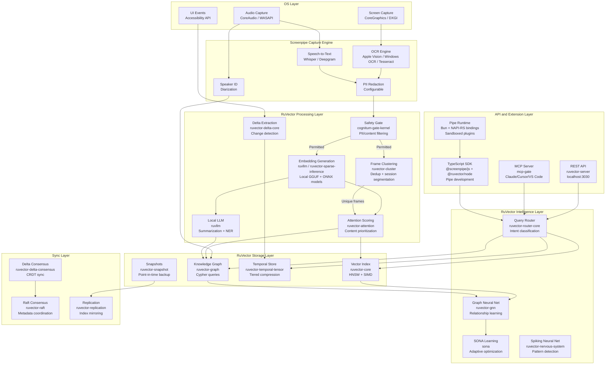
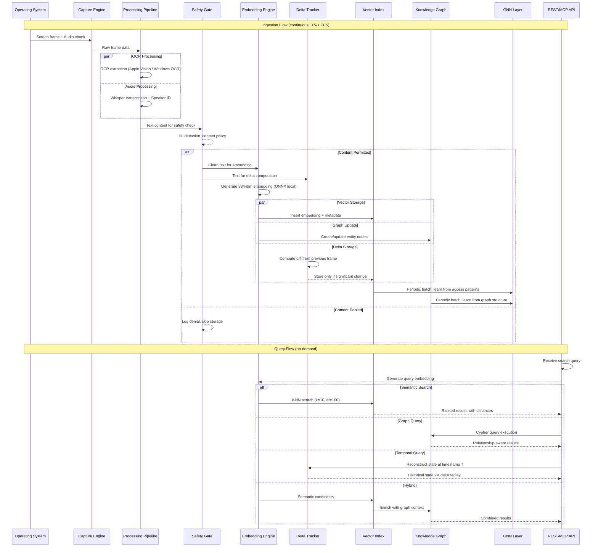
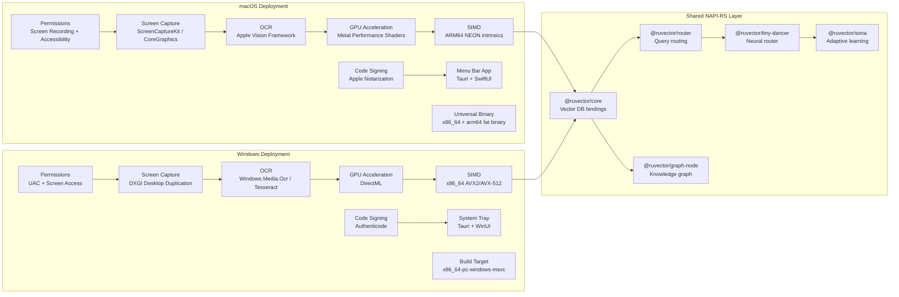
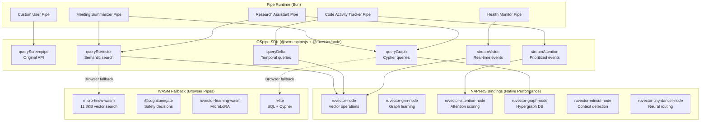
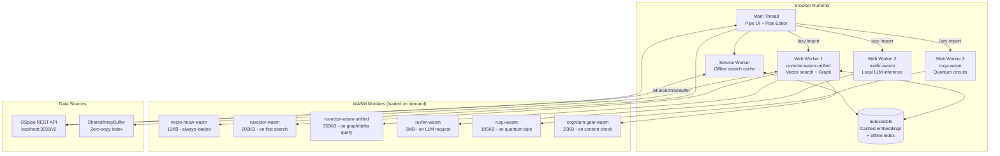

# ADR-029: RuVector + Screenpipe (OSpipe) Integration Architecture

**Status**: Proposed
**Date**: 2026-02-12
**Parent**: ADR-001 RuVector Core Architecture
**Authors**: ruv.io, RuVector Architecture Team
**Deciders**: Architecture Review Board
**SDK**: Claude-Flow

## Version History

| Version | Date | Author | Changes |
|---------|------|--------|---------|
| 0.1 | 2026-02-12 | ruv.io | Initial integration architecture proposal |
| 0.2 | 2026-02-12 | ruv.io | Added ruvllm local LLM, ruvector-cluster, ruvector-postgres, security architecture, Linux plan, backward compatibility, API versioning, WASM inventory, FFI router, ruvbot agents, burst-scaling, agentic capabilities |

---

## Abstract

This ADR defines the integration architecture for combining **Screenpipe** -- an open-source, local-first desktop recording and AI memory system -- with the **RuVector** ecosystem of 70+ Rust crates and 50+ npm packages. The resulting system, codenamed **OSpipe**, replaces Screenpipe's SQLite + FTS5 storage backend with RuVector's SIMD-accelerated HNSW vector database, enriches its capture pipeline with graph neural networks, attention mechanisms, quantum-enhanced search, and delta-behavior tracking, and extends its platform reach through NAPI-RS native bindings and WASM modules targeting Windows and macOS.

---

## 1. Context

### 1.1 The Personal AI Memory Problem

Desktop operating systems generate an extraordinary volume of information: screen content, spoken words, typed text, application context switches, notifications, meetings, code sessions, design reviews. Current approaches to capturing and querying this data fall into two categories:

1. **Keyword search** (e.g., Spotlight, Windows Search): Fast but semantically shallow. Searching for "budget discussion" will not find a screenshot of a spreadsheet or a spoken conversation about finances.
2. **Cloud-based AI memory** (e.g., Recall, Rewind.ai): Powerful semantic search but introduces privacy risks, requires internet, and depends on proprietary services.

Screenpipe occupies a unique position: it captures screen and audio locally, performs OCR and transcription on-device, and stores everything in a local SQLite database. However, its search is limited to FTS5 full-text matching -- it lacks true semantic vector search, relationship graphs between content, temporal pattern detection, and the kind of hardware-accelerated performance needed for real-time AI-augmented workflows.

RuVector provides exactly these capabilities: sub-millisecond HNSW vector search (61us p50), graph neural networks for relationship learning, attention mechanisms for content prioritization, and cross-platform deployment via NAPI-RS and WASM.

### 1.2 Why Integrate

| Gap in Screenpipe | RuVector Solution | Crate/Package |
|-------------------|-------------------|---------------|
| FTS5 keyword-only search | SIMD-accelerated semantic vector search (HNSW) | `ruvector-core` |
| No content relationships | Hypergraph knowledge graph with Cypher queries | `ruvector-graph` |
| No temporal pattern detection | Delta-behavior change tracking with causal ordering | `ruvector-delta-core`, `ruvector-delta-index` |
| No content prioritization | Multi-head attention for relevance scoring | `ruvector-attention` |
| No learned search improvement | GNN layers that improve retrieval over time | `ruvector-gnn` |
| Basic OCR text extraction | Scientific OCR with LaTeX/MathML extraction | `@ruvector/scipix` |
| No hierarchy-aware search | Hyperbolic embeddings for app/window/tab hierarchies | `ruvector-hyperbolic-hnsw` |
| No edge/WASM deployment | Neuromorphic HNSW in 11.8KB WASM | `micro-hnsw-wasm` |
| No AI safety guardrails | Coherence gate for content safety decisions | `cognitum-gate-kernel` |
| No intelligent routing | Neural router for query-type classification | `ruvector-router-core`, `@ruvector/tiny-dancer` |
| No distributed sync | CRDT-based delta consensus across devices | `ruvector-delta-consensus` |
| No quantum-enhanced search | Grover-inspired amplitude amplification for search | `ruqu-algorithms` |
| Requires external LLM (Ollama/OpenAI) | On-device GGUF inference, fully offline | `ruvllm` |
| No frame deduplication | Clustering-based duplicate frame detection | `ruvector-cluster` |
| No enterprise DB backend | PostgreSQL with pgvector for team deployments | `ruvector-postgres` |

### 1.3 Screenpipe Project Analysis

**Repository**: [github.com/screenpipe/screenpipe](https://github.com/screenpipe/screenpipe)
**License**: MIT
**Funding**: $2.8M (July 2025)
**Stack**: Rust (backend), Tauri (desktop), TypeScript/React (frontend), SQLite (storage)

#### Architecture Layers

| Layer | Function | Technology |
|-------|----------|------------|
| **Capture** | Screen frames, audio streams, UI events | CoreGraphics (macOS), DXGI (Windows), X11/PipeWire (Linux) |
| **Processing** | OCR, speech-to-text, speaker ID, PII redaction | Apple Vision / Windows OCR / Tesseract, Whisper, Deepgram |
| **Storage** | Structured data, media files | SQLite (`~/.screenpipe/db.sqlite`), MP4/MP3 files (`~/.screenpipe/data/`) |
| **API** | REST endpoints, raw SQL, streaming | localhost:3030 (`/search`, `/frames/{id}`, `/health`, `/raw_sql`) |
| **Extension** | Pipes (plugins), MCP server, SDK | TypeScript via Bun, `@screenpipe/js`, Next.js pipe templates |

#### Key Database Tables

| Table | Purpose |
|-------|---------|
| `frames` | Screen capture metadata (timestamp, monitor, app, window) |
| `ocr_results` | Extracted text from screen frames |
| `audio_chunks` | Audio recording metadata and file references |
| `transcriptions` | Speech-to-text results |
| `speakers` | Identified speaker profiles |
| `tags` | User annotations and labels |

#### Resource Profile

| Metric | Value |
|--------|-------|
| CPU usage | 5-15% typical |
| RAM | 0.5-3 GB |
| Storage | ~30 GB/month at 1 FPS (M3 MacBook Pro) |
| Frame rate | 1.0 FPS default (macOS: 0.5 FPS) |
| Audio chunks | 30-second intervals |

#### Pipe System

Screenpipe pipes are sandboxed TypeScript/JavaScript plugins stored in `~/.screenpipe/pipes/{name}/`. They operate on a cron-like schedule, query the REST API, and can trigger actions (write notes, send notifications, update external systems). The SDK (`@screenpipe/js`) provides:

- `pipe.queryScreenpipe()` -- Filtered content retrieval
- `pipe.streamVision()` -- Real-time streaming of vision events
- MCP server integration for Claude Desktop, Cursor, VS Code

---

## 2. RuVector Capabilities Mapping

This section maps every relevant RuVector crate and package to specific Screenpipe integration points. Crate paths reference `/workspaces/ruvector/crates/` and npm packages reference `/workspaces/ruvector/npm/packages/`.

### 2.1 Core Vector Storage and Search

#### `ruvector-core` -- Primary Embedding Store

**Path**: `crates/ruvector-core`
**Role**: Replaces SQLite FTS5 as the primary search backend for OCR text and audio transcription embeddings.

| Feature | Application in OSpipe |
|---------|----------------------|
| HNSW index (M=32, ef=200) | Semantic nearest-neighbor search across all captured text |
| SIMD distance (AVX2/NEON) | Hardware-accelerated cosine similarity on embedding vectors |
| Tiered quantization (4x-32x) | Compress month-old embeddings to reduce 30 GB/month footprint |
| Filtered search | Metadata filters: time range, app name, monitor, content type |
| Hybrid search (dense + BM25) | Combine semantic understanding with keyword precision |
| MMR (Maximal Marginal Relevance) | Deduplicate near-identical consecutive screenshots |
| Conformal prediction | Uncertainty bounds on search result confidence |

**Integration point**: Embeddings generated from OCR text and audio transcriptions are inserted into an HNSW index. The existing `/search` REST endpoint is augmented with a `mode=semantic` parameter that routes to RuVector instead of FTS5.

#### `ruvector-collections` -- Multi-Index Management

**Path**: `crates/ruvector-collections`
**Role**: Manages separate collections per content type (screen text, audio, UI events) with different embedding dimensions and quantization policies.

#### `ruvector-filter` -- Advanced Metadata Filtering

**Path**: `crates/ruvector-filter`
**Role**: Enables complex compound filters on vector search results: `app = "VS Code" AND timestamp > "2026-02-01" AND monitor = 2`.

### 2.2 Graph and Relationship Intelligence

#### `ruvector-graph` -- Knowledge Graph

**Path**: `crates/ruvector-graph`
**npm**: `npm/packages/graph-node` (NAPI-RS) and `npm/packages/graph-wasm` (WASM)
**Role**: Builds a persistent knowledge graph connecting related screen content.

| Graph Entity | Node Type | Example |
|-------------|-----------|---------|
| Application | `:App` | VS Code, Chrome, Slack |
| Window/Tab | `:Window` | "PR #1234 - GitHub", "Budget.xlsx" |
| Person | `:Person` | Speaker from audio, @mention in text |
| Topic | `:Topic` | Extracted via NER/topic modeling |
| Meeting | `:Meeting` | Time-bounded audio + screen cluster |
| Code Symbol | `:Symbol` | Function name seen in IDE capture |

**Relationships**: `(:Person)-[:DISCUSSED]->(:Topic)`, `(:App)-[:SHOWED]->(:Window)`, `(:Meeting)-[:INVOLVED]->(:Person)`, `(:Window)-[:REFERENCES]->(:Symbol)`

**Cypher queries** enable powerful contextual search:
```cypher
MATCH (p:Person)-[:DISCUSSED]->(t:Topic {name: "budget"})
WHERE p.last_seen > datetime("2026-02-01")
RETURN p.name, count(t) ORDER BY count(t) DESC
```

#### `ruvector-gnn` -- Graph Neural Network Layer

**Path**: `crates/ruvector-gnn`
**npm**: `npm/packages/graph-node` (includes GNN bindings)
**Role**: Learns relationship patterns between content nodes to improve retrieval relevance over time.

| GNN Application | Description |
|-----------------|-------------|
| Link prediction | Predict which apps/windows are likely viewed together |
| Node classification | Auto-categorize content into work/personal/creative |
| Community detection | Identify project clusters across applications |
| Temporal GNN | Learn daily workflow patterns for proactive suggestions |

#### `ruvector-mincut` -- Network Analysis

**Path**: `crates/ruvector-mincut`
**Role**: Dynamic min-cut analysis identifies natural topic boundaries in continuous screen recording streams. When the min-cut value drops below a threshold, it signals a context switch (e.g., user moved from coding to email).

### 2.3 Attention and Prioritization

#### `ruvector-attention` -- Multi-Head Attention

**Path**: `crates/ruvector-attention`
**npm**: `npm/packages/tiny-dancer` (neural routing with attention)
**Role**: Content prioritization and relevance scoring.

| Attention Mechanism | OSpipe Application |
|--------------------|--------------------|
| Geometric attention | Spatial layout analysis of screen regions |
| Graph attention | Weighted traversal of knowledge graph |
| Sparse attention | Efficient processing of long temporal sequences |
| Cross-attention | Align screen content with concurrent audio |

**Key use case**: When a user searches for "that email about the contract", cross-attention between the query embedding and the temporal stream of screen + audio embeddings identifies the most relevant moment, even if the word "contract" never appeared on screen (but was spoken in a concurrent call).

#### `ruvector-nervous-system` -- Bio-Inspired Processing

**Path**: `crates/ruvector-nervous-system`
**Role**: Spiking neural network (SNN) with BTSP learning and EWC plasticity for always-on background processing of the capture stream.

| SNN Feature | Application |
|-------------|-------------|
| Spike-timing dependent plasticity (STDP) | Learn temporal correlations between screen events |
| Elastic Weight Consolidation (EWC) | Prevent forgetting learned patterns as new data arrives |
| Winner-take-all circuits | Competitive selection of most salient content per frame |
| LIF neurons | Energy-efficient continuous processing on CPU |

### 2.4 Temporal and Delta Tracking

#### `ruvector-delta-core` -- Behavioral Change Detection

**Path**: `crates/ruvector-delta-core`
**Role**: Models screen content changes as first-class delta objects rather than full-frame snapshots.

Instead of storing every OCR result as an independent record, the delta system computes what changed between consecutive frames:

```
Frame N:   "function calculateTotal(items) { return items.reduce(...) }"
Frame N+1: "function calculateTotal(items, tax) { return items.reduce(...) * tax }"
Delta:     { position: 35, removed: ")", added: ", tax)", position: 72, added: " * tax" }
```

This reduces storage by 60-80% for static content (e.g., reading a document) and enables temporal queries: "Show me all code changes in VS Code between 2pm and 4pm."

#### `ruvector-delta-index` -- Delta-Aware HNSW

**Path**: `crates/ruvector-delta-index`
**Role**: HNSW index that supports incremental updates via deltas rather than full re-embedding, reducing compute cost for minor text changes.

#### `ruvector-delta-consensus` -- Cross-Device Sync

**Path**: `crates/ruvector-delta-consensus`
**Role**: CRDT-based distributed consensus for synchronizing OSpipe data across multiple devices (work laptop + home desktop) without a central server.

#### `ruvector-delta-graph` -- Graph Delta Operations

**Path**: `crates/ruvector-delta-graph`
**Role**: Incremental updates to the knowledge graph as new content is captured, without rebuilding the entire graph.

#### `ruvector-temporal-tensor` -- Temporal Compression

**Path**: `crates/ruvector-temporal-tensor`
**Role**: Tiered temporal compression for embedding storage:

| Age | Compression | Latency | Storage |
|-----|-------------|---------|---------|
| < 1 hour | None (f32) | 61us | 100% |
| 1-24 hours | Scalar (u8) | ~70us | 25% |
| 1-7 days | Product quantization | ~100us | 6-12% |
| 7-30 days | Binary quantization | ~1ms | 3% |
| > 30 days | Archive + delta only | ~10ms | <1% |

### 2.5 Quantum-Enhanced Search

#### `ruqu-core` -- Quantum Circuit Simulation

**Path**: `crates/ruqu-core`
**Role**: State-vector quantum circuit simulation with SIMD acceleration for enhanced search algorithms.

#### `ruqu-algorithms` -- Quantum Search Algorithms

**Path**: `crates/ruqu-algorithms`
**Role**: Production-ready quantum-inspired algorithms applicable to OSpipe:

| Algorithm | Application |
|-----------|-------------|
| Grover's search | Amplitude amplification for searching unstructured screen data |
| QAOA | Optimization of graph traversal paths in knowledge graph |
| VQE | Variational eigensolver for topic clustering of captured content |

#### `ruqu-exotic` -- Quantum-Classical Hybrids

**Path**: `crates/ruqu-exotic`
**Role**: Experimental quantum-classical hybrid algorithms for AI-enhanced search:

- **Quantum memory decay**: Natural forgetting of irrelevant screen captures
- **Interference search**: Quantum interference patterns for multi-modal query resolution
- **Reasoning error correction**: Surface code-inspired error correction for search result consistency

### 2.6 Routing and Intelligence

#### `ruvector-router-core` -- Neural Query Router

**Path**: `crates/ruvector-router-core`
**npm**: `npm/packages/router`
**Role**: Routes incoming search queries to the optimal backend based on query characteristics.

| Query Type | Route | Backend |
|-----------|-------|---------|
| Exact keyword | FTS5 | SQLite (legacy) |
| Semantic similarity | HNSW | `ruvector-core` |
| Relationship query | Cypher | `ruvector-graph` |
| Temporal pattern | Delta replay | `ruvector-delta-core` |
| Multi-modal | Cross-attention | `ruvector-attention` |

#### `@ruvector/tiny-dancer` -- Agent Orchestration Router

**Path**: `npm/packages/tiny-dancer`
**Role**: FastGRNN-based neural router with circuit breaker, uncertainty estimation, and hot-reload for routing pipe requests to appropriate processing backends.

#### `sona` -- Self-Optimizing Neural Architecture

**Path**: `crates/sona`
**npm**: `npm/packages/sona`
**Role**: Runtime-adaptive learning for the query router. SONA learns from user search patterns to improve routing accuracy over time:

- **Two-tier LoRA**: Lightweight adaptation layers for user-specific preferences
- **EWC++**: Prevents catastrophic forgetting when learning new patterns
- **ReasoningBank**: Trajectory-based learning from search outcomes
- **Sub-millisecond overhead**: <0.05ms adaptation latency

### 2.7 Specialized Processing

#### `@ruvector/scipix` -- Scientific OCR

**Path**: `npm/packages/scipix`
**Role**: Extends Screenpipe's OCR capabilities for scientific and technical content:

- LaTeX equation extraction from screen captures
- MathML conversion for mathematical notation
- Technical diagram recognition
- Research paper structure extraction

When a user captures a screen showing a research paper or whiteboard equation, SciPix provides structured extraction that goes beyond raw OCR text.

#### `@ruvector/rvdna` -- Genomic Analysis (Health Monitoring)

**Path**: `npm/packages/rvdna`
**Role**: For health-monitoring OSpipe pipes. If the user is a researcher viewing genomic data, rvDNA can:

- Parse .rvdna format files captured on screen
- Perform variant calling on captured genomic visualizations
- HNSW vector search over protein sequence embeddings

#### `@ruvector/spiking-neural` -- Spiking Neural Networks

**Path**: `npm/packages/spiking-neural`
**Role**: Energy-efficient continuous background processing of the capture stream using biologically-inspired spiking neural networks. Ideal for always-on pattern detection with minimal CPU impact.

#### `ruvector-fpga-transformer` -- Deterministic Latency Processing

**Path**: `crates/ruvector-fpga-transformer`
**Role**: For enterprise OSpipe deployments requiring guaranteed latency bounds on search queries. The FPGA transformer backend provides deterministic processing times with quantization-first design.

### 2.8 Infrastructure and Safety

#### `ruvector-raft` -- Distributed Consensus

**Path**: `crates/ruvector-raft`
**Role**: Raft consensus for multi-device OSpipe clusters where a family or team shares a coordinated memory system.

#### `ruvector-replication` -- Data Replication

**Path**: `crates/ruvector-replication`
**Role**: Replicates vector indices across devices for redundancy and faster local search.

#### `ruvector-snapshot` -- Point-in-Time Backup

**Path**: `crates/ruvector-snapshot`
**Role**: Consistent snapshots of the vector index for backup and recovery.

#### `cognitum-gate-kernel` -- AI Safety Gate

**Path**: `crates/cognitum-gate-kernel`
**npm**: `npm/packages/cognitum-gate-wasm`
**Role**: Real-time permit/defer/deny decisions for content safety:

- Prevent storage of detected sensitive content (credit cards, SSNs)
- Gate pipe access to specific content categories
- Enforce PII redaction policies before vector storage
- Coherence verification on search results

#### `prime-radiant` -- Coherence Engine

**Path**: `crates/prime-radiant`
**Role**: Sheaf Laplacian mathematics for structural consistency verification. Ensures that knowledge graph updates maintain logical coherence and detects hallucinated relationships.

#### `mcp-gate` -- MCP Protocol Server

**Path**: `crates/mcp-gate`
**Role**: Production MCP server implementation that exposes OSpipe capabilities to Claude Desktop, Cursor, VS Code, and other MCP-compatible AI assistants.

#### `ruvector-server` -- REST API Server

**Path**: `crates/ruvector-server`
**Role**: High-performance REST API server that can either replace or augment Screenpipe's existing localhost:3030 API with vector-aware endpoints.

#### `ruvector-metrics` -- Observability

**Path**: `crates/ruvector-metrics`
**Role**: Prometheus-compatible metrics for monitoring OSpipe performance, query latency, index health, and storage utilization.

### 2.9 Edge and WASM Deployment

#### `micro-hnsw-wasm` -- Ultra-Lightweight Vector Search

**Path**: `crates/micro-hnsw-wasm`
**Role**: 11.8KB WASM module with neuromorphic HNSW for in-browser OSpipe pipes. Features LIF neurons, STDP learning, and winner-take-all selection.

#### `ruvector-wasm` -- Full WASM Vector DB

**Path**: `crates/ruvector-wasm`
**npm**: `npm/packages/ruvector-wasm`
**Role**: Complete vector database in WASM for pipes running in the browser-based pipe editor.

#### `ruvector-dag` -- Query Plan Optimization

**Path**: `crates/ruvector-dag`
**Role**: DAG-based query plan optimization with neural learning for complex multi-step OSpipe queries.

#### `ruvector-hyperbolic-hnsw` -- Hierarchy-Aware Search

**Path**: `crates/ruvector-hyperbolic-hnsw`
**Role**: Poincare ball model embeddings for hierarchy-aware search. Maps the natural hierarchy of OS > App > Window > Tab > Content into hyperbolic space where hierarchical distance is preserved.

#### `ruvector-sparse-inference` -- Edge Inference

**Path**: `crates/ruvector-sparse-inference`
**Role**: PowerInfer-style sparse inference for efficient neural network inference on edge devices. Enables local embedding generation without GPU.

#### `rvlite` -- Standalone Lightweight DB

**Path**: `crates/rvlite`
**npm**: `npm/packages/rvlite`
**Role**: Standalone vector database with SQL, SPARQL, and Cypher support. Can serve as a drop-in replacement for Screenpipe's SQLite while adding vector capabilities.

### 2.10 Learning and Adaptation

#### `ruvector-learning-wasm` -- MicroLoRA Adaptation

**Path**: `crates/ruvector-learning-wasm`
**Role**: Ultra-fast MicroLoRA adaptation in WASM (<100us latency) for per-user learning of search preferences and content relevance.

#### `ruvector-economy-wasm` -- Compute Economy

**Path**: `crates/ruvector-economy-wasm`
**Role**: CRDT-based autonomous credit economy for distributed OSpipe networks where multiple users contribute compute resources.

#### `ruvector-exotic-wasm` -- Emergent Behavior

**Path**: `crates/ruvector-exotic-wasm`
**Role**: Exotic AI mechanisms for emergent behavior in multi-agent pipe systems:

- Neural Autonomous Orgs for pipe governance
- Morphogenetic Networks for adaptive UI
- Time Crystals for periodic pattern detection

### 2.11 Local LLM Inference

#### `ruvllm` -- On-Device Language Model Inference

**Path**: `crates/ruvllm`
**npm**: `npm/packages/ruvllm` + 5 platform-specific binary packages
**Role**: GGUF-based local LLM inference for on-device summarization, embedding generation, and pipe intelligence -- without any external API dependency.

| Feature | Application in OSpipe |
|---------|----------------------|
| GGUF model loading | Load quantized LLMs (Q4_K_M, Q5_K_M) for on-device inference |
| Embedding generation | Replace external APIs for embedding -- fully offline operation |
| Text summarization | Summarize captured screen sessions, meetings, and code activity |
| Classification | Classify captured content into categories (work, personal, sensitive) |
| Named Entity Recognition | Extract people, organizations, projects from OCR/transcription text |
| Pipe intelligence | Power autonomous pipe decision-making without cloud LLM calls |

**Platform binaries** (pre-built NAPI-RS):

| Platform | Package |
|----------|---------|
| macOS ARM64 | `npm/packages/ruvllm-darwin-arm64` |
| macOS x64 | `npm/packages/ruvllm-darwin-x64` |
| Windows x64 | `npm/packages/ruvllm-win32-x64-msvc` |
| Linux ARM64 | `npm/packages/ruvllm-linux-arm64-gnu` |
| Linux x64 | `npm/packages/ruvllm-linux-x64-gnu` |

**WASM fallback**: `npm/packages/ruvllm-wasm` for browser-based pipes.

**Integration point**: RuvLLM replaces the current Ollama/OpenAI dependency for pipes that need LLM capabilities, making OSpipe fully self-contained and offline-capable.

```typescript
import { RuvLLM } from "@ruvector/ruvllm";

const llm = new RuvLLM({ model: "ruvltra-0.5b-q4_k_m.gguf" });

// Summarize a capture session
const summary = await llm.generate({
  prompt: `Summarize this screen activity:\n${ocrText}`,
  maxTokens: 200,
});

// Generate embeddings locally (no API needed)
const embedding = await llm.embed(ocrText); // 384-dim vector
```

#### `ruvllm-cli` -- CLI for Model Management

**Path**: `crates/ruvllm-cli`
**Role**: Download, manage, and test GGUF models for OSpipe deployment.

### 2.12 Clustering and Frame Deduplication

#### `ruvector-cluster` -- Content Clustering

**Path**: `crates/ruvector-cluster`
**Role**: Groups similar screen captures, deduplicates near-identical consecutive frames, and auto-categorizes content into sessions.

| Feature | Application in OSpipe |
|---------|----------------------|
| K-means clustering | Group similar screenshots into activity sessions |
| DBSCAN | Density-based detection of content clusters without predefined K |
| Hierarchical clustering | Multi-level grouping: project > task > sub-task |
| Frame deduplication | Detect and skip near-identical consecutive frames (static content) |
| Session segmentation | Automatic work session boundaries from capture stream |

**Key use case**: When the user is reading a document for 30 minutes, `ruvector-cluster` detects that consecutive frames are >95% similar and stores only the first frame + a duration marker, reducing storage by 90%+ for static reading sessions.

### 2.13 Advanced Attention and Gated Transformers

#### `ruvector-mincut-gated-transformer` -- Gated Transformer with MinCut Attention

**Path**: `crates/ruvector-mincut-gated-transformer`
**npm WASM**: `crates/ruvector-mincut-gated-transformer-wasm`
**Role**: Advanced gated transformer architecture combining MinCut-based attention with learned gating for superior context-switch detection and content segmentation.

| Feature | Application in OSpipe |
|---------|----------------------|
| Gated MinCut attention | Detect context switches with learned gating thresholds |
| Multi-scale segmentation | Identify topic changes at sentence, paragraph, and session level |
| Cross-modal gating | Gate attention between screen and audio modalities |

#### `ruvector-attention-unified-wasm` -- Unified Attention in WASM

**Path**: `crates/ruvector-attention-unified-wasm`
**Role**: All attention mechanisms (geometric, graph, sparse, cross) compiled to a single WASM module for browser-based pipes.

### 2.14 Enterprise and Database Backends

#### `ruvector-postgres` -- PostgreSQL Backend

**Path**: `crates/ruvector-postgres`
**npm**: `npm/packages/postgres-cli`
**Role**: PostgreSQL-backed vector storage for enterprise OSpipe deployments. Replaces the local HNSW index with pgvector for centralized team deployments.

| Feature | Application in OSpipe |
|---------|----------------------|
| pgvector integration | Server-side vector search with PostgreSQL |
| Team deployment | Shared OSpipe instance for organizations |
| Backup/recovery | Leverage PostgreSQL's mature backup tooling |
| Access control | Row-level security for multi-user capture data |

### 2.15 Agentic Capabilities

#### `agentic-integration` -- Autonomous Pipe Orchestration

**Path**: `npm/packages/agentic-integration`
**Role**: Framework for building autonomous, self-orchestrating OSpipe pipes that can chain operations, make decisions, and coordinate with other pipes.

#### `agentic-synth` -- Synthetic Data Generation

**Path**: `npm/packages/agentic-synth`
**Role**: Generate synthetic screen capture data for testing OSpipe pipes without requiring real user data. Essential for CI/CD and privacy-safe development.

#### `ruvbot` -- Long-Running Agent Templates

**Path**: `npm/packages/ruvbot`
**Role**: Pre-built agent templates for persistent OSpipe pipes. Deploy always-on agents that monitor capture streams, generate summaries, trigger notifications, and learn from user behavior.

| Template | Application |
|----------|-------------|
| `code-reviewer` | Monitors IDE captures and suggests improvements |
| `meeting-summarizer` | Auto-generates meeting notes from audio + screen |
| `research-assistant` | Builds knowledge base from browsing sessions |
| `self-learning-bot` | Continuously improves search relevance from usage |

### 2.16 Scaling and Performance

#### `burst-scaling` -- Capture Load Spike Handling

**Path**: `npm/packages/burst-scaling`
**Role**: Dynamic scaling for handling capture load spikes -- rapid window switching, multi-monitor setups, high-FPS capture modes. Manages backpressure and queuing to prevent dropped frames.

| Feature | Application in OSpipe |
|---------|----------------------|
| Backpressure management | Queue frames during CPU spikes without dropping |
| Adaptive batch sizing | Increase embedding batch size during high-load periods |
| Resource budgeting | Cap CPU/memory usage per-component with dynamic allocation |
| Multi-monitor balancing | Distribute capture load across cores by monitor |

### 2.17 Quantum Meta-Package

#### `ruQu` -- Unified Quantum Package

**Path**: `crates/ruQu`
**Role**: Meta-crate that re-exports `ruqu-core`, `ruqu-algorithms`, and `ruqu-exotic` under a single dependency. Simplifies quantum integration for OSpipe.

```toml
[dependencies]
ruqu = { version = "2.0.5", path = "../ruQu" }
# Instead of adding ruqu-core, ruqu-algorithms, ruqu-exotic separately
```

### 2.18 Complete WASM Module Inventory

All WASM packages available for browser-based OSpipe pipes:

| Package | Size | Purpose |
|---------|------|---------|
| `micro-hnsw-wasm` | 11.8 KB | Ultra-lightweight vector search |
| `ruvector-wasm` | ~200 KB | Full vector DB |
| `ruvector-wasm-unified` | ~350 KB | All-in-one unified bundle |
| `ruvllm-wasm` | ~2 MB | Local LLM inference |
| `ruvector-delta-wasm` | ~50 KB | Delta behavior tracking |
| `ruvector-math-wasm` | ~30 KB | Mathematical primitives |
| `ruvector-hyperbolic-hnsw-wasm` | ~80 KB | Hyperbolic embeddings |
| `ruvector-sparse-inference-wasm` | ~120 KB | Edge neural inference |
| `ruvector-temporal-tensor-wasm` | ~60 KB | Temporal compression |
| `ruvector-attention-unified-wasm` | ~150 KB | All attention mechanisms |
| `ruvector-mincut-wasm` | ~40 KB | MinCut network analysis |
| `ruvector-mincut-gated-transformer-wasm` | ~90 KB | Gated transformer |
| `ruvector-gnn-wasm` | ~100 KB | Graph neural networks |
| `ruvector-dag-wasm` | ~45 KB | Query plan optimization |
| `ruvector-nervous-system-wasm` | ~70 KB | Spiking neural network |
| `ruvector-fpga-transformer-wasm` | ~80 KB | Deterministic inference |
| `ruvector-economy-wasm` | ~55 KB | Compute economy CRDT |
| `ruvector-exotic-wasm` | ~65 KB | Emergent AI mechanisms |
| `ruvector-learning-wasm` | ~45 KB | MicroLoRA adaptation |
| `cognitum-gate-wasm` | ~25 KB | Safety gate decisions |
| `ruqu-wasm` | ~105 KB | Quantum simulation |

### 2.19 FFI and CLI Tools

#### `ruvector-router-ffi` -- Foreign Function Interface

**Path**: `crates/ruvector-router-ffi`
**Role**: C-compatible FFI bindings for the query router. Allows Screenpipe's Rust backend to call the router directly without NAPI-RS overhead -- zero-copy, in-process routing.

**Integration point**: Screenpipe's Rust capture engine links `ruvector-router-ffi` directly, avoiding the TypeScript → NAPI-RS → Rust round-trip for the hot path.

```rust
// In Screenpipe's Rust backend (zero-overhead)
use ruvector_router_ffi::{route_query, QueryType};

let route = route_query(query_text, QueryType::Auto);
match route {
    QueryType::Semantic => hnsw_search(query_embedding),
    QueryType::Graph => cypher_query(query_text),
    QueryType::Temporal => delta_replay(query_text),
    QueryType::Keyword => fts5_search(query_text),
}
```

#### `ruvector-router-cli` / `ruvector-attention-cli` -- CLI Debugging Tools

**Path**: `crates/ruvector-router-cli`, `crates/ruvector-attention-cli`
**Role**: CLI tools for debugging query routing decisions and attention scores during OSpipe development.

### 2.20 Node.js and NAPI-RS Bindings

#### `ruvector-node` -- Core NAPI-RS Bindings

**Path**: `crates/ruvector-node`
**npm**: `npm/packages/node`
**Role**: Native Node.js bindings for `ruvector-core` via NAPI-RS. Provides direct access to SIMD-accelerated vector operations from Screenpipe's TypeScript pipe runtime.

#### `ruvector-gnn-node` -- GNN NAPI-RS Bindings

**Path**: `crates/ruvector-gnn-node`
**Role**: Native Node.js bindings for graph neural network operations.

#### `ruvector-attention-node` -- Attention NAPI-RS Bindings

**Path**: `crates/ruvector-attention-node`
**Role**: Native Node.js bindings for attention mechanism operations.

#### `ruvector-graph-node` -- Graph DB NAPI-RS Bindings

**Path**: `npm/packages/graph-node`
**Role**: Native Node.js bindings for the hypergraph database. 10x faster than the WASM equivalent.

#### `ruvector-tiny-dancer-node` -- Router NAPI-RS Bindings

**Path**: `crates/ruvector-tiny-dancer-node`
**Role**: Native Node.js bindings for the neural router.

#### `ruvector-mincut-node` -- MinCut NAPI-RS Bindings

**Path**: `crates/ruvector-mincut-node`
**Role**: Native Node.js bindings for network analysis and context-switch detection.

#### Platform-Specific NAPI-RS Binaries

Pre-built binaries are available for all Screenpipe-supported platforms:

| Platform | Router | RuvLLM | Tiny Dancer |
|----------|--------|--------|-------------|
| macOS ARM64 | `npm/packages/router-darwin-arm64` | `npm/packages/ruvllm-darwin-arm64` | `npm/packages/tiny-dancer-darwin-arm64` |
| macOS x64 | `npm/packages/router-darwin-x64` | `npm/packages/ruvllm-darwin-x64` | `npm/packages/tiny-dancer-darwin-x64` |
| Windows x64 | `npm/packages/router-win32-x64-msvc` | `npm/packages/ruvllm-win32-x64-msvc` | `npm/packages/tiny-dancer-win32-x64-msvc` |
| Linux ARM64 | `npm/packages/router-linux-arm64-gnu` | `npm/packages/ruvllm-linux-arm64-gnu` | `npm/packages/tiny-dancer-linux-arm64-gnu` |
| Linux x64 | `npm/packages/router-linux-x64-gnu` | `npm/packages/ruvllm-linux-x64-gnu` | `npm/packages/tiny-dancer-linux-x64-gnu` |

---

## 3. Architecture Diagrams

### 3.1 Overall Integration Architecture

<details>
<summary>Click to expand: Overall OSpipe Architecture</summary>



</details>

### 3.2 Data Flow Pipeline

<details>
<summary>Click to expand: Data Flow from Capture to Query</summary>



</details>

### 3.3 Platform-Specific Deployment

<details>
<summary>Click to expand: Windows and macOS Deployment Architecture</summary>



</details>

### 3.4 Pipe Architecture with RuVector

<details>
<summary>Click to expand: Enhanced Pipe System Architecture</summary>



</details>

---

## 4. Windows Integration Plan

### 4.1 Screen Capture Pipeline

**Screenpipe's existing approach**: DXGI Desktop Duplication API for screen capture, Windows.Media.Ocr for text extraction.

**OSpipe enhancement**:

| Component | Technology | Purpose |
|-----------|------------|---------|
| Capture | DXGI `IDXGIOutputDuplication` | Zero-copy GPU-to-CPU frame transfer |
| GPU preprocessing | DirectML | Resize/normalize frames on GPU before OCR |
| OCR primary | Windows.Media.Ocr (WinRT) | Native Windows OCR with language detection |
| OCR fallback | Tesseract via `leptonica` | Cross-platform fallback |
| Scientific OCR | `@ruvector/scipix` | LaTeX/MathML extraction for technical content |

### 4.2 NAPI-RS Bindings for Windows

Pre-built native binaries are already available for Windows x64:

| Package | Binary | Size |
|---------|--------|------|
| `@ruvector/router` | `router-win32-x64-msvc` | Pre-built |
| `@ruvector/ruvllm` | `ruvllm-win32-x64-msvc` | Pre-built |
| `@ruvector/tiny-dancer` | `tiny-dancer-win32-x64-msvc` | Pre-built |

**Build configuration** for Windows-specific crates:

```toml
[target.x86_64-pc-windows-msvc]
rustflags = ["-C", "target-feature=+avx2,+fma"]

[target.x86_64-pc-windows-msvc.ruvector-core]
features = ["simd", "parallel", "storage", "hnsw"]
```

### 4.3 System Tray Integration

Screenpipe uses Tauri for its desktop application. OSpipe extends this with:

| Feature | Implementation |
|---------|---------------|
| System tray icon | Tauri `SystemTray` with recording status indicator |
| Quick search | Global hotkey (Win+Shift+S) opens search overlay |
| Capture status | Real-time CPU/RAM/storage metrics in tray tooltip |
| Privacy controls | One-click pause/resume, app exclusion list |
| Auto-start | Windows Task Scheduler registration |
| Background service | Windows Service via `windows-service` crate for headless operation |

### 4.4 Windows-Specific Performance Optimizations

| Optimization | Details |
|-------------|---------|
| AVX2 SIMD | 8-wide float operations for distance calculations (16M ops/sec) |
| AVX-512 detection | Runtime detection and dispatch for newer Intel/AMD CPUs |
| Large pages | 2MB pages for HNSW index memory via `VirtualAlloc` with `MEM_LARGE_PAGES` |
| NUMA awareness | Pin HNSW search threads to local NUMA node on multi-socket systems |
| Memory-mapped I/O | `CreateFileMapping` for zero-copy vector persistence |
| IO completion ports | Async I/O for concurrent embedding generation and index operations |
| DirectML acceleration | GPU-accelerated embedding generation via DirectML ONNX runtime |

### 4.5 Windows Installer and Distribution

| Aspect | Approach |
|--------|----------|
| Installer | NSIS or WiX via Tauri bundler |
| Code signing | Authenticode with EV certificate |
| Auto-update | Tauri updater with delta updates |
| Registry | `HKCU\Software\OSpipe` for configuration |
| Data location | `%LOCALAPPDATA%\OSpipe\` for database, `%LOCALAPPDATA%\OSpipe\data\` for media |
| Uninstaller | Clean removal including database, with optional data export |

---

## 5. macOS Integration Plan

### 5.1 Screen Capture Pipeline

**Screenpipe's existing approach**: CoreGraphics `CGWindowListCreateImage` for screen capture, Apple Vision framework for OCR.

**OSpipe enhancement**:

| Component | Technology | Purpose |
|-----------|------------|---------|
| Capture (macOS 12.3+) | ScreenCaptureKit (`SCStream`) | Modern, efficient screen capture with per-window/per-app filtering |
| Capture (legacy) | CoreGraphics `CGDisplayStream` | Fallback for older macOS versions |
| GPU preprocessing | Metal Performance Shaders | Resize/normalize on Apple GPU |
| OCR primary | Apple Vision (`VNRecognizeTextRequest`) | Highest quality on-device OCR |
| OCR scientific | `@ruvector/scipix` | LaTeX/MathML for research content |
| Audio capture | CoreAudio `AVCaptureSession` | System audio + microphone |

### 5.2 macOS Permissions Model

| Permission | Purpose | API |
|-----------|---------|-----|
| Screen Recording | Capture screen content | `CGPreflightScreenCaptureAccess()` |
| Accessibility | UI event tracking, keyboard/mouse | `AXIsProcessTrusted()` |
| Microphone | Audio capture for transcription | `AVCaptureDevice.authorizationStatus` |
| Automation | Control other apps (optional for pipes) | AppleScript/Shortcuts |
| Full Disk Access | Read application data (optional) | System Preferences manual grant |

**Permission flow**: On first launch, OSpipe guides users through each permission with explanatory dialogs. The Tauri app monitors permission status and degrades gracefully if specific permissions are denied.

### 5.3 Metal GPU Acceleration

Apple Silicon Macs (M1-M4) provide significant GPU acceleration opportunities:

| Operation | CPU (ARM64 NEON) | Metal GPU | Speedup |
|-----------|------------------|-----------|---------|
| Embedding generation (384-dim) | ~5ms | ~0.8ms | 6.2x |
| Batch cosine distance (1000 vectors) | ~237us | ~45us | 5.3x |
| HNSW search (10K vectors, k=10) | 61us | N/A (CPU optimal) | -- |
| OCR preprocessing (1080p frame) | ~12ms | ~2ms | 6x |

**Implementation**: Metal acceleration is used for embedding generation and OCR preprocessing. HNSW graph traversal remains CPU-bound (pointer-chasing workload unsuitable for GPU).

```rust
// Metal compute pipeline for batch embedding
#[cfg(target_os = "macos")]
mod metal_accel {
    use metal::*;

    pub fn batch_embed(texts: &[String], device: &Device) -> Vec<Vec<f32>> {
        let pipeline = device.new_compute_pipeline_state_with_function(
            &library.get_function("embed_kernel", None).unwrap()
        ).unwrap();
        // ... Metal command buffer setup
    }
}
```

### 5.4 Universal Binary Support

OSpipe ships as a Universal Binary (fat binary) supporting both architectures:

| Architecture | SIMD | Target Triple |
|-------------|------|---------------|
| Apple Silicon (M1-M4) | ARM64 NEON | `aarch64-apple-darwin` |
| Intel Mac | x86_64 AVX2 | `x86_64-apple-darwin` |

**Build command**:
```bash
# Build universal binary
cargo build --release --target aarch64-apple-darwin
cargo build --release --target x86_64-apple-darwin
lipo -create \
  target/aarch64-apple-darwin/release/ospipe \
  target/x86_64-apple-darwin/release/ospipe \
  -output target/universal/ospipe
```

### 5.5 Spotlight Integration

OSpipe can optionally register as a Spotlight importer, making captured content searchable via macOS Spotlight (Cmd+Space):

| Feature | Implementation |
|---------|---------------|
| Spotlight importer | `mdimporter` plugin with custom UTI for `.ospipe` content |
| Indexed attributes | `kMDItemTextContent`, `kMDItemContentCreationDate`, `kMDItemCreator` |
| Search routing | Spotlight queries forwarded to RuVector HNSW for semantic results |
| Quick Look | Preview panel showing captured frame + OCR text |

### 5.6 macOS-Specific Performance Optimizations

| Optimization | Details |
|-------------|---------|
| ARM64 NEON | 4-wide float SIMD for distance calculations (8M ops/sec) |
| Unified Memory | Zero-copy between CPU and GPU for Metal acceleration |
| Grand Central Dispatch | `libdispatch` for concurrent embedding processing |
| IOSurface | Hardware-accelerated screen frame sharing between capture and OCR |
| Memory pressure | Respond to `os_proc_available_memory()` by increasing quantization |
| Energy efficiency | Reduce capture FPS when on battery (`IOPSCopyPowerSourcesInfo`) |
| App Nap prevention | `NSProcessInfo.processInfo.beginActivity` for background processing |

### 5.7 macOS Distribution

| Aspect | Approach |
|--------|----------|
| Format | `.dmg` with drag-to-Applications |
| Code signing | Apple Developer ID + Notarization |
| Auto-update | Sparkle framework via Tauri updater |
| Sandbox | App Sandbox with `com.apple.security.temporary-exception` for screen recording |
| Data location | `~/Library/Application Support/OSpipe/` for database |
| Menu bar | Native SwiftUI menu bar extra via Tauri plugin |
| Login item | `SMAppService.register` for launch-at-login |

---

## 6. WebAssembly (WASM) Integration Plan

Screenpipe pipes run in a sandboxed runtime (Bun). For **browser-based pipes** -- the pipe editor, web dashboard, and third-party web tools -- OSpipe provides a complete WASM stack that mirrors the NAPI-RS native bindings.

### 6.1 WASM Bundle Strategy

Not every pipe needs every module. OSpipe uses a tiered loading strategy:

| Tier | Modules | Combined Size | Use Case |
|------|---------|---------------|----------|
| **Micro** | `micro-hnsw-wasm` | ~12 KB | Minimal vector search (embedded widgets, mobile web) |
| **Standard** | `ruvector-wasm` + `cognitum-gate-wasm` | ~225 KB | Semantic search + safety gate |
| **Full** | `ruvector-wasm-unified` | ~350 KB | All-in-one bundle (search, graph, delta, attention) |
| **AI** | `ruvector-wasm-unified` + `ruvllm-wasm` + `ruqu-wasm` | ~2.5 MB | Full local AI (LLM + quantum + vector) |

**Lazy loading**: Only the Micro tier loads on page init. Higher tiers load on first use via dynamic `import()`:

```typescript
// Pipe loads micro-hnsw on init (12KB)
import init, { MicroHNSW } from "@ruvector/micro-hnsw-wasm";
await init();

// Full vector DB loads lazily on first semantic search
let ruvector: typeof import("@ruvector/ruvector-wasm-unified") | null = null;
async function semanticSearch(query: string) {
  if (!ruvector) {
    ruvector = await import("@ruvector/ruvector-wasm-unified");
    await ruvector.default();
  }
  return ruvector.search(query, { k: 10 });
}
```

### 6.2 Web Worker Deployment

Heavy WASM operations run in Web Workers to avoid blocking the UI:

```typescript
// ospipe-worker.ts -- runs in Web Worker
import init, { RuVector, RuvLLM } from "@ruvector/ruvector-wasm-unified";

let db: RuVector;
let llm: RuvLLM;

self.onmessage = async (e) => {
  const { type, payload } = e.data;

  switch (type) {
    case "init":
      await init();
      db = new RuVector({ dimensions: 384, metric: "cosine" });
      break;

    case "init-llm":
      // Load LLM WASM module (~2MB) only when needed
      const ruvllm = await import("@ruvector/ruvllm-wasm");
      await ruvllm.default();
      llm = new ruvllm.RuvLLM({ model: payload.modelUrl });
      break;

    case "embed":
      const embedding = await llm.embed(payload.text);
      self.postMessage({ type: "embedding", data: embedding });
      break;

    case "search":
      const results = db.search(payload.embedding, { k: payload.k });
      self.postMessage({ type: "results", data: results });
      break;

    case "insert":
      db.insert(payload.id, payload.embedding, payload.metadata);
      break;

    case "graph-query":
      const { RvLite } = await import("@ruvector/rvlite");
      const graph = new RvLite();
      const graphResults = graph.query(payload.cypher);
      self.postMessage({ type: "graph-results", data: graphResults });
      break;
  }
};
```

### 6.3 SharedArrayBuffer for Zero-Copy

When available (COOP/COEP headers set), OSpipe uses `SharedArrayBuffer` for zero-copy data sharing between the main thread and WASM workers:

```typescript
// Main thread creates shared memory for vector index
const sharedIndex = new SharedArrayBuffer(1024 * 1024 * 50); // 50MB
const worker = new Worker("ospipe-worker.js");

// Worker maps HNSW index into shared memory
worker.postMessage({ type: "init", sharedMemory: sharedIndex });

// Main thread can read search results without copying
const resultsView = new Float32Array(sharedIndex, resultOffset, resultLength);
```

**Required headers** (set by OSpipe's local server):

```
Cross-Origin-Opener-Policy: same-origin
Cross-Origin-Embedder-Policy: require-corp
```

### 6.4 Service Worker for Offline Pipes

Pipes can work fully offline using Service Worker + IndexedDB:

```typescript
// service-worker.ts
import { MicroHNSW } from "@ruvector/micro-hnsw-wasm";

self.addEventListener("fetch", (event) => {
  if (event.request.url.includes("/api/v2/search")) {
    event.respondWith(handleOfflineSearch(event.request));
  }
});

async function handleOfflineSearch(request: Request): Promise<Response> {
  const { query } = await request.json();

  // Search local WASM index while offline
  const index = await getLocalIndex(); // from IndexedDB
  const results = index.search(query, { k: 10 });

  return new Response(JSON.stringify(results), {
    headers: { "Content-Type": "application/json" },
  });
}
```

### 6.5 WASM Performance vs NAPI-RS

| Operation | NAPI-RS (native) | WASM (browser) | Ratio |
|-----------|-------------------|----------------|-------|
| HNSW search (10K, k=10) | 61us | ~250us | 4.1x slower |
| Cosine distance (1000 vecs) | 237us | ~900us | 3.8x slower |
| Embedding generation (ruvllm) | ~5ms | ~20ms | 4x slower |
| Graph Cypher query (1-hop) | ~0.8ms | ~3ms | 3.7x slower |
| Delta computation | ~0.1ms | ~0.4ms | 4x slower |
| Safety gate check | ~0.05ms | ~0.15ms | 3x slower |

**Guidance**: Use NAPI-RS for desktop pipes (default). WASM is for browser-based pipe editor, web dashboard, and portable tools. For latency-critical operations, WASM pipes should pre-compute and cache results.

### 6.6 WASM SIMD Acceleration

All RuVector WASM modules compile with WASM SIMD128 for hardware-accelerated vector operations:

```bash
# Build with SIMD support
RUSTFLAGS="-C target-feature=+simd128" wasm-pack build --target web
```

| Browser | WASM SIMD | Speedup vs scalar |
|---------|-----------|-------------------|
| Chrome 91+ | Yes | 2-4x |
| Firefox 89+ | Yes | 2-4x |
| Safari 16.4+ | Yes | 2-3x |
| Edge 91+ | Yes | 2-4x |

### 6.7 Pipe Editor Integration

Screenpipe's browser-based pipe editor gets embedded RuVector capabilities:

| Feature | WASM Module | Description |
|---------|-------------|-------------|
| Live semantic search preview | `ruvector-wasm` | Test queries against sample data while editing pipe code |
| Inline graph visualizer | `rvlite` | Render knowledge graph subgraphs in the editor |
| Attention heatmap | `ruvector-attention-unified-wasm` | Visualize attention scores across captured content |
| Safety gate tester | `cognitum-gate-wasm` | Test content safety rules before deployment |
| Quantum circuit playground | `ruqu-wasm` | Interactive quantum circuit builder for experimental pipes |
| Embedding inspector | `ruvllm-wasm` | Generate and compare embeddings in-browser |
| Delta diff viewer | `ruvector-delta-wasm` | Visualize content changes over time |

### 6.8 WASM Build Pipeline

All WASM modules use a unified build pipeline:

```bash
# Build all WASM modules for OSpipe
cargo install wasm-pack

# Individual module build
wasm-pack build crates/ruvector-wasm --target web --out-dir ../../npm/packages/ruvector-wasm

# Optimized production build (with wasm-opt)
wasm-pack build crates/ruvector-wasm --target web --release

# Bundle size analysis
wasm-opt -Oz --strip-debug target/wasm32-unknown-unknown/release/ruvector_wasm.wasm -o optimized.wasm
ls -lh optimized.wasm
```

**Tree shaking**: Each WASM module is independently importable. The unified bundle (`ruvector-wasm-unified`) uses `wasm-bindgen` feature flags to include only requested capabilities:

```toml
[features]
default = ["search"]
search = []           # HNSW vector search only (~200KB)
graph = ["search"]    # + knowledge graph (~+80KB)
delta = ["search"]    # + delta tracking (~+50KB)
attention = []        # attention mechanisms (~+150KB)
full = ["search", "graph", "delta", "attention"]  # everything (~350KB)
```

### 6.9 Cross-Platform WASM Deployment Matrix

| Deployment Target | Bundle Tier | Worker | SharedArrayBuffer | Offline |
|-------------------|-------------|--------|-------------------|---------|
| Pipe Editor (browser) | Full | Yes | Yes (local server) | No |
| Web Dashboard | Standard | Yes | Yes (local server) | Yes (Service Worker) |
| Embedded Widget | Micro | Optional | No | No |
| Tauri WebView (desktop) | Full | Yes | Yes | N/A (native fallback) |
| Mobile PWA | Standard | Yes | Depends on browser | Yes |
| Electron (if used) | Full | Yes | Yes | Yes |
| Cloudflare Worker (edge) | Micro | N/A | No | N/A |

<details>
<summary>Click to expand: WASM Deployment Architecture Diagram</summary>



</details>

---

## 7. Security Architecture

### 6.1 Data Encryption

| Layer | Mechanism | Details |
|-------|-----------|---------|
| At-rest encryption | AES-256-GCM | All vector indices, graph data, and delta stores encrypted on disk |
| Key derivation | Argon2id | User passphrase → encryption key with 64MB memory cost |
| Key storage (macOS) | Keychain Services | `SecItemAdd` with `kSecAttrAccessibleWhenUnlockedThisDeviceOnly` |
| Key storage (Windows) | DPAPI | `CryptProtectData` bound to user SID |
| Key storage (Linux) | libsecret / GNOME Keyring | D-Bus Secret Service API |
| Cross-device sync | X25519 + ChaCha20-Poly1305 | End-to-end encrypted CRDT deltas |
| Memory protection | `mlock()` / `VirtualLock()` | Prevent key material from being swapped to disk |

### 6.2 Content Safety

| Threat | Mitigation | Component |
|--------|------------|-----------|
| PII in screen captures | Pre-storage PII redaction | `cognitum-gate-kernel` |
| Credit card numbers | Regex + ML detection, auto-redact before embedding | `cognitum-gate-kernel` |
| Password fields | Detect password input fields via Accessibility API, skip capture | Capture engine |
| Sensitive apps | User-configurable app exclusion list (e.g., banking apps) | OSpipe settings |
| Incognito/private windows | Auto-detect and skip private browsing windows | Capture engine |
| Data exfiltration via pipes | Pipe sandboxing with capability-based permissions | `cognitum-gate-kernel` |

### 6.3 Pipe Sandboxing

Pipes operate under a capability model enforced by `cognitum-gate-kernel`:

```typescript
// Pipe manifest declares required capabilities
{
  "name": "meeting-summarizer",
  "capabilities": {
    "read_audio": true,       // Can access audio transcriptions
    "read_screen": false,     // Cannot access raw screen captures
    "write_external": false,  // Cannot send data outside OSpipe
    "local_llm": true,        // Can use ruvllm for local inference
    "network": false          // No network access
  }
}
```

### 6.4 Audit Trail

All data access is logged via `ruvector-metrics` with cryptographic witnesses (`ruqu-core` witness module):

- Every search query is logged with timestamp, query hash, and result count
- Every pipe data access is logged with capability verification
- Witness logs are tamper-evident (hash chain)
- Optional export for compliance audits

---

## 8. Linux Integration Plan

While Windows and macOS are primary targets, Screenpipe supports Linux and OSpipe maintains that support.

### 7.1 Screen Capture Pipeline

| Component | Technology | Notes |
|-----------|------------|-------|
| X11 capture | `XShmGetImage` / `XComposite` | Legacy X11 applications |
| Wayland capture | PipeWire + `xdg-desktop-portal` | Modern Wayland compositors (GNOME, KDE) |
| Audio capture | PipeWire / PulseAudio | System audio + microphone |
| OCR | Tesseract via `leptonica` | No native OS OCR equivalent |

### 7.2 Linux-Specific Optimizations

| Optimization | Details |
|-------------|---------|
| AVX2/AVX-512 SIMD | Runtime detection via `cpuid`, same as Windows |
| io_uring | Async I/O for embedding + index operations (kernel 5.1+) |
| huge pages | `madvise(MADV_HUGEPAGE)` for HNSW index memory |
| cgroups v2 | Resource limits for background capture process |
| D-Bus integration | System tray via `StatusNotifierItem` (SNI) protocol |
| systemd service | `ospipe.service` for headless server operation |
| Flatpak / AppImage | Distribution for distro-agnostic deployment |

### 7.3 Linux Pre-Built Binaries

| Package | Binary |
|---------|--------|
| `@ruvector/router` | `router-linux-x64-gnu`, `router-linux-arm64-gnu` |
| `@ruvector/ruvllm` | `ruvllm-linux-x64-gnu`, `ruvllm-linux-arm64-gnu` |
| `@ruvector/tiny-dancer` | `tiny-dancer-linux-x64-gnu`, `tiny-dancer-linux-arm64-gnu` |

---

## 9. Backward Compatibility and Migration

### 8.1 Existing Pipe Compatibility

All existing Screenpipe pipes continue to work unchanged:

| Existing API | Status | Notes |
|-------------|--------|-------|
| `pipe.queryScreenpipe()` | Unchanged | Routes through FTS5 by default |
| `pipe.streamVision()` | Unchanged | Same event format |
| `/search` REST endpoint | Backward compatible | New `mode` parameter defaults to `keyword` |
| `/raw_sql` endpoint | Unchanged | Direct SQLite access preserved |
| `@screenpipe/js` SDK | Unchanged | Enhanced SDK is additive, not breaking |

### 8.2 Migration Path for Pipe Developers

| Phase | Action | Breaking Changes |
|-------|--------|-----------------|
| Phase 0 (now) | Existing pipes work as-is | None |
| Phase 1 | Add optional `@ruvector/node` import | None -- opt-in |
| Phase 2 | New SDK methods: `queryRuVector()`, `queryGraph()`, `queryDelta()` | None -- additive |
| Phase 3 | Deprecate `queryScreenpipe()` with `mode=semantic` redirect | Warning only |
| Phase 4 | `queryScreenpipe()` internally routes through RuVector | None -- transparent |

### 8.3 Data Migration

Historical SQLite data is migrated to RuVector in background:

```
1. Dual-write begins (new data → both SQLite + RuVector)
2. Background batch job embeds historical OCR text (oldest first)
3. Background batch job builds knowledge graph from historical entities
4. Progress tracked via ruvector-metrics (estimated: ~1 hour per month of data)
5. After full migration, SQLite becomes read-only fallback
```

### 8.4 API Versioning Strategy

| Version | Endpoint | Backend |
|---------|----------|---------|
| v1 (current) | `/search`, `/frames/{id}`, `/health` | SQLite FTS5 |
| v2 (OSpipe) | `/v2/search`, `/v2/graph`, `/v2/delta`, `/v2/health` | RuVector |
| v1 compat | `/search` with `Accept: application/json` | Routes to v2 internally |

**Version negotiation**: Pipes declare their API version in their manifest. The OSpipe server automatically routes to the appropriate backend. v1 pipes never see RuVector changes.

```typescript
// Pipe manifest
{
  "name": "my-pipe",
  "apiVersion": "v2",  // or "v1" for legacy
}
```

---

## 10. Implementation Milestones

### Phase 0: Pre-Integration (Week 0)

**Goal**: Validate compatibility and set up development environment.

| Task | Deliverable |
|------|-------------|
| Fork Screenpipe, add RuVector workspace | Compiling workspace with both codebases |
| Validate all NAPI-RS binaries load on Windows + macOS | Platform compatibility matrix |
| Run `ruvllm` model download + inference on target platforms | Offline LLM verified |
| Set up CI/CD for cross-platform builds | GitHub Actions for Windows, macOS, Linux |
| Create synthetic test data via `agentic-synth` | 1000 sample frames with OCR text |

### Phase 1: Foundation (Weeks 1-4)

**Goal**: Replace Screenpipe's FTS5 backend with RuVector HNSW while maintaining backward compatibility.

| Task | Crates Used | Deliverable |
|------|-------------|-------------|
| Fork Screenpipe, add RuVector as Cargo workspace dependency | `ruvector-core` | Compiling integration |
| Implement embedding generation pipeline | `ruvector-sparse-inference` | Local ONNX embedding from OCR text |
| Create dual-write storage adapter | `ruvector-core`, `ruvector-collections` | SQLite + HNSW parallel writes |
| Add `mode=semantic` to `/search` endpoint | `ruvector-server`, `ruvector-filter` | Semantic search via REST |
| Implement frame deduplication via clustering | `ruvector-cluster` | Skip near-identical consecutive frames |
| Integrate ruvllm for local embedding generation | `ruvllm` | Offline-capable, no external API dependency |
| Implement tiered quantization for historical data | `ruvector-temporal-tensor` | 4x storage reduction for 7+ day old data |
| Add safety gate to ingestion pipeline | `cognitum-gate-kernel` | PII filtering before vector storage |
| Unit and integration tests | `ruvector-bench` | >80% coverage on new code |

**Success criteria**: Semantic search returns relevant results for queries where FTS5 fails (e.g., "that spreadsheet with the Q4 numbers" finding a screenshot of Excel).

### Phase 2: Intelligence (Weeks 5-8)

**Goal**: Add knowledge graph, attention mechanisms, and delta tracking.

| Task | Crates Used | Deliverable |
|------|-------------|-------------|
| Build knowledge graph from captured entities | `ruvector-graph`, `ruvector-gnn` | Entity extraction + graph construction |
| Implement delta-based change detection | `ruvector-delta-core`, `ruvector-delta-index` | 60-80% storage reduction for static content |
| Add attention-based content scoring | `ruvector-attention` | Priority ranking of captured content |
| Implement query router | `ruvector-router-core`, `@ruvector/tiny-dancer` | Automatic routing: semantic vs. graph vs. temporal |
| Add context-switch detection | `ruvector-mincut` | Automatic session segmentation |
| Integrate SONA adaptive learning | `sona` | Router improves with usage |
| Implement Cypher query endpoint | `ruvector-graph` | `/graph` endpoint for relationship queries |
| Add ruvllm-powered NER for entity extraction | `ruvllm` | Extract people, orgs, projects from text |
| Integrate gated transformer for context segmentation | `ruvector-mincut-gated-transformer` | Multi-scale topic change detection |
| Implement FFI router in Screenpipe's Rust backend | `ruvector-router-ffi` | Zero-overhead in-process query routing |

**Success criteria**: System correctly identifies "the person I was discussing budgets with last week" by combining audio transcription (speaker ID), knowledge graph (person-topic relationships), and temporal query (last week filter).

### Phase 3: Platform Optimization (Weeks 9-12)

**Goal**: Platform-specific optimizations for Windows and macOS.

| Task | Platform | Crates Used | Deliverable |
|------|----------|-------------|-------------|
| AVX2/AVX-512 runtime dispatch | Windows | `ruvector-core` | Optimal SIMD on Intel/AMD |
| Metal GPU embedding generation | macOS | `ruvector-sparse-inference` | 6x faster embedding on Apple Silicon |
| ScreenCaptureKit integration | macOS | Screenpipe core | Modern capture API |
| DirectML ONNX runtime | Windows | `ruvector-sparse-inference` | GPU-accelerated embeddings |
| Universal Binary build | macOS | All crates | Single binary for M1+ and Intel |
| Windows Service mode | Windows | OSpipe service | Headless background operation |
| Spotlight importer | macOS | `ruvector-core` | System-wide search integration |
| System tray enhancements | Both | Tauri | Quick search, privacy controls |

**Success criteria**: <100ms end-to-end search latency on both platforms with platform-native GPU acceleration.

### Phase 4: Ecosystem (Weeks 13-16)

**Goal**: Enhanced pipe SDK, MCP integration, and distributed sync.

| Task | Crates Used | Deliverable |
|------|-------------|-------------|
| Extend pipe SDK with RuVector APIs | `ruvector-node`, `ruvector-gnn-node` | `queryRuVector()`, `queryGraph()`, `queryDelta()` |
| WASM fallback for browser-based pipes | `micro-hnsw-wasm`, `ruvector-wasm` | Vector search in pipe editor |
| MCP server with full OSpipe capabilities | `mcp-gate` | Claude/Cursor access to knowledge graph |
| Cross-device sync via CRDT deltas | `ruvector-delta-consensus`, `ruvector-raft` | Multi-device memory sync |
| Quantum-enhanced search (experimental) | `ruqu-algorithms` | Grover-inspired amplitude amplification |
| Spiking neural network background processor | `ruvector-nervous-system` | Energy-efficient pattern detection |
| Deploy ruvbot agent templates for common pipes | `ruvbot` | Meeting summarizer, code tracker, research assistant |
| PostgreSQL backend for enterprise deployments | `ruvector-postgres` | Team/org-wide shared OSpipe |
| Burst scaling for multi-monitor capture spikes | `burst-scaling` | Handle high-load without frame drops |
| Performance dashboard | `ruvector-metrics` | Prometheus metrics + Grafana dashboard |
| Public beta release | All | OSpipe v0.1.0 |

**Success criteria**: Third-party developers can build pipes that leverage semantic search, knowledge graphs, and temporal queries through the enhanced SDK.

### Phase 5: Advanced Features (Weeks 17-24)

**Goal**: Research features and production hardening.

| Task | Crates Used | Deliverable |
|------|-------------|-------------|
| Hyperbolic embeddings for app hierarchy | `ruvector-hyperbolic-hnsw` | Hierarchy-aware search |
| FPGA transformer for enterprise | `ruvector-fpga-transformer` | Deterministic latency guarantees |
| Coherence verification on graph updates | `prime-radiant` | Hallucination detection in knowledge graph |
| Bio-inspired always-on processing | `ruvector-nervous-system`, `@ruvector/spiking-neural` | SNN for continuous pattern detection |
| Compute economy for distributed networks | `ruvector-economy-wasm` | Multi-user resource sharing |
| Scientific document analysis pipeline | `@ruvector/scipix` | LaTeX/diagram extraction from screen |
| Health monitoring pipe template | `@ruvector/rvdna` | Genomic data analysis from screen captures |
| Production release | All | OSpipe v1.0.0 |

---

## 11. Decision

### 11.1 Recommended Integration Approach

We recommend a **layered replacement strategy** where RuVector components are introduced alongside (not replacing) Screenpipe's existing storage, with a gradual migration path:

1. **Dual-write phase**: Both SQLite/FTS5 and RuVector HNSW receive all data. Existing pipes continue to work unchanged.
2. **Router phase**: A neural query router directs queries to the optimal backend (FTS5 for exact match, HNSW for semantic, Graph for relational).
3. **Migration phase**: Historical data is batch-migrated from SQLite to RuVector with tiered quantization.
4. **Deprecation phase**: FTS5 becomes a compatibility shim that routes to RuVector internally.

### 11.2 Key Architectural Decisions

| Decision | Rationale |
|----------|-----------|
| Keep Screenpipe capture layer unchanged | Mature, platform-tested capture code should not be rewritten |
| Add RuVector as Cargo workspace member | Tight Rust-level integration with zero-copy data sharing |
| Use NAPI-RS for pipe SDK (not WASM) | 10x performance over WASM for desktop pipes |
| Provide WASM fallback for browser pipes | Portability for the pipe editor and web-based tools |
| Implement dual-write before migration | Zero downtime, rollback capability |
| Use CRDT for cross-device sync (not Raft) | Works without central coordinator, handles network partitions |
| Store embeddings and raw text separately | Different retention policies, quantization tiers |
| Default to ruvllm for embeddings and summarization | No external API dependency, fully offline, GGUF models |
| Use ruvector-router-ffi for hot-path routing | Zero-overhead in-process routing in Screenpipe's Rust backend |
| Include ruvector-cluster in capture pipeline | Eliminate 90%+ redundant frames from static content |
| Offer ruvector-postgres for enterprise deployments | PostgreSQL for team/org shared OSpipe instances |

### 11.3 Technology Choices

| Component | Choice | Alternatives Considered |
|-----------|--------|------------------------|
| Vector index | ruvector-core HNSW | FAISS (no Rust/WASM), Qdrant (external service) |
| Knowledge graph | ruvector-graph | Neo4j (external service), SQLite graph extension (limited) |
| Embedding model | ruvllm (local GGUF) + ONNX fallback (384-dim) | OpenAI API (requires internet), Cohere (cloud) |
| Local LLM | ruvllm (GGUF Q4_K_M, ~400MB) | Ollama (separate process), llama.cpp (no Rust integration) |
| Frame deduplication | ruvector-cluster (DBSCAN) | Perceptual hashing (limited), naive diff (slow) |
| Query routing | ruvector-router-core + SONA | Static rules (no learning), LLM-based (too slow) |
| Delta tracking | ruvector-delta-core | Git-like (too heavy), custom diffing (reinventing wheel) |
| Cross-device sync | ruvector-delta-consensus (CRDT) | Raft (requires leader), Paxos (too complex for desktop) |
| Safety gate | cognitum-gate-kernel | Regex rules (brittle), LLM classification (too slow) |

---

## 12. Consequences

### 12.1 Benefits

1. **Semantic search**: Users can find content by meaning, not just keywords. "That conversation about the contract" finds relevant audio and screen content even without the word "contract" appearing in OCR text.
2. **Knowledge graph**: Relationships between people, topics, apps, and time are explicitly modeled, enabling queries like "Who did I discuss Project X with this week?"
3. **Storage efficiency**: Delta tracking + tiered quantization reduces storage from ~30 GB/month to ~8-12 GB/month.
4. **Performance**: 61us p50 vector search vs. ~5ms FTS5 on equivalent dataset sizes.
5. **Platform optimization**: AVX2 on Windows, NEON on Apple Silicon, Metal GPU for embedding generation on macOS.
6. **Learning system**: SONA and GNN layers improve search quality based on user behavior without manual tuning.
7. **Privacy preservation**: All processing remains local. CRDT sync is end-to-end encrypted without central server.
8. **Developer ecosystem**: Enhanced pipe SDK gives developers access to semantic search, graph queries, and temporal analysis.

### 12.2 Risks and Mitigations

| Risk | Probability | Impact | Mitigation |
|------|-------------|--------|------------|
| Integration complexity increases Screenpipe build times | High | Medium | Feature flags, incremental compilation, pre-built NAPI-RS binaries |
| HNSW recall < 100% for edge cases | Medium | Medium | Hybrid search (HNSW candidates + exact reranking), ef_search tuning |
| Increased memory usage from vector index | Medium | Medium | Tiered quantization, memory-pressure responsive compression |
| Cross-device sync conflicts | Medium | Low | CRDT guarantees eventual consistency, conflict-free by design |
| macOS permission changes in future OS versions | Low | High | Abstract permission layer, ScreenCaptureKit migration path |
| Windows Defender flagging background capture | Medium | Medium | Authenticode signing, Microsoft SmartScreen registration |
| Embedding model quality for non-English content | Medium | Medium | Multilingual model option (paraphrase-multilingual-MiniLM-L12-v2) |
| Storage migration from SQLite corrupts data | Low | High | Dual-write phase ensures SQLite remains source of truth during migration |

### 12.3 Performance Targets

| Metric | Target | Baseline (Screenpipe) |
|--------|--------|-----------------------|
| Semantic search (10K frames, k=10) | < 100us p50 | ~5ms (FTS5) |
| Graph query (1-hop traversal) | < 1ms | N/A (not available) |
| Delta compression ratio | 60-80% for static content | 0% (full frame storage) |
| Embedding generation (local ONNX) | < 5ms per text chunk | N/A (not available) |
| End-to-end search latency | < 100ms | ~50ms (FTS5 only) |
| Memory overhead | < 500 MB additional | ~600 MB baseline |
| CPU overhead (idle) | < 3% additional | ~10% baseline |
| Storage reduction | 60-70% vs. current | ~30 GB/month |

### 12.4 Non-Goals

The following are explicitly out of scope for this integration:

- **Replacing Screenpipe's UI**: The Tauri desktop application remains Screenpipe's responsibility.
- **Cloud hosting**: OSpipe is local-first. Cloud deployment is a separate concern.
- **Mobile platforms**: iOS and Android are not targeted in this ADR.
- **Real-time video analysis**: Frame-by-frame video understanding (beyond OCR) is future work.
- **Full conversational AI**: RuVector provides local LLM inference via `ruvllm` for embeddings, summarization, and classification, but does not replace dedicated conversational AI services for complex multi-turn dialogue.

---

## 13. References

1. Screenpipe Project. [github.com/screenpipe/screenpipe](https://github.com/screenpipe/screenpipe). MIT License.
2. Screenpipe Architecture Documentation. [docs.screenpi.pe/architecture](https://docs.screenpi.pe/architecture).
3. Screenpipe Pipe SDK. `@screenpipe/js` npm package.
4. ADR-001: RuVector Core Architecture. `/workspaces/ruvector/docs/adr/ADR-001-ruvector-core-architecture.md`.
5. ADR-016: Delta-Behavior DDD Architecture. `/workspaces/ruvector/docs/adr/ADR-016-delta-behavior-ddd-architecture.md`.
6. Malkov, Y., & Yashunin, D. (2018). "Efficient and robust approximate nearest neighbor search using Hierarchical Navigable Small World graphs." arXiv:1603.09320.
7. Apple ScreenCaptureKit Documentation. [developer.apple.com/documentation/screencapturekit](https://developer.apple.com/documentation/screencapturekit).
8. Microsoft DXGI Desktop Duplication. [learn.microsoft.com/en-us/windows/win32/direct3ddxgi/desktop-dup-api](https://learn.microsoft.com/en-us/windows/win32/direct3ddxgi/desktop-dup-api).
9. ONNX Runtime. [onnxruntime.ai](https://onnxruntime.ai). Cross-platform inference engine.
10. SimSIMD. [github.com/ashvardanian/SimSIMD](https://github.com/ashvardanian/SimSIMD). SIMD distance functions.

---

## Appendix A: Full Crate Dependency Map

The following RuVector crates are directly involved in the OSpipe integration, organized by dependency layer:

```
Layer 0 (No RuVector deps):
  ruvector-math              - Mathematical primitives (Optimal Transport, Info Geometry)
  ruqu-core                  - Quantum circuit simulator
  cognitum-gate-kernel       - Safety gate kernel (no-std)
  micro-hnsw-wasm            - Neuromorphic HNSW (11.8KB)
  ruvllm                     - Local LLM inference (GGUF)

Layer 1 (Depends on Layer 0):
  ruvector-core              - Vector DB engine (depends on ruvector-math)
  ruvector-filter            - Metadata filtering
  ruvector-delta-core        - Delta type system
  ruvector-cluster           - Content clustering and frame deduplication
  ruqu-algorithms            - Quantum algorithms (depends on ruqu-core)
  ruQu                       - Quantum meta-package (re-exports ruqu-core, algorithms, exotic)

Layer 2 (Depends on Layer 1):
  ruvector-graph             - Knowledge graph (depends on ruvector-core)
  ruvector-gnn               - Graph neural networks (depends on ruvector-core)
  ruvector-attention         - Attention mechanisms (depends on ruvector-core)
  ruvector-delta-index       - Delta-aware HNSW (depends on ruvector-core, ruvector-delta-core)
  ruvector-delta-consensus   - CRDT sync (depends on ruvector-delta-core)
  ruvector-collections       - Collection management (depends on ruvector-core)
  ruvector-temporal-tensor   - Temporal compression (depends on ruvector-core)
  ruvector-hyperbolic-hnsw   - Hyperbolic search (depends on ruvector-core)
  ruvector-sparse-inference  - Edge inference (depends on ruvector-core)
  ruvector-mincut            - Network analysis (depends on ruvector-core)
  ruvector-mincut-gated-transformer - Gated transformer (depends on ruvector-mincut, ruvector-attention)
  ruvector-postgres          - PostgreSQL backend (depends on ruvector-core)

Layer 3 (Depends on Layer 2):
  ruvector-router-core       - Query routing (depends on ruvector-core, ruvector-gnn)
  ruvector-router-ffi        - FFI bindings for zero-overhead in-process routing
  sona                       - Adaptive learning (depends on ruvector-core)
  ruvector-nervous-system    - SNN processing (depends on ruvector-core, ruvector-gnn)
  prime-radiant              - Coherence engine (depends on ruvector-graph)
  ruvector-raft              - Distributed consensus (depends on ruvector-core)
  ruvector-replication       - Data replication (depends on ruvector-core)

Layer 4 (Application layer):
  ruvector-server            - REST API (depends on many Layer 2-3 crates)
  mcp-gate                   - MCP server (depends on ruvector-server)
  ruvector-node              - NAPI-RS bindings (depends on ruvector-core)
  ruvector-gnn-node          - GNN NAPI-RS (depends on ruvector-gnn)
  ruvector-graph-node        - Graph NAPI-RS (depends on ruvector-graph)
  ruvllm (NAPI-RS)           - LLM NAPI-RS (5 platform binaries)
  ruvbot                     - Agent templates (depends on ruvllm, ruvector-node)
  agentic-integration        - Pipe orchestration (depends on ruvector-node)
  burst-scaling              - Load management (depends on ruvector-core)

WASM layer (browser pipes):
  21 WASM packages available (see section 2.18 for complete inventory)
```

## Appendix B: API Surface for OSpipe Pipes

### Enhanced SDK Methods

```typescript
import { pipe } from "@screenpipe/js";
import { RuVector, Graph, Delta } from "@ruvector/node";

// Original Screenpipe API (unchanged)
const results = await pipe.queryScreenpipe({
  q: "budget meeting",
  contentType: "all",
  limit: 20,
  startTime: new Date(Date.now() - 86400000).toISOString(),
});

// New: Semantic vector search via RuVector
const semanticResults = await pipe.queryRuVector({
  query: "financial discussion about quarterly targets",
  k: 10,
  metric: "cosine",
  filters: {
    app: "Zoom",
    timeRange: { start: "2026-02-01", end: "2026-02-12" },
    contentType: "audio",
  },
  rerank: true,        // MMR deduplication
  confidence: true,    // Include conformal prediction bounds
});

// New: Knowledge graph query via Cypher
const graphResults = await pipe.queryGraph(`
  MATCH (p:Person)-[:DISCUSSED]->(t:Topic)
  WHERE t.name CONTAINS "budget" AND p.last_seen > datetime("2026-02-01")
  RETURN p.name, t.name, p.last_seen
  ORDER BY p.last_seen DESC
  LIMIT 10
`);

// New: Temporal delta query
const deltaResults = await pipe.queryDelta({
  app: "VS Code",
  file: "src/auth.ts",
  timeRange: { start: "2026-02-10T14:00:00", end: "2026-02-10T16:00:00" },
  includeChanges: true,  // Return line-by-line diffs
});

// New: Attention-weighted real-time stream
const stream = pipe.streamAttention({
  threshold: 0.7,  // Only emit events above attention score 0.7
  categories: ["code_change", "person_mention", "topic_shift"],
});

for await (const event of stream) {
  console.log(`[${event.category}] Score: ${event.attention} - ${event.summary}`);
}
```

## Appendix C: Resource Estimates

### Storage Projections (per month, 1 FPS, 8-hour workday)

| Component | Without RuVector | With RuVector | Savings |
|-----------|-----------------|---------------|---------|
| Raw media (MP4/MP3) | ~20 GB | ~20 GB (unchanged) | 0% |
| OCR text (SQLite) | ~2 GB | ~0.5 GB (delta-compressed) | 75% |
| Embeddings (384-dim, f32) | N/A | ~1.2 GB (tiered quantization) | -- |
| Knowledge graph | N/A | ~0.3 GB | -- |
| HNSW index | N/A | ~0.8 GB | -- |
| **Total** | **~22 GB** | **~22.8 GB** | ~-3.6% (net, with semantic capabilities) |
| **Total with media compression** | ~22 GB | ~15 GB (delta media + quantized vectors) | **32%** |

### Memory Projections (runtime)

| Component | Baseline (Screenpipe) | Added by RuVector | Total |
|-----------|----------------------|-------------------|-------|
| Capture engine | ~200 MB | 0 | ~200 MB |
| OCR/STT processing | ~300 MB | 0 | ~300 MB |
| SQLite + FTS5 | ~100 MB | -50 MB (reduced after migration) | ~50 MB |
| HNSW index (hot tier) | N/A | ~200 MB | ~200 MB |
| Knowledge graph | N/A | ~100 MB | ~100 MB |
| GNN model | N/A | ~50 MB | ~50 MB |
| Router + SONA | N/A | ~30 MB | ~30 MB |
| **Total** | **~600 MB** | **+330 MB** | **~930 MB** |

### CPU Projections (continuous operation)

| Task | Baseline | Added by RuVector | Notes |
|------|----------|-------------------|-------|
| Screen capture | ~3% | 0 | Unchanged |
| OCR processing | ~5% | 0 | Unchanged |
| Audio transcription | ~2% | 0 | Unchanged |
| Embedding generation | N/A | ~2% | Batch, async |
| Delta computation | N/A | ~0.5% | Lightweight diff |
| Graph updates | N/A | ~0.3% | Incremental |
| SNN background | N/A | ~0.2% | Spike-based, efficient |
| **Total** | **~10%** | **+3%** | **~13%** |

---

## Revision History

| Version | Date | Author | Changes |
|---------|------|--------|---------|
| 0.1 | 2026-02-12 | ruv.io | Initial integration architecture proposal |
| 0.2 | 2026-02-12 | ruv.io | Added: ruvllm (local LLM), ruvector-cluster (dedup), ruvector-postgres (enterprise), security architecture (encryption, sandboxing, audit), Linux integration plan, backward compatibility + migration path, API versioning strategy, 21 WASM modules inventory, ruvector-router-ffi (zero-overhead), ruvbot (agent templates), burst-scaling, agentic-integration/synth, ruQu meta-package, gated transformer, Phase 0 pre-integration |
