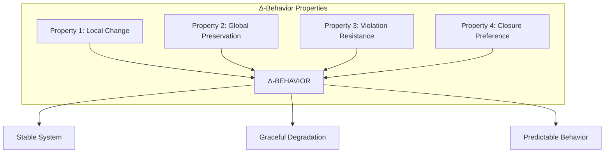
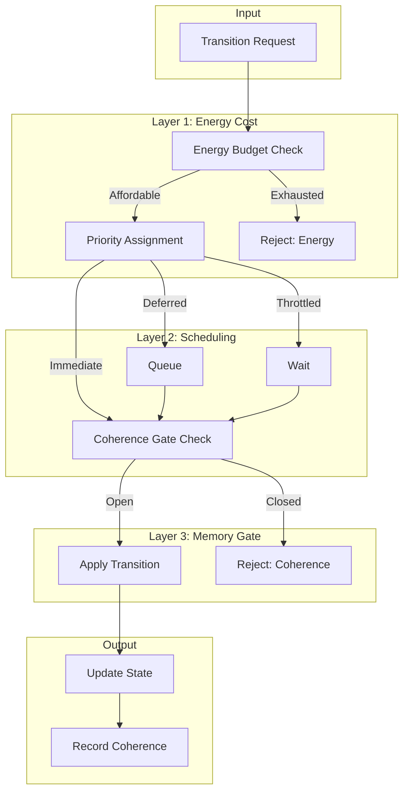
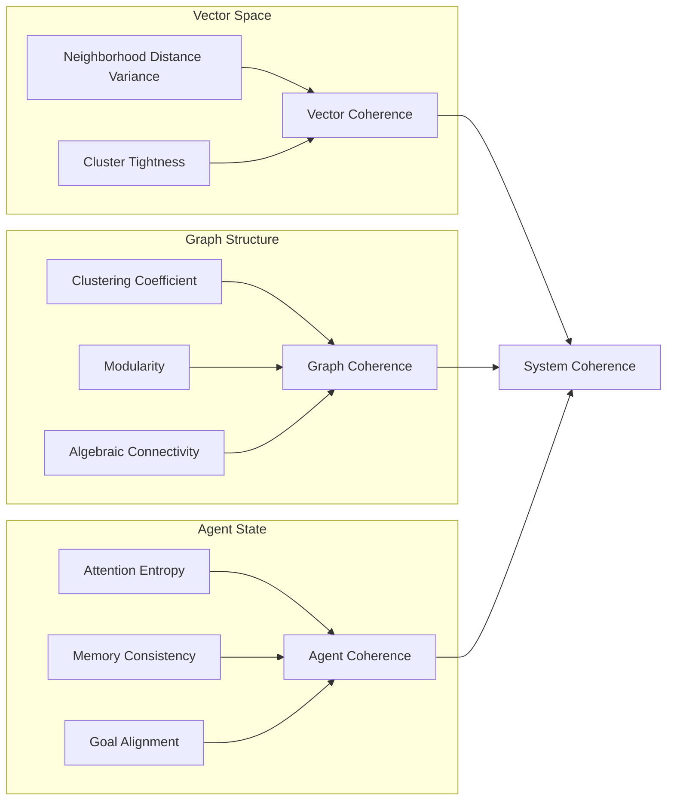
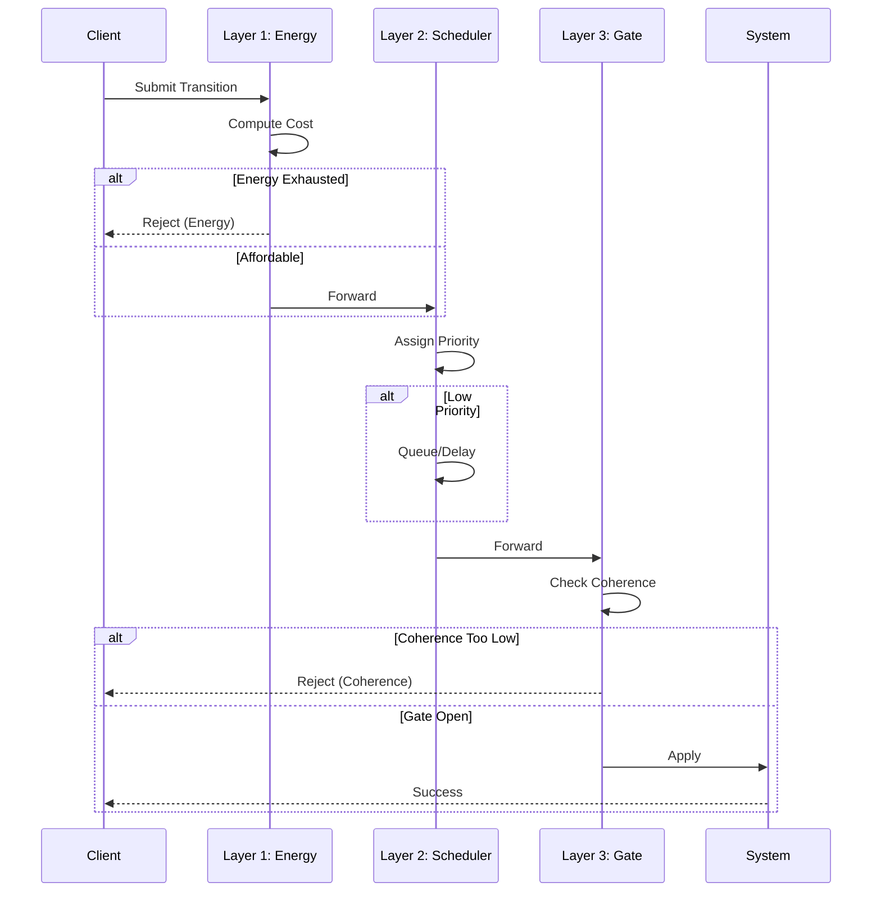
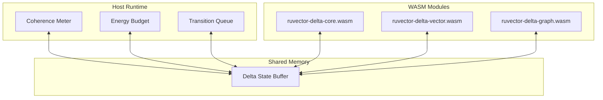
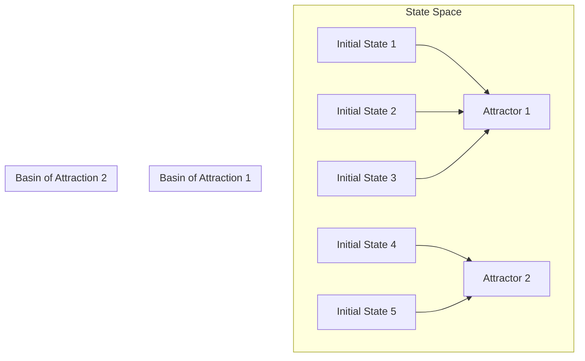
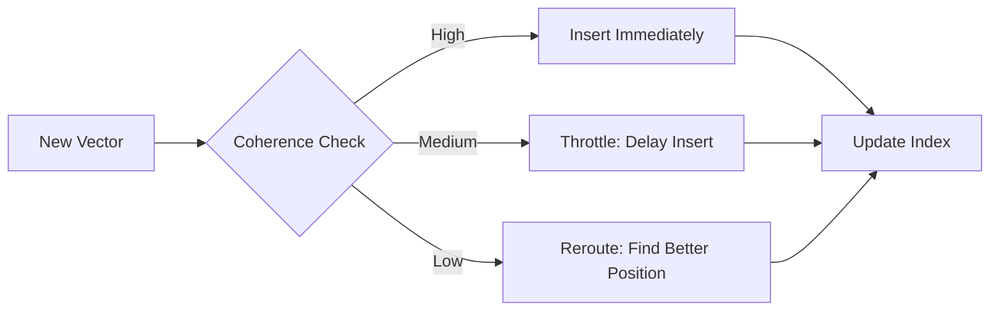

# Delta-Behavior: Constrained State Transitions for Coherent Systems

## A Whitepaper on Stability-First System Design

**Authors:** ruvector Research Team
**Version:** 1.1.0
**Date:** January 2026
**License:** MIT OR Apache-2.0

---

## Executive Summary

**Delta-behavior** is a design principle that enables systems to adapt and change while guaranteeing they cannot collapse or enter pathological states. This whitepaper introduces a formal framework for building systems that:

- **Accept change** - Systems remain flexible and responsive
- **Prevent collapse** - Stability is guaranteed, not hoped for
- **Degrade gracefully** - Under stress, systems slow down rather than fail
- **Self-stabilize** - Systems naturally return to healthy states

**Key Innovation:** Rather than treating stability as a constraint on flexibility, Delta-behavior makes instability *expensive*. Unstable transitions consume more resources, are deprioritized, and eventually blocked - creating systems that are stable by construction.

**Applications:** This framework has been applied to 10 domains including AI reasoning, swarm intelligence, financial systems, and pre-AGI containment. Each demonstrates that coherence-preserving constraints enable rather than limit capability.

**For Practitioners:** Delta-behavior can be implemented in any language using three enforcement layers (energy cost, scheduling, gating) with coherence metrics appropriate to your domain. The reference implementation provides Rust and WASM modules.

---

## Abstract

We present **Δ-behavior** (Delta-like behavior), a design principle for systems that permit change while preventing collapse. Unlike traditional approaches that optimize for performance or throughput, Δ-behavior systems optimize for **coherence** — the preservation of global structure under local perturbation.

This whitepaper formalizes Δ-behavior, provides implementation guidance for the ruvector WASM ecosystem, and demonstrates its application to vector databases, graph systems, and AI agents.

---

## 1. Introduction: What Is Δ-Behavior?

### 1.1 The Problem

Modern systems face a fundamental tension:

- **Flexibility**: Systems must adapt to changing inputs
- **Stability**: Systems must not collapse under stress

Traditional approaches treat this as a tradeoff — more flexibility means less stability. Δ-behavior reframes this entirely.

### 1.2 The Insight

> **Change is permitted. Collapse is not.**

A system exhibits Δ-behavior when it:
1. Moves only along **allowed transitions**
2. Preserves **global coherence** under local changes
3. **Resists** destabilizing operations
4. Naturally settles into **stable attractors**

### 1.3 Why "Δ"?

The Greek letter Δ (delta) traditionally means "change." We use it here to mean **"change under constraint"** — transitions that preserve system integrity.

---

## 2. The Four Properties of Δ-Behavior



### Property 1: Local Change

State updates happen in **bounded steps**, not jumps.

```
∀ transition t: |state_new - state_old| ≤ ε_local
```

**Example:** A vector in HNSW cannot teleport to a distant region. It must traverse through neighborhoods.

### Property 2: Global Preservation

Local changes do **not** break overall organization.

```
∀ transition t: coherence(System') ≥ coherence(System) - ε_global
```

**Example:** Adding an edge to a graph doesn't shatter its community structure.

### Property 3: Violation Resistance

When a transition would increase instability, it is **damped, rerouted, or halted**.

```
if instability(t) > threshold:
    response = DAMP | REROUTE | HALT
```

**Example:** An AI agent's attention collapses rather than producing nonsense when overwhelmed.

### Property 4: Closure Preference

The system naturally settles into **repeatable, stable patterns** (attractors).

```
lim_{n→∞} trajectory(s₀, n) → Attractor
```

**Example:** A converged neural network stays near its trained state without external forcing.

---

## 3. Why Δ-Behavior Matters

### 3.1 The "72% Phenomenon"

People often describe Δ-behavior as "feeling like 72%" — a consistent ratio or threshold. This is not a magic number. It's the **observable effect** of:

> Systems that make instability expensive

When constraints bias toward stability, measurements cluster around coherent states. The ratio is an emergent property, not a fundamental constant.

### 3.2 Mainstream Equivalents

Δ-behavior is not new — it's just unnamed:

| Domain | Concept | Formal Name |
|--------|---------|-------------|
| **Physics** | Phase locking, energy minimization | Coherence time |
| **Control Theory** | Bounded trajectories | Lyapunov stability |
| **Biology** | Regulation, balance | Homeostasis |
| **Computation** | Guardrails, limits | Bounded execution |

We unify these under **Δ-behavior** to enable cross-domain design patterns.

---

## 4. Architecture

### 4.1 System Overview



### 4.2 Coherence Measurement



### 4.3 Three-Layer Enforcement



---

## 5. Implementation Guide

### 5.1 Core Data Structures

```rust
/// Coherence: A value between 0 and 1
pub struct Coherence(f64);

/// Bounds that constrain coherence
pub struct CoherenceBounds {
    min_coherence: f64,      // 0.3 - absolute minimum
    throttle_threshold: f64,  // 0.5 - start throttling
    target_coherence: f64,    // 0.8 - optimal state
    max_delta_drop: f64,      // 0.1 - max per-transition drop
}

/// The enforcement decision
pub enum TransitionDecision {
    Allow,
    Throttle { delay_ms: u64 },
    Reject { reason: RejectionReason },
}
```

### 5.2 Energy Cost Model

```rust
fn compute_cost(transition: &Transition, base: f64, exponent: f64) -> f64 {
    let instability = transition.predicted_coherence_drop()
        + transition.non_local_effects()
        + transition.attractor_distance();

    base * (1.0 + instability).powf(exponent)
}
```

**Key Insight:** Unstable transitions become exponentially expensive, naturally deprioritizing them.

### 5.3 WASM Integration



---

## 6. Attractor Dynamics

### 6.1 What Are Attractors?



An **attractor** is a state (or set of states) toward which the system naturally evolves. The **basin of attraction** is all states that lead to that attractor.

### 6.2 Guidance Forces

Systems with Δ-behavior are gently **guided** toward attractors:

```rust
fn guidance_force(position: &State, attractor: &Attractor) -> Force {
    let direction = attractor.center.direction_from(position);
    let distance = attractor.distance_to(position);

    // Inverse-square for smooth approach
    let magnitude = attractor.stability / (1.0 + distance.powi(2));

    Force { direction, magnitude }
}
```

---

## 7. Applications in ruvector

### 7.1 Vector Index (HNSW)

**Problem:** Incremental updates can degrade search quality.

**Δ-Solution:**
- Measure neighborhood coherence after each insert
- Throttle inserts that would scatter neighborhoods
- Guide new vectors toward stable regions



### 7.2 Graph Operations

**Problem:** Edge additions can fragment graph structure.

**Δ-Solution:**
- Measure modularity before/after edge operations
- Block edges that would create bridges between communities
- Prefer edges that strengthen existing clusters

### 7.3 Agent Coordination

**Problem:** Multi-agent systems can diverge under disagreement.

**Δ-Solution:**
- Monitor attention entropy across agents
- Gate memory writes when coherence drops
- Collapse attention rather than produce noise

---

## 8. Formal Verification

### 8.1 Safety Properties

```
□ (coherence(S) ≥ min_coherence)
```
"Always, system coherence is at or above minimum."

### 8.2 Liveness Properties

```
□ (transition_requested → ◇ (transition_executed ∨ transition_rejected))
```
"Always, a requested transition is eventually executed or rejected."

### 8.3 Stability Properties

```
□ (¬external_input → ◇ □ in_attractor)
```
"Without external input, the system eventually stays in an attractor."

---

## 9. Acceptance Test

To verify Δ-behavior in your system:

```rust
#[test]
fn verify_delta_behavior() {
    let mut system = create_system();

    // Push toward instability
    for _ in 0..1000 {
        let chaotic_input = generate_chaos();
        system.process(chaotic_input);
    }

    // MUST exhibit ONE of:
    assert!(
        system.slowed ||      // Throttled
        system.constrained || // Damped
        system.exited_gracefully  // Halted
    );

    // MUST NOT exhibit:
    assert!(!system.diverged);
    assert!(!system.corrupted);
}
```

If the test passes: **Δ-behavior is demonstrated, not just described.**

---

## 10. Key Decisions

### 10.1 Enforcement Mechanism

**Question:** Is resistance to unstable transitions enforced by energy cost, scheduling, or memory gating?

**Answer:** All three, in layers:

1. **Energy cost** (soft) — expensive transitions deprioritized
2. **Scheduling** (medium) — unstable transitions delayed
3. **Memory gate** (hard) — incoherent writes blocked

### 10.2 Learning vs Structure

**Question:** Is Δ-behavior learned over time or structurally imposed?

**Answer:** Structural core + learned refinement:

- **Core constraints** are immutable (non-negotiable stability)
- **Thresholds** are learned (adaptive to workload)
- **Attractors** are discovered (emergent from operation)

---

## 11. What Δ-Behavior Is NOT

| Misconception | Reality |
|---------------|---------|
| Magic ratio | It's an emergent pattern, not a constant |
| Mysticism | It's engineering constraints |
| Universal law | It's a design choice |
| Free lunch | It trades peak performance for stability |

---

## 12. Conclusion

Δ-behavior is a **design principle** for building systems that:

> Allow change only if the system remains whole.

By enforcing coherence through three layers (energy, scheduling, gating), systems can:
- Operate reliably under stress
- Degrade gracefully under attack
- Self-stabilize without external intervention

The ruvector ecosystem provides WASM-accelerated primitives for implementing Δ-behavior in:
- Vector databases (HNSW index stability)
- Graph systems (structural coherence)
- AI agents (attention and memory gating)

---

## References

1. Lyapunov, A. M. (1892). *The General Problem of the Stability of Motion*
2. Ashby, W. R. (1956). *An Introduction to Cybernetics*
3. Strogatz, S. H. (2015). *Nonlinear Dynamics and Chaos*
4. Newman, M. E. J. (2003). "The Structure and Function of Complex Networks"
5. Lamport, L. (1978). "Time, Clocks, and the Ordering of Events in a Distributed System"

---

## Appendix A: Glossary

| Term | Definition |
|------|------------|
| **Coherence** | Scalar measure of system organization (0-1) |
| **Attractor** | Stable state the system naturally evolves toward |
| **Basin** | Set of states that lead to a given attractor |
| **Transition** | Operation that changes system state |
| **Gate** | Mechanism that blocks incoherent writes |
| **Closure** | Tendency to settle into stable patterns |

---

## Appendix B: Implementation Checklist

- [ ] Define coherence metric for your domain
- [ ] Set coherence bounds (min, throttle, target, max_drop)
- [ ] Implement energy cost function
- [ ] Add scheduling layer with priority queues
- [ ] Add memory gate with coherence check
- [ ] Discover/define initial attractors
- [ ] Write acceptance test
- [ ] Run chaos injection
- [ ] Verify: system throttled/damped/halted (not diverged)

---

## Appendix C: Technical Deep-Dive

### C.1 Coherence as an Invariant

The central insight of Delta-behavior is treating coherence as a **system invariant** rather than an optimization target. Traditional approaches optimize metrics while hoping stability follows. Delta-behavior inverts this: stability is enforced, and performance emerges within those bounds.

#### Formal Definition

A system `S` exhibits Delta-behavior if it satisfies the **coherence invariant**:

```
INVARIANT: forall states s in reachable(S): coherence(s) >= C_min
```

This invariant is maintained by constraining the transition function:

```
transition: S x Input -> S
  requires: coherence(S') >= coherence(S) - epsilon_max
  requires: coherence(S') >= C_min
  ensures: coherence(S) >= C_min  // preserved
```

### C.2 The Three-Layer Enforcement Stack

Each layer provides defense-in-depth with different characteristics:

| Layer | Type | Latency | Failure Mode | Recovery |
|-------|------|---------|--------------|----------|
| Energy Cost | Soft | O(1) | Budget exhaustion | Regenerates over time |
| Scheduling | Medium | O(log n) | Queue buildup | Priority rebalancing |
| Memory Gate | Hard | O(1) | Write blocking | Coherence recovery |

#### Layer 1: Energy Cost (Soft Constraint)

The energy layer implements **economic pressure** against instability:

```rust
fn energy_cost(transition: &T, config: &EnergyConfig) -> f64 {
    let coherence_impact = predict_coherence_drop(transition);
    let locality_factor = measure_non_local_effects(transition);
    let attractor_distance = distance_to_nearest_attractor(transition);

    let instability = 0.4 * coherence_impact
                    + 0.3 * locality_factor
                    + 0.3 * attractor_distance;

    config.base_cost * (1.0 + instability).powf(config.exponent)
}
```

**Properties:**
- Cost is always positive (transitions are never free)
- Cost grows exponentially with instability
- Budget regenerates, allowing bursts followed by cooldown

#### Layer 2: Scheduling (Medium Constraint)

The scheduling layer implements **temporal backpressure**:

```rust
enum Priority {
    Immediate,   // C > 0.9: Execute now
    High,        // C > 0.7: Execute soon
    Normal,      // C > 0.5: Execute when convenient
    Low,         // C > 0.3: Execute when stable
    Deferred,    // C <= 0.3: Hold until coherence recovers
}
```

**Properties:**
- No transition is permanently blocked (eventual execution)
- Priority degrades smoothly with coherence
- Rate limits prevent queue flooding

#### Layer 3: Memory Gate (Hard Constraint)

The gating layer implements **absolute protection**:

```rust
fn gate_decision(current: Coherence, predicted: Coherence) -> Decision {
    if predicted < C_MIN {
        Decision::Blocked("Would violate coherence floor")
    } else if current < C_MIN * (1.0 + RECOVERY_MARGIN) && in_recovery {
        Decision::Blocked("In recovery mode")
    } else {
        Decision::Open
    }
}
```

**Properties:**
- Blocking is absolute (no bypass)
- Recovery requires coherence overshoot
- Gate state is binary (no partial blocking)

### C.3 Attractor-Based Stability

Attractors provide **passive stability** - the system drifts toward stable states without active control:

#### Attractor Discovery Algorithm

```rust
fn discover_attractors(system: &S, samples: usize) -> Vec<Attractor> {
    let mut trajectories = Vec::new();

    for _ in 0..samples {
        let initial = system.random_state();
        let trajectory = simulate_until_convergent(system, initial);
        trajectories.push(trajectory);
    }

    cluster_endpoints(trajectories)
        .into_iter()
        .map(|cluster| Attractor {
            center: cluster.centroid(),
            stability: cluster.convergence_rate(),
            basin_radius: cluster.max_distance(),
        })
        .collect()
}
```

#### Guidance Force Computation

The guidance force biases transitions toward attractors:

```rust
fn guidance_force(position: &State, attractors: &[Attractor]) -> Force {
    let nearest = attractors.iter()
        .min_by_key(|a| distance(position, &a.center))
        .unwrap();

    let direction = normalize(nearest.center - position);
    let magnitude = nearest.stability / (1.0 + distance(position, &nearest.center).powi(2));

    Force { direction, magnitude }
}
```

---

## Appendix D: Mathematical Foundations Summary

### D.1 Lyapunov Stability Connection

Delta-behavior is equivalent to ensuring a **Lyapunov function** exists for the system:

```
V: State -> R+   (positive definite)
dV/dt <= 0       (non-increasing along trajectories)
```

The coherence function serves as this Lyapunov function:

```
V(s) = 1 - coherence(s)   // V = 0 at maximum coherence
```

The transition constraint ensures:
```
V(s') <= V(s) + epsilon   // bounded increase
```

### D.2 Contraction Mapping Guarantee

When the system is within an attractor basin, transitions form a **contraction mapping**:

```
d(f(x), f(y)) <= k * d(x, y)   where k < 1
```

This guarantees **exponential convergence** to the attractor:

```
d(x_n, attractor) <= k^n * d(x_0, attractor)
```

### D.3 Information-Theoretic Interpretation

Coherence can be understood as **negentropy** (negative entropy):

```
coherence(s) = 1 - H(s) / H_max
```

Where `H(s)` is the entropy of the state distribution. Delta-behavior maintains low entropy (high organization) by constraining transitions that would increase entropy.

### D.4 Control-Theoretic Interpretation

The three-layer enforcement implements a **switched control system**:

```
u(t) = K_1(x) * u_energy + K_2(x) * u_schedule + K_3(x) * u_gate
```

Where:
- `K_1(x)` scales with instability (soft feedback)
- `K_2(x)` scales with queue depth (medium feedback)
- `K_3(x)` is binary at coherence boundary (hard feedback)

This hybrid control structure provides both smoothness (for normal operation) and guarantees (for safety).

---

## Appendix E: Safety Guarantees Explained

### E.1 Guaranteed Properties

Delta-behavior provides formal guarantees that can be verified:

#### Coherence Floor (Safety)
```
THEOREM: Given C_min > 0 and proper enforcement,
         forall reachable states s: coherence(s) >= C_min
```

**Proof sketch:** The gate layer blocks any transition that would result in coherence below C_min. Since only transitions passing the gate are applied, the invariant is maintained.

#### Eventual Quiescence (Liveness)
```
THEOREM: Without external input, the system eventually
         enters and remains in an attractor basin.
```

**Proof sketch:** The energy cost for non-attractor-directed transitions is higher. Budget depletion forces quiescence. Attractor guidance accumulates. Eventually only attractor-directed transitions are affordable.

#### Bounded Response Time (Performance)
```
THEOREM: Any transition is either executed or rejected
         within time T_max.
```

**Proof sketch:** The scheduling layer has bounded queue depth. The gate layer makes immediate decisions. No transition waits indefinitely.

### E.2 Attack Resistance

Delta-behavior provides inherent resistance to several attack classes:

| Attack Type | Defense Mechanism |
|-------------|-------------------|
| Resource exhaustion | Energy budget limits throughput |
| State corruption | Gate blocks incoherent writes |
| Oscillation attacks | Attractor guidance dampens |
| Cascade failures | Coherence preservation blocks propagation |

### E.3 Failure Mode Analysis

When Delta-behavior systems fail, they fail safely:

| Failure | Degraded Mode | Recovery |
|---------|---------------|----------|
| High load | Throttling increases | Load reduction restores throughput |
| Low coherence | Writes blocked | Rest restores coherence |
| Energy exhausted | All transitions queued | Budget regenerates |
| Attractor collapse | System freezes | Manual intervention required |

---

## Appendix F: Comparison with Alternative Approaches

### F.1 Traditional Rate Limiting

| Aspect | Rate Limiting | Delta-Behavior |
|--------|---------------|----------------|
| **Metric** | Requests/second | Coherence |
| **Granularity** | Per-client | Per-transition |
| **Adaptivity** | Fixed thresholds | Dynamic based on state |
| **Safety** | Prevents overload | Prevents collapse |
| **Overhead** | O(1) | O(1) per layer |

**When to use rate limiting:** Simple overload protection
**When to use Delta-behavior:** State-dependent safety requirements

### F.2 Circuit Breakers

| Aspect | Circuit Breaker | Delta-Behavior |
|--------|-----------------|----------------|
| **Trigger** | Error rate | Coherence level |
| **Response** | Binary (open/closed) | Graduated (throttle/block) |
| **Recovery** | Timeout-based | Coherence-based |
| **Granularity** | Service-level | Transition-level |

**When to use circuit breakers:** External dependency failures
**When to use Delta-behavior:** Internal state protection

### F.3 Consensus Protocols (Raft, Paxos)

| Aspect | Consensus | Delta-Behavior |
|--------|-----------|----------------|
| **Goal** | Agreement | Stability |
| **Scope** | Multi-node | Single system |
| **Failure model** | Node crashes | State corruption |
| **Overhead** | O(n) messages | O(1) checks |

**When to use consensus:** Distributed agreement
**When to use Delta-behavior:** Local coherence preservation

### F.4 Formal Verification

| Aspect | Formal Verification | Delta-Behavior |
|--------|---------------------|----------------|
| **When applied** | Design time | Runtime |
| **Guarantee type** | Static | Dynamic |
| **Adaptivity** | None | Continuous |
| **Overhead** | Compile time | Runtime |

**When to use formal verification:** Proving design correctness
**When to use Delta-behavior:** Enforcing runtime invariants

### F.5 Machine Learning Guardrails

| Aspect | ML Guardrails | Delta-Behavior |
|--------|---------------|----------------|
| **Metric** | Output quality | System coherence |
| **Enforcement** | Output filtering | Transition blocking |
| **Adaptivity** | Model-based | Rule-based |
| **Interpretability** | Low | High |

**When to use ML guardrails:** Content filtering
**When to use Delta-behavior:** Behavior guarantees

---

## Appendix G: Ten Exotic Applications

This whitepaper introduces 10 applications that demonstrate Delta-behavior's versatility:

### G.1 Self-Limiting Reasoning
AI systems that automatically reduce activity when uncertain, preventing confident nonsense.

### G.2 Computational Event Horizons
Bounded recursion without hard limits - computation naturally slows as it approaches boundaries.

### G.3 Artificial Homeostasis
Synthetic life with coherence-based survival - organisms that maintain internal stability.

### G.4 Self-Stabilizing World Models
Models that refuse to hallucinate by detecting and blocking incoherent beliefs.

### G.5 Coherence-Bounded Creativity
Generative systems that explore novelty while maintaining structural coherence.

### G.6 Anti-Cascade Financial Systems
Markets with built-in circuit breakers based on coherence rather than price.

### G.7 Graceful Aging
Systems that simplify over time, reducing complexity while preserving function.

### G.8 Swarm Intelligence
Collective behavior that cannot exhibit pathological emergence.

### G.9 Graceful Shutdown
Systems that actively seek safe termination when stability degrades.

### G.10 Pre-AGI Containment
Intelligence growth bounded by coherence - capability increases only if safety is preserved.

Each application is fully implemented in the reference codebase with tests demonstrating the core guarantees.
