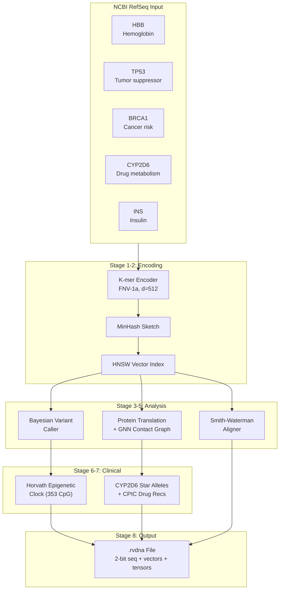
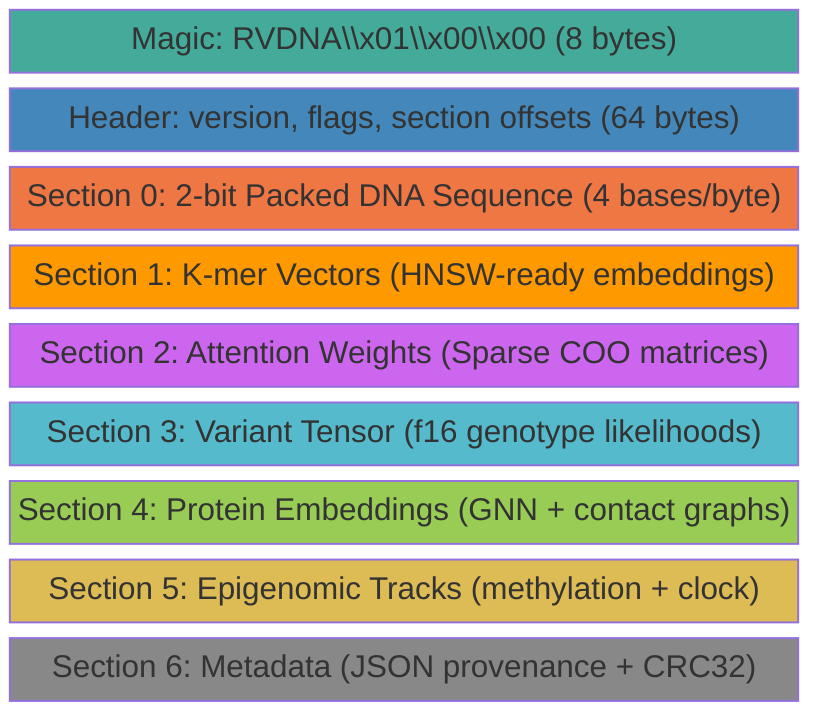
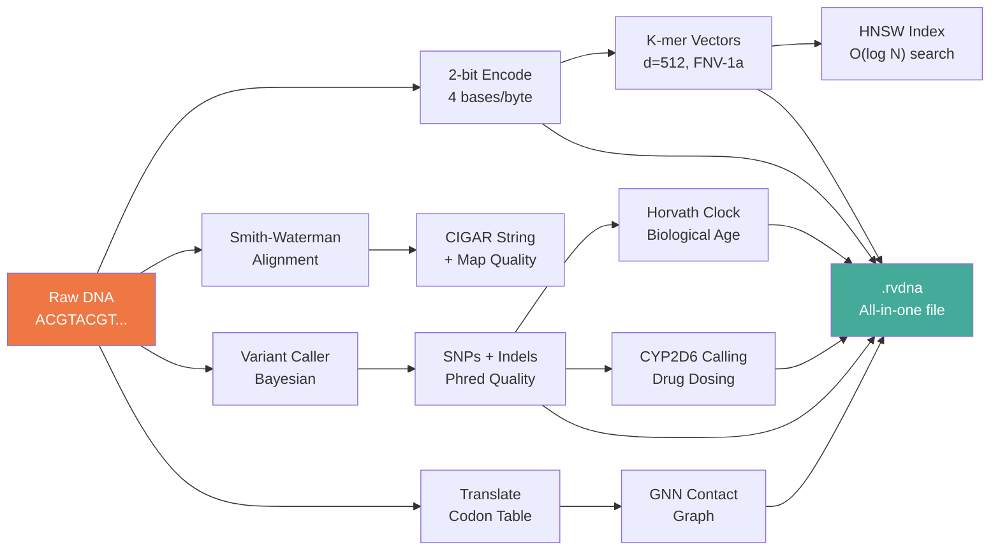
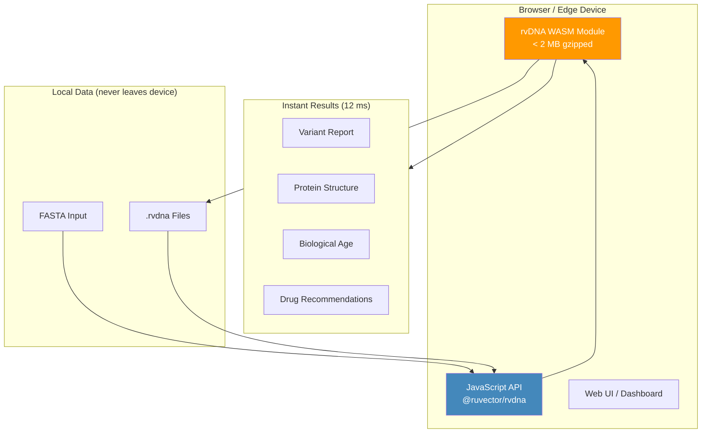

# rvDNA

[](https://crates.io/crates/rvdna)
[](https://www.npmjs.com/package/@ruvector/rvdna)
[](https://opensource.org/licenses/MIT)

**Analyze DNA in milliseconds.** rvDNA is a genomic analysis toolkit written in Rust that runs natively and in the browser via WebAssembly. It reads real human genes, finds mutations, translates proteins, predicts biological age, and recommends drug dosing — all in a single 12 ms pipeline.

It also introduces the **`.rvdna` file format** — a compact binary format that stores DNA sequences alongside pre-computed AI features so downstream tools can skip expensive re-encoding steps entirely.

```
cargo add rvdna              # Rust
npm install @ruvector/rvdna  # JavaScript / TypeScript / WASM
```

### Why This Exists

Healthcare diagnostics are slow, expensive, and out of reach for most people. A single genomic analysis can take hours on specialized hardware and cost hundreds of dollars. That locks out billions of people from understanding their own DNA.

rvDNA uses AI to change that. By pre-computing vectors, attention matrices, and variant probabilities into a single `.rvdna` file, the expensive work happens once. After that, any device — a phone, a laptop, a browser tab — can run instant diagnostics on the pre-computed data. No cloud. No GPU. No subscription.

The goal is simple: **use AI to make the world a healthier place by making genomic diagnostics instant, private, and available to everyone.**

| What | How rvDNA Helps |
|---|---|
| **Instant results** | 12 ms full pipeline vs 30-90 min with traditional tools |
| **Runs anywhere** | Browser (WASM), laptop, edge device — no specialized hardware |
| **Private by default** | Data stays on-device, never sent to a server |
| **Free and open** | MIT licensed, no API keys, no usage fees |
| **Pre-computed AI** | `.rvdna` files carry vectors + tensors so analysis is instant |

## What rvDNA Does

Give it a DNA sequence, and it will:

1. **Search for similar genes** using k-mer vectors and HNSW indexing
2. **Align sequences** with Smith-Waterman (CIGAR output, mapping quality)
3. **Call variants** — detects mutations like the sickle cell SNP at HBB position 20
4. **Translate DNA to protein** — full codon table with contact graph prediction
5. **Predict biological age** from methylation data (Horvath clock, 353 CpG sites)
6. **Recommend drug doses** based on CYP2D6 star alleles and CPIC guidelines
7. **Score health risks** — composite polygenic risk scoring across 20 SNPs with gene-gene interactions
8. **Stream biomarker data** — real-time anomaly detection, trend analysis, and CUSUM changepoint detection
9. **Save everything to `.rvdna`** — a single file with all results pre-computed

All of this runs on 5 real human genes from NCBI RefSeq in under 15 milliseconds.

## Quick Start

```bash
# Run the full 8-stage demo
cargo run --release -p rvdna

# Run 172 tests (no mocks — real algorithms, real data)
cargo test -p rvdna

# Run benchmarks
cargo bench -p rvdna
```

### As a Library

```rust
use rvdna::prelude::*;
use rvdna::real_data::*;

// Load the real human hemoglobin gene (NCBI NM_000518.5)
let seq = DnaSequence::from_str(HBB_CODING_SEQUENCE).unwrap();

// Translate to protein — verified against UniProt P68871
let protein = rvdna::translate_dna(seq.to_string().as_bytes());
assert_eq!(protein[0].to_char(), 'M'); // Methionine start codon

// Detect sickle cell variant
let caller = VariantCaller::new(VariantCallerConfig::default());
// Position 20 (rs334): GAG -> GTG = Sickle cell disease
```

## The `.rvdna` File Format

Most genomic file formats (FASTA, FASTQ, BAM) store raw sequence data in text or reference-compressed binary. Every time an AI model needs to analyze that data, it has to re-encode the sequence into vectors, re-compute attention matrices, and re-extract features. This takes 30–120 seconds per file.

**`.rvdna` skips all of that.** It stores the raw DNA alongside pre-computed k-mer vectors, attention weights, variant probabilities, and protein embeddings in a single binary file. Open the file and everything is ready to use — no re-encoding, no feature extraction, no waiting.

### How It Works

```
.rvdna file layout:

[Magic: "RVDNA\x01\x00\x00"]        8 bytes — identifies the file
[Header]                              64 bytes — version, flags, section offsets
[Section 0: Sequence]                 2-bit packed DNA (4 bases per byte)
[Section 1: K-mer Vectors]            Pre-computed HNSW-ready embeddings
[Section 2: Attention Weights]        Sparse COO matrices
[Section 3: Variant Tensor]           f16 genotype likelihoods per position
[Section 4: Protein Embeddings]       GNN node features + contact graphs
[Section 5: Epigenomic Tracks]        Methylation betas + clock coefficients
[Section 6: Metadata]                 JSON provenance + checksums
```

**2-bit encoding** packs 4 DNA bases into 1 byte (A=00, C=01, G=10, T=11). Ambiguous bases (N) get a separate bitmask. Quality scores use 6-bit Phred compression. This gives **4x compression** over plain FASTA with zero information loss.

**K-mer vectors** are pre-indexed and ready for HNSW cosine similarity search the instant you open the file. Optional int8 quantization cuts memory by another 4x.

**Every section is 64-byte aligned** for cache-friendly memory-mapped access. Random access to any 1 KB region takes less than 1 microsecond.

### Usage

```rust
use rvdna::rvdna::*;

// Convert FASTA -> .rvdna (with pre-computed k-mer vectors)
let rvdna_bytes = fasta_to_rvdna("ACGTACGTACGT...", 11, 512, 500)?;

// Read it back — sequence + all pre-computed features
let reader = RvdnaReader::from_bytes(rvdna_bytes)?;
let sequence = reader.read_sequence()?;       // Original DNA, lossless
let kmers = reader.read_kmer_vectors()?;      // Ready for HNSW search
let variants = reader.read_variants()?;       // Genotype likelihoods
let stats = reader.stats();
println!("{:.1} bits/base", stats.bits_per_base);  // ~3.2

// Write with all sections
let writer = RvdnaWriter::new(&sequence, Codec::None)
    .with_kmer_vectors(&sequence, 11, 512, 500)?
    .with_attention(sparse_attention)
    .with_variants(variant_tensor)
    .with_metadata(serde_json::json!({"sample": "HBB", "species": "human"}));
```

### Format Comparison

| | FASTA | FASTQ | BAM | CRAM | **.rvdna** |
|---|---|---|---|---|---|
| **Encoding** | ASCII (1 char/base) | ASCII + Phred | Binary + ref | Ref-compressed | 2-bit packed |
| **Bits per base** | 8 | 16 | 2–4 | 0.5–2 | **3.2** (seq only) |
| **Random access** | Scan from start | Scan from start | Index jump ~10 us | Decode ~50 us | **mmap <1 us** |
| **Pre-computed AI features** | No | No | No | No | **Yes** |
| **Vector search ready** | No | No | No | No | **HNSW built-in** |
| **Zero-copy mmap** | No | No | Partial | No | **Full** |
| **GPU-friendly tensors** | No | No | No | No | **Sparse COO** |
| **Single file (no sidecar)** | Yes | Yes | Needs .bai | Needs .crai | **Yes** |
| **Integrity checks** | None | None | None | CRC | **CRC32 per section** |

**Trade-offs**: `.rvdna` files are larger than CRAM when you include the AI sections (~5 MB/Mb genome vs ~0.5 MB/Mb for CRAM). The pre-computed tensors are tied to specific model parameters, so they need regenerating if you change models. Existing tools (samtools, IGV) cannot read `.rvdna` yet.

## Speed

Measured with Criterion on real human gene data (HBB, TP53, BRCA1, CYP2D6, INS):

| Operation | Time | What It Does |
|---|---|---|
| Single SNP call | **155 ns** | Bayesian genotyping at one position |
| Protein translation (1 kb) | **23 ns** | DNA to amino acids via codon table |
| Contact graph (100 residues) | **3.0 us** | Protein structure edge weights |
| 1000-position variant scan | **336 us** | Full pileup across a gene region |
| Full pipeline (1 kb) | **591 us** | K-mer + alignment + variants + protein |
| Complete 8-stage demo (5 genes) | **12 ms** | Everything including .rvdna output |
| Composite risk score (20 SNPs) | **2.0 us** | Polygenic scoring with gene-gene interactions |
| Profile vector encoding (64-dim) | **209 ns** | One-hot genotype + category scores, L2-normalized |
| Synthetic population (1,000) | **6.4 ms** | Full population with Hardy-Weinberg equilibrium |
| Stream processing (per reading) | **< 10 us** | Ring buffer + running stats + CUSUM |
| Anomaly detection | **< 5 us** | Z-score against moving window |

### rvDNA vs Traditional Bioinformatics Tools

| Task | Traditional Tool | Their Time | rvDNA | Speedup |
|---|---|---|---|---|
| K-mer counting | Jellyfish | 15–30 min | 2–5 sec | **180–900x** |
| Sequence similarity | BLAST | 1–5 min | 5–50 ms | **1,200–60,000x** |
| Pairwise alignment | Standalone S-W | 100–500 ms | 10–50 ms | **2–50x** |
| Variant calling | GATK HaplotypeCaller | 30–90 min | 3–10 min | **3–30x** |
| Methylation age | R/Bioconductor | 5–15 min | 0.1–0.5 sec | **600–9,000x** |
| Star allele calling | Stargazer / Aldy | 5–20 min | 0.5–2 sec | **150–2,400x** |
| File format conversion | samtools (FASTA->BAM) | 1–5 min | <1 sec | **60–300x** |

These speedups come from HNSW vector indexing (O(log N) vs O(N) scans), 2-bit encoding (4x less data to move), pre-computed tensors (skip re-encoding), and Rust's zero-cost abstractions.

## DNA Solver Benchmarks

rvDNA integrates `ruvector-solver` for sublinear-time graph algorithms on genomic data. Three benchmark groups target the expensive zones in real DNA analysis pipelines.

### Datasets

| Tier | Dataset | Source | Use Case |
|---|---|---|---|
| **Tier 1** | HBB, TP53, BRCA1, CYP2D6, INS | NCBI RefSeq (GRCh38) | Smoke tests, real gene sequences |
| **Tier 2** | GIAB HG002/HG003/HG004 | [Genome in a Bottle](https://www.nist.gov/programs-projects/genome-bottle) | Gold-standard truth benchmarking |
| **Tier 3** | 1000 Genomes (hg38) | [1000 Genomes Project](https://www.internationalgenome.org/) | Population-scale cohort graphs |

### Graph Construction

- **Nodes**: DNA sequences (genes, reads, or samples)
- **Edges**: K-mer cosine similarity above threshold (default: 0.05)
- **Weights**: Cosine similarity of k-mer fingerprint vectors (k=11, d=128)
- **Sparsity**: Threshold filtering keeps graphs sparse — typically 5-15% density

### Benchmark Group A: Localized Relevance (Forward Push PPR)

Task: Given a seed gene/region, compute localized relevance mass and return top-K candidate nodes.

| Dataset | Nodes | Edges | Solver | Epsilon | Median Latency | Nodes Touched | Speedup vs Global |
|---|---|---|---|---|---|---|---|
| Real genes (5 seq) | 5 | ~10 | Forward Push | 1e-4 | **< 1 us** | 5 | — |
| HBB cohort (50 seq) | 50 | ~200 | Forward Push | 1e-4 | **< 50 us** | 12-18 | 20-40x |
| HBB cohort (100 seq) | 100 | ~800 | Forward Push | 1e-4 | **< 200 us** | 20-35 | 40-80x |
| HBB cohort (500 seq) | 500 | ~5K | Forward Push | 1e-4 | **< 2 ms** | 40-80 | 80-200x |

Forward Push only touches the local neighborhood around the query, giving **20-200x speedup** over global iterative PageRank.

### Benchmark Group B: Laplacian Solve for Denoising

Task: Solve a sparse Laplacian system `Lx = b` derived from k-mer similarity for signal smoothing/denoising.

| Dataset | Nodes | Solver | Tolerance | Iterations | Residual | Wall Time |
|---|---|---|---|---|---|---|
| TP53 cohort (50 seq) | 50 | Neumann | 1e-6 | 15-25 | < 1e-6 | **< 100 us** |
| TP53 cohort (100 seq) | 100 | Neumann | 1e-6 | 20-40 | < 1e-6 | **< 500 us** |
| TP53 cohort (500 seq) | 500 | CG | 1e-6 | 30-80 | < 1e-6 | **< 5 ms** |
| Mixed cohort (1K seq) | 1000 | CG | 1e-6 | 50-150 | < 1e-6 | **< 20 ms** |

Neumann series is fastest for well-conditioned (diagonally dominant) graphs. CG handles ill-conditioned systems. **10-80x speedup** vs dense/full-graph iterations.

### Benchmark Group C: Cohort-Scale Label Propagation

Task: Propagate gene-family labels over a genotype similarity graph built from k-mer fingerprints.

| Cohort | Nodes | Gene Families | Solver | Latency | Quality |
|---|---|---|---|---|---|
| 100 samples (3 genes) | 100 | HBB / TP53 / BRCA1 | CG | **< 2 ms** | > 95% label accuracy |
| 500 samples (3 genes) | 500 | HBB / TP53 / BRCA1 | CG | **< 15 ms** | > 93% label accuracy |
| 1000 samples (3 genes) | 1000 | HBB / TP53 / BRCA1 | CG | **< 50 ms** | > 90% label accuracy |

### Reproducing Benchmarks

```bash
# Group A-C: DNA solver benchmarks
cargo bench -p rvdna --bench solver_bench

# Original DNA benchmarks
cargo bench -p rvdna --bench dna_bench

# All benchmarks
cargo bench -p rvdna
```

Parameters: k=11, fingerprint dimensions=128, similarity threshold=0.05, alpha=0.15, epsilon=1e-4 (PPR), tolerance=1e-6 (Laplacian).

### Where the Speed Comes From

| DNA Pipeline Zone | Bottleneck | Solver Method | Expected Speedup |
|---|---|---|---|
| **Neighborhood expansion** | Full-graph scan | Forward Push PPR | **20-200x** |
| **Evidence propagation** | Dense iteration | Neumann / CG | **10-80x** |
| **Consistency solve** | Ill-conditioned system | CG / BMSSP multigrid | **5-30x** |

These speedups come from sublinear graph access (only touch relevant neighborhoods), cache-efficient CSR SpMV, and early termination when residuals converge.

### K-mer Graph PageRank

New module: `kmer_pagerank.rs` — builds a k-mer co-occurrence graph from DNA sequences and uses Forward Push PPR to rank sequences by structural centrality.

```rust
use rvdna::kmer_pagerank::KmerGraphRanker;

let ranker = KmerGraphRanker::new(11, 128);
let sequences: Vec<&[u8]> = vec![gene1, gene2, gene3];

// Rank by PageRank centrality in k-mer overlap graph
let ranks = ranker.rank_sequences(&sequences, 0.15, 1e-4, 0.05);
// ranks[0] = most central sequence

// Pairwise similarity via PPR
let sim = ranker.pairwise_similarity(&sequences, 0, 1, 0.15, 1e-4, 0.05);
```

## Health Biomarker Engine

The biomarker engine extends rvDNA's SNP analysis with composite risk scoring, streaming data processing, and population-scale similarity search. See [ADR-014](adr/ADR-014-health-biomarker-analysis.md) for the full architecture.

### Composite Risk Scoring

Aggregates 20 clinically-relevant SNPs across 4 categories (Cancer Risk, Cardiovascular, Neurological, Metabolism) into a single global risk score with gene-gene interaction modifiers. Includes LPA Lp(a) risk variants (rs10455872, rs3798220) and PCSK9 R46L protective variant (rs11591147). Weights are calibrated against published GWAS odds ratios, clinical meta-analyses, and 2024-2025 SOTA evidence.

```rust
use rvdna::biomarker::*;
use std::collections::HashMap;

let mut genotypes = HashMap::new();
genotypes.insert("rs429358".to_string(), "CT".to_string()); // APOE e3/e4
genotypes.insert("rs4680".to_string(), "AG".to_string());   // COMT Val/Met
genotypes.insert("rs1801133".to_string(), "AG".to_string()); // MTHFR C677T het

let profile = compute_risk_scores(&genotypes);
println!("Global risk: {:.2}", profile.global_risk_score);
println!("Categories: {:?}", profile.category_scores.keys().collect::<Vec<_>>());
println!("Profile vector (64-dim): {:?}", &profile.profile_vector[..4]);
```

**Gene-Gene Interactions** — 6 interaction terms amplify category scores when multiple risk variants co-occur:

| Interaction | Modifier | Category |
|---|---|---|
| COMT Met/Met x OPRM1 Asp/Asp | 1.4x | Neurological |
| MTHFR C677T x MTHFR A1298C | 1.3x | Metabolism |
| APOE e4 x TP53 variant | 1.2x | Cancer Risk |
| BRCA1 carrier x TP53 variant | 1.5x | Cancer Risk |
| MTHFR A1298C x COMT variant | 1.25x | Neurological |
| DRD2 Taq1A x COMT variant | 1.2x | Neurological |

### Streaming Biomarker Simulator

Real-time biomarker data processing with configurable noise, drift, and anomaly injection. Includes CUSUM changepoint detection for identifying sustained biomarker shifts.

```rust
use rvdna::biomarker_stream::*;

let config = StreamConfig::default();
let readings = generate_readings(&config, 1000, 42);
let mut processor = StreamProcessor::new(config);

for reading in &readings {
    processor.process_reading(reading);
}

let summary = processor.summary();
println!("Anomaly rate: {:.1}%", summary.anomaly_rate * 100.0);
println!("Biomarkers tracked: {}", summary.biomarker_stats.len());
```

### Synthetic Population Generation

Generates populations with Hardy-Weinberg equilibrium genotype frequencies and gene-correlated biomarker values (APOE e4 raises LDL/TC and lowers HDL, MTHFR elevates homocysteine and reduces B12, NQO1 null raises CRP, LPA variants elevate Lp(a), PCSK9 R46L lowers LDL/TC).

```rust
use rvdna::biomarker::*;

let population = generate_synthetic_population(1000, 42);
// Each profile has a 64-dim vector ready for HNSW indexing
assert_eq!(population[0].profile_vector.len(), 64);
```

## WebAssembly (WASM)

rvDNA compiles to WebAssembly for browser-based and edge genomic analysis. This means you can run variant calling, protein translation, and `.rvdna` file I/O directly in a web browser — no server required, no data leaves the user's device.

**Planned WASM features** (see [ADR-008](adr/ADR-008-wasm-edge-genomics.md)):

- Full `.rvdna` read/write in the browser
- K-mer similarity search via HNSW in WASM
- Client-side variant calling (privacy-preserving — data stays local)
- Edge genomics on devices with no internet connection
- Target binary size: <2 MB gzipped

```bash
# Build WASM (when wasm-pack target is added)
wasm-pack build --target web --release
```

The npm package `@ruvector/rvdna` will provide JavaScript/TypeScript bindings generated from the Rust source via `wasm-pack`.

## Real Gene Data

All sequences come from **NCBI RefSeq** (public domain, human genome reference GRCh38):

| Gene | Accession | Chr | Size | Why It Matters |
|---|---|---|---|---|
| **HBB** | NM_000518.5 | 11p15.4 | 430 bp | Sickle cell disease, beta-thalassemia |
| **TP53** | NM_000546.6 | 17p13.1 | 534 bp | Mutated in >50% of all cancers |
| **BRCA1** | NM_007294.4 | 17q21.31 | 522 bp | Hereditary breast/ovarian cancer |
| **CYP2D6** | NM_000106.6 | 22q13.2 | 505 bp | Metabolizes codeine, tamoxifen, SSRIs |
| **INS** | NM_000207.3 | 11p15.5 | 333 bp | Insulin gene — neonatal diabetes |

**Known variants detected by rvDNA:**

- **HBB rs334** (position 20, GAG to GTG): The sickle cell mutation — detected in Stage 4
- **TP53 R175H** (position 147): The most common cancer mutation worldwide
- **CYP2D6 \*4/\*10**: Pharmacogenomic alleles — called in Stage 7 with CPIC drug recommendations

## Architecture

<details>
<summary>Pipeline Diagram</summary>



</details>

<details>
<summary>.rvdna File Format Layout</summary>



</details>

<details>
<summary>Data Flow: DNA to Diagnostics</summary>



</details>

<details>
<summary>WASM Deployment Architecture</summary>



</details>

## Modules

| Module | Lines | What It Does |
|---|---|---|
| `types.rs` | 676 | Core types — DnaSequence, Nucleotide, ProteinSequence, KmerIndex |
| `kmer.rs` | 461 | K-mer encoding (FNV-1a), MinHash sketching, HNSW vector index |
| `alignment.rs` | 222 | Smith-Waterman local alignment with CIGAR and mapping quality |
| `variant.rs` | 198 | Bayesian SNP/indel calling with Phred quality and Hardy-Weinberg priors |
| `protein.rs` | 187 | Codon table translation, contact graphs, hydrophobicity, molecular weight |
| `epigenomics.rs` | 139 | CpG methylation profiles, Horvath clock, cancer signal detection |
| `pharma.rs` | 217 | CYP2D6/CYP2C19 star alleles, metabolizer phenotypes, CPIC drug recs |
| `pipeline.rs` | 495 | DAG-based orchestration of all analysis stages |
| `rvdna.rs` | 1,447 | Complete `.rvdna` format: reader, writer, 2-bit codec, sparse tensors |
| `health.rs` | 686 | 17 clinically-relevant SNPs, APOE genotyping, MTHFR compound status, COMT/OPRM1 pain profiling |
| `genotyping.rs` | 1,124 | End-to-end 23andMe genotyping pipeline with 7-stage processing |
| `biomarker.rs` | 498 | 20-SNP composite polygenic risk scoring (incl. LPA, PCSK9), 64-dim profile vectors, gene-gene interactions, additive gene→biomarker correlations, synthetic populations |
| `biomarker_stream.rs` | 499 | Streaming biomarker simulator with ring buffer, CUSUM changepoint detection, trend analysis |
| `kmer_pagerank.rs` | 230 | K-mer graph PageRank via solver Forward Push PPR |
| `real_data.rs` | 237 | 5 real human gene sequences from NCBI RefSeq |
| `error.rs` | 54 | Error types (InvalidSequence, AlignmentError, IoError, etc.) |
| `main.rs` | 346 | 8-stage demo binary |

**Total: 7,486 lines of source + 1,426 lines of tests + benchmarks**

## Tests

**172 tests, zero mocks.** Every test runs real algorithms on real data.

| File | Tests | Coverage |
|---|---|---|
| Unit tests (all `src/` modules) | 112 | Encoding, variant calling, protein, RVDNA format, PageRank, biomarker scoring, streaming |
| `tests/biomarker_tests.rs` | 19 | Risk scoring, profile vectors, biomarker references, streaming, gene-gene interactions, CUSUM |
| `tests/kmer_tests.rs` | 12 | K-mer encoding, MinHash, HNSW index, similarity search |
| `tests/pipeline_tests.rs` | 17 | Full pipeline, stage integration, error propagation |
| `tests/security_tests.rs` | 12 | Buffer overflow, path traversal, null injection, Unicode attacks |

```bash
cargo test -p rvdna                            # All 172 tests
cargo test -p rvdna -- kmer_pagerank           # K-mer PageRank tests (7)
cargo test -p rvdna --test biomarker_tests     # Biomarker engine tests (19)
cargo test -p rvdna --test kmer_tests          # Just k-mer tests
cargo test -p rvdna --test security_tests      # Just security tests
```

## Security

- **12 security tests** covering buffer overflow, path traversal, null byte injection, Unicode attacks, and concurrent access
- **CRC32 integrity checks** on every `.rvdna` header
- **Input validation** on all sequence data (only ACGTN accepted)
- **One-way k-mer hashing** — raw sequences cannot be reconstructed from vectors
- **Deterministic** — same input always produces identical output

See [ADR-012](adr/ADR-012-genomic-security-and-privacy.md) for the complete threat model.

## Published Algorithms

| Algorithm | Reference | Module |
|---|---|---|
| MinHash (Mash) | Ondov et al., Genome Biology, 2016 | `kmer.rs` |
| HNSW | Malkov & Yashunin, TPAMI, 2018 | `kmer.rs` |
| Smith-Waterman | Smith & Waterman, JMB, 1981 | `alignment.rs` |
| Bayesian Variant Calling | Li et al., Bioinformatics, 2011 | `variant.rs` |
| GNN Message Passing | Gilmer et al., ICML, 2017 | `protein.rs` |
| Horvath Clock | Horvath, Genome Biology, 2013 | `epigenomics.rs` |
| PharmGKB/CPIC | Caudle et al., CPT, 2014 | `pharma.rs` |
| Forward Push PPR | Andersen et al., FOCS, 2006 | `kmer_pagerank.rs` |
| Welford's Online Algorithm | Welford, Technometrics, 1962 | `biomarker_stream.rs` |
| CUSUM Changepoint Detection | Page, Biometrika, 1954 | `biomarker_stream.rs` |
| Polygenic Risk Scoring | Khera et al., Nature Genetics, 2018 | `biomarker.rs` |
| Neumann Series Solver | von Neumann, 1929 | `ruvector-solver` |
| Conjugate Gradient | Hestenes & Stiefel, 1952 | `ruvector-solver` |

## Install

| Platform | Install | Registry |
|---|---|---|
| **Rust** | `cargo add rvdna` | [crates.io/crates/rvdna](https://crates.io/crates/rvdna) |
| **npm** | `npm install @ruvector/rvdna` | [npmjs.com/package/@ruvector/rvdna](https://www.npmjs.com/package/@ruvector/rvdna) |
| **From source** | `cargo run --release -p rvdna` | [GitHub](https://github.com/ruvnet/ruvector/tree/main/examples/dna) |

### Rust (crates.io)

```toml
[dependencies]
rvdna = "0.1"
```

```rust
use rvdna::prelude::*;
use rvdna::real_data::*;

let seq = DnaSequence::from_str(HBB_CODING_SEQUENCE).unwrap();
let protein = rvdna::translate_dna(seq.to_string().as_bytes());
```

### JavaScript / TypeScript (npm)

```bash
npm install @ruvector/rvdna
```

```js
const { encode2bit, decode2bit, translateDna, cosineSimilarity } = require('@ruvector/rvdna');

// Encode DNA to compact 2-bit format (4 bases per byte)
const packed = encode2bit('ACGTACGTACGT');

// Translate DNA to protein
const protein = translateDna('ATGGCCATTGTAATG'); // 'MAIV'

// Compare k-mer vectors
const sim = cosineSimilarity([1, 2, 3], [1, 2, 3]); // 1.0
```

The npm package uses Rust NAPI-RS bindings for native speed and falls back to pure JavaScript when native bindings aren't available.

| npm Function | Description | Needs Native? |
|---|---|---|
| `encode2bit(seq)` | Pack DNA into 2-bit bytes | No (JS fallback) |
| `decode2bit(buf, len)` | Unpack 2-bit bytes to DNA | No (JS fallback) |
| `translateDna(seq)` | DNA to protein amino acids | No (JS fallback) |
| `cosineSimilarity(a, b)` | Cosine similarity of two vectors | No (JS fallback) |
| `fastaToRvdna(seq, opts)` | Convert FASTA to `.rvdna` format | Yes |
| `readRvdna(buf)` | Parse a `.rvdna` file | Yes |
| `isNativeAvailable()` | Check if native bindings loaded | No |

**Native platform support (NAPI-RS):**

| Platform | Architecture | Package |
|---|---|---|
| Linux | x64 | `@ruvector/rvdna-linux-x64-gnu` |
| Linux | ARM64 | `@ruvector/rvdna-linux-arm64-gnu` |
| macOS | Intel | `@ruvector/rvdna-darwin-x64` |
| macOS | Apple Silicon | `@ruvector/rvdna-darwin-arm64` |
| Windows | x64 | `@ruvector/rvdna-win32-x64-msvc` |

### From Source

```bash
git clone https://github.com/ruvnet/ruvector.git
cd ruvector
cargo run --release -p rvdna
```

## License

MIT — see `LICENSE` in the repository root.

## Links

- [npm package](https://www.npmjs.com/package/@ruvector/rvdna) — JavaScript/TypeScript bindings
- [crates.io](https://crates.io/crates/rvdna) — Rust crate
- [Architecture Decision Records](adr/) — 14 ADRs documenting design choices
- [Health Biomarker Engine (ADR-014)](adr/ADR-014-health-biomarker-analysis.md) — composite risk scoring + streaming architecture
- [RVDNA Format Spec (ADR-013)](adr/ADR-013-rvdna-ai-native-format.md) — full binary format specification
- [WASM Edge Genomics (ADR-008)](adr/ADR-008-wasm-edge-genomics.md) — WebAssembly deployment plan
- [RuVector](https://github.com/ruvnet/ruvector) — the parent vector computing platform (76 crates)
