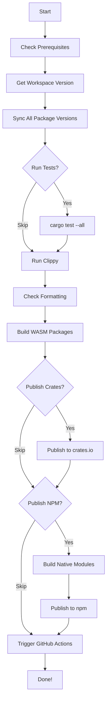

# Quick Deployment Guide

This is a condensed quick-reference guide. For full documentation, see [DEPLOYMENT.md](DEPLOYMENT.md).

## Prerequisites Checklist

- [ ] Rust toolchain installed (`rustc`, `cargo`)
- [ ] Node.js v18+ and npm installed
- [ ] `wasm-pack` installed
- [ ] `jq` installed
- [ ] crates.io API token obtained
- [ ] NPM authentication token obtained

## 5-Minute Setup

```bash
# 1. Install missing tools (if needed)
curl https://rustwasm.github.io/wasm-pack/installer/init.sh -sSf | sh
sudo apt-get install jq  # or: brew install jq

# 2. Set credentials
export CRATES_API_KEY="your-crates-io-token"
export NPM_TOKEN="your-npm-token"

# 3. Test deployment script
./scripts/test-deploy.sh

# 4. Dry run
./scripts/deploy.sh --dry-run

# 5. Deploy!
./scripts/deploy.sh
```

## Common Commands

```bash
# Full deployment
./scripts/deploy.sh

# Dry run (no publishing)
./scripts/deploy.sh --dry-run

# Skip tests (faster, but risky)
./scripts/deploy.sh --skip-tests

# Publish only to crates.io
./scripts/deploy.sh --skip-npm

# Publish only to npm
./scripts/deploy.sh --skip-crates

# Set explicit version
./scripts/deploy.sh --version 0.2.0

# Help
./scripts/deploy.sh --help
```

## Quick Troubleshooting

| Problem | Solution |
|---------|----------|
| Tests failing | `cargo test --all --verbose` to see details |
| Clippy errors | `cargo clippy --all-targets --fix` |
| Format issues | `cargo fmt --all` |
| Missing tools | Check Prerequisites section above |
| WASM build fails | `curl https://rustwasm.github.io/wasm-pack/installer/init.sh -sSf \| sh` |
| Already published | Bump version in `Cargo.toml` |

## Publishing Workflow



## Environment Variables

```bash
# Required for crate publishing
export CRATES_API_KEY="your-token"

# Required for npm publishing
export NPM_TOKEN="your-token"

# Optional for GitHub Actions trigger
export GITHUB_TOKEN="your-token"
```

## Security Warning

**NEVER commit these to git:**
- API tokens
- NPM tokens
- GitHub tokens
- `.env` files with credentials

## What Gets Published

### crates.io (29 crates)
- `ruvector-core`, `ruvector-graph`, `ruvector-gnn`
- `ruvector-cluster`, `ruvector-raft`, `ruvector-replication`
- `ruvector-node`, `ruvector-wasm`, and 21 more...

### npm (8 packages)
- `@ruvector/node`
- `@ruvector/wasm`
- `@ruvector/gnn`
- `@ruvector/gnn-wasm`
- `@ruvector/graph-node`
- `@ruvector/graph-wasm`
- `@ruvector/tiny-dancer`
- `@ruvector/tiny-dancer-wasm`

## Logs

Deployment logs: `logs/deployment/deploy-YYYYMMDD-HHMMSS.log`

```bash
# View latest log
ls -t logs/deployment/*.log | head -1 | xargs cat

# Follow live log
tail -f logs/deployment/deploy-*.log
```

## Getting Help

- Full docs: [DEPLOYMENT.md](DEPLOYMENT.md)
- Script help: `./scripts/deploy.sh --help`
- Test script: `./scripts/test-deploy.sh`
- Issues: https://github.com/ruvnet/ruvector/issues
